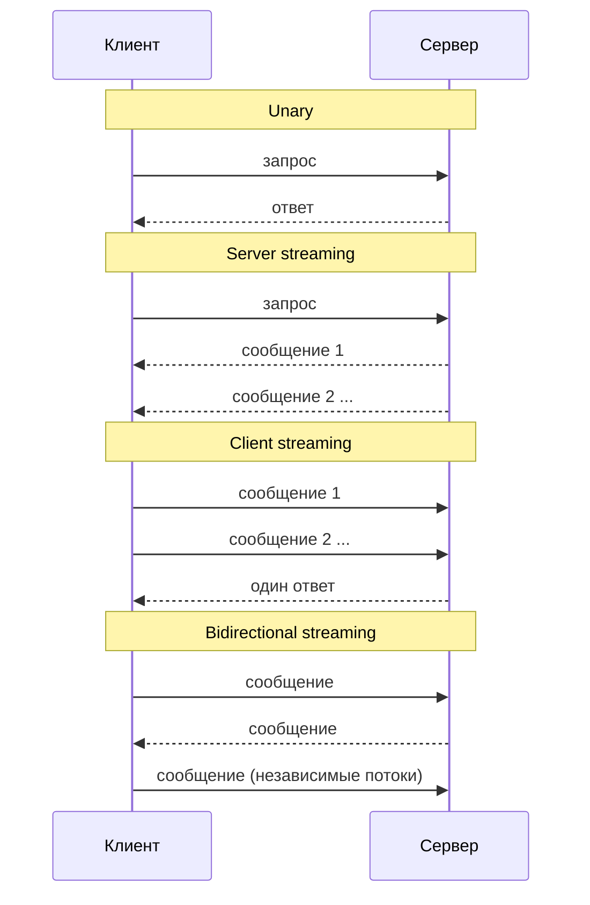
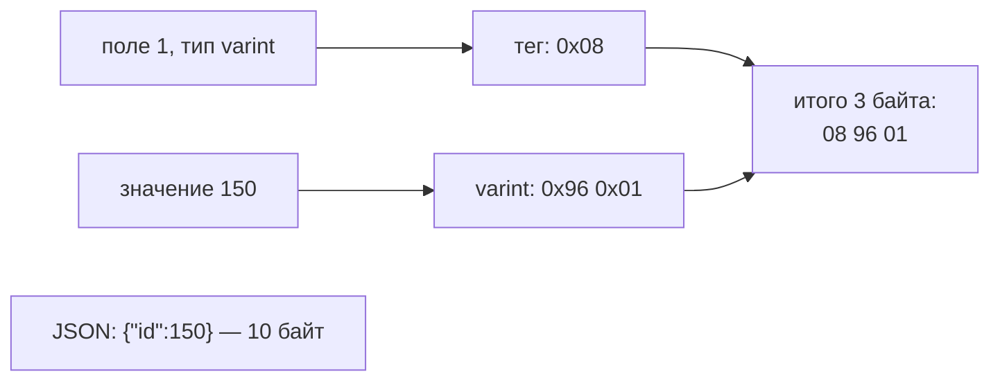

:::tldr
- **gRPC** — RPC-фреймворк поверх **HTTP/2**: контракт описывается в `.proto`-файле, из него генерируются клиент и сервер (C#, Go, Java, ...). Вызов удалённого сервиса выглядит как вызов метода.
- **Protocol Buffers** — бинарная сериализация: компактнее и быстрее JSON, строгая схема, поля идентифицируются **номерами** → обратная совместимость при эволюции.
- Четыре типа вызовов: **unary**, **server streaming**, **client streaming**, **bidirectional streaming**.
- Встроены: дедлайны, отмена, метаданные (заголовки), статус-коды, interceptors, балансировка на стороне клиента.
- Идеален для **межсервисного** взаимодействия внутри системы. Для публичных API и браузеров удобнее REST/JSON (браузер не может напрямую — нужен **gRPC-Web** или JSON transcoding).
:::

## Контракт — прежде всего

```protobuf protos/orders.proto
syntax = "proto3";

option csharp_namespace = "Shop.Orders.Grpc";
package orders.v1;

import "google/protobuf/timestamp.proto";

service OrderService {
  rpc GetOrder (GetOrderRequest) returns (OrderReply);                       // unary
  rpc WatchOrderStatus (WatchRequest) returns (stream OrderStatusEvent);     // server streaming
  rpc UploadItems (stream OrderItem) returns (UploadSummary);                // client streaming
  rpc Chat (stream ChatMessage) returns (stream ChatMessage);                // bidirectional
}

message GetOrderRequest { int32 order_id = 1; }

message OrderReply {
  int32 id = 1;
  string customer_email = 2;
  repeated OrderItem items = 3;
  int64 total_tiyin = 4;                               // деньги — целым числом минимальных единиц
  google.protobuf.Timestamp created_at = 5;
  OrderStatus status = 6;
}

message OrderItem { string sku = 1; int32 qty = 2; }
enum OrderStatus { ORDER_STATUS_UNSPECIFIED = 0; NEW = 1; PAID = 2; SHIPPED = 3; }
message WatchRequest { int32 order_id = 1; }
message OrderStatusEvent { OrderStatus status = 1; google.protobuf.Timestamp at = 2; }
message UploadSummary { int32 count = 1; }
message ChatMessage { string text = 1; }
```

```xml .csproj — генерация кода из proto
<ItemGroup>
  <Protobuf Include="Protos\orders.proto" GrpcServices="Server" />   <!-- или Client / Both -->
  <PackageReference Include="Grpc.AspNetCore" Version="2.*" />
</ItemGroup>
```

## Сервер

```csharp
public sealed class OrderGrpcService(IOrderRepository repo, IOrderEvents events) : OrderService.OrderServiceBase
{
    public override async Task<OrderReply> GetOrder(GetOrderRequest request, ServerCallContext context)
    {
        var order = await repo.GetAsync(request.OrderId, context.CancellationToken)
            ?? throw new RpcException(new Status(StatusCode.NotFound, $"Order {request.OrderId} not found"));
        return order.ToReply();
    }

    public override async Task WatchOrderStatus(WatchRequest request, IServerStreamWriter<OrderStatusEvent> stream, ServerCallContext context)
    {
        await foreach (var e in events.SubscribeAsync(request.OrderId, context.CancellationToken))
            await stream.WriteAsync(new OrderStatusEvent { Status = e.Status, At = Timestamp.FromDateTime(e.At) });
    }
}

builder.Services.AddGrpc(o => o.Interceptors.Add<LoggingInterceptor>());
app.MapGrpcService<OrderGrpcService>();
```

## Клиент

```csharp
builder.Services.AddGrpcClient<OrderService.OrderServiceClient>(o => o.Address = new Uri("https://orders-api"))
    .AddStandardResilienceHandler();          // ретраи, таймауты, circuit breaker (Microsoft.Extensions.Http.Resilience)

public sealed class CheckoutService(OrderService.OrderServiceClient orders)
{
    public async Task<OrderReply> LoadAsync(int id, CancellationToken ct) =>
        await orders.GetOrderAsync(new GetOrderRequest { OrderId = id },
            deadline: DateTime.UtcNow.AddSeconds(3),          // дедлайн распространяется на сервер
            cancellationToken: ct);

    public async Task WatchAsync(int id, CancellationToken ct)
    {
        using var call = orders.WatchOrderStatus(new WatchRequest { OrderId = id }, cancellationToken: ct);
        await foreach (var e in call.ResponseStream.ReadAllAsync(ct))
            Console.WriteLine($"{e.At}: {e.Status}");
    }
}
```

## Четыре вида вызовов



## Почему gRPC быстрый

- **HTTP/2**: мультиплексирование — много параллельных вызовов в одном TCP-соединении, сжатие заголовков HPACK, бинарные фреймы.
- **Protobuf**: поля кодируются как «номер + тип + значение» (varint для чисел). Нет имён полей, кавычек и текстового парсинга. Сообщение обычно в 3–10 раз меньше JSON.
- **Сгенерированный код** сериализации — без рефлексии.



## gRPC против REST

| | REST / JSON | gRPC |
|---|---|---|
| Контракт | OpenAPI (часто вторичен) | `.proto` — первичен, код генерируется |
| Формат | Текст (JSON) | Бинарный (Protobuf) |
| Транспорт | HTTP/1.1 или HTTP/2 | HTTP/2 (обязательно), HTTP/3 |
| Стриминг | Ограничен (SSE, chunked) | 4 режима, встроен |
| Браузеры | Нативно | Через gRPC-Web или JSON transcoding |
| Читаемость, отладка | curl, браузер | Нужны инструменты (grpcurl, Postman) |
| Кэширование HTTP | Да (GET, ETag, CDN) | Нет |
| Модель | Ресурсы + HTTP-методы | Методы сервиса |
| Где хорош | Публичные API, веб, интеграции | Внутренние сервисы, высокая нагрузка, стриминг, polyglot |

## Эволюция контракта

Правила обратной совместимости Protobuf:

- **Никогда не меняйте номер** существующего поля и не переиспользуйте номера удалённых полей (`reserved 7;`).
- Добавлять новые поля — безопасно: старые клиенты их проигнорируют, новые получат значения по умолчанию.
- Переименовать поле — безопасно для бинарного формата (имена не передаются), но ломает JSON-транскодинг.
- Нулевое значение enum — `UNSPECIFIED`: в proto3 не отличить «не задано» от 0.
- Версионируйте пакет (`orders.v1` → `orders.v2`) для несовместимых изменений.

## Практические моменты

- **Дедлайны** обязательны: без них зависший вызов держит ресурсы бесконечно. Дедлайн передаётся серверу, и тот может отменить работу.
- **Ошибки** — через `RpcException` со статусами (`NotFound`, `InvalidArgument`, `Unavailable`, `DeadlineExceeded`). Для детальных ошибок — `google.rpc.Status` с деталями (Rich Error Model).
- **Балансировка**: HTTP/2 держит одно долгое соединение, и L4-балансировщик отправит всё на один под. Нужна L7-балансировка (Envoy, Linkerd, Istio) или клиентская балансировка (`dns:///orders-api` + `LoadBalancingConfig`).
- **JSON transcoding** (`AddJsonTranscoding`) — один сервис доступен и по gRPC, и как REST/JSON по аннотациям `google.api.http`.

## Вопросы на засыпку

:::qa Почему gRPC плохо работает с обычным L4-балансировщиком?
HTTP/2 мультиплексирует все вызовы через одно долгоживущее TCP-соединение. L4-балансировщик распределяет **соединения**, а не запросы — вся нагрузка клиента уйдёт на один сервер. Нужна балансировка по запросам (L7-прокси, service mesh) или на стороне клиента.
:::

:::qa Как передать метаданные (например, токен или trace id)?
Через `Metadata` — это HTTP/2-заголовки: `new Metadata { { "authorization", $"Bearer {token}" } }`. На сервере — `context.RequestHeaders`. Для сквозной передачи — interceptors. Trace context передаётся автоматически при включённом OpenTelemetry.
:::

:::qa Можно ли вызвать gRPC из браузера?
Напрямую нет: браузерный API не даёт управлять фреймами HTTP/2 и трейлерами. Варианты: **gRPC-Web** (`app.UseGrpcWeb()` + клиент grpc-web; нет client/bidi streaming) или **JSON transcoding** (REST-эндпоинты из тех же сервисов).
:::

:::qa Чем Protobuf хуже JSON?
Бинарные сообщения нельзя прочитать глазами, нужна схема для декодирования, нет встроенной поддержки произвольной динамической структуры (есть `Struct`/`Any`, но неудобно). Для публичных интеграций JSON универсальнее.
:::

## Итог

gRPC — контрактно-ориентированный RPC поверх HTTP/2 с компактным Protobuf и полноценным стримингом. Отличный выбор для внутреннего взаимодействия микросервисов и потоковых сценариев; для публичных API и браузеров обычно остаётся REST (или gRPC с JSON transcoding). Не забывайте про дедлайны, L7-балансировку и правила эволюции `.proto`.
