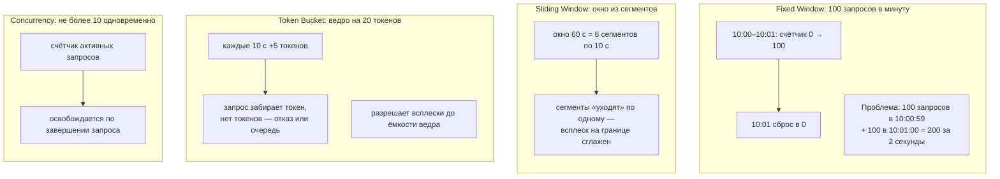
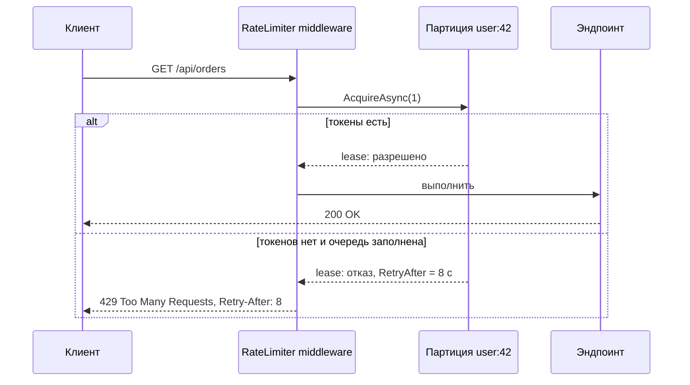
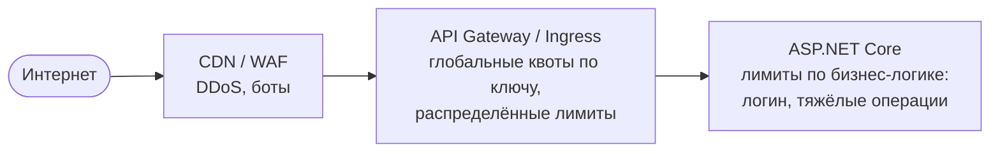

:::tldr
- **Rate limiting** ограничивает число запросов за период, чтобы защитить сервис от перегрузки, злоупотреблений (брутфорс, парсинг) и обеспечить справедливое распределение ресурсов между клиентами.
- С .NET 7 встроен middleware: `AddRateLimiter` + `UseRateLimiter` + политики на эндпоинтах (`RequireRateLimiting`, `[EnableRateLimiting]`).
- Алгоритмы: **Fixed Window**, **Sliding Window**, **Token Bucket** (допускает всплески), **Concurrency** (ограничивает **одновременные** запросы).
- **Партиционирование**: отдельный лимит на пользователя, API-ключ, IP, тенант — `PartitionedRateLimiter`.
- При превышении — **429 Too Many Requests** с заголовком `Retry-After`. Встроенный лимитер работает **в памяти одного экземпляра**: для глобальных лимитов в кластере нужен распределённый (Redis) или лимиты на API-шлюзе.
:::

## Алгоритмы



| Алгоритм | Что ограничивает | Плюсы | Минусы | Когда |
|---|---|---|---|---|
| Fixed Window | Запросы за интервал | Прост, дёшев | Двойной всплеск на границе окон | Грубые квоты (в день/час) |
| Sliding Window | Запросы за скользящий интервал | Сглаживает границы | Чуть больше памяти | Публичные API |
| Token Bucket | Средняя скорость + всплески | Естественно для пользователей: разрешает «пачки» | Сложнее объяснить клиентам | API с неравномерной нагрузкой |
| Concurrency | Одновременные запросы | Защищает ресурс (БД, тяжёлый отчёт) | Не ограничивает частоту | Дорогие эндпоинты, экспорт, загрузка файлов |

## Настройка

```csharp
builder.Services.AddRateLimiter(options =>
{
    options.RejectionStatusCode = StatusCodes.Status429TooManyRequests;

    // 1. Фиксированное окно — для логина (защита от перебора паролей)
    options.AddFixedWindowLimiter("login", o =>
    {
        o.PermitLimit = 5;
        o.Window = TimeSpan.FromMinutes(1);
        o.QueueLimit = 0;                              // без очереди — сразу отказ
    });

    // 2. Ограничение параллельности для тяжёлого отчёта
    options.AddConcurrencyLimiter("reports", o =>
    {
        o.PermitLimit = 3;
        o.QueueLimit = 10;                             // до 10 запросов ждут в очереди
        o.QueueProcessingOrder = QueueProcessingOrder.OldestFirst;
    });

    // 3. Token bucket на пользователя (или IP для анонимных)
    options.AddPolicy("per-user", httpContext =>
    {
        var key = httpContext.User.FindFirstValue("sub")
                  ?? httpContext.Connection.RemoteIpAddress?.ToString()
                  ?? "anonymous";
        return RateLimitPartition.GetTokenBucketLimiter(key, _ => new TokenBucketRateLimiterOptions
        {
            TokenLimit = 20,                            // ёмкость ведра (всплеск)
            TokensPerPeriod = 5,
            ReplenishmentPeriod = TimeSpan.FromSeconds(10),
            QueueLimit = 0,
            AutoReplenishment = true
        });
    });

    // Глобальный лимит для всех запросов
    options.GlobalLimiter = PartitionedRateLimiter.Create<HttpContext, string>(ctx =>
        RateLimitPartition.GetConcurrencyLimiter("global", _ => new ConcurrencyLimiterOptions { PermitLimit = 1000, QueueLimit = 0 }));

    // Ответ при отказе
    options.OnRejected = async (ctx, ct) =>
    {
        if (ctx.Lease.TryGetMetadata(MetadataName.RetryAfter, out var retryAfter))
            ctx.HttpContext.Response.Headers.RetryAfter = ((int)retryAfter.TotalSeconds).ToString();
        await ctx.HttpContext.Response.WriteAsJsonAsync(new ProblemDetails
        {
            Status = 429, Title = "Слишком много запросов", Detail = "Повторите позже"
        }, ct);
    };
});

var app = builder.Build();
app.UseRouting();
app.UseAuthentication();
app.UseRateLimiter();              // после аутентификации, если лимиты зависят от пользователя

app.MapPost("/auth/login", Login).RequireRateLimiting("login");
app.MapGet("/reports/sales", SalesReport).RequireRateLimiting("reports");
app.MapGroup("/api").RequireRateLimiting("per-user");
app.MapGet("/health", () => "ok").DisableRateLimiting();
```



## Где ограничивать



- **Встроенный лимитер хранит счётчики в памяти процесса.** При 5 экземплярах лимит «100 в минуту» фактически станет ~500. Для точных глобальных квот (тарифы API) — Redis (библиотеки вроде `RedisRateLimiting`), API-шлюз (Kong, YARP с распределённым хранилищем, Azure API Management) или Ingress (`nginx.ingress.kubernetes.io/limit-rps`).
- Лимиты в приложении идеально подходят для **защиты ресурсов** экземпляра (concurrency) и бизнес-сценариев (логин, отправка SMS).

## Хорошие практики

- Партиционируйте **по аутентифицированному пользователю/ключу**, а для анонимных — по IP (с учётом `ForwardedHeaders`, иначе все клиенты будут одним IP прокси).
- Возвращайте `Retry-After` и документируйте лимиты; часто добавляют заголовки `RateLimit-Limit`, `RateLimit-Remaining`, `RateLimit-Reset`.
- Разные лимиты для разных тарифов: партиция по тарифу + ключу.
- Не ограничивайте health checks и внутренние эндпоинты мониторинга.
- Клиенты должны уважать 429: экспоненциальная задержка с jitter, Polly обрабатывает `Retry-After`.

## Вопросы на засыпку

:::qa Чем 429 отличается от 503?
429 Too Many Requests — **конкретный клиент** превысил свою квоту. 503 Service Unavailable — **сервис** перегружен или недоступен для всех. Оба могут содержать `Retry-After`.
:::

:::qa Зачем нужна очередь (QueueLimit) в лимитере?
Вместо мгновенного отказа запрос ждёт освобождения разрешения. Это сглаживает кратковременные всплески, но увеличивает задержку и держит соединения. Для интерактивных API очередь обычно маленькая или нулевая.
:::

:::qa Как rate limiting связан с backpressure?
Rate limiting — один из механизмов backpressure на границе системы: сервер сообщает клиенту «притормози». Concurrency limiter защищает внутренние ресурсы от перегрузки, превращая её в быстрые отказы вместо деградации всего сервиса.
:::

:::qa Что будет с памятью при партиционировании по IP?
Каждая партиция — отдельный лимитер в памяти. Встроенная реализация удаляет неактивные партиции по таймеру, но атака с миллионами IP может раздуть память. Поэтому для анонимного трафика — защита на уровне WAF/шлюза, а в приложении — глобальный лимит.
:::

## Итог

Встроенный rate limiter ASP.NET Core предлагает четыре алгоритма и партиционирование по любому ключу. Используйте его для защиты ресурсов экземпляра и чувствительных эндпоинтов, возвращайте 429 с `Retry-After`, а глобальные квоты в кластере реализуйте на шлюзе или через распределённое хранилище.
