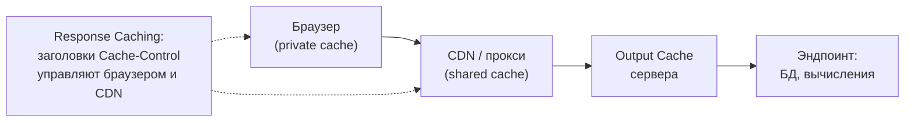
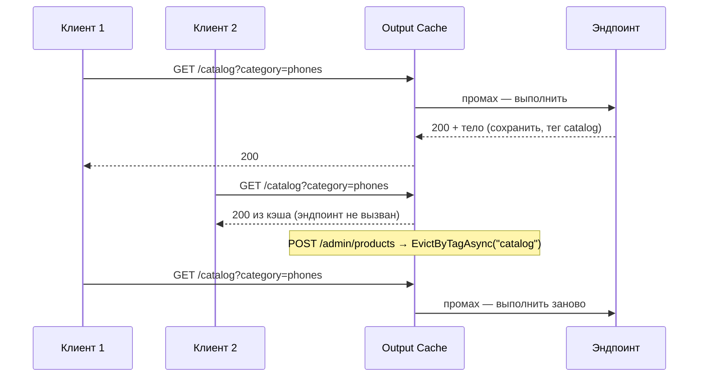

:::tldr
- **Response Caching** (`UseResponseCaching`) — реализует **HTTP-кэширование по стандарту**: ориентируется на заголовки `Cache-Control`, `Vary`; учитывает заголовки **клиента** (`Cache-Control: no-cache` от браузера обходит кэш). В основном это про установку заголовков для браузеров, CDN и прокси.
- **Output Caching** (.NET 7+, `UseOutputCache`) — **серверный** кэш готовых ответов, полностью под контролем приложения: политики, **теги и программная инвалидация**, защита от cache stampede (resource locking), хранилище в памяти или **Redis** (.NET 8+). Заголовки клиента не могут обойти кэш.
- Кэшировать можно только **идемпотентные** запросы (GET/HEAD) без персональных данных; по умолчанию запросы с аутентификацией и `Set-Cookie` не кэшируются.
- Для кэширования **данных** (а не HTTP-ответов) используются `IMemoryCache`, `IDistributedCache`, **`HybridCache`** (.NET 9).
:::

## Уровни HTTP-кэширования



## Response Caching

```csharp
builder.Services.AddResponseCaching();
app.UseResponseCaching();

[HttpGet("catalog")]
[ResponseCache(Duration = 300, Location = ResponseCacheLocation.Any, VaryByQueryKeys = ["category"])]
public IActionResult Catalog(string category) => Ok(_catalog.Get(category));
// Ответ: Cache-Control: public, max-age=300
```

Особенности:
- Работает **по правилам RFC 9111**: если клиент прислал `Cache-Control: no-cache` или `max-age=0` (обновление страницы F5), middleware **не использует** кэш.
- Не кэширует ответы с `Authorization`, `Set-Cookie`, статусами кроме 200.
- Нет инвалидации — только истечение срока.
- Атрибут `[ResponseCache]` полезен и **без** middleware: он просто выставляет заголовки для браузера и CDN.

## Output Caching

```csharp
builder.Services.AddOutputCache(options =>
{
    options.AddBasePolicy(p => p.Expire(TimeSpan.FromSeconds(30)));                  // по умолчанию для помеченных эндпоинтов
    options.AddPolicy("Catalog", p => p
        .Expire(TimeSpan.FromMinutes(10))
        .SetVaryByQuery("category", "page")
        .Tag("catalog"));
    options.AddPolicy("NoCache", p => p.NoCache());
});
// Распределённое хранилище для нескольких экземпляров (.NET 8+)
builder.Services.AddStackExchangeRedisOutputCache(o => o.Configuration = builder.Configuration["Redis"]);

var app = builder.Build();
app.UseOutputCache();          // после UseCors, UseRouting; перед эндпоинтами

app.MapGet("/catalog", GetCatalog).CacheOutput("Catalog");

// Инвалидация по тегу при изменении данных
app.MapPost("/admin/products", async (CreateProduct cmd, IOutputCacheStore cache, CancellationToken ct) =>
{
    // ... сохранить товар
    await cache.EvictByTagAsync("catalog", ct);
    return Results.Created();
});
```



**Resource locking** (включён по умолчанию): если 100 запросов одновременно пришли за устаревшей записью, эндпоинт выполнится **один раз**, остальные подождут результат — защита от **cache stampede**.

## Сравнение

| | Response Caching | Output Caching |
|---|---|---|
| Появился | ASP.NET Core 1.x | .NET 7 |
| Модель | HTTP-кэш по RFC | Серверный кэш приложения |
| Кто управляет | Заголовки ответа **и запроса** | Политики приложения |
| Клиент может обойти (`no-cache`) | Да | Нет |
| Инвалидация | Только по времени | **Теги**, программная (`EvictByTagAsync`) |
| Защита от stampede | Нет | Да (resource locking) |
| Хранилище | Память | Память, Redis, свое `IOutputCacheStore` |
| Vary | `VaryByHeader`, `VaryByQueryKeys` | Query, заголовки, route values, свои ключи (`VaryByValue`) |
| Работа с аутентифицированными запросами | Нет | Нет по умолчанию, можно разрешить своей политикой |

## Условные запросы: ETag

Даже без серверного кэша можно сэкономить трафик: сервер возвращает `ETag` (хэш версии), клиент при повторном запросе шлёт `If-None-Match`, и если данные не изменились — ответ **304 Not Modified** без тела.

```csharp
app.MapGet("/products/{id}", async (int id, HttpContext ctx, AppDbContext db) =>
{
    var p = await db.Products.FindAsync(id);
    if (p is null) return Results.NotFound();
    var etag = $"\"{p.Version}\"";                                   // rowversion / хэш
    if (ctx.Request.Headers.IfNoneMatch == etag) return Results.StatusCode(304);
    ctx.Response.Headers.ETag = etag;
    ctx.Response.Headers.CacheControl = "private, no-cache";          // хранить, но проверять
    return Results.Ok(p);
});
```

## Кэш ответов vs кэш данных

| Что кэшируем | Инструмент | Когда |
|---|---|---|
| Целый HTTP-ответ | Output Cache, CDN | Одинаковый ответ для многих клиентов (каталог, публичные страницы) |
| Данные / объекты | `IMemoryCache`, `IDistributedCache`, `HybridCache` | Данные переиспользуются в разных ответах, ответ персонализирован |
| Ничего, но экономим трафик | ETag / Last-Modified | Большие ресурсы, редко меняющиеся |

```csharp HybridCache (.NET 9): L1 в памяти + L2 распределённый, защита от stampede
public async Task<ProductDto?> GetProductAsync(int id, CancellationToken ct) =>
    await _hybridCache.GetOrCreateAsync($"product:{id}",
        async token => await _db.Products.Where(p => p.Id == id).Select(p => p.ToDto()).FirstOrDefaultAsync(token),
        new HybridCacheEntryOptions { Expiration = TimeSpan.FromMinutes(10) },
        tags: ["products"], cancellationToken: ct);
```

## Типичные ошибки

- **Кэширование персональных данных** в shared-кэше: ответ пользователя А отдаётся пользователю Б. Всегда `Cache-Control: private` для персонализированных ответов и не кэшируйте их в Output Cache без ключа пользователя.
- Забыть `Vary`: ответ на `?lang=ru` отдаётся для `?lang=uz`.
- Output Cache в памяти при нескольких экземплярах: инвалидация по тегу сработает только на одном — используйте Redis-хранилище.
- Кэшировать ошибки (500) или частичные результаты.
- Неправильный порядок middleware: `UseOutputCache` до `UseCors` — ответы из кэша без CORS-заголовков.

## Вопросы на засыпку

:::qa Почему Response Caching «не работает» при обновлении страницы в браузере?
При F5 браузер отправляет `Cache-Control: max-age=0` — по стандарту это требование проверить свежесть у источника, и middleware честно не использует кэш. Output Caching на такие заголовки не реагирует.
:::

:::qa Что такое stale-while-revalidate?
Директива `Cache-Control`, разрешающая кэшу отдавать устаревший ответ, пока в фоне загружается свежий. Снижает задержку для пользователей. Поддерживается CDN и браузерами.
:::

:::qa Как кэшировать ответы для аутентифицированных пользователей?
Output Cache: своя политика (`IOutputCachePolicy`), которая разрешает кэширование и добавляет идентификатор пользователя или тенанта в ключ (`VaryByValue`). Но часто разумнее кэшировать общие **данные**, а ответ собирать персонально.
:::

:::qa Как инвалидировать CDN?
Через API CDN (purge по URL или тегу — Cloudflare Cache Tags, Fastly Surrogate Keys) или версионированием URL (`/app.v123.js`). Для статики — «вечный» кэш + хэш в имени файла.
:::

## Итог

Response Caching — про стандартные HTTP-заголовки и кэши браузера/CDN, Output Caching — серверный кэш под полным контролем приложения, с тегами, инвалидацией и защитой от stampede. Для данных используйте `HybridCache`/`IDistributedCache`, для экономии трафика — ETag, и никогда не кэшируйте персональные ответы в общем кэше.
