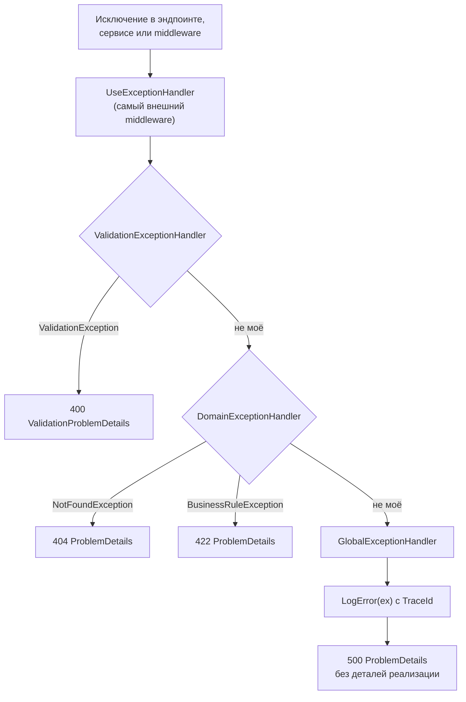

:::tldr
- Ошибки обрабатываются **централизованно**, а не `try/catch` в каждом контроллере: `UseExceptionHandler` + **`IExceptionHandler`** (.NET 8) — одно место, где исключение превращается в HTTP-ответ.
- Формат ответа — **ProblemDetails** (RFC 9457, ранее 7807): `type`, `title`, `status`, `detail`, `instance` + расширения (`traceId`, `errors`). `AddProblemDetails()` включает его для всех ошибок.
- Маппинг: ошибка валидации → **400**, не найдено → **404**, конфликт версий → **409**, нарушено бизнес-правило → **422**, неожиданное исключение → **500** без деталей реализации.
- **Не показывайте стек и сообщения исключений** клиентам в продакшене; логируйте их с `TraceId` и отдавайте `TraceId` клиенту.
- Для ожидаемых ошибок бизнес-логики часто используют **Result pattern** вместо исключений — исключения остаются для действительно исключительных ситуаций.
:::

## Формат ProblemDetails

```json
HTTP/1.1 404 Not Found
Content-Type: application/problem+json

{
  "type": "https://api.example.uz/errors/order-not-found",
  "title": "Заказ не найден",
  "status": 404,
  "detail": "Заказ 1042 не существует или был удалён",
  "instance": "/api/orders/1042",
  "traceId": "00-4bf92f3577b34da6a3ce929d0e0e4736-00f067aa0ba902b7-01"
}
```

Единый машиночитаемый формат позволяет клиентам обрабатывать ошибки одинаково для всех эндпоинтов и сервисов.

## Архитектура обработки



## Реализация (.NET 8+)

```csharp
public sealed class DomainExceptionHandler(IProblemDetailsService problemDetails) : IExceptionHandler
{
    public async ValueTask<bool> TryHandleAsync(HttpContext ctx, Exception exception, CancellationToken ct)
    {
        (int status, string title)? mapped = exception switch
        {
            NotFoundException          => (404, "Ресурс не найден"),
            BusinessRuleException      => (422, "Нарушено бизнес-правило"),
            ConcurrencyConflictException => (409, "Данные были изменены другим пользователем"),
            _ => null
        };
        if (mapped is null) return false;                          // передать следующему обработчику

        ctx.Response.StatusCode = mapped.Value.status;
        return await problemDetails.TryWriteAsync(new ProblemDetailsContext
        {
            HttpContext = ctx,
            Exception = exception,
            ProblemDetails = { Title = mapped.Value.title, Detail = exception.Message, Status = mapped.Value.status }
        });
    }
}

public sealed class GlobalExceptionHandler(ILogger<GlobalExceptionHandler> logger, IProblemDetailsService problemDetails) : IExceptionHandler
{
    public async ValueTask<bool> TryHandleAsync(HttpContext ctx, Exception exception, CancellationToken ct)
    {
        logger.LogError(exception, "Необработанное исключение при {Method} {Path}", ctx.Request.Method, ctx.Request.Path);
        ctx.Response.StatusCode = StatusCodes.Status500InternalServerError;
        return await problemDetails.TryWriteAsync(new ProblemDetailsContext
        {
            HttpContext = ctx,
            ProblemDetails = { Title = "Внутренняя ошибка сервера", Status = 500 }   // без exception.Message!
        });
    }
}
```

```csharp Регистрация
builder.Services.AddProblemDetails(o => o.CustomizeProblemDetails = ctx =>
{
    ctx.ProblemDetails.Instance = $"{ctx.HttpContext.Request.Method} {ctx.HttpContext.Request.Path}";
    ctx.ProblemDetails.Extensions["traceId"] = Activity.Current?.Id ?? ctx.HttpContext.TraceIdentifier;
});
builder.Services.AddExceptionHandler<DomainExceptionHandler>();   // порядок регистрации = порядок вызова
builder.Services.AddExceptionHandler<GlobalExceptionHandler>();

var app = builder.Build();
app.UseExceptionHandler();        // первым в конвейере
app.UseStatusCodePages();         // ProblemDetails и для 404/405 без тела
```

## Ожидаемые ошибки: исключения или Result

Исключения дороги (сбор стека — микросекунды) и превращают поток управления в «goto через слои». Для **ожидаемых** исходов (не найдено, недостаточно средств, неверный статус) многие команды используют **Result pattern**:

```csharp
public sealed record Error(string Code, string Message, ErrorType Type);
public enum ErrorType { Validation, NotFound, Conflict, BusinessRule }

public readonly record struct Result<T>(T? Value, Error? Error)
{
    public bool IsSuccess => Error is null;
    public static Result<T> Ok(T value) => new(value, null);
    public static Result<T> Fail(Error error) => new(default, error);
}

public async Task<Result<Guid>> PlaceOrderAsync(PlaceOrder cmd, CancellationToken ct)
{
    var customer = await _customers.FindAsync(cmd.CustomerId, ct);
    if (customer is null)
        return Result<Guid>.Fail(new("customer.not_found", "Покупатель не найден", ErrorType.NotFound));
    if (customer.Balance < cmd.Total)
        return Result<Guid>.Fail(new("balance.insufficient", "Недостаточно средств", ErrorType.BusinessRule));
    // ...
    return Result<Guid>.Ok(order.Id);
}

// Единый маппинг Result → HTTP
public static IResult ToHttp<T>(this Result<T> r) => r.IsSuccess
    ? TypedResults.Ok(r.Value)
    : TypedResults.Problem(title: r.Error!.Message, statusCode: r.Error.Type switch
      {
          ErrorType.Validation => 400, ErrorType.NotFound => 404,
          ErrorType.Conflict => 409, _ => 422
      }, extensions: new Dictionary<string, object?> { ["code"] = r.Error.Code });
```

| | Исключения | Result |
|---|---|---|
| Видно в сигнатуре | Нет | Да — метод явно может завершиться ошибкой |
| Стоимость | Высокая (стек) | Низкая |
| Забыть обработать | Легко (упадёт в 500) | Сложнее |
| Код | Короче в «счастливом пути» | Больше проверок `if (!r.IsSuccess)` |
| Для чего | Неожиданные ситуации, нарушения инвариантов | Ожидаемые бизнес-исходы |

Популярные библиотеки: **ErrorOr**, **FluentResults**, **Ardalis.Result**, **OneOf**.

## Какой статус-код выбрать

| Ситуация | Код |
|---|---|
| Невалидный формат запроса, ошибки полей | 400 Bad Request |
| Нет аутентификации / токен невалиден | 401 Unauthorized |
| Нет прав | 403 Forbidden |
| Ресурс не найден (или скрываем существование) | 404 Not Found |
| Конфликт: дубликат, устаревшая версия (optimistic concurrency) | 409 Conflict |
| Предусловие не выполнено (`If-Match`) | 412 Precondition Failed |
| Формально корректно, но нарушает бизнес-правила | 422 Unprocessable Content |
| Превышен лимит запросов | 429 Too Many Requests |
| Неожиданная ошибка | 500 Internal Server Error |
| Зависимость недоступна / перегрузка | 502 / 503 / 504 |

## Типичные ошибки

- `try/catch` в каждом действии контроллера с одинаковым кодом — дублирование и неконсистентные ответы.
- Отдавать `exception.ToString()` клиенту — утечка стека, путей, SQL, версий библиотек (подсказки атакующему).
- `catch (Exception) { return Ok(); }` — «проглатывание» ошибки: клиент думает, что всё успешно.
- Бросать `Exception` вместо специализированных типов — невозможно различить случаи.
- Использовать исключения для валидации в горячих путях (тысячи исключений в секунду заметно нагружают CPU).
- Возвращать 200 с `{ "success": false }` — ломает семантику HTTP, мониторинг и ретраи.

## Вопросы на засыпку

:::qa Чем UseExceptionHandler отличается от UseDeveloperExceptionPage?
`UseDeveloperExceptionPage` показывает подробную страницу со стеком, запросом и заголовками — только для разработки. `UseExceptionHandler` перехватывает исключение, логирует и формирует безопасный ответ — для продакшена. С .NET 6 developer page включается автоматически в Development.
:::

:::qa Что произойдёт, если исключение возникло после начала отправки ответа?
Заголовки уже отправлены, статус-код изменить нельзя. `UseExceptionHandler` не сможет написать ProblemDetails; соединение будет прервано (клиент увидит обрыв). Поэтому стриминговые ответы требуют особой обработки ошибок (например, событие ошибки в потоке).
:::

:::qa Нужно ли логировать исключения в каждом слое?
Нет. Логируйте в одном месте — там, где исключение **обрабатывается** (глобальный обработчик) или где есть уникальный контекст. Лог-и-проброс на каждом уровне дублирует записи. Если нужно добавить контекст — оберните в новое исключение с `innerException` или используйте scopes.
:::

:::qa Как вернуть ошибки валидации в формате ProblemDetails?
`ValidationProblemDetails` / `TypedResults.ValidationProblem(errors)` — содержит словарь `errors` «поле → сообщения». `[ApiController]` делает это автоматически для ошибок DataAnnotations.
:::

## Итог

Централизуйте обработку ошибок через `UseExceptionHandler` и цепочку `IExceptionHandler`, отдавайте клиентам единый формат ProblemDetails с `traceId`, маппьте типы ошибок на правильные статус-коды и не раскрывайте детали реализации. Для ожидаемых бизнес-исходов рассмотрите Result pattern, оставив исключения для исключительного.
