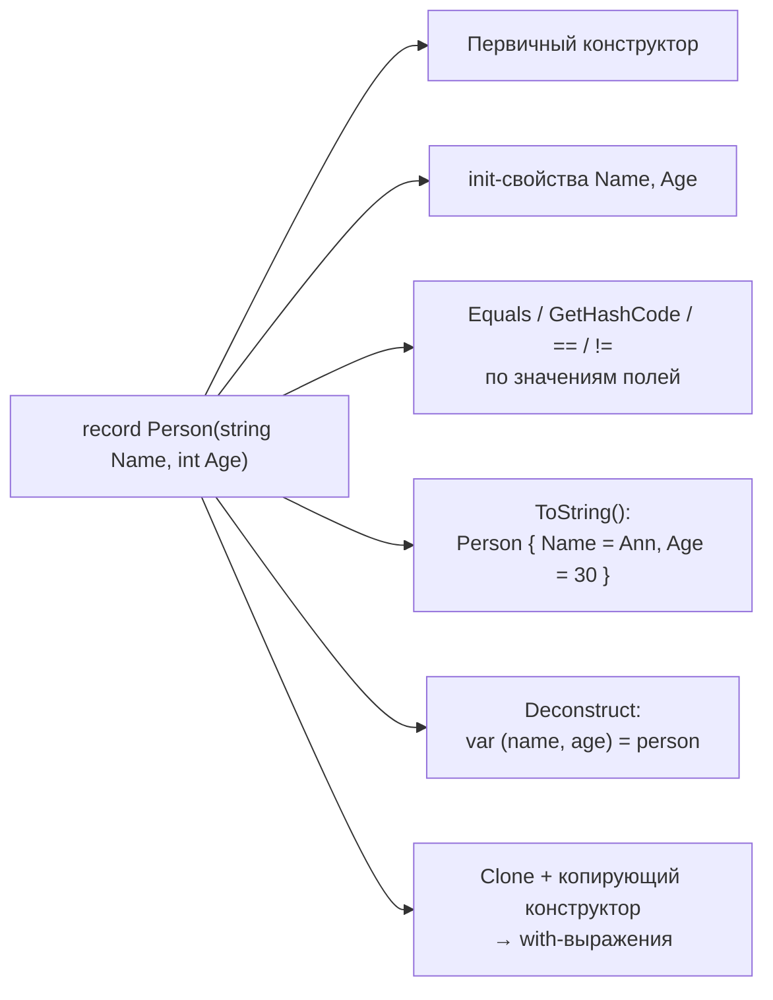
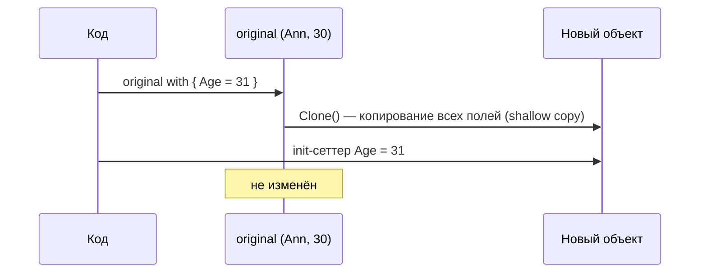

:::tldr
- **`record`** (= `record class`) — ссылочный тип с **равенством по значению**: два record равны, если равны все их поля.
- **Positional record** `record Person(string Name, int Age);` — компилятор генерирует: конструктор, `init`-свойства, `Deconstruct`, `Equals`/`GetHashCode`/`==`, `ToString()` с перечислением полей, копирующий конструктор.
- **`with`-выражение** создаёт копию с изменёнными свойствами (non-destructive mutation).
- **`record struct`** (C# 10) — то же для значимых типов; `readonly record struct` — неизменяемый вариант.
- Применение: DTO, команды и события, Value Objects в DDD, ключи словарей, неизменяемые снапшоты.
:::

## Что генерирует компилятор

```csharp
public record Person(string Name, int Age);
```

Эквивалентно примерно такому коду:

```csharp
public class Person : IEquatable<Person>
{
    public Person(string Name, int Age) { this.Name = Name; this.Age = Age; }

    public string Name { get; init; }
    public int Age { get; init; }

    protected virtual Type EqualityContract => typeof(Person);   // учёт типа при сравнении

    public virtual bool Equals(Person? other) =>
        other is not null &&
        EqualityContract == other.EqualityContract &&
        EqualityComparer<string>.Default.Equals(Name, other.Name) &&
        EqualityComparer<int>.Default.Equals(Age, other.Age);

    public override bool Equals(object? obj) => Equals(obj as Person);
    public override int GetHashCode() => HashCode.Combine(EqualityContract, Name, Age);
    public static bool operator ==(Person? a, Person? b) => a?.Equals(b) ?? b is null;
    public static bool operator !=(Person? a, Person? b) => !(a == b);

    public override string ToString() => $"Person {{ Name = {Name}, Age = {Age} }}";
    public void Deconstruct(out string Name, out int Age) { Name = this.Name; Age = this.Age; }

    protected Person(Person original) { Name = original.Name; Age = original.Age; }  // для with
    public virtual Person <Clone>$() => new Person(this);                            // для with
}
```



## Равенство по значению

```csharp
var a = new Person("Ann", 30);
var b = new Person("Ann", 30);

Console.WriteLine(a == b);                  // True — record
Console.WriteLine(ReferenceEquals(a, b));   // False — разные объекты

class PersonClass { public string Name = ""; }
Console.WriteLine(new PersonClass() == new PersonClass());  // False — сравнение ссылок
```

Это делает record идеальным для ключей в `Dictionary`/`HashSet` и для сравнения в тестах (`Assert.Equal(expected, actual)`).

:::warning Коллекции внутри record сравниваются по ссылке
```csharp
public record Order(int Id, List<string> Items);

var o1 = new Order(1, new() { "A" });
var o2 = new Order(1, new() { "A" });
Console.WriteLine(o1 == o2);   // False! List сравнивается по ссылке
```
Для глубокого сравнения переопределите `Equals` или используйте неизменяемые коллекции с собственной логикой сравнения.
:::

## with-выражения

```csharp
var original = new Person("Ann", 30);
var older = original with { Age = 31 };    // новый объект, original не изменён

Console.WriteLine(original);   // Person { Name = Ann, Age = 30 }
Console.WriteLine(older);      // Person { Name = Ann, Age = 31 }
```



Копия — **поверхностная** (shallow): вложенные ссылочные объекты общие.

## record class vs record struct vs class

| | `class` | `record` (class) | `record struct` | `readonly record struct` |
|---|---|---|---|---|
| Тип | Ссылочный | Ссылочный | Значимый | Значимый |
| Равенство | По ссылке | По значению | По значению | По значению |
| Свойства positional-параметров | — | `init` | `get; set;` (изменяемые!) | `init` |
| `with` | Нет | Да | Да | Да |
| Наследование | Да | Только от record | Нет | Нет |
| Аллокация | Куча | Куча | Без отдельной аллокации | Без отдельной аллокации |

## Где применять

```csharp
// 1. DTO и контракты API
public record OrderDto(int Id, string Customer, decimal Total);

// 2. Команды и события (CQRS, messaging) — неизменяемы, удобно логировать через ToString
public record PlaceOrderCommand(Guid CustomerId, IReadOnlyList<OrderLine> Lines);
public record OrderPlaced(Guid OrderId, DateTimeOffset At);

// 3. Value Object в DDD — с валидацией
public record Email
{
    public string Value { get; }
    public Email(string value)
    {
        if (!value.Contains('@')) throw new ArgumentException("Некорректный email");
        Value = value.Trim().ToLowerInvariant();
    }
}

// 4. Составной ключ
var cache = new Dictionary<(string, int), Price>();          // tuple
var cache2 = new Dictionary<PriceKey, Price>();              // record — с именами
public readonly record struct PriceKey(string Sku, int RegionId);
```

## Где record не подходит

- **Сущности EF Core** — у сущности идентичность определяется ключом, а не всеми полями; EF отслеживает изменения, а `with` создаёт новый объект, о котором контекст не знает. Равенство по значению ломает логику Change Tracker и коллекций навигации.
- Объекты с **изменяемым состоянием** и поведением (сервисы, агрегаты).
- Типы с большим числом полей в горячем коде: сравнение и `GetHashCode` проходят по всем полям.

## Вопросы на засыпку

:::qa Как равенство record работает при наследовании?
Сгенерированный `EqualityContract` возвращает фактический тип. `Student : Person` с теми же Name/Age **не равен** `Person` — типы должны совпадать. Это защищает от асимметричного равенства.
:::

:::qa Можно ли сделать record изменяемым?
Да: объявить свойства явно с `set` (`public string Name { get; set; }`). Но изменяемый record в `HashSet` — ловушка: после изменения хэш-код меняется, и объект «теряется» в коллекции.
:::

:::qa Можно ли переопределить ToString или Equals в record?
Да. `ToString` — обычным `override`. Для равенства переопределяется `virtual bool Equals(Person? other)` (и тогда обязательно `GetHashCode`). Чтобы изменить формат вывода, можно переопределить `PrintMembers`.
:::

:::qa Чем positional record отличается от класса с primary constructor (C# 12)?
В классе с первичным конструктором `class Service(ILogger log)` параметры — просто захваченные переменные: свойств, `Equals`, `Deconstruct` не генерируется. У record параметры становятся публичными свойствами с равенством по значению.
:::

## Итог

`record` — лаконичный способ описать **неизменяемые данные** с равенством по значению, удобным `ToString` и копированием через `with`. Используйте для DTO, сообщений и Value Objects; для сущностей с идентичностью и изменяемым состоянием оставайтесь на обычных классах.
