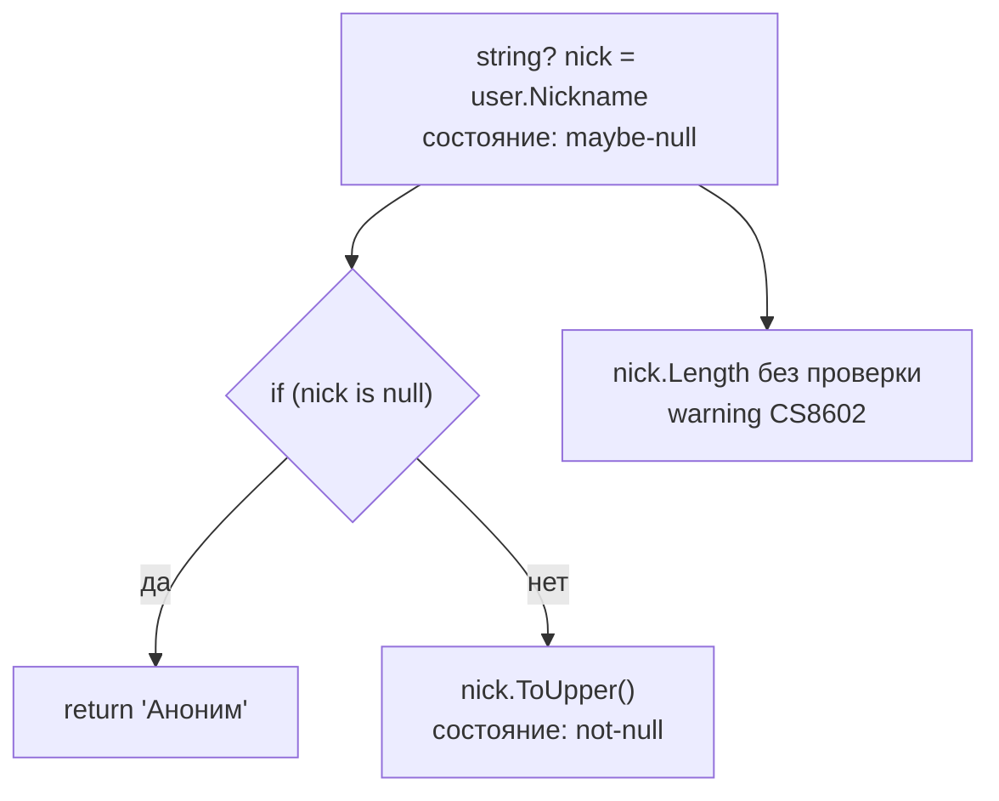

:::tldr
- **Nullable reference types (NRT)** — режим компилятора (`<Nullable>enable</Nullable>`), в котором `string` означает «**не может быть null**», а `string?` — «может быть null».
- Это **только статический анализ**: в рантайме ничего не меняется, `string` и `string?` — один и тот же тип. Нарушения — **предупреждения**, а не ошибки (можно сделать ошибками).
- Компилятор отслеживает **состояние null** по потоку кода: после `if (x is null) return;` переменная считается не-null.
- `!` (null-forgiving) — «я знаю, что здесь не null» — подавляет предупреждение; злоупотреблять нельзя.
- Атрибуты `[NotNullWhen]`, `[MaybeNull]`, `[NotNull]`, `[MemberNotNull]` описывают контракты методов, которые компилятор не может вывести сам.
:::

## Проблема, которую решает NRT

`NullReferenceException` — самое частое исключение в .NET. До C# 8 любая переменная ссылочного типа могла быть `null`, и узнать об этом можно было только в рантайме. Тони Хоар называл изобретение null «ошибкой на миллиард долларов».

```csharp
#nullable enable

public class UserService
{
    public string GetDisplayName(User user)           // user — не null по контракту
    {
        return user.Nickname.ToUpper();               // warning CS8602: Nickname может быть null
    }
}

public class User
{
    public string Email { get; set; } = "";           // не-null, инициализирован
    public string? Nickname { get; set; }             // может отсутствовать
}
```



## Включение

```xml
<PropertyGroup>
  <Nullable>enable</Nullable>
  <!-- Сделать все nullable-предупреждения ошибками -->
  <WarningsAsErrors>nullable</WarningsAsErrors>
</PropertyGroup>
```

Для постепенной миграции большого проекта — директивы в отдельных файлах:

```csharp
#nullable enable        // включить для файла
#nullable disable       // выключить
#nullable restore       // вернуть настройку проекта
```

## Основные операторы

```csharp
string? name = GetName();

int len1 = name?.Length ?? 0;         // ?. и ?? — безопасный доступ и значение по умолчанию
name ??= "Гость";                     // присвоить, если null
int len2 = name!.Length;              // ! — подавить предупреждение (ответственность на вас)

ArgumentNullException.ThrowIfNull(user);   // после этой строки компилятор знает: user не null
```

:::warning Оператор ! — не проверка
`!` ничего не проверяет в рантайме — только убирает предупреждение. `null!` в инициализаторе (`public DbSet<User> Users { get; set; } = null!;`) допустим, когда значение гарантированно установит фреймворк. В бизнес-коде каждый `!` — повод задуматься.
:::

## Как объявлять свойства и конструкторы

```csharp
public class Order
{
    // 1. Обязательное значение через конструктор
    public Order(string number) => Number = number;
    public string Number { get; }

    // 2. required (C# 11) — обязателен при создании через инициализатор
    public required string CustomerEmail { get; init; }

    // 3. Необязательное
    public string? Comment { get; set; }

    // 4. Значение по умолчанию
    public List<OrderLine> Lines { get; } = new();
}

var o = new Order("A-1") { CustomerEmail = "a@b.uz" };   // без CustomerEmail — ошибка компиляции
```

## Атрибуты для сложных контрактов

Компилятор анализирует только тело текущего метода. Чтобы он понимал поведение вызываемых методов, есть атрибуты из `System.Diagnostics.CodeAnalysis`:

```csharp
// «Если метод вернул true — value не null»
public bool TryGetUser(int id, [NotNullWhen(true)] out User? user)
{
    user = _cache.GetValueOrDefault(id);
    return user is not null;
}

if (TryGetUser(5, out var u))
    Console.WriteLine(u.Email);   // без предупреждения

// «Если вход не null — выход не null»
[return: NotNullIfNotNull(nameof(input))]
public static string? Normalize(string? input) => input?.Trim();

// «После вызова метода поле инициализировано»
[MemberNotNull(nameof(_connection))]
private void EnsureConnected() => _connection ??= CreateConnection();

// «Метод никогда не возвращает управление»
[DoesNotReturn]
public static void Throw(string message) => throw new InvalidOperationException(message);
```

| Атрибут | Смысл |
|---|---|
| `[AllowNull]` | Вход может быть null, даже если тип не-nullable (сеттер с нормализацией) |
| `[DisallowNull]` | Вход не может быть null, даже если тип nullable |
| `[MaybeNull]` | Выход может быть null (для дженериков: `T` в `FirstOrDefault`) |
| `[NotNull]` | Выход / out-параметр не null после вызова |
| `[NotNullWhen(bool)]` | Не null, если метод вернул указанное значение |
| `[MemberNotNull]` | После метода указанные поля не null |
| `[DoesNotReturn]` | Метод всегда бросает исключение |

## Дженерики и nullable

```csharp
// T? для неограниченного T означает «default(T)» — null для ссылочных, 0 для int
public T? FindOrDefault<T>(IEnumerable<T> items, Func<T, bool> predicate) { ... }

// Ограничение notnull — T не может быть nullable-типом
public class Cache<TKey, TValue> where TKey : notnull { }
```

## NRT и ASP.NET Core

- **Model binding / валидация**: с включённым NRT не-nullable свойства запросов считаются **обязательными** (`[Required]` неявно). Отсутствие значения → 400.
- **EF Core**: `string` → столбец `NOT NULL`, `string?` → `NULL`. Включение NRT в существующем проекте может сгенерировать миграцию, меняющую nullability столбцов — проверяйте!
- **System.Text.Json** (.NET 9+): можно включить `RespectNullableAnnotations`, чтобы десериализация проверяла null.

## Типичные ошибки

- Включить `Nullable` и массово расставить `!` — предупреждения исчезнут, проблемы останутся.
- Думать, что NRT защищает в рантайме: данные из JSON, БД, рефлексии или кода без NRT всё равно могут принести `null`. На **границах** системы — проверки (`ThrowIfNull`, валидация).
- Путать `int?` (это `Nullable<int>`, реальный другой тип) и `string?` (аннотация, тот же тип `string`).

## Вопросы на засыпку

:::qa Чем string? отличается от int? на уровне рантайма?
`int?` — это структура `Nullable<int>` с полями `HasValue` и `Value`, другой тип. `string?` — тот же `System.String`, компилятор лишь добавляет атрибут `[Nullable]` в метаданные для анализа.
:::

:::qa Почему компилятор не видит, что поле инициализировано в методе Init()?
Анализ потока работает внутри одного метода. Он не знает, что `Init()` устанавливает поле. Поможет атрибут `[MemberNotNull(nameof(_field))]` на `Init()`.
:::

:::qa Как включить NRT в большом legacy-проекте?
Постепенно: `<Nullable>warnings</Nullable>` (только предупреждения без аннотаций) или `#nullable enable` по файлам, начиная с новых и с доменной модели. Затем включать для проекта целиком и переводить предупреждения в ошибки.
:::

:::qa Что такое required и чем отличается от параметра конструктора?
`required` (C# 11) требует задать свойство в инициализаторе объекта. Удобно для DTO с множеством полей — не нужен огромный конструктор. Конструктор с `[SetsRequiredMembers]` снимает это требование.
:::

## Итог

NRT делает «может ли быть null» частью контракта типа и переносит поиск `NullReferenceException` на этап компиляции. Включайте во всех новых проектах, описывайте нестандартные контракты атрибутами и проверяйте данные на границах системы — рантайм-гарантий NRT не даёт.
