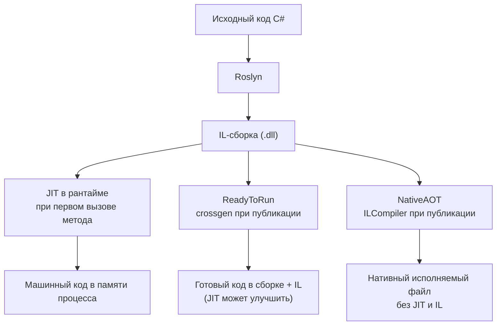
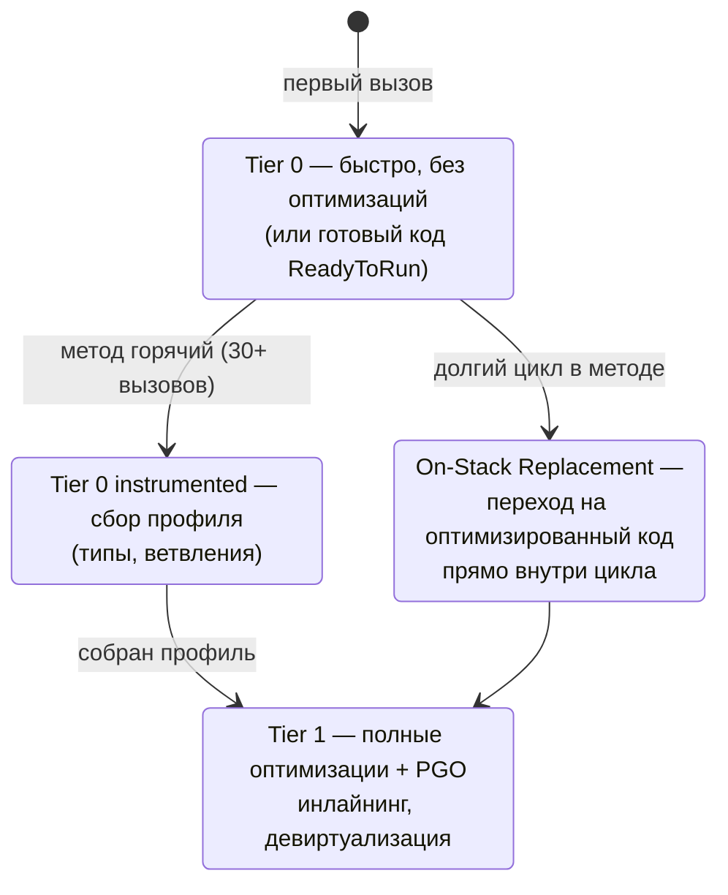
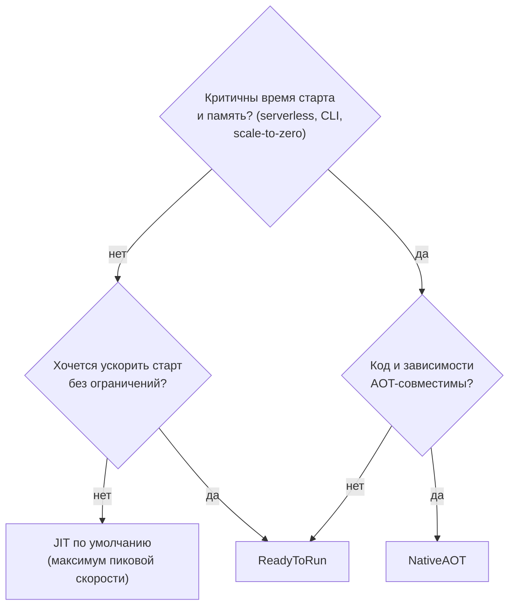

:::tldr
- C# компилируется в **IL** (промежуточный язык). Превратить IL в машинный код можно **во время выполнения** (JIT) или **заранее** (AOT).
- **JIT (RyuJIT)**: компилирует метод при первом вызове. Плюсы — оптимизация под конкретный процессор и реальный профиль нагрузки (**Tiered compilation + Dynamic PGO**). Минус — медленный старт.
- **ReadyToRun (R2R)**: частичный AOT — сборки содержат заранее скомпилированный код + IL; JIT может перекомпилировать горячие методы. Быстрее старт, полная совместимость.
- **NativeAOT** (.NET 7+): единый нативный бинарник без JIT и IL. Мгновенный старт, мало памяти, маленький образ. Ограничения: **нет динамической генерации кода** (`Reflection.Emit`), рефлексия ограничена, нужен **trimming**-совместимый код.
- NativeAOT хорош для: serverless, CLI-утилит, микросервисов с частым масштабированием, контейнеров с жёсткими лимитами памяти.
:::

## Путь от C# до машинного кода



## Как работает JIT

При первом вызове метода вместо машинного кода вызывается **заглушка** (stub), которая запускает JIT-компилятор. Готовый код сохраняется, адрес в заглушке заменяется — последующие вызовы идут напрямую.

### Tiered compilation

Компилировать всё с полными оптимизациями — долго, старт будет медленным. Поэтому (с .NET Core 3.0) используется многоуровневая компиляция:



**Dynamic PGO** (Profile-Guided Optimization, включён по умолчанию с .NET 8): JIT видит, что в `IShape.Area()` в 95% случаев приходит `Circle`, и генерирует быструю ветку `if (shape is Circle) { инлайн Circle.Area } else { виртуальный вызов }`. AOT-компилятор так не умеет — у него нет данных о реальной нагрузке.

## ReadyToRun: компромисс

```xml
<PropertyGroup>
  <PublishReadyToRun>true</PublishReadyToRun>
</PropertyGroup>
```

- Сборки содержат предкомпилированный код → меньше работы JIT при старте (часто -30–50% времени старта).
- IL остаётся → полная совместимость: рефлексия, `Emit`, всё работает.
- Горячие методы всё равно перекомпилируются JIT-ом в Tier 1 с PGO.
- Минус — сборки больше по размеру.

## NativeAOT

```xml
<PropertyGroup>
  <PublishAot>true</PublishAot>
  <InvariantGlobalization>true</InvariantGlobalization>   <!-- меньше размер, если не нужна ICU -->
</PropertyGroup>
```

```bash
dotnet publish -c Release -r linux-x64
# результат: один исполняемый файл ~10–20 МБ для Minimal API
```

Компилятор анализирует всю программу целиком (**whole program analysis**), выбрасывает неиспользуемый код (**trimming**) и компилирует остальное в нативный код.

| | JIT | ReadyToRun | NativeAOT |
|---|---|---|---|
| Время старта | Медленное (сотни мс) | Быстрее | **Мгновенное** (десятки мс) |
| Пиковая производительность | **Максимальная** (PGO) | Максимальная (после JIT) | Хорошая, но без Dynamic PGO |
| Память | Больше (JIT, метаданные) | Больше | **Меньше** |
| Размер | Нужен рантайм | Нужен рантайм, сборки больше | Один файл, без рантайма |
| Рефлексия | Полная | Полная | Ограниченная (только сохранённое trimmer-ом) |
| `Reflection.Emit`, `Expression.Compile` | Да | Да | Нет / интерпретация |
| Динамическая загрузка сборок | Да | Да | Нет |
| Кроссплатформенность бинарника | Да (IL) | Нет (под RID) | Нет (под RID) |

## Ограничения NativeAOT на практике

```csharp
// Не работает без доработки: сериализация через рефлексию
JsonSerializer.Serialize(order);                          // warning IL2026/IL3050

// Работает: source generator
[JsonSerializable(typeof(Order))]
partial class AppJson : JsonSerializerContext { }
JsonSerializer.Serialize(order, AppJson.Default.Order);

// Minimal API: CreateSlimBuilder + генератор делегатов запросов
var builder = WebApplication.CreateSlimBuilder(args);
builder.Services.ConfigureHttpJsonOptions(o => o.SerializerOptions.TypeInfoResolverChain.Insert(0, AppJson.Default));
```

Что пока плохо поддерживается или требует обходных путей:

- **MVC-контроллеры** (используют рефлексию) — только Minimal API.
- **EF Core** — поддержка экспериментальная (precompiled queries, .NET 9+).
- Библиотеки, использующие `Emit`: классический AutoMapper, Castle DynamicProxy (Moq), часть DI-контейнеров.
- Встроенный DI **поддерживается**, `System.Text.Json` и `ILogger` — с генераторами.

:::tip Анализаторы подскажут
`<IsAotCompatible>true</IsAotCompatible>` в библиотеке включает анализаторы trimming и AOT: предупреждения `IL2xxx` / `IL3xxx` покажут проблемные места ещё на этапе сборки.
:::

## Как выбрать



## Вопросы на засыпку

:::qa Почему JIT может генерировать более быстрый код, чем AOT?
JIT знает конкретный процессор (может использовать AVX-512, если он есть) и реальный профиль выполнения: какие типы приходят в виртуальные вызовы, какие ветки горячие. AOT должен компилировать под «средний» процессор и без знания нагрузки.
:::

:::qa Что такое trimming и чем он опасен?
Удаление неиспользуемого кода при публикации (`PublishTrimmed`). Опасен для кода с рефлексией: тип или метод, используемый только через строку, будет вырезан, и в рантайме случится `MissingMethodException`. Анализатор выдаёт предупреждения, их нельзя игнорировать.
:::

:::qa Что такое On-Stack Replacement?
Если метод с долгим циклом вызван один раз (например, `Main` с обработкой миллиона элементов), он так и остался бы в неоптимизированном Tier 0. OSR позволяет переключиться на оптимизированную версию прямо посреди выполнения цикла.
:::

:::qa Можно ли отключить Tiered compilation?
Да: `<TieredCompilation>false</TieredCompilation>` — всё сразу компилируется с полными оптимизациями (медленнее старт, без PGO). Или `<TieredPGO>false</TieredPGO>`. Обычно настройки по умолчанию оптимальны.
:::

## Итог

JIT даёт максимальную пиковую скорость благодаря знанию реальной нагрузки, ReadyToRun ускоряет старт без ограничений, NativeAOT — мгновенный старт и минимальный размер ценой отказа от динамических возможностей. Для обычного веб-сервиса хватает JIT, для serverless и CLI — стоит рассмотреть NativeAOT.
