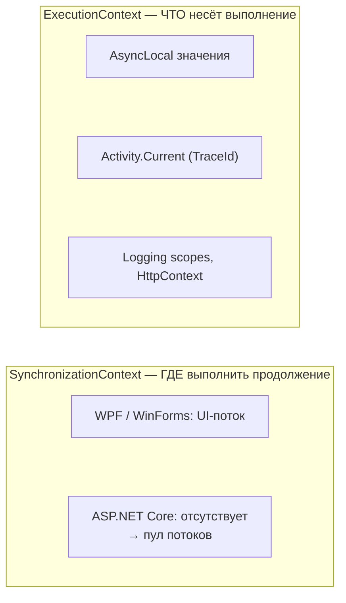
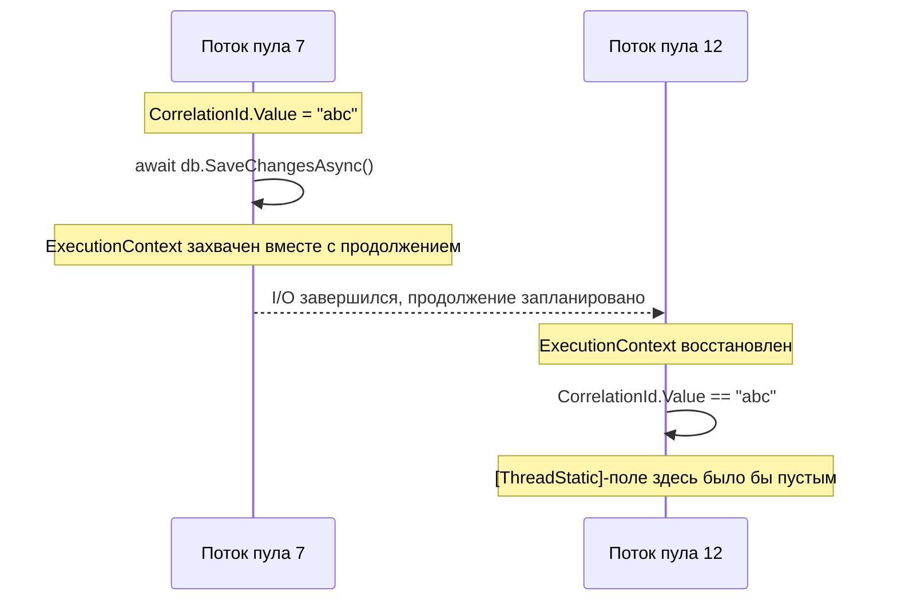
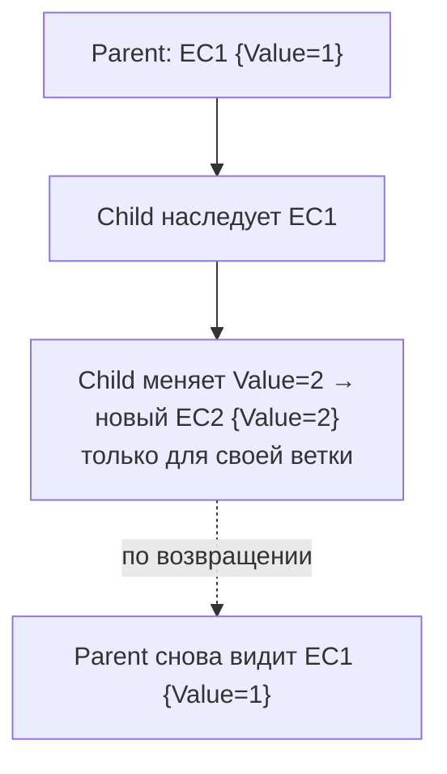

:::tldr
- **ExecutionContext** — «окружение» логического потока выполнения: значения `AsyncLocal<T>`, контекст безопасности, культура (через `AsyncLocal`). Он **захватывается** при `await`, `Task.Run`, `ThreadPool.QueueUserWorkItem`, создании `Timer` и **восстанавливается** в продолжении — поэтому данные «следуют» за асинхронной операцией через разные потоки.
- **`AsyncLocal<T>`** — значение, привязанное к ExecutionContext (а не к потоку): видно в продолжениях и дочерних задачах. Изменения в дочерней асинхронной операции **не видны** родителю (copy-on-write). На нём построены `Activity.Current` (трассировка), `IHttpContextAccessor`, logging scopes.
- **`[ThreadStatic]` / `ThreadLocal<T>`** привязаны к **потоку** — после `await` продолжение может выполниться на другом потоке, значение «теряется». В асинхронном коде не используйте их для контекста запроса.
- **SynchronizationContext** — другое: определяет, **где** выполнится продолжение (UI-поток в WPF/WinForms). В ASP.NET Core его **нет**, поэтому `ConfigureAwait(false)` там не нужен для корректности, но полезен в библиотеках.
- Подавление потока контекста: `ExecutionContext.SuppressFlow()`, `UnsafeQueueUserWorkItem` — для низкоуровневых оптимизаций и чтобы фоновые задачи не наследовали контекст запроса.
:::

## Два разных «контекста»



| | ExecutionContext | SynchronizationContext |
|---|---|---|
| Назначение | Перенос «окружающих» данных | Выбор потока/планировщика для продолжения |
| Поток через `await` | Всегда (если не подавлен) | Захватывается, если не `ConfigureAwait(false)` |
| Влияние `ConfigureAwait(false)` | Никакого — контекст всё равно течёт | Продолжение не возвращается в контекст |
| В ASP.NET Core | Есть | Нет |

## Как течёт ExecutionContext



```csharp
public static class Correlation
{
    private static readonly AsyncLocal<string?> _id = new();
    public static string? Id { get => _id.Value; set => _id.Value = value; }
}

[ThreadStatic] private static string? _threadId;

async Task HandleAsync()
{
    Correlation.Id = "abc";
    _threadId = "abc";

    await Task.Delay(10);                 // продолжение — возможно, на другом потоке

    Console.WriteLine(Correlation.Id);    // abc
    Console.WriteLine(_threadId);         // null (или чужое значение!) — привязано к потоку
}
```

## Семантика copy-on-write

```csharp
static readonly AsyncLocal<int> Value = new();

async Task Parent()
{
    Value.Value = 1;
    await Child();
    Console.WriteLine(Value.Value);       // 1 — изменение в Child не видно родителю
}

async Task Child()
{
    Console.WriteLine(Value.Value);       // 1 — унаследовано
    Value.Value = 2;                      // создаётся НОВЫЙ ExecutionContext для этой ветки
    await Task.Yield();
    Console.WriteLine(Value.Value);       // 2
}
```



ExecutionContext неизменяем: запись в `AsyncLocal` создаёт новый объект контекста. Поэтому дочерние операции не могут «испортить» контекст родителя — и поэтому нельзя вернуть значение наверх через `AsyncLocal`. Если нужно передать данные вверх, храните в `AsyncLocal` **изменяемый объект-держатель** и меняйте его поля (так устроен `HttpContextAccessor`).

## Где это используется в .NET

| Механизм | Как использует ExecutionContext |
|---|---|
| `Activity.Current` | `AsyncLocal<Activity>` — TraceId/SpanId для распределённой трассировки |
| `IHttpContextAccessor` | `AsyncLocal` с держателем `HttpContext` |
| `ILogger.BeginScope` | Скоупы логирования хранятся в `AsyncLocal` |
| `CultureInfo.CurrentCulture` | Течёт через await (с .NET 4.6) |
| `Transaction.Current` (`TransactionScope`) | При `TransactionScopeAsyncFlowOption.Enabled` |
| EF Core, Npgsql | Не используют для соединений — контекст передаётся явно через DI |

## Подводные камни

:::warning Утечки контекста в фоновые задачи
`Task.Run` или `_ = Task.Run(...)` из обработчика запроса **наследует** ExecutionContext: `Activity` запроса (спаны «висят» на завершённом запросе), `HttpContext` (обращение после окончания запроса — `ObjectDisposedException` или чужие данные, т.к. объекты переиспользуются). Для фоновой работы — очередь + `BackgroundService`, а при необходимости — `using (ExecutionContext.SuppressFlow()) { Task.Run(...); }`.
:::

:::warning Не храните HttpContext
`IHttpContextAccessor.HttpContext` можно читать только в пределах запроса. Сохранить его в поле singleton-сервиса или использовать в продолжении после ответа — источник гонок и ошибок. Извлекайте нужные значения (UserId, TraceId) заранее и передавайте явно.
:::

- **Производительность**: каждая запись в `AsyncLocal` — выделение нового контекста; много `AsyncLocal` с частыми изменениями в горячем пути заметны в профиле. `IAsyncLocalValueChangedHandler`-уведомления (`AsyncLocal` с обработчиком) ещё дороже.
- **Таймеры и кэши**: `System.Threading.Timer`, созданный внутри запроса, захватывает контекст запроса и держит его объекты в памяти — используйте `SuppressFlow` при создании долгоживущих таймеров.
- `ThreadLocal`/`[ThreadStatic]` уместны для **кэшей на поток** (буферы, `Random`), но не для данных, связанных с логической операцией.

## Явная передача против неявного контекста

Неявный контекст удобен для сквозных аспектов (трассировка, логирование, корреляция), но **скрывает зависимости**: метод неявно требует, чтобы кто-то заранее установил значение. Для бизнес-данных (текущий пользователь, тенант) предпочтительнее Scoped-сервисы через DI или явные параметры — их видно в сигнатуре и легко подменить в тестах.

## Вопросы на засыпку

:::qa Почему ConfigureAwait(false) не отключает AsyncLocal?
`ConfigureAwait(false)` влияет только на SynchronizationContext/TaskScheduler — где выполнится продолжение. ExecutionContext захватывается и восстанавливается независимо от этого; чтобы его не передавать, нужен `ExecutionContext.SuppressFlow()` или `Unsafe*`-API.
:::

:::qa Почему значение AsyncLocal, установленное в вызванном async-методе, не видно после await в вызывающем?
Async-метод при входе работает в контексте вызывающего, но при записи в `AsyncLocal` создаёт новый контекст для своей ветки; по завершении вызывающий продолжает со своим исходным контекстом (восстанавливаемым машиной состояний). Это защищает вызывающего от побочных эффектов.
:::

:::qa Где в ASP.NET Core нет SynchronizationContext и что это даёт?
Во всём конвейере обработки запросов. Продолжения выполняются на любом потоке пула, нет «возврата» в контекст — меньше накладных расходов и нет классических deadlock-ов от `.Result` в UI/старом ASP.NET. Но блокирующие ожидания всё равно опасны — они вызывают голодание пула потоков.
:::

:::qa Как реализовать «текущий тенант» — через AsyncLocal или DI?
Предпочтительно Scoped-сервис `ITenantContext`, заполняемый middleware: зависимость явная, тестируемая и ограничена временем жизни запроса. `AsyncLocal` оправдан, если значение нужно в коде вне DI (статические помощники, сторонние библиотеки) или в обработчиках сообщений, где скоуп создаётся вручную.
:::

## Итог

ExecutionContext переносит «окружающие» данные (`AsyncLocal`, `Activity`, скоупы логирования, культуру) через `await` и границы потоков, тогда как SynchronizationContext определяет, где выполнится продолжение, и в ASP.NET Core отсутствует. `AsyncLocal` работает по принципу copy-on-write, `[ThreadStatic]` в асинхронном коде ненадёжен. Остерегайтесь утечки контекста запроса в фоновые задачи и таймеры, а бизнес-контекст передавайте явно через DI.
