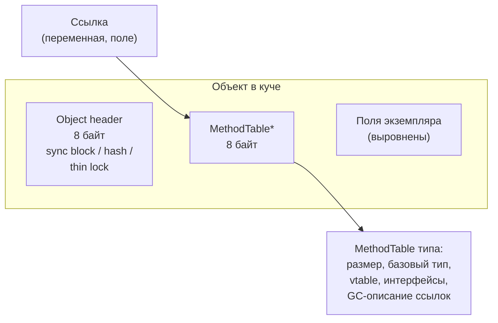
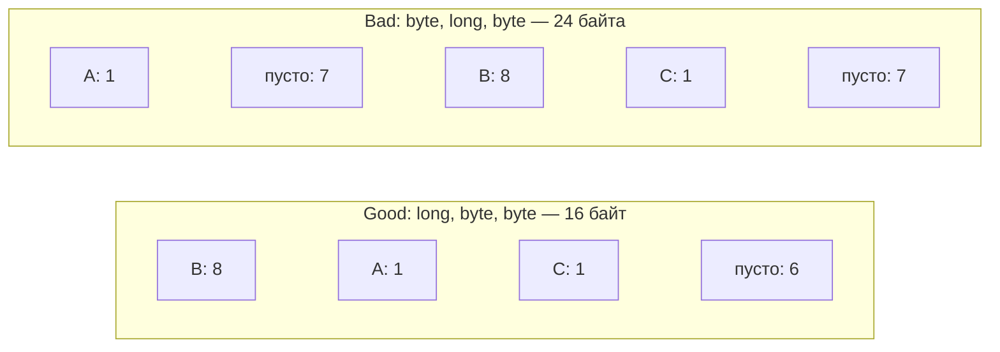
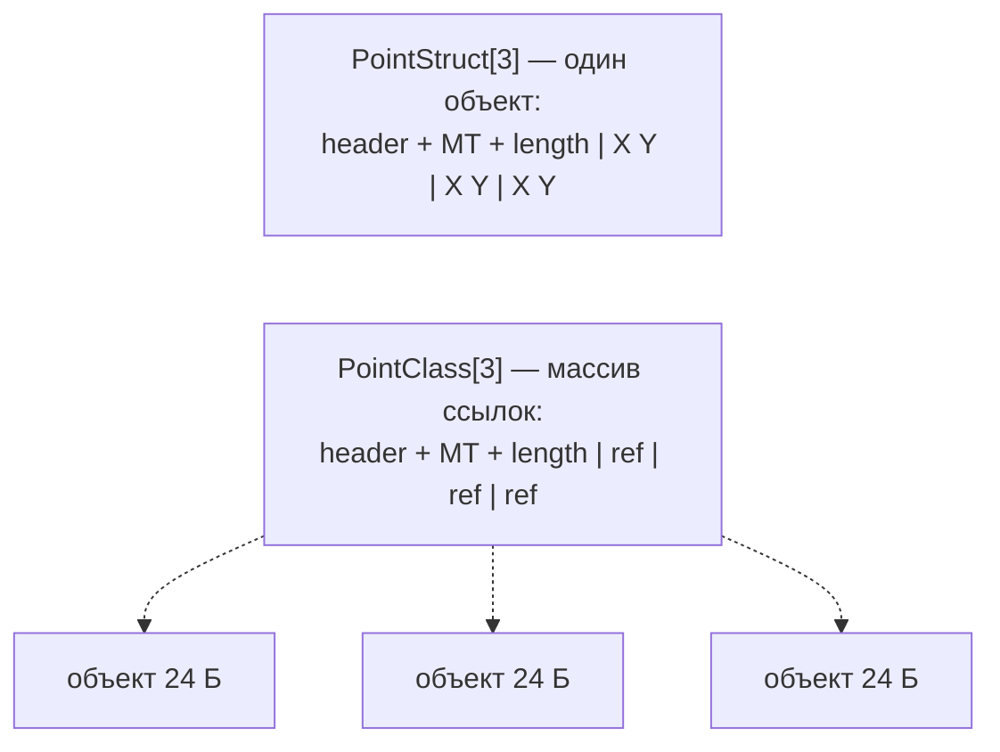

:::tldr
- Каждый объект ссылочного типа в куче (64-бит) имеет **накладные расходы 16 байт**: **object header** (8 байт: sync block index, хэш-код, биты GC и блокировок) и **указатель на MethodTable** (8 байт: тип, таблица виртуальных методов, информация для GC). Ссылка на объект указывает на поле MethodTable, заголовок лежит **перед** ним.
- Минимальный размер объекта — **24 байта** (даже у пустого класса). Поля размещаются с **выравниванием**; CLR по умолчанию **переупорядочивает** поля классов (`LayoutKind.Auto`) для плотной упаковки.
- **Массив** дополнительно хранит длину (8 байт с выравниванием); `string` — длину и символы UTF-16 + завершающий `\0`. `object[]` из 1000 элементов — это 8 КБ ссылок + 1000 отдельных объектов.
- **Struct** не имеет заголовка и MethodTable (в неупакованном виде): массив из 1000 `Point` — один непрерывный блок 16 КБ. Упаковка (boxing) добавляет заголовок и MethodTable.
- Практика Senior-уровня: понимать стоимость мелких объектов, выбирать struct/массивы структур для плотных данных, избегать **false sharing** в конкурентном коде, измерять (`ObjectLayoutInspector`, dotMemory, `GC.GetAllocatedBytesForCurrentThread`).
:::

## Структура объекта



```csharp
class Empty { }                               // 24 байта: header 8 + MT 8 + минимум 8 под поля
class Point { int X; int Y; }                 // 24 байта: 16 + 8 (два int)
class Person { string Name; int Age; long Id; }   // 40 байт: 16 + ссылка 8 + long 8 + int 4 (+4 выравнивание)
```

Минимальный размер 24 байта нужен, чтобы освобождённое место могло стать «свободным объектом» в списке свободной памяти GC.

## Заголовок объекта

В 8 байтах заголовка (на x64 используются 4 байта + выравнивание) хранится одно из:
- **thin lock** — id потока-владельца при `lock(obj)` без конкуренции;
- **хэш-код** из `RuntimeHelpers.GetHashCode` (базовый `object.GetHashCode`);
- **индекс sync block** — если нужно и то, и другое, или блокировка «раздулась» (конкуренция, `Monitor.Wait`). Sync block — отдельная структура в таблице CLR.
- биты, используемые GC (маркировка во время сборки).

Поэтому `lock` на любом объекте ничего не стоит по памяти, пока нет конкуренции.

## Выравнивание и порядок полей

```csharp
[StructLayout(LayoutKind.Sequential)]
struct Bad { byte A; long B; byte C; }    // 24 байта: 1 + 7 (выравнивание) + 8 + 1 + 7

[StructLayout(LayoutKind.Sequential)]
struct Good { long B; byte A; byte C; }   // 16 байт: 8 + 1 + 1 + 6
```



- Для **классов** CLR сам переупорядочивает поля (`Auto`), так что порядок объявления не важен.
- Для **struct** по умолчанию `Sequential` (важно для interop) — порядок полей влияет на размер. `[StructLayout(LayoutKind.Auto)]` разрешает переупорядочивание для структур, не используемых в interop.
- `LayoutKind.Explicit` + `[FieldOffset]` — ручное размещение (unions, бинарные протоколы).

## Массивы и строки



| Данные | Размер (x64, приблизительно) |
|---|---|
| `int[1000]` | 24 + 4 000 ≈ 4 КБ |
| `PointStruct[1000]` (2×int) | 24 + 8 000 ≈ 8 КБ, один объект |
| `PointClass[1000]` | 24 + 8 000 (ссылки) + 1000 × 24 ≈ 32 КБ, 1001 объект |
| `string` из 10 символов | 22 + 2×10 → 42 → выравнивание до 48 байт |
| `List<int>` из 1000 | объект List (~32 Б) + внутренний массив с запасом ёмкости |
| `Dictionary<int,int>` из 1000 | массивы buckets + entries (~24 байта на запись) + запас |
| Упакованный `int` (boxing) | 24 байта вместо 4 |

Массив структур — **непрерывная память**: лучше для кэша процессора (последовательный доступ, предвыборка), меньше работы GC (один объект вместо тысячи). Это основа data-oriented оптимизаций.

Объекты ≥ **85 000 байт** попадают в **Large Object Heap** — например, `double[10_700]` уже там.

## False sharing


```csharp Разнести горячие поля по разным линиям кэша
[StructLayout(LayoutKind.Explicit, Size = 128)]
struct PaddedCounter
{
    [FieldOffset(64)] public long Value;      // отступ от соседних данных
}

var counters = new PaddedCounter[Environment.ProcessorCount];   // счётчик на ядро — без false sharing
Interlocked.Increment(ref counters[core].Value);
```

В BCL это учитывается внутри `ConcurrentQueue`, `ThreadPool` и др. В своём коде проблема проявляется в счётчиках на поток/ядро и структурах, интенсивно изменяемых из разных потоков.

## Как измерить

```csharp
// Размер экземпляра и раскладка полей
TypeLayout.PrintLayout<Person>();             // пакет ObjectLayoutInspector

// Сколько выделил код
long before = GC.GetAllocatedBytesForCurrentThread();
DoWork();
long allocated = GC.GetAllocatedBytesForCurrentThread() - before;

// Размер неуправляемой копии структуры
int size = Unsafe.SizeOf<PointStruct>();
```

В BenchmarkDotNet — `[MemoryDiagnoser]` (столбцы Allocated, Gen0). Для дампов — dotMemory, PerfView, `dotnet-gcdump`, команды SOS `!dumpobj`, `!objsize`.

## Вопросы на засыпку

:::qa Сколько памяти занимает new object()?
24 байта на x64: 8 байт заголовка, 8 байт указателя на MethodTable и 8 байт минимального пространства под поля. На x86 — 12 байт.
:::

:::qa Почему lock(obj) не требует дополнительной памяти?
Неконкурентная блокировка хранится как thin lock прямо в заголовке объекта (id потока и счётчик рекурсии). Только при конкуренции, `Wait/Pulse` или одновременном хранении хэш-кода создаётся sync block в отдельной таблице, а в заголовке остаётся его индекс. С .NET 9 есть и отдельный тип `System.Threading.Lock`.
:::

:::qa Когда массив структур хуже массива классов?
Если структуры большие и их часто передают/копируют по значению, если нужна общая изменяемая ссылка на элемент из разных мест, или если нужна полиморфность. Также сортировка и перестановка больших структур копирует больше байт, чем перестановка ссылок.
:::

:::qa Что хранит MethodTable и зачем GC его читает?
Размер экземпляра, указатель на родительский тип, таблицу виртуальных методов, список реализуемых интерфейсов и **GC-описание** — где в объекте находятся ссылки. GC использует его при маркировке, чтобы пройти по ссылкам объекта, и при компактировании — чтобы знать размер.
:::

## Итог

Объект в куче .NET — это заголовок (блокировки, хэш-код, служебные биты GC) и указатель на MethodTable плюс выровненные поля: минимум 24 байта на x64. Мелкие объекты, упаковка и массивы ссылок дороги по памяти и для GC; массивы структур дают плотное непрерывное размещение. Учитывайте выравнивание полей в struct, избегайте false sharing в конкурентном коде и проверяйте выводы измерениями.
