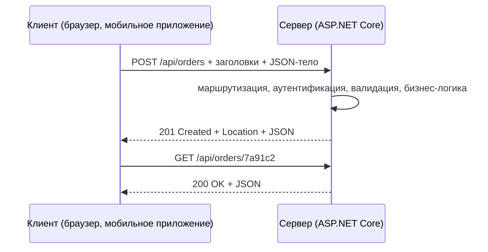
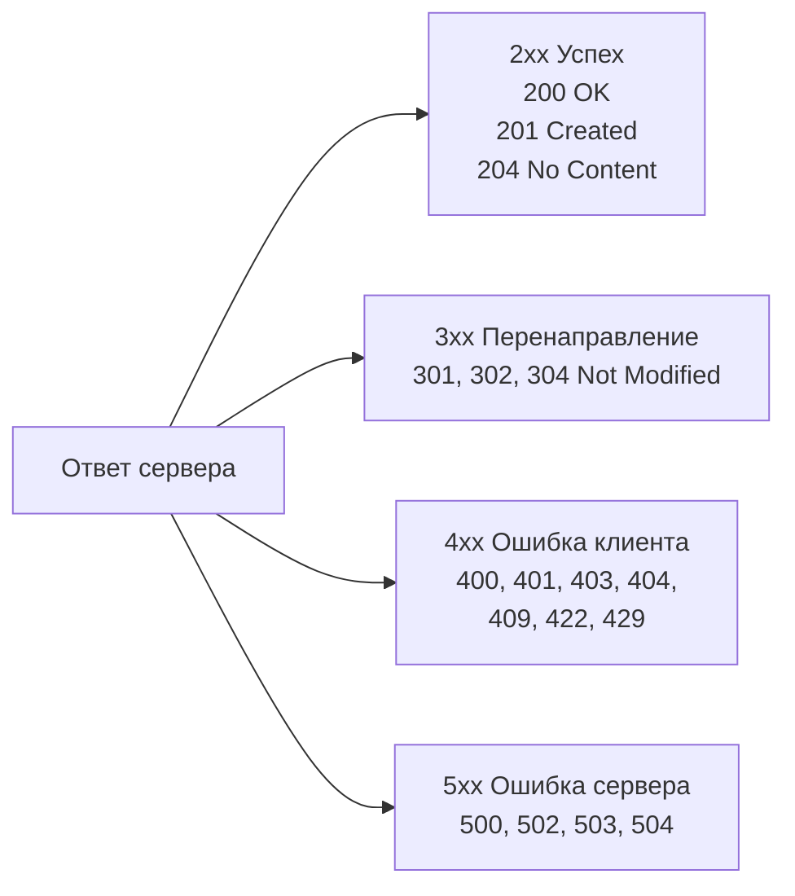

:::tldr
- **HTTP** — текстовый протокол «запрос → ответ». Запрос: **метод**, **URL**, **заголовки**, необязательное **тело**. Ответ: **статус-код**, заголовки, тело (чаще JSON).
- **REST** — стиль API: **ресурсы** адресуются URL (`/orders/42`), действия выражаются **HTTP-методами**, сервер не хранит состояние клиента между запросами (**stateless**).
- Методы: **GET** — прочитать, **POST** — создать / выполнить действие, **PUT** — заменить целиком, **PATCH** — изменить частично, **DELETE** — удалить. GET, PUT, DELETE — **идемпотентны** (повтор не меняет результат), POST — нет.
- Статус-коды: **2xx** успех (200 OK, 201 Created, 204 No Content), **3xx** перенаправление, **4xx** ошибка клиента (400, 401, 403, 404, 409, 422, 429), **5xx** ошибка сервера (500, 502, 503, 504).
- **401** — «кто вы?» (не аутентифицирован), **403** — «вам нельзя» (нет прав). Ошибки в ASP.NET Core принято отдавать в формате **ProblemDetails** (RFC 9457).
:::

## Как выглядит HTTP-обмен

```http Запрос
POST /api/orders HTTP/1.1
Host: shop.example.uz
Content-Type: application/json
Authorization: Bearer eyJhbGciOi...
Accept: application/json

{ "productId": "3f2c...", "quantity": 2 }
```

```http Ответ
HTTP/1.1 201 Created
Content-Type: application/json
Location: /api/orders/7a91c2

{ "id": "7a91c2", "status": "New", "total": 840000 }
```



## Ресурсы и методы

| Действие | Метод и URL | Успешный ответ |
|---|---|---|
| Список заказов | `GET /api/orders?status=new&page=2` | 200 + массив |
| Один заказ | `GET /api/orders/42` | 200 или **404** |
| Создать заказ | `POST /api/orders` | **201** + `Location` |
| Заменить заказ | `PUT /api/orders/42` | 200 или 204 |
| Изменить часть полей | `PATCH /api/orders/42` | 200 или 204 |
| Удалить | `DELETE /api/orders/42` | **204** |
| Действие над ресурсом | `POST /api/orders/42/cancel` | 200 / 204 |
| Вложенный ресурс | `GET /api/customers/7/orders` | 200 |

Правила именования: существительные во множественном числе (`/orders`, не `/getOrders`), вложенность для связей, фильтры и пагинация — в query string, действия, не укладывающиеся в CRUD, — подресурсом-глаголом (`/cancel`).

## Безопасность и идемпотентность методов

| Метод | Безопасный (не меняет данные) | Идемпотентный | Тело запроса |
|---|---|---|---|
| GET | Да | Да | Нет |
| HEAD | Да | Да | Нет |
| POST | Нет | **Нет** | Да |
| PUT | Нет | Да | Да |
| PATCH | Нет | Не обязательно | Да |
| DELETE | Нет | Да | Обычно нет |

**Идемпотентность** — повторный одинаковый запрос даёт то же состояние на сервере. Это важно, потому что сеть ненадёжна: клиент не получил ответ и повторил запрос. `PUT /orders/42 {status: Paid}` дважды — заказ всё равно оплачен один раз. `POST /payments` дважды — **два платежа**! Поэтому для POST используют **ключ идемпотентности** (заголовок `Idempotency-Key`).

## Статус-коды



| Код | Значение | Когда |
|---|---|---|
| 200 OK | Успех с телом | GET, обновление с возвратом данных |
| 201 Created | Ресурс создан | POST, + заголовок `Location` |
| 204 No Content | Успех без тела | DELETE, PUT без возврата |
| 400 Bad Request | Некорректный запрос | Невалидный JSON, ошибки валидации |
| 401 Unauthorized | Не аутентифицирован | Нет или просрочен токен |
| 403 Forbidden | Нет прав | Пользователь известен, но доступ запрещён |
| 404 Not Found | Ресурс не найден | Неверный id или чужой ресурс |
| 409 Conflict | Конфликт состояния | Email уже занят, конкурентное изменение |
| 422 Unprocessable Content | Бизнес-валидация | Данные корректны по формату, но нарушают правила |
| 429 Too Many Requests | Превышен лимит | Rate limiting, + `Retry-After` |
| 500 Internal Server Error | Ошибка в коде сервера | Необработанное исключение |
| 502 / 504 | Ошибка/таймаут шлюза | Прокси не дождался ответа от сервиса |
| 503 Service Unavailable | Сервис временно недоступен | Перегрузка, обслуживание |

## Важные заголовки

| Заголовок | Назначение |
|---|---|
| `Content-Type` | Формат тела: `application/json` |
| `Accept` | Какой формат ответа ожидает клиент |
| `Authorization` | Учётные данные: `Bearer <token>` |
| `Location` | Адрес созданного ресурса (с 201) |
| `Cache-Control`, `ETag` | Кэширование и условные запросы |
| `Retry-After` | Когда повторить (с 429, 503) |
| `X-Request-Id` / `traceparent` | Сквозной идентификатор запроса для логов |

## REST API в ASP.NET Core

```csharp Minimal API
var orders = app.MapGroup("/api/orders").RequireAuthorization();

orders.MapGet("/", async (IOrderService svc, int page = 1) => Results.Ok(await svc.ListAsync(page)));

orders.MapGet("/{id:guid}", async (Guid id, IOrderService svc) =>
    await svc.GetAsync(id) is { } order ? Results.Ok(order) : Results.NotFound());

orders.MapPost("/", async (CreateOrderRequest req, IOrderService svc) =>
{
    var created = await svc.CreateAsync(req);
    return Results.Created($"/api/orders/{created.Id}", created);    // 201 + Location
});

orders.MapDelete("/{id:guid}", async (Guid id, IOrderService svc) =>
    await svc.DeleteAsync(id) ? Results.NoContent() : Results.NotFound());
```

```json Ошибка в формате ProblemDetails
{
  "type": "https://tools.ietf.org/html/rfc9110#section-15.5.1",
  "title": "One or more validation errors occurred.",
  "status": 400,
  "errors": { "Quantity": ["Количество должно быть больше 0"] },
  "traceId": "00-4bf92f3577b34da6a3ce929d0e0e4736-00f067aa0ba902b7-01"
}
```

## Типичные ошибки

:::warning Частые ошибки в API
- Возвращать **200 с `{"success": false}`** при ошибке — клиенты, прокси и мониторинг не видят проблему.
- Глаголы в URL (`/api/getOrders`, `/api/deleteOrder?id=5`) и изменение данных через GET.
- 500 на ошибки валидации ввода — это 400/422.
- Путать 401 и 403.
- Отдавать сущности БД целиком (лишние и чувствительные поля) вместо DTO.
- Возвращать большие списки без пагинации.
:::

## Вопросы на засыпку

:::qa Чем PUT отличается от PATCH?
PUT заменяет ресурс **целиком**: не переданные поля сбрасываются (или запрос считается неполным). PATCH изменяет только переданные поля (JSON Merge Patch или JSON Patch). PUT идемпотентен по определению; PATCH может не быть (например, «увеличить счётчик на 1»).
:::

:::qa Что значит stateless в REST?
Каждый запрос содержит всё необходимое для обработки (включая токен аутентификации), сервер не хранит контекст «сессии» клиента между запросами в памяти. Благодаря этому любой экземпляр сервиса за балансировщиком может обработать любой запрос — система легко масштабируется.
:::

:::qa Чем HTTP отличается от HTTPS?
HTTPS — тот же HTTP поверх TLS: трафик шифруется, а клиент проверяет сертификат сервера (подлинность). Без HTTPS пароли и токены передаются открытым текстом. В продакшене — только HTTPS.
:::

:::qa Как версионировать REST API?
Чаще всего — в URL (`/api/v2/orders`), реже — в заголовке или query string. Новую версию вводят только при ломающих изменениях; добавление новых необязательных полей обратно совместимо и версии не требует.
:::

## Итог

HTTP — протокол запросов и ответов с методами, заголовками, телом и статус-кодами. REST строит API вокруг ресурсов и стандартной семантики методов: GET читает, POST создаёт, PUT/PATCH изменяют, DELETE удаляет. Возвращайте правильные статус-коды (201, 204, 400, 401/403, 404, 409), ошибки — в формате ProblemDetails, помните об идемпотентности и не меняйте данные через GET.
