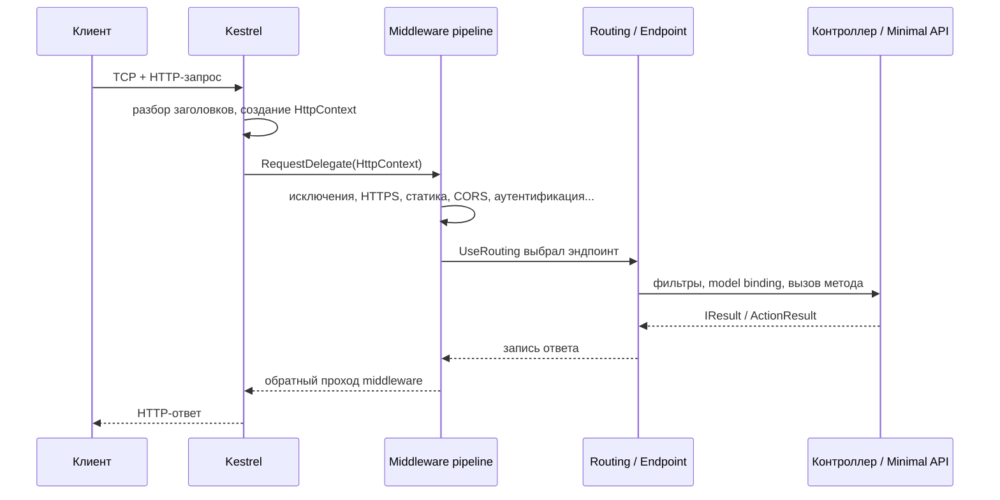
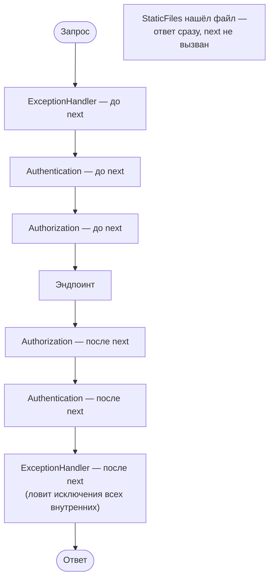

:::tldr
- Запрос принимает **Kestrel**, создаёт `HttpContext` и передаёт его в **конвейер middleware** — цепочку компонентов, каждый из которых может обработать запрос, передать дальше (`await next(context)`) и обработать ответ на обратном пути.
- Порядок регистрации = порядок выполнения на входе и **обратный** на выходе («луковица»).
- Middleware может **замкнуть** конвейер (short-circuit): не вызывать `next` и сразу вернуть ответ (статика, 401, кэш, rate limit).
- Типичный порядок: ExceptionHandler → HSTS → HttpsRedirection → StaticFiles → Routing → CORS → Authentication → Authorization → RateLimiter → эндпоинты.
- `Use` — обычный middleware, `Run` — конечный, `Map`/`MapWhen`/`UseWhen` — ветвление конвейера.
:::

## Путь запроса от сокета до контроллера



1. **Kestrel** читает байты из сокета (через `System.IO.Pipelines`), парсит HTTP/1.1, HTTP/2 или HTTP/3.
2. Создаётся **`HttpContext`**: `Request`, `Response`, `User`, `Items`, `RequestServices` (скоуп DI на запрос), `Features`.
3. `HttpContext` передаётся в **первый** делегат конвейера.
4. Каждый middleware решает: обработать, передать дальше, или ответить сам.
5. В конце — **эндпоинт** (контроллер, Minimal API, Razor Page, gRPC-сервис, SignalR-хаб).
6. Ответ проходит middleware **в обратном порядке**.
7. Скоуп DI уничтожается — вызываются `Dispose` scoped-сервисов.

## Модель «луковицы»



```csharp Свой middleware как делегат
app.Use(async (context, next) =>
{
    var sw = Stopwatch.StartNew();
    // код ДО — на входе
    await next(context);                  // передать управление следующему
    // код ПОСЛЕ — на выходе (ответ уже сформирован)
    logger.LogInformation("{Path} → {Status} за {Ms} мс",
        context.Request.Path, context.Response.StatusCode, sw.ElapsedMilliseconds);
});
```

```csharp Свой middleware как класс
public sealed class CorrelationIdMiddleware(RequestDelegate next)
{
    private const string Header = "X-Correlation-ID";

    public async Task InvokeAsync(HttpContext context, ILogger<CorrelationIdMiddleware> logger) // scoped-зависимости — в InvokeAsync
    {
        var id = context.Request.Headers.TryGetValue(Header, out var v) ? v.ToString() : Guid.NewGuid().ToString("N");
        context.Response.OnStarting(() => { context.Response.Headers[Header] = id; return Task.CompletedTask; });

        using (logger.BeginScope(new Dictionary<string, object> { ["CorrelationId"] = id }))
            await next(context);
    }
}

app.UseMiddleware<CorrelationIdMiddleware>();
```

:::warning Время жизни middleware-класса
Middleware, подключённый через `UseMiddleware<T>`, создаётся **один раз** на всё приложение — это фактически синглтон. Scoped-зависимости (DbContext) нельзя внедрять в его **конструктор** — только параметрами метода `InvokeAsync`. Альтернатива — реализовать `IMiddleware` и зарегистрировать в DI с нужным временем жизни.
:::

## Правильный порядок

```csharp Program.cs — рекомендуемый порядок
var app = builder.Build();

if (app.Environment.IsDevelopment())
    app.UseDeveloperExceptionPage();
else
{
    app.UseExceptionHandler("/error");   // 1. самый внешний — ловит всё, что ниже
    app.UseHsts();
}

app.UseHttpsRedirection();               // 2. редирект на HTTPS
app.UseStaticFiles();                    // 3. статика — без аутентификации, быстро замыкает
app.UseRouting();                        // 4. выбор эндпоинта (метаданные для следующих)
app.UseCors();                           // 5. после Routing, до Auth
app.UseAuthentication();                 // 6. кто ты? → HttpContext.User
app.UseAuthorization();                  // 7. можно ли? (читает [Authorize] эндпоинта)
app.UseRateLimiter();                    // 8. лимиты (могут зависеть от пользователя)
app.UseOutputCache();                    // 9. кэш ответов

app.MapControllers();                    // 10. эндпоинты
app.MapHealthChecks("/health");
app.Run();
```

:::note Почему порядок критичен
- `UseAuthorization` **до** `UseAuthentication` — `User` ещё пустой, всё будет 401.
- `UseExceptionHandler` **не первым** — исключения из middleware выше него не будут пойманы.
- `UseStaticFiles` **после** `UseAuthorization` — каждый запрос за картинкой проходит проверку прав (если только статику не нужно защищать).
- `UseCors` **после** `UseAuthorization` — preflight-запросы `OPTIONS` получат 401.
:::

## Ветвление конвейера

```csharp
// Map: отдельный конвейер для префикса пути (путь «отрезается»)
app.Map("/admin", admin =>
{
    admin.UseMiddleware<AdminIpFilterMiddleware>();
    admin.Run(ctx => ctx.Response.WriteAsync("Admin area"));
});

// MapWhen: ветка по условию, в основной конвейер не возвращается
app.MapWhen(ctx => ctx.Request.Headers.ContainsKey("X-Legacy"), legacy => legacy.UseMiddleware<LegacyMiddleware>());

// UseWhen: ветка по условию, ПОТОМ возвращается в основной конвейер
app.UseWhen(ctx => ctx.Request.Path.StartsWithSegments("/api"), api => api.UseMiddleware<ApiKeyMiddleware>());

// Run: терминальный middleware — next нет
app.Run(async ctx => await ctx.Response.WriteAsync("Fallback"));
```

## Endpoint routing: зачем UseRouting отдельно

С ASP.NET Core 3.0 маршрутизация разделена на два шага:

- `UseRouting` — **выбирает** эндпоинт и кладёт его в `HttpContext` (`context.GetEndpoint()`), вместе с метаданными (`[Authorize]`, политика CORS, rate limit).
- Middleware между `UseRouting` и эндпоинтами **видят метаданные** выбранного эндпоинта и действуют по ним.
- `MapControllers()`/`MapGet()` — **выполняют** эндпоинт (с .NET 6 `WebApplication` добавляет `UseEndpoints` автоматически).

## Типичные ошибки

- Писать в `Response` **после** `await next()`, когда ответ уже начал отправляться → `InvalidOperationException: Headers are read-only, response has already started`. Используйте `Response.OnStarting`.
- Читать `Request.Body` в middleware и не включить `Request.EnableBuffering()` — тело можно прочитать только один раз, контроллер получит пустой поток.
- Хранить состояние запроса в полях middleware-класса — он общий для всех запросов → гонки. Для данных запроса — `HttpContext.Items` или `HttpContext.Features`.
- Блокирующий I/O в middleware — тормозит весь сервис.

## Вопросы на засыпку

:::qa Чем middleware отличается от фильтра MVC?
Middleware работает для **всех** запросов на уровне HTTP и не знает про контроллеры и модели. Фильтры работают только внутри MVC/эндпоинтов, имеют доступ к `ActionArguments`, результату действия, `ModelState`. Кросс-срезы HTTP (логирование, заголовки) — middleware; логика вокруг действия — фильтры.
:::

:::qa Что такое HttpContext.Features?
Низкоуровневый набор интерфейсов, которые предоставляет сервер: `IHttpRequestFeature`, `IHttpConnectionFeature`, `IHttpResponseBodyFeature` и т.п. `HttpContext.Request`/`Response` — удобные обёртки над ними. Middleware может подменять фичи (так работает, например, буферизация ответа).
:::

:::qa Можно ли использовать HttpContext в фоновой задаче после завершения запроса?
Нет. `HttpContext` переиспользуется (пулинг) после завершения запроса; обращение к нему из фоновой задачи — неопределённое поведение. Скопируйте нужные данные (UserId, заголовки) до запуска фоновой работы.
:::

:::qa Как short-circuit работает с эндпоинтами в .NET 8?
Метод `.ShortCircuit()` у эндпоинта (`app.MapGet("/ping", ...).ShortCircuit()`) выполняет его сразу после `UseRouting`, пропуская остальные middleware (аутентификацию, CORS) — полезно для health-check и robots.txt.
:::

## Итог

Запрос в ASP.NET Core — это `HttpContext`, проходящий через цепочку делегатов-middleware туда и обратно. Порядок регистрации определяет поведение: обработка ошибок — снаружи, статика — пораньше, аутентификация — перед авторизацией, эндпоинты — в центре.
