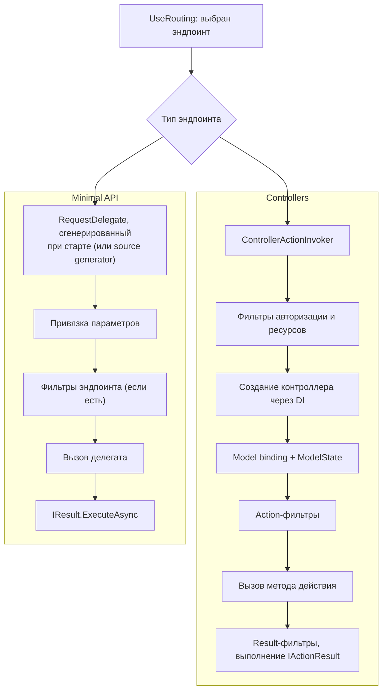
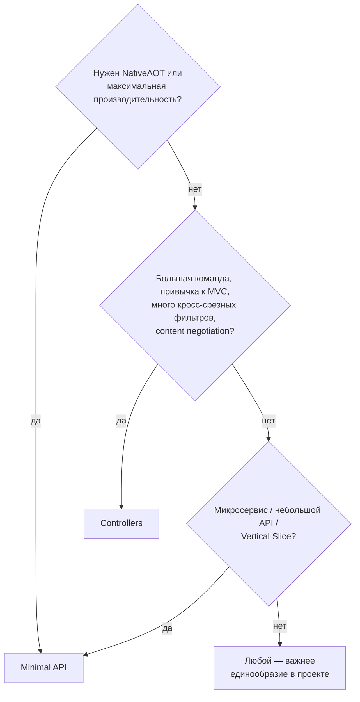

:::tldr
- Оба подхода работают поверх **endpoint routing** и одного конвейера middleware; различается модель описания эндпоинтов.
- **Controllers (MVC)**: классы-наследники `ControllerBase`, действия-методы, атрибутная маршрутизация, **фильтры MVC**, `ModelState`, соглашения `[ApiController]`. Больше «церемоний», но богатая инфраструктура.
- **Minimal API** (.NET 6+): эндпоинт — это делегат `app.MapGet("/path", handler)`. Меньше кода, быстрее (нет MVC-инфраструктуры), поддержка **NativeAOT**, фильтры эндпоинтов, группы маршрутов, `TypedResults`.
- С .NET 7–8 возможности почти сравнялись: валидация, фильтры, OpenAPI, группы. Выбор — стиль и масштаб; можно смешивать в одном приложении.
- Для структурирования Minimal API используют группы (`MapGroup`), методы-расширения по фичам, или библиотеки вроде Carter / FastEndpoints.
:::

## Один и тот же эндпоинт двумя способами

```csharp Контроллер
[ApiController]
[Route("api/orders")]
public class OrdersController(IOrderService orders) : ControllerBase
{
    [HttpGet("{id:int}")]
    [ProducesResponseType<OrderDto>(StatusCodes.Status200OK)]
    [ProducesResponseType(StatusCodes.Status404NotFound)]
    public async Task<ActionResult<OrderDto>> Get(int id, CancellationToken ct)
    {
        var order = await orders.GetAsync(id, ct);
        return order is null ? NotFound() : Ok(order);
    }

    [HttpPost]
    public async Task<IActionResult> Create(CreateOrderRequest request, CancellationToken ct)
    {
        var id = await orders.CreateAsync(request, ct);
        return CreatedAtAction(nameof(Get), new { id }, null);
    }
}
```

```csharp Minimal API
var orders = app.MapGroup("/api/orders").WithTags("Orders").RequireAuthorization();

orders.MapGet("/{id:int}", async Task<Results<Ok<OrderDto>, NotFound>> (int id, IOrderService svc, CancellationToken ct) =>
    await svc.GetAsync(id, ct) is { } order ? TypedResults.Ok(order) : TypedResults.NotFound())
    .WithName("GetOrder");

orders.MapPost("/", async (CreateOrderRequest request, IOrderService svc, CancellationToken ct) =>
{
    var id = await svc.CreateAsync(request, ct);
    return TypedResults.CreatedAtRoute("GetOrder", new { id });
});
```

## Что происходит под капотом



Для Minimal API при старте строится **специализированный `RequestDelegate`** под сигнатуру обработчика (через Expression trees, а в AOT — через Request Delegate Generator). Нет поиска контроллеров, создания контекстов действий, `ModelState` — отсюда меньшие накладные расходы.

## Сравнение

| Возможность | Controllers | Minimal API |
|---|---|---|
| Описание | Классы и атрибуты | Делегаты и методы-расширения |
| Маршрутизация | Атрибуты `[Route]`, `[HttpGet]` | `MapGet/MapPost`, `MapGroup` |
| Привязка параметров | `[FromBody]`, `[FromQuery]`... + соглашения `[ApiController]` | Выводится из сигнатуры, `[AsParameters]` для группировки |
| Валидация | Автоматическая (DataAnnotations + `ModelState`, 400 от `[ApiController]`) | .NET 10: встроенная `AddValidation()`; ранее — фильтры / FluentValidation |
| Фильтры | Полный набор MVC-фильтров | `IEndpointFilter` (+ middleware) |
| Результаты | `IActionResult`, `ActionResult<T>` | `IResult`, `TypedResults`, `Results<T1,T2>` |
| OpenAPI | Атрибуты `[ProducesResponseType]` | Выводится из `TypedResults`, `.Produces<T>()` |
| NativeAOT | Нет | Да |
| Производительность | Хорошая | Выше (меньше накладных расходов) |
| Content negotiation (XML и др.) | Да | Только JSON |
| Организация кода | Естественная (класс = ресурс) | Нужна дисциплина |

## Фильтры эндпоинтов в Minimal API

```csharp
public sealed class ValidationFilter<T>(IValidator<T> validator) : IEndpointFilter where T : class
{
    public async ValueTask<object?> InvokeAsync(EndpointFilterInvocationContext ctx, EndpointFilterDelegate next)
    {
        var arg = ctx.Arguments.OfType<T>().First();
        var result = await validator.ValidateAsync(arg);
        if (!result.IsValid) return TypedResults.ValidationProblem(result.ToDictionary());
        return await next(ctx);
    }
}

orders.MapPost("/", CreateOrder).AddEndpointFilter<ValidationFilter<CreateOrderRequest>>();
```

## Организация Minimal API в большом проекте

```csharp Эндпоинты по фичам
public static class OrderEndpoints
{
    public static IEndpointRouteBuilder MapOrderEndpoints(this IEndpointRouteBuilder app)
    {
        var group = app.MapGroup("/api/orders").WithTags("Orders").RequireAuthorization();
        group.MapGet("/{id:int}", GetById).WithName("GetOrder");
        group.MapPost("/", Create);
        group.MapDelete("/{id:int}", Delete).RequireAuthorization("Admin");
        return app;
    }

    private static async Task<Results<Ok<OrderDto>, NotFound>> GetById(int id, IOrderService svc, CancellationToken ct) =>
        await svc.GetAsync(id, ct) is { } o ? TypedResults.Ok(o) : TypedResults.NotFound();

    private static async Task<Created> Create(CreateOrderRequest req, IOrderService svc, CancellationToken ct) =>
        TypedResults.Created($"/api/orders/{await svc.CreateAsync(req, ct)}");

    private static async Task<NoContent> Delete(int id, IOrderService svc, CancellationToken ct)
    {
        await svc.DeleteAsync(id, ct);
        return TypedResults.NoContent();
    }
}

// Program.cs
app.MapOrderEndpoints();
```

Такой стиль хорошо сочетается с **Vertical Slice Architecture**: всё, что относится к фиче (эндпоинт, команда, обработчик, валидатор), лежит рядом.

## Как выбрать



## Вопросы на засыпку

:::qa Как Minimal API определяет, откуда брать параметр?
По порядку: явные атрибуты (`[FromRoute]`, `[FromQuery]`, `[FromBody]`, `[FromServices]`, `[FromHeader]`); специальные типы (`HttpContext`, `CancellationToken`, `ClaimsPrincipal`); имя совпадает с параметром маршрута → маршрут; простой тип (есть `TryParse`) → query; зарегистрирован в DI → сервис; иначе → тело (JSON).
:::

:::qa Зачем TypedResults, если есть Results?
`Results.Ok(x)` возвращает `IResult` — OpenAPI не знает тип ответа. `TypedResults.Ok(x)` возвращает `Ok<T>` — тип известен на этапе компиляции, метаданные для OpenAPI генерируются автоматически, а в unit-тестах можно проверить тип результата. `Results<Ok<T>, NotFound>` описывает несколько возможных ответов.
:::

:::qa Можно ли смешивать контроллеры и Minimal API?
Да, в одном приложении: `builder.Services.AddControllers(); app.MapControllers(); app.MapGet(...)`. Они используют общий роутинг, middleware, DI, аутентификацию.
:::

:::qa Что делает атрибут [ApiController]?
Включает соглашения: обязательная атрибутная маршрутизация, автоматический ответ 400 `ValidationProblemDetails` при невалидной модели, вывод источников параметров (`[FromBody]` для сложных типов), `ProblemDetails` для ошибочных статус-кодов.
:::

## Итог

Контроллеры и Minimal API — два способа описать эндпоинты поверх одной платформы. Контроллеры дают привычную структуру и полный набор MVC-возможностей, Minimal API — лаконичность, скорость и AOT. Выбирайте по размеру проекта и требованиям, а главное — придерживайтесь единого стиля.
