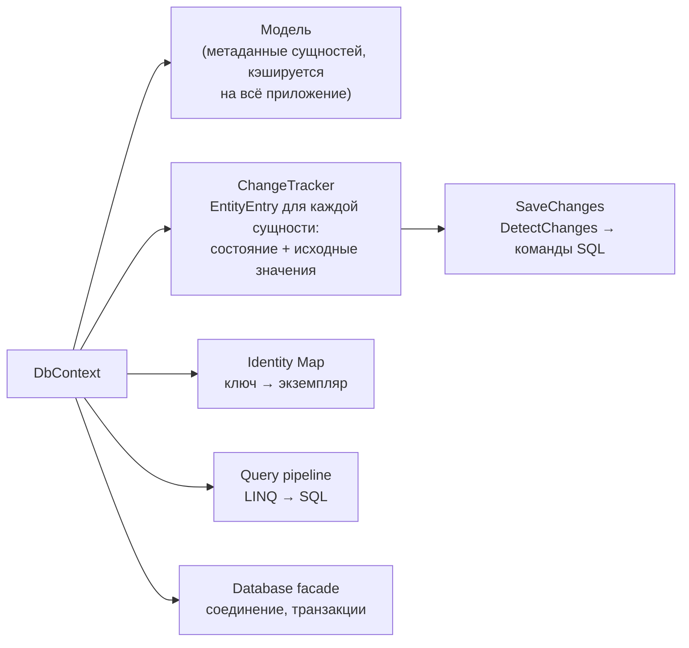
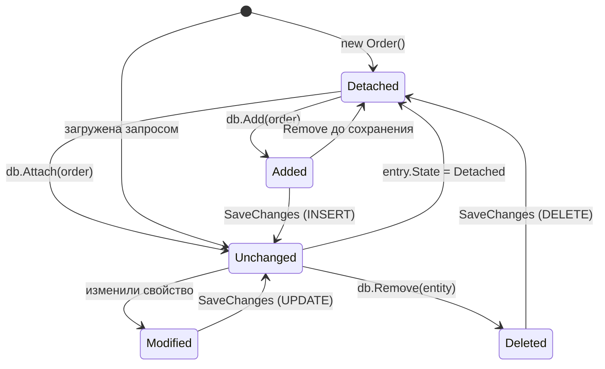
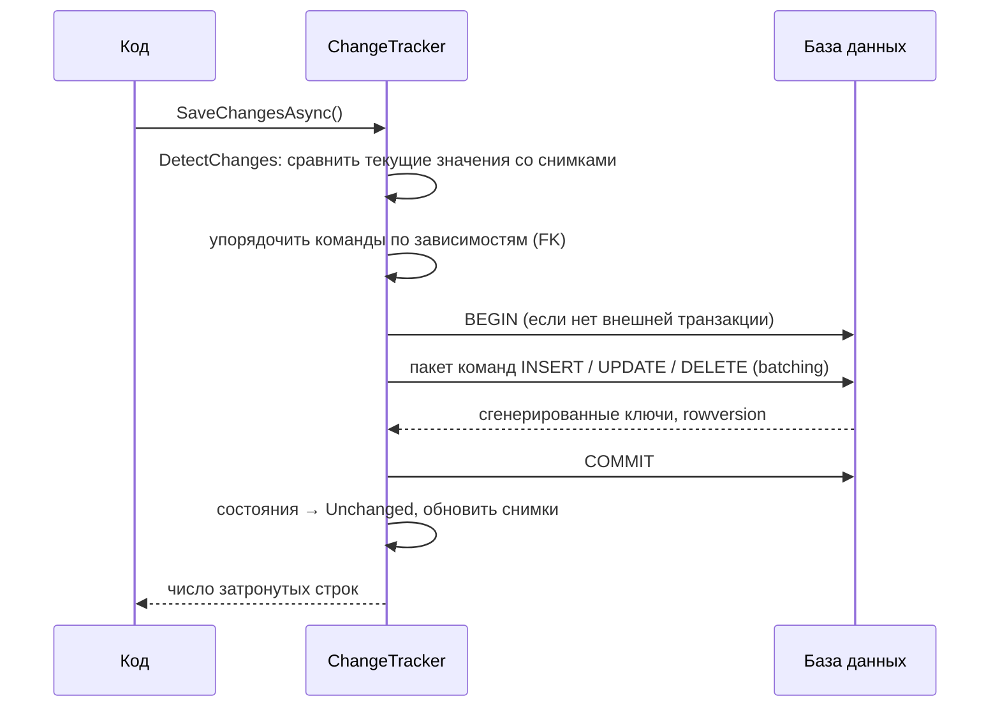

:::tldr
- **`DbContext`** — сессия работы с БД: запросы, отслеживание изменений, сохранение. Лёгкий, **не потокобезопасный**, живёт **недолго** (обычно Scoped — один на HTTP-запрос).
- **Unit of Work**: все изменения копятся в памяти и отправляются в БД **одним вызовом `SaveChanges`** в одной транзакции.
- **Identity Map**: в пределах контекста одна строка БД = **один объект**. Повторный запрос той же сущности вернёт тот же экземпляр.
- **Change Tracker** хранит для каждой сущности состояние (`Added`, `Unchanged`, `Modified`, `Deleted`, `Detached`) и **снимок исходных значений**; при `SaveChanges` вызывает `DetectChanges`, сравнивает текущие значения со снимком и генерирует `INSERT/UPDATE/DELETE` только для изменённых столбцов.
- Для чтения без изменений — `AsNoTracking()`: нет снимков и Identity Map, быстрее и меньше памяти.
:::

## Роль DbContext

```csharp
public sealed class ShopDbContext(DbContextOptions<ShopDbContext> options) : DbContext(options)
{
    public DbSet<Order> Orders => Set<Order>();
    public DbSet<Customer> Customers => Set<Customer>();

    protected override void OnModelCreating(ModelBuilder b) =>
        b.ApplyConfigurationsFromAssembly(typeof(ShopDbContext).Assembly);
}

builder.Services.AddDbContext<ShopDbContext>(o =>
    o.UseNpgsql(builder.Configuration.GetConnectionString("Default")));
```



## Состояния сущностей



| Состояние | Что сделает SaveChanges |
|---|---|
| `Added` | `INSERT` |
| `Unchanged` | Ничего |
| `Modified` | `UPDATE` только изменённых столбцов |
| `Deleted` | `DELETE` |
| `Detached` | Контекст о сущности не знает |

## Как работает отслеживание изменений

```csharp
await using var db = new ShopDbContext(options);

var order = await db.Orders.FirstAsync(o => o.Id == 42);   // Unchanged, сохранён снимок исходных значений
order.Status = OrderStatus.Paid;                           // обычное присваивание — EF пока ничего не знает
order.PaidAt = DateTime.UtcNow;

Console.WriteLine(db.Entry(order).State);                  // вызов Entry → DetectChanges → Modified

await db.SaveChangesAsync();
// UPDATE orders SET status = @p0, paid_at = @p1 WHERE id = @p2;
// (остальные столбцы не трогаются)
```



По умолчанию используется **snapshot change tracking**: при загрузке копируются исходные значения, при `DetectChanges` — сравниваются. Это автоматически, но стоит CPU и памяти при тысячах отслеживаемых сущностей. Альтернатива — сущности с `INotifyPropertyChanged` (уведомления вместо сравнения), на практике используется редко.

## Identity Map

```csharp
var a = await db.Customers.FirstAsync(c => c.Id == 7);
var b = await db.Customers.FirstAsync(c => c.Email == "ann@x.uz");   // та же строка
Console.WriteLine(ReferenceEquals(a, b));                              // True — один объект

var c = await db.Customers.FindAsync(7);    // Find сначала ищет в Identity Map — без запроса к БД
```

:::warning Запрос всё равно идёт в БД
`FirstAsync` отправит SQL, даже если сущность уже отслеживается; EF получит строку, но вернёт **существующий** экземпляр — **без перезаписи** его значений данными из БД. Если вы изменили объект в памяти, повторный запрос не «откатит» изменения. Только `Find` избегает запроса.
:::

## Unit of Work на практике

```csharp
public async Task TransferAsync(int fromId, int toId, decimal amount, CancellationToken ct)
{
    var from = await db.Accounts.FindAsync([fromId], ct) ?? throw new NotFoundException();
    var to   = await db.Accounts.FindAsync([toId], ct) ?? throw new NotFoundException();

    from.Withdraw(amount);                                  // доменная логика меняет состояние
    to.Deposit(amount);
    db.Transfers.Add(new Transfer(fromId, toId, amount));

    await db.SaveChangesAsync(ct);                          // 2 UPDATE + 1 INSERT в одной транзакции
}
```

Все изменения применяются **атомарно**: либо всё, либо ничего.

## Работа с «отсоединёнными» сущностями

В веб-API объект часто приходит из запроса (DTO), а не из контекста:

```csharp
// Вариант 1 (рекомендуемый): загрузить и изменить
var product = await db.Products.FindAsync(dto.Id);
product!.Rename(dto.Name);
await db.SaveChangesAsync();                              // UPDATE только Name

// Вариант 2: Update — пометит ВСЕ свойства как Modified (и все связанные сущности графа)
db.Products.Update(new Product { Id = dto.Id, Name = dto.Name });   // остальные поля затрутся значениями по умолчанию!

// Вариант 3: массовое обновление без загрузки (EF Core 7+)
await db.Products.Where(p => p.Id == dto.Id)
    .ExecuteUpdateAsync(s => s.SetProperty(p => p.Name, dto.Name));
```

## Время жизни и потокобезопасность

- **Короткоживущий**: чем дольше живёт контекст, тем больше сущностей в Change Tracker, тем медленнее `DetectChanges` и больше памяти, тем более устаревшие данные в Identity Map.
- **Не потокобезопасный**: две одновременные операции на одном контексте → `InvalidOperationException: A second operation was started on this context instance before a previous operation completed`. Для параллельных запросов — отдельные контексты (`IDbContextFactory<T>`).
- В Blazor Server и фоновых службах — `IDbContextFactory<T>.CreateDbContextAsync()` на каждую операцию.

## Полезные инструменты Change Tracker

```csharp
db.ChangeTracker.DebugView.LongView;              // что отслеживается и в каком состоянии
db.ChangeTracker.Clear();                         // сбросить всё (после пакетной обработки)
db.ChangeTracker.QueryTrackingBehavior = QueryTrackingBehavior.NoTracking;   // по умолчанию без отслеживания
db.ChangeTracker.AutoDetectChangesEnabled = false;                           // для массовых вставок (затем DetectChanges вручную)

// Аудит: перехватить изменения перед сохранением
foreach (var entry in db.ChangeTracker.Entries<IAuditable>())
{
    if (entry.State == EntityState.Added) entry.Entity.CreatedAt = DateTime.UtcNow;
    if (entry.State == EntityState.Modified) entry.Entity.UpdatedAt = DateTime.UtcNow;
}
```

## Вопросы на засыпку

:::qa Зачем нужен Repository, если DbContext уже Unit of Work, а DbSet — репозиторий?
Во многих проектах — не нужен: `DbContext` и есть реализация UoW и Repository. Собственный репозиторий оправдан для инкапсуляции сложных запросов, ограничения доступных операций (DDD-агрегаты), или если хочется изолировать домен от EF. Подробнее — в разделе архитектуры.
:::

:::qa Что делает SaveChanges, если одна из команд упала?
Вся транзакция откатывается, в БД ничего не изменится. Но **состояние Change Tracker не откатывается** — сущности остаются в `Added/Modified`. Повторный `SaveChanges` попытается снова. Обычно после ошибки контекст выбрасывают.
:::

:::qa Почему EF не видит изменение, сделанное через ExecuteUpdate?
`ExecuteUpdate`/`ExecuteDelete` выполняются напрямую в БД, минуя Change Tracker. Уже загруженные сущности в контексте останутся со старыми значениями. Это нормально для массовых операций, но смешивать с отслеживаемыми изменениями нужно аккуратно.
:::

:::qa Что такое DbContext pooling?
`AddDbContextPool` переиспользует экземпляры контекста: после запроса контекст сбрасывается (`ChangeTracker.Clear` и т.п.) и возвращается в пул. Экономит создание объектов на высоких нагрузках. Нельзя хранить собственное состояние в полях контекста.
:::

## Итог

`DbContext` — короткоживущая сессия, объединяющая Unit of Work (все изменения — одним `SaveChanges`), Identity Map (одна строка = один объект) и Change Tracker (состояния и снимки для генерации минимальных `UPDATE`). Держите контекст коротким, не делите между потоками и отключайте отслеживание для чистого чтения.
