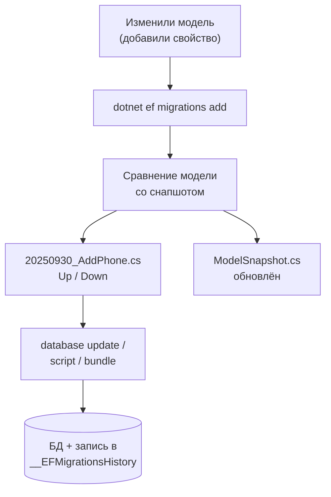
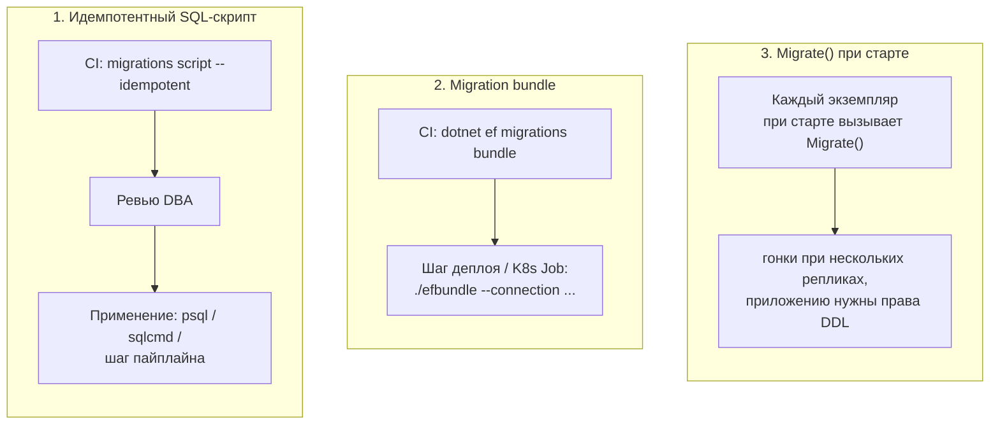
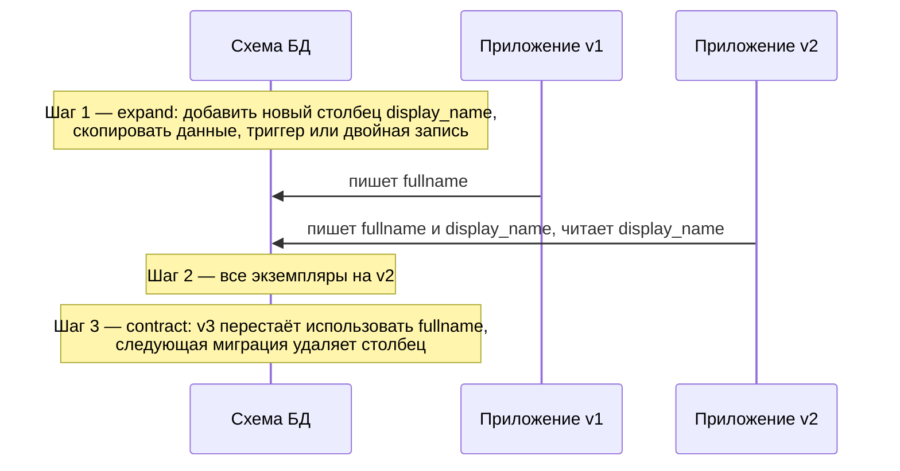

:::tldr
- **Миграция** — C#-класс с методами `Up` (применить) и `Down` (откатить), описывающий изменение схемы. Создаётся командой `dotnet ef migrations add Name` сравнением текущей модели со **снапшотом** (`ModelSnapshot.cs`).
- Применённые миграции записываются в таблицу **`__EFMigrationsHistory`**.
- Применение в продакшене: **идемпотентный SQL-скрипт** (`migrations script --idempotent`) или **migration bundle** (`migrations bundle`) в CI/CD. `Database.Migrate()` при старте приложения — только для простых случаев (гонки при нескольких экземплярах, права DDL у приложения).
- Откат: `database update PreviousMigration` (выполнит `Down`). В продакшене чаще делают **новую миграцию-исправление** (roll forward).
- **Squash**: удалить накопившиеся миграции и создать одну baseline — аккуратно, с синхронизацией истории на всех окружениях.
- Для деплоя без простоя — **expand/contract**: сначала совместимые изменения, потом код, потом удаление старого.
:::

## Как устроены миграции



```csharp Сгенерированная миграция
public partial class AddCustomerPhone : Migration
{
    protected override void Up(MigrationBuilder mb)
    {
        mb.AddColumn<string>(name: "phone", table: "customers", type: "varchar(20)", maxLength: 20, nullable: true);
        mb.CreateIndex(name: "ix_customers_phone", table: "customers", column: "phone");
    }

    protected override void Down(MigrationBuilder mb)
    {
        mb.DropIndex(name: "ix_customers_phone", table: "customers");
        mb.DropColumn(name: "phone", table: "customers");
    }
}
```

**Снапшот** — это полное описание модели на момент последней миграции. Именно с ним (а не с реальной БД!) сравнивается модель при создании новой миграции. Поэтому снапшот обязательно коммитится, а конфликты в нём при слиянии веток нужно разрешать внимательно.

## Основные команды

```bash
dotnet ef migrations add AddCustomerPhone            # создать
dotnet ef migrations list                            # список и статус (применена ли)
dotnet ef migrations remove                          # удалить ПОСЛЕДНЮЮ неприменённую
dotnet ef migrations has-pending-model-changes       # есть ли изменения модели без миграции (EF 8) — для CI

dotnet ef database update                            # применить все
dotnet ef database update AddOrders                  # откатить/накатить до конкретной миграции (Down для последующих)
dotnet ef database update 0                          # откатить всё

dotnet ef migrations script --idempotent -o migrate.sql        # SQL для всех миграций с проверками
dotnet ef migrations script AddOrders AddCustomerPhone          # SQL между двумя миграциями
dotnet ef migrations bundle --self-contained -r linux-x64      # исполняемый файл efbundle
```

## Способы применения в продакшене



| Способ | Плюсы | Минусы |
|---|---|---|
| Идемпотентный SQL-скрипт | Прозрачно, ревью DBA, любые инструменты | Нужно отдельно выполнять |
| Migration bundle | Один артефакт, не нужен SDK, выполняется в пайплайне или K8s Job | Ещё один бинарник в поставке |
| `Database.Migrate()` при старте | Просто для прототипов и одиночного инстанса | Гонки реплик, долгий старт, права DDL у приложения, откат приложения не откатит схему |

:::warning Migrate() при нескольких репликах
Три пода одновременно стартуют и пытаются применить одну миграцию — возможны ошибки и частично применённые изменения. Если всё же используете — делайте это в отдельном init-контейнере/Job или под распределённой блокировкой. С EF Core 9 `Migrate()` берёт блокировку на БД (для поддерживаемых провайдеров), но выносить миграции в отдельный шаг всё равно надёжнее.
:::

## Ручная доработка миграций

Сгенерированный код — это черновик. Его нужно **читать** и часто править:

```csharp
protected override void Up(MigrationBuilder mb)
{
    // EF сгенерировал DropColumn + AddColumn при переименовании свойства → ПОТЕРЯ ДАННЫХ
    // Исправляем на переименование:
    mb.RenameColumn(name: "fullname", table: "customers", newName: "display_name");

    // Перенос данных
    mb.AddColumn<string>("status_code", "orders", nullable: true);
    mb.Sql("UPDATE orders SET status_code = CASE status WHEN 0 THEN 'new' WHEN 1 THEN 'paid' END");
    mb.AlterColumn<string>("status_code", "orders", nullable: false);

    // Индекс без блокировки таблицы (PostgreSQL) — вне транзакции
    mb.Sql("CREATE INDEX CONCURRENTLY IF NOT EXISTS ix_orders_created ON orders (created_at)", suppressTransaction: true);
}
```

## Откат

- В разработке: `dotnet ef database update PreviousMigration` → выполнит `Down()`.
- В продакшене `Down` применяют редко: откат удаления столбца **не вернёт данные**. Чаще — **roll forward**: новая миграция, исправляющая проблему.
- Поэтому важно, чтобы **новая версия схемы была совместима с предыдущей версией кода** — тогда откат приложения не требует отката схемы.

## Zero-downtime: expand / contract

Во время rolling deployment старая и новая версии приложения работают **одновременно** с одной схемой.



Правила:
- Добавлять столбцы — **nullable** или с default.
- Не удалять и не переименовывать столбцы, которые использует работающая версия.
- `NOT NULL` на существующий столбец — только после заполнения данных.
- Большие таблицы: индексы `CONCURRENTLY`/`ONLINE`, изменения пачками.

## Squash миграций

Через пару лет в проекте сотни миграций: медленная сборка, долгое создание тестовой БД. Squash:

1. Убедиться, что **все окружения** применили все миграции.
2. Удалить папку `Migrations`.
3. `dotnet ef migrations add Baseline` — одна миграция с полной схемой.
4. На существующих БД: очистить `__EFMigrationsHistory` и вставить запись `Baseline` (не применяя её). На новых — применится целиком.
5. Перенести в Baseline ручные SQL-объекты (представления, функции, seed-данные) из старых миграций — scaffolding их не восстановит!

## Типичные ошибки

- Не читать сгенерированную миграцию → потеря данных при переименовании.
- Редактировать уже применённую в других окружениях миграцию — окружения разойдутся.
- Конфликт в `ModelSnapshot.cs` при слиянии двух веток с миграциями — разрешают, удаляя свою миграцию, подтягивая чужую и пересоздавая свою.
- Длинные миграции данных внутри транзакции деплоя — блокировки таблиц и таймауты.
- Seed-данные через `HasData` для больших или часто меняющихся справочников — каждое изменение генерирует миграцию.

## Вопросы на засыпку

:::qa Что делает флаг --idempotent?
Оборачивает каждую миграцию в проверку «есть ли её Id в `__EFMigrationsHistory`». Такой скрипт можно безопасно выполнять на БД в любом состоянии — применятся только недостающие миграции.
:::

:::qa Как проверить в CI, что разработчик не забыл создать миграцию?
`dotnet ef migrations has-pending-model-changes` (EF Core 8+) вернёт ошибку, если модель отличается от снапшота. Альтернатива — тест, вызывающий `context.Database.HasPendingModelChanges()`.
:::

:::qa Как применять миграции в Kubernetes?
Отдельный Job (или init-container) с migration bundle или SQL-скриптом перед обновлением Deployment (Helm hook `pre-upgrade`). Так миграция выполняется один раз, с отдельными правами и логами.
:::

:::qa Что такое HasData и когда не стоит его использовать?
Seed-данные в модели: EF генерирует `InsertData/UpdateData` в миграциях. Подходит для небольших неизменных справочников с фиксированными ключами. Для тестовых данных, больших объёмов и данных, зависящих от окружения, — отдельные скрипты или `UseSeeding` (EF Core 9).
:::

## Итог

Миграции — версионированная история схемы: создаются сравнением модели со снапшотом, применяются идемпотентным скриптом или bundle в пайплайне и всегда требуют ревью. Для продакшена думайте о совместимости версий (expand/contract), предпочитайте roll forward откату, а накопившуюся историю сжимайте squash-ем после синхронизации всех окружений.
