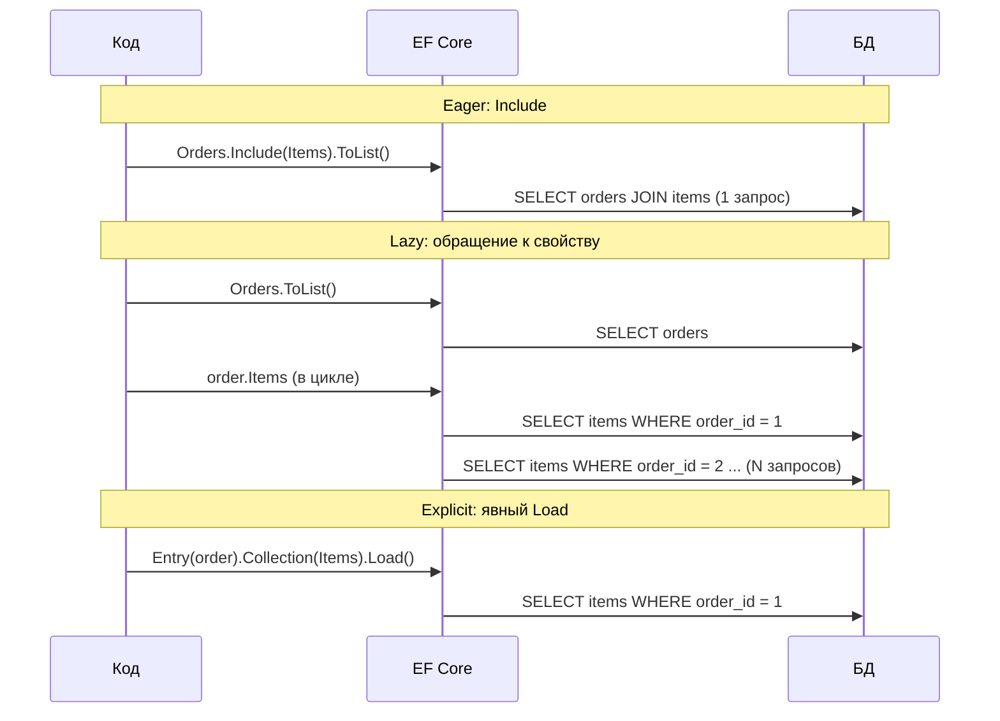
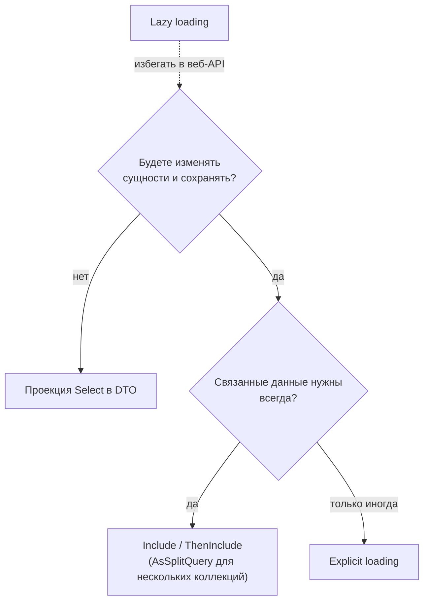

:::tldr
- **Eager loading** — связанные данные загружаются **сразу** вместе с основной сущностью через `Include` / `ThenInclude` (JOIN или отдельные запросы при `AsSplitQuery`). Предсказуемо, количество запросов известно заранее.
- **Lazy loading** — навигационное свойство загружается **автоматически при первом обращении** (через прокси или `ILazyLoader`). Удобно, но скрывает запросы к БД → классическая проблема **N+1**. В EF Core выключено по умолчанию.
- **Explicit loading** — загрузить связанные данные **вручную позже**: `db.Entry(order).Collection(o => o.Items).LoadAsync()`. Полный контроль, можно загрузить с фильтром.
- Четвёртый, часто лучший вариант — **проекция** (`Select` в DTO): загружаются только нужные столбцы, без отслеживания и без проблем с навигациями.
- Для веб-API рекомендация: проекции или eager loading; lazy loading — избегать.
:::

## Модель для примеров

```csharp
public class Order
{
    public int Id { get; set; }
    public int CustomerId { get; set; }
    public Customer Customer { get; set; } = null!;          // reference navigation
    public List<OrderItem> Items { get; set; } = [];         // collection navigation
}
public class OrderItem { public int Id { get; set; } public int ProductId { get; set; } public Product Product { get; set; } = null!; public int Qty { get; set; } }
```

По умолчанию EF Core **не загружает** навигационные свойства: после `db.Orders.First()` свойство `Customer` будет `null`, а `Items` — пустым списком (если связанные сущности не были загружены ранее в тот же контекст — тогда EF «подцепит» их через fix-up).

## Три стратегии



### Eager loading

```csharp
var orders = await db.Orders
    .Where(o => o.CreatedAt >= from)
    .Include(o => o.Customer)                            // reference
    .Include(o => o.Items)                               // collection
        .ThenInclude(i => i.Product)                     // следующий уровень
    .Include(o => o.Items.Where(i => i.Qty > 0).OrderBy(i => i.Id))  // filtered include (EF Core 5+)
    .AsSplitQuery()                                      // отдельный запрос на каждую коллекцию
    .ToListAsync(ct);
```

:::warning Cartesian explosion
`Include` двух коллекций одним JOIN-ом умножает строки: заказ с 10 товарами и 5 платежами вернётся как 50 строк, данные заказа дублируются 50 раз. При больших графах объём результата растёт взрывообразно. `AsSplitQuery()` выполняет отдельный SQL на каждую коллекцию — строк меньше, но несколько round-trip и нет согласованного снимка без транзакции. Можно включить глобально: `UseQuerySplittingBehavior(QuerySplittingBehavior.SplitQuery)`.
:::

### Lazy loading

```csharp
// Вариант 1: прокси (пакет Microsoft.EntityFrameworkCore.Proxies)
builder.Services.AddDbContext<ShopDbContext>(o => o.UseNpgsql(conn).UseLazyLoadingProxies());

public class Order
{
    public int Id { get; set; }
    public virtual Customer Customer { get; set; } = null!;        // virtual — обязательно
    public virtual ICollection<OrderItem> Items { get; set; } = [];
}

var order = await db.Orders.FirstAsync();
var name = order.Customer.Name;          // здесь — скрытый SELECT customers WHERE id = ...
```

EF создаёт **динамический класс-наследник** (прокси), переопределяющий `virtual`-свойства: при первом `get` он выполняет запрос. Поэтому классы не должны быть `sealed`, а навигации — `virtual`.

Проблемы lazy loading:
- **N+1**: цикл по 100 заказам с обращением к `Customer` = 101 запрос.
- **Синхронный I/O**: ленивая загрузка выполняется синхронно — блокирует поток в async-коде.
- **Сериализация**: `System.Text.Json` обходит навигации и лениво загружает весь граф (или падает на циклах).
- **После уничтожения контекста** — исключение (или тихий null при отключённом предупреждении).

### Explicit loading

```csharp
var order = await db.Orders.SingleAsync(o => o.Id == id, ct);

if (needItems)
    await db.Entry(order).Collection(o => o.Items).LoadAsync(ct);

await db.Entry(order).Reference(o => o.Customer).LoadAsync(ct);

// С фильтром и агрегатами — без загрузки всей коллекции
var bigItems = await db.Entry(order).Collection(o => o.Items).Query().Where(i => i.Qty > 10).ToListAsync(ct);
var count = await db.Entry(order).Collection(o => o.Items).Query().CountAsync(ct);
```

Полезно, когда решение «нужны ли связанные данные» принимается по ходу выполнения логики.

## Проекция — чаще всего лучший выбор для чтения

```csharp
var dto = await db.Orders
    .Where(o => o.Id == id)
    .Select(o => new OrderDetailsDto(
        o.Id,
        o.Customer.Name,                                   // навигация внутри Select → JOIN, без Include
        o.Items.Select(i => new OrderItemDto(i.Product.Name, i.Qty)).ToList(),
        o.Items.Sum(i => i.Qty * i.Product.Price)))
    .SingleOrDefaultAsync(ct);
```

- Загружаются только нужные столбцы.
- Нет отслеживания, нет Identity Map — проекции в DTO не отслеживаются.
- `Include` не нужен: навигации в `Select` транслируются в JOIN/подзапросы.

## Сравнение

| | Eager (`Include`) | Lazy | Explicit | Проекция (`Select`) |
|---|---|---|---|---|
| Когда запрос | Сразу | При обращении к свойству | Когда вызвали `Load` | Сразу |
| Число запросов | Известно (1 или по одному на коллекцию) | Непредсказуемо (N+1) | Контролируется | 1 (обычно) |
| Загружаемые данные | Все столбцы сущностей | Все столбцы | Все / по фильтру | Только нужные |
| Отслеживание | Да (если не `AsNoTracking`) | Да | Да | Нет |
| Подходит для | Изменения агрегата, загрузка графа | Десктоп-приложения, прототипы | Условная загрузка | Чтение для API/UI |



## Вопросы на засыпку

:::qa Что такое relationship fix-up?
Если связанные сущности уже отслеживаются контекстом, EF автоматически заполняет навигационные свойства при загрузке новых сущностей. Пример: загрузили клиентов, потом заказы — `order.Customer` окажется заполнен без `Include`. Это может сбивать с толку при отладке.
:::

:::qa Работает ли Include с AsNoTracking?
Да. Но без Identity Map одинаковые связанные сущности материализуются как **разные** объекты (например, один `Customer` для 100 заказов → 100 экземпляров). `AsNoTrackingWithIdentityResolution()` устраняет дубли без полного отслеживания.
:::

:::qa Как включить lazy loading без прокси?
Внедрить `ILazyLoader` (или делегат `Action<object, string>`) в конструктор сущности и вызывать `_lazyLoader.Load(this, ref _customer)` в геттере. Сущность получает зависимость от EF — поэтому применяется редко.
:::

:::qa Почему Include игнорируется в некоторых запросах?
Если запрос заканчивается проекцией (`Select` не в сущность), `Include` бессмыслен и игнорируется — данные определяются самой проекцией.
:::

## Итог

Eager loading делает загрузку явной и предсказуемой, lazy loading удобен, но прячет запросы и порождает N+1, explicit loading даёт контроль для условных сценариев. Для чтения в API лучше всего проекции в DTO, для изменения агрегатов — `Include` с `AsSplitQuery` при нескольких коллекциях.
