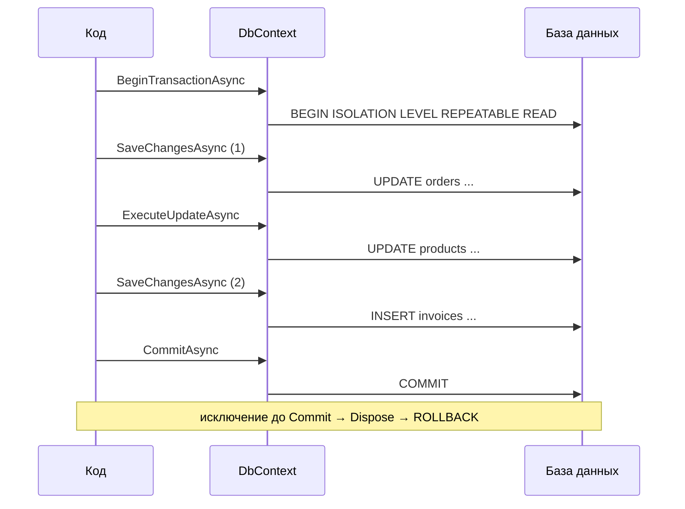
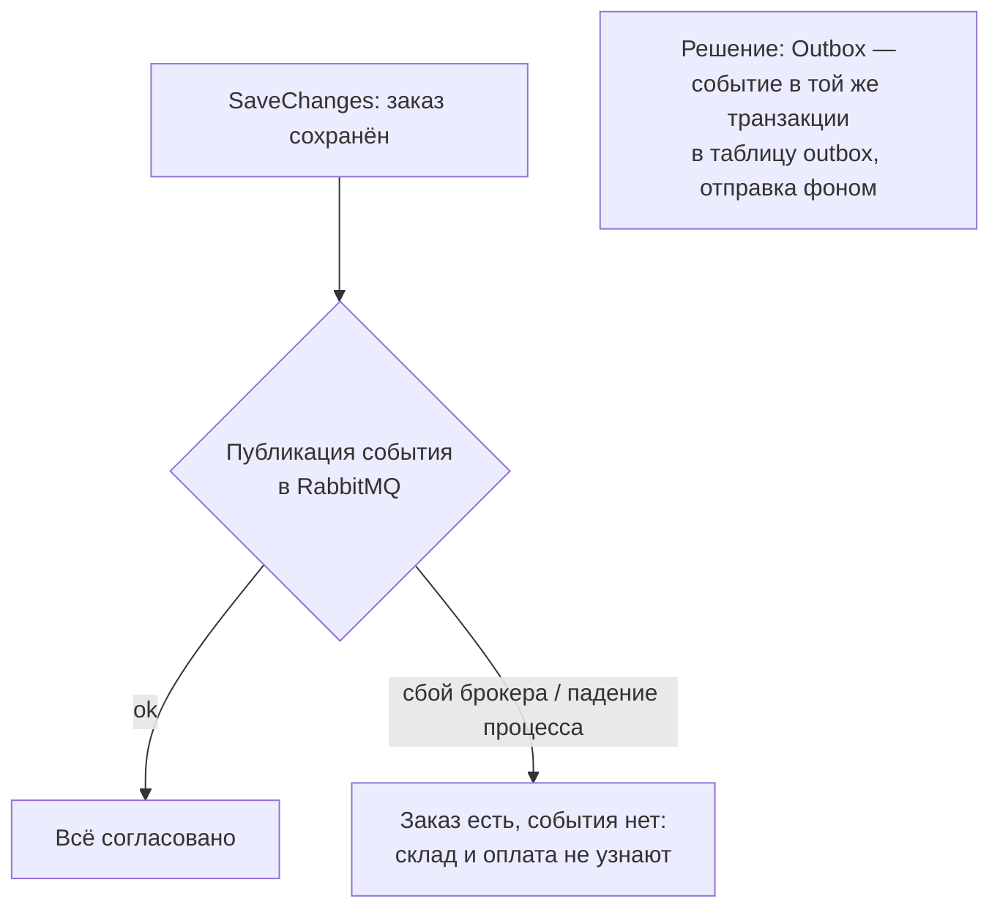

:::tldr
- **`SaveChanges`** сам оборачивает все накопленные изменения в **одну транзакцию** — для большинства сценариев явная транзакция не нужна.
- **`Database.BeginTransactionAsync()`** — явная транзакция, когда нужно объединить **несколько `SaveChanges`**, смешать EF с `ExecuteUpdate`/raw SQL или задать **уровень изоляции**. Обязательно `CommitAsync`, иначе откат при `Dispose`.
- **`TransactionScope`** (ambient transaction) — неявная транзакция, к которой автоматически присоединяются соединения внутри блока. Удобно для нескольких контекстов/ADO.NET на **одной** БД; для разных БД требует распределённой транзакции (в .NET Core — только Windows + MSDTC, с .NET 7). В async-коде нужен `TransactionScopeAsyncFlowOption.Enabled`.
- С **retry-стратегией** (`EnableRetryOnFailure`) явная транзакция должна выполняться внутри `CreateExecutionStrategy().ExecuteAsync(...)`, иначе ошибка.
- Между разными сервисами/БД — не распределённые транзакции, а **Outbox + Saga**.
:::

## SaveChanges — транзакция по умолчанию

```csharp
db.Orders.Add(order);
db.Stock.Update(stockItem);
db.AuditLog.Add(new AuditRecord("order.created", order.Id));
await db.SaveChangesAsync();
// BEGIN; INSERT orders...; UPDATE stock...; INSERT audit_log...; COMMIT;
// Ошибка любой команды → ROLLBACK всего
```

Если внешняя транзакция уже открыта (`BeginTransaction` или ambient), `SaveChanges` использует её и **не коммитит**.

## Явная транзакция

```csharp
await using var tx = await db.Database.BeginTransactionAsync(IsolationLevel.RepeatableRead, ct);
try
{
    var order = await db.Orders.SingleAsync(o => o.Id == id, ct);
    order.MarkPaid();
    await db.SaveChangesAsync(ct);                                   // 1-й SaveChanges — внутри tx

    await db.Products
        .Where(p => order.Items.Select(i => i.ProductId).Contains(p.Id))
        .ExecuteUpdateAsync(s => s.SetProperty(p => p.SoldCount, p => p.SoldCount + 1), ct);  // bulk — внутри tx

    db.Invoices.Add(Invoice.For(order));
    await db.SaveChangesAsync(ct);                                   // 2-й SaveChanges — внутри tx

    await tx.CommitAsync(ct);
}
catch
{
    await tx.RollbackAsync(ct);    // необязательно: Dispose без Commit откатит сам
    throw;
}
```



### Точки сохранения (savepoints)

EF Core автоматически создаёт savepoint перед `SaveChanges` внутри явной транзакции: при ошибке откатывается только этот `SaveChanges`, а транзакция остаётся живой. Можно и вручную:

```csharp
await tx.CreateSavepointAsync("before-bonus", ct);
try { await ApplyBonusAsync(ct); }
catch (BonusException) { await tx.RollbackToSavepointAsync("before-bonus", ct); }
```

## Retry и транзакции

Облачные БД дают кратковременные ошибки (failover, сетевые сбои). `EnableRetryOnFailure` повторяет операцию. Но если повторить только последний `SaveChanges` из транзакции, где уже было выполнено что-то ещё, — данные станут несогласованными. Поэтому EF требует оборачивать всю единицу работы:

```csharp
builder.Services.AddDbContext<ShopDbContext>(o => o.UseNpgsql(conn, npg => npg.EnableRetryOnFailure(maxRetryCount: 5)));

var strategy = db.Database.CreateExecutionStrategy();
await strategy.ExecuteAsync(async () =>
{
    db.ChangeTracker.Clear();                                        // повтор начинается с чистого состояния
    await using var tx = await db.Database.BeginTransactionAsync(ct);
    // ... вся логика транзакции, включая загрузку данных
    await db.SaveChangesAsync(ct);
    await tx.CommitAsync(ct);
});
```

:::warning Commit при обрыве соединения
Если соединение оборвалось **во время** `COMMIT`, приложение не знает, зафиксирована ли транзакция. Повтор может применить изменения дважды. Для критичных операций — идемпотентность (уникальный ключ операции) или проверка результата (`verifySucceeded` в `ExecuteInTransactionAsync`).
:::

## TransactionScope

```csharp
using var scope = new TransactionScope(
    TransactionScopeOption.Required,
    new TransactionOptions { IsolationLevel = IsolationLevel.ReadCommitted, Timeout = TimeSpan.FromSeconds(30) },
    TransactionScopeAsyncFlowOption.Enabled);          // обязательно для async/await

await ordersDb.SaveChangesAsync();                     // соединение автоматически «вступает» в ambient-транзакцию
await using (var conn = new NpgsqlConnection(sameDbConn))
{
    await conn.OpenAsync();
    await conn.ExecuteAsync("INSERT INTO legacy_log ...");   // Dapper — в той же транзакции
}

scope.Complete();                                      // без Complete → откат при Dispose
```

- Одна БД, одно соединение → локальная транзакция.
- Несколько соединений/разные БД → **эскалация до распределённой транзакции** (2PC через MSDTC). В .NET на Linux не поддерживается; с .NET 7 — только Windows с явным `TransactionManager.ImplicitDistributedTransactions = true`.
- Для PostgreSQL двухфазный коммит (`PREPARE TRANSACTION`) Npgsql поддерживает, но это сложная и редкая конфигурация.

## Общее соединение для нескольких контекстов

```csharp
await using var conn = new NpgsqlConnection(connStr);
await conn.OpenAsync(ct);
await using var tx = await conn.BeginTransactionAsync(ct);

var ordersOptions = new DbContextOptionsBuilder<OrdersContext>().UseNpgsql(conn).Options;
await using var orders = new OrdersContext(ordersOptions);
await orders.Database.UseTransactionAsync(tx, ct);        // использовать существующую транзакцию

await using var billing = new BillingContext(new DbContextOptionsBuilder<BillingContext>().UseNpgsql(conn).Options);
await billing.Database.UseTransactionAsync(tx, ct);

// ... изменения в обоих контекстах
await orders.SaveChangesAsync(ct);
await billing.SaveChangesAsync(ct);
await tx.CommitAsync(ct);
```

## Когда транзакция охватывает не только БД



Транзакция БД не может включить отправку сообщения в брокер или HTTP-вызов. Для согласованности используют паттерн **Transactional Outbox** (событие записывается в таблицу в той же транзакции, фоновый процесс публикует) и **Saga** для процессов через несколько сервисов. Подробнее — в разделе архитектуры.

## Типичные ошибки

- Открыть транзакцию и выполнять внутри **HTTP-вызовы** или долгие вычисления — блокировки в БД держатся всё это время.
- Забыть `CommitAsync` — все изменения молча откатятся.
- `TransactionScope` без `AsyncFlowOption.Enabled` в async-коде → `InvalidOperationException` или транзакция «теряется» после `await`.
- Использовать явную транзакцию там, где хватает одного `SaveChanges` — лишняя сложность.
- Держать уровень `Serializable` «на всякий случай» — больше блокировок и ошибок сериализации.

## Вопросы на засыпку

:::qa Какой уровень изоляции у SaveChanges по умолчанию?
Уровень по умолчанию базы данных: `READ COMMITTED` в PostgreSQL и SQL Server (в SQL Server с `READ_COMMITTED_SNAPSHOT` — версионное чтение, по умолчанию в Azure SQL). Чтобы изменить — явная транзакция с нужным `IsolationLevel`.
:::

:::qa Можно ли отключить автоматическую транзакцию SaveChanges?
Да: `db.Database.AutoTransactionBehavior = AutoTransactionBehavior.Never` (EF Core 7+). Полезно в редких случаях (например, если БД не поддерживает транзакции или для мелкой оптимизации одиночной команды), но обычно не нужно.
:::

:::qa Чем BeginTransaction отличается от TransactionScope?
`BeginTransaction` — явная транзакция конкретного соединения/контекста, полный контроль, работает везде. `TransactionScope` — неявная (ambient) транзакция для всего кода внутри блока, удобна для нескольких компонентов, но может эскалировать в распределённую и требует аккуратности с async.
:::

:::qa Как тестировать код с транзакциями?
Интеграционными тестами на реальной БД (Testcontainers). InMemory-провайдер транзакции не поддерживает (игнорирует или выдаёт предупреждение). Популярный приём — оборачивать каждый тест в транзакцию и откатывать её (или Respawn для очистки).
:::

## Итог

Для большинства операций достаточно одного `SaveChanges` — он уже атомарен. Явная транзакция нужна для нескольких `SaveChanges`, bulk-операций и уровня изоляции; с retry-стратегией — внутри `ExecutionStrategy`. `TransactionScope` — для нескольких компонентов одной БД, а согласованность между сервисами и брокерами решается Outbox и Saga, а не распределёнными транзакциями.
