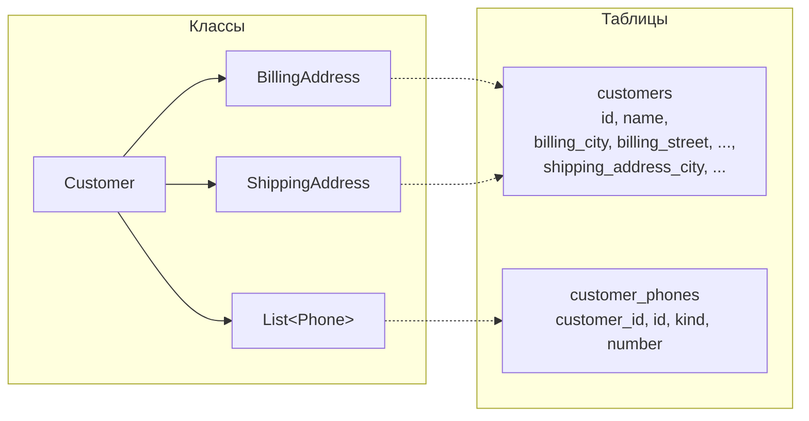
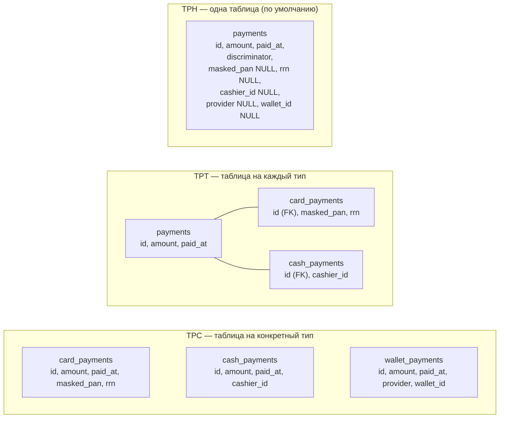

:::tldr
- **Owned type** (`OwnsOne`/`OwnsMany`) — тип без собственной идентичности, принадлежащий сущности-владельцу. Идеален для **Value Objects** DDD (`Address`, `Money`). По умолчанию хранится **в столбцах таблицы владельца**; `OwnsMany` — в отдельной таблице. **Complex types** (EF Core 8+) — альтернатива для value objects с семантикой значения.
- **Table splitting** — несколько сущностей в **одной таблице** с общим ключом (например, «лёгкий» `Order` и «тяжёлый» `OrderDetails`).
- Наследование:
  - **TPH** (Table per Hierarchy, по умолчанию) — одна таблица на всю иерархию + столбец-**дискриминатор**. Быстро, но много nullable-столбцов.
  - **TPT** (Table per Type) — таблица на каждый тип, связанные по ключу. Нормализовано, но **JOIN-ы** на каждый запрос — медленно.
  - **TPC** (Table per Concrete type, EF Core 7+) — таблица на каждый **конкретный** тип со всеми столбцами. Нет JOIN-ов для конкретного типа, но полиморфные запросы — через `UNION ALL`.
:::

## Owned types — value objects

```csharp
public sealed record Address(string Country, string City, string Street, string Zip);

public class Customer
{
    public int Id { get; private set; }
    public string Name { get; private set; } = "";
    public Address BillingAddress { get; private set; } = null!;
    public Address? ShippingAddress { get; private set; }
    public List<Phone> Phones { get; private set; } = [];
}
public sealed record Phone(string Kind, string Number);

public void Configure(EntityTypeBuilder<Customer> b)
{
    b.OwnsOne(c => c.BillingAddress, a =>
    {
        a.Property(x => x.City).HasColumnName("billing_city").HasMaxLength(100);
        a.Property(x => x.Street).HasColumnName("billing_street");
        // ...
    });
    b.OwnsOne(c => c.ShippingAddress);                  // столбцы ShippingAddress_City и т.д.
    b.OwnsMany(c => c.Phones, p =>                      // отдельная таблица customer_phones
    {
        p.ToTable("customer_phones");
        p.WithOwner().HasForeignKey("CustomerId");
    });
}
```



Особенности owned types:
- Загружаются **всегда вместе** с владельцем (`Include` не нужен).
- Не имеют `DbSet`, нельзя запросить отдельно.
- Технически — сущности со скрытым ключом (shadow key), поэтому один экземпляр нельзя «разделить» между двумя владельцами.
- Можно хранить в **JSON-столбце**: `b.OwnsOne(c => c.Settings, s => s.ToJson())` — EF Core 7+ умеет фильтровать по полям JSON.

### Complex types (EF Core 8+)

```csharp
b.ComplexProperty(c => c.BillingAddress);
```

В отличие от owned types, complex types — это **настоящие значения**: без скрытого ключа, один экземпляр можно присвоить нескольким сущностям, сравниваются по значению. Ограничения по мере развития EF снимаются (коллекции complex types и JSON — EF Core 10). Для новых value objects часто предпочтительнее.

## Table splitting

```csharp
// Одна таблица orders, две сущности: часто нужная и «тяжёлая»
modelBuilder.Entity<Order>(b =>
{
    b.ToTable("orders");
    b.HasOne(o => o.Details).WithOne().HasForeignKey<OrderDetails>(d => d.Id);
});
modelBuilder.Entity<OrderDetails>().ToTable("orders");   // та же таблица, тот же ключ

var list = await db.Orders.ToListAsync();                  // только лёгкие столбцы
var full = await db.Orders.Include(o => o.Details).FirstAsync(o => o.Id == id);  // + тяжёлые (JSON, текст)
```

Обратная операция — **entity splitting** (EF Core 7+): одна сущность хранится в **нескольких** таблицах (`SplitToTable`).

## Наследование

Пример иерархии платежей:

```csharp
public abstract class Payment { public int Id { get; set; } public decimal Amount { get; set; } public DateTime PaidAt { get; set; } }
public class CardPayment : Payment { public string MaskedPan { get; set; } = ""; public string Rrn { get; set; } = ""; }
public class CashPayment : Payment { public string CashierId { get; set; } = ""; }
public class WalletPayment : Payment { public string Provider { get; set; } = ""; public string WalletId { get; set; } = ""; }
```



```csharp Конфигурация
// TPH (по умолчанию)
b.Entity<Payment>().HasDiscriminator<string>("kind")
    .HasValue<CardPayment>("card").HasValue<CashPayment>("cash").HasValue<WalletPayment>("wallet");

// TPT
b.Entity<Payment>().UseTptMappingStrategy();

// TPC
b.Entity<Payment>().UseTpcMappingStrategy();
```

### Какой SQL получается

```sql
-- Запрос всех платежей: db.Payments.ToList()
-- TPH:
SELECT * FROM payments;
-- TPT:
SELECT p.*, c.masked_pan, c.rrn, h.cashier_id, ...
FROM payments p LEFT JOIN card_payments c ON c.id = p.id LEFT JOIN cash_payments h ON h.id = p.id LEFT JOIN wallet_payments w ...;
-- TPC:
SELECT id, amount, paid_at, masked_pan, rrn, NULL, NULL, NULL, 'card' FROM card_payments
UNION ALL SELECT id, amount, paid_at, NULL, NULL, cashier_id, NULL, NULL, 'cash' FROM cash_payments
UNION ALL ...;

-- Запрос одного типа: db.Payments.OfType<CardPayment>()
-- TPH: SELECT ... FROM payments WHERE kind = 'card'
-- TPT: SELECT ... FROM payments p JOIN card_payments c ON ...
-- TPC: SELECT ... FROM card_payments          -- самый быстрый
```

| | TPH | TPT | TPC |
|---|---|---|---|
| Таблиц | 1 | На каждый тип (включая абстрактный) | На каждый конкретный тип |
| Nullable-столбцы | Много (поля наследников) | Нет | Нет |
| Ограничения NOT NULL для полей наследников | Невозможно (только CHECK) | Да | Да |
| Запрос всей иерархии | Быстро (одна таблица) | Медленно (JOIN всех таблиц) | Средне (`UNION ALL`) |
| Запрос конкретного типа | Быстро (`WHERE discriminator`) | JOIN с базовой | **Самый быстрый** |
| Генерация ключей | Обычная | Обычная | Нужна **общая последовательность** (ключи уникальны по всей иерархии) |
| Нормализация | Низкая | Высокая | Средняя (дублирование базовых столбцов) |
| Рекомендация | **По умолчанию** — в большинстве случаев лучший | Редко, из-за производительности | Когда почти всегда запрашивается конкретный тип |

:::tip Не злоупотребляйте наследованием
Наследование в модели БД усложняет запросы и миграции. Часто лучше композиция: `Payment` с полем `Method` и owned-объектом/JSON-столбцом деталей. Наследование оправдано, когда у типов действительно разное поведение и много различающихся полей.
:::

## Вопросы на засыпку

:::qa Можно ли использовать owned type как ключ словаря или сравнивать по значению?
Сам EF сравнивает owned types как сущности, а не как значения. Если класс — `record`, C#-сравнение работает по значению, но EF при замене (`customer.Address = new Address(...)`) удалит старую «сущность» и добавит новую. Complex types лишены этих особенностей.
:::

:::qa Почему TPT медленный?
Каждый полиморфный запрос делает JOIN базовой таблицы со всеми таблицами наследников, а вставка/обновление затрагивает несколько таблиц. С ростом иерархии и данных JOIN-ы становятся узким местом.
:::

:::qa Что будет с дискриминатором при добавлении нового наследника в TPH?
Добавится новое значение дискриминатора и новые nullable-столбцы. Старые строки не меняются. Если в данных встретится неизвестное значение дискриминатора — EF выбросит исключение при материализации.
:::

:::qa Как хранить value object одним столбцом?
Через **value converter**: `b.Property(o => o.Total).HasConversion(m => m.Amount, v => new Money(v))` или `ConfigureConventions(...).HaveConversion<MoneyConverter>()`. Подходит для однополевых объектов (`Email`, `OrderId`).
:::

## Итог

Owned и complex types позволяют хранить value objects в таблице владельца, table splitting и entity splitting — гибко распределять данные по таблицам. Для наследования по умолчанию используйте TPH, TPC — если запросы почти всегда к конкретным типам, TPT — только если нормализация важнее скорости.
