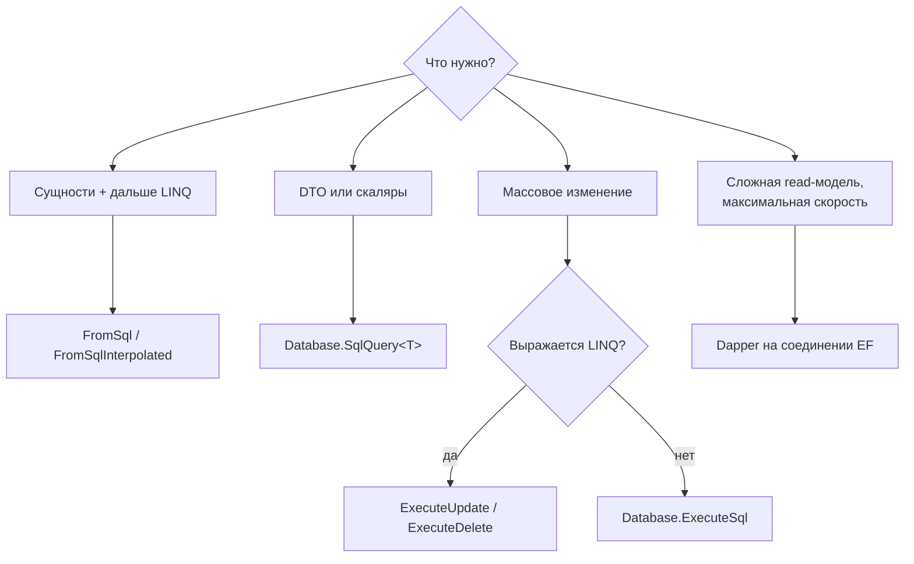
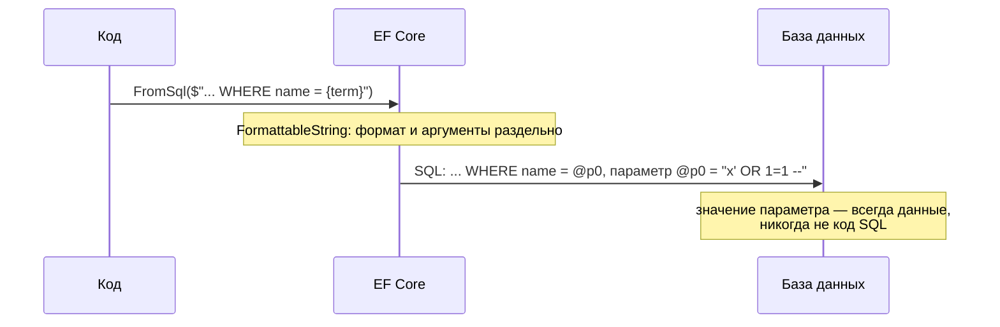

:::tldr
- **`FromSql($"...")`** — запрос, возвращающий **сущности** (можно продолжить LINQ: `Where`, `Include`, `OrderBy` — EF обернёт SQL в подзапрос). Интерполяция автоматически превращается в **параметры** — безопасно от SQL-инъекций.
- **`Database.SqlQuery<T>($"...")`** (EF Core 7/8+) — произвольные типы и скаляры, не обязательно сущности (DTO без `DbSet`).
- **`Database.ExecuteSql($"...")`** — команды без результата (`UPDATE`, `DELETE`, вызов процедуры); возвращает число строк.
- **`ExecuteUpdate` / `ExecuteDelete`** (EF Core 7+) — массовые операции через LINQ без загрузки сущностей — часто избавляют от raw SQL.
- `FromSqlRaw`/`ExecuteSqlRaw` принимают строку **как есть** — параметры только вручную; никогда не склеивайте в них пользовательский ввод.
- Уходить в SQL стоит для: оконных функций и CTE, специфичных возможностей СУБД (полнотекстовый поиск, `jsonb`, `LATERAL`, hints), хранимых процедур, сложной аналитики, когда LINQ генерирует неэффективный запрос. Для read-моделей популярен **Dapper**.
:::

## Инструменты



## FromSql

```csharp
string term = request.Search;                       // пользовательский ввод

var products = await db.Products
    .FromSql($"""
        SELECT * FROM products
        WHERE to_tsvector('russian', name || ' ' || description) @@ plainto_tsquery('russian', {term})
        """)
    .Where(p => p.IsActive)                          // LINQ поверх SQL
    .OrderBy(p => p.Price)
    .Take(20)
    .AsNoTracking()
    .ToListAsync(ct);
```

EF превращает это в:

```sql
SELECT p.* FROM (
    SELECT * FROM products
    WHERE to_tsvector('russian', name || ' ' || description) @@ plainto_tsquery('russian', @p0)
) AS p
WHERE p.is_active
ORDER BY p.price
LIMIT @p1
```

Требования `FromSql`: SQL должен возвращать **все столбцы** сущности с правильными именами; для последующей композиции LINQ — быть композируемым (не `EXEC` процедуры в SQL Server).

## Параметризация и SQL-инъекции

```csharp
// БЕЗОПАСНО: интерполированная строка FormattableString → {term} станет параметром @p0
db.Products.FromSql($"SELECT * FROM products WHERE name = {term}");

// БЕЗОПАСНО: Raw с явными параметрами
db.Products.FromSqlRaw("SELECT * FROM products WHERE name = {0}", term);
db.Products.FromSqlRaw("SELECT * FROM products WHERE name = @name", new NpgsqlParameter("name", term));

// ОПАСНО: строка собрана заранее — интерполяция уже выполнена, EF получает готовый текст
var sql = $"SELECT * FROM products WHERE name = '{term}'";
db.Products.FromSqlRaw(sql);   // term = "x' OR 1=1; DROP TABLE products; --"
```



:::warning Имена таблиц и столбцов нельзя параметризовать
Параметры подставляются только на место **значений**. Если нужна динамическая сортировка по имени столбца — белый список:
```csharp
var column = request.SortBy switch { "price" => "price", "name" => "name", _ => "id" };
db.Products.FromSqlRaw($"SELECT * FROM products ORDER BY {column}");   // только из белого списка!
```
Лучше — динамический LINQ (`OrderBy` через switch по выражениям).
:::

## SqlQuery — DTO и скаляры

```csharp
public sealed record SalesByDay(DateOnly Day, decimal Revenue, int Orders);

var stats = await db.Database.SqlQuery<SalesByDay>($"""
    SELECT date_trunc('day', created_at)::date AS "Day",
           SUM(total) AS "Revenue",
           COUNT(*)   AS "Orders"
    FROM orders
    WHERE created_at >= {from}
    GROUP BY 1
    ORDER BY 1
    """).ToListAsync(ct);

int count = await db.Database.SqlQuery<int>($"SELECT COUNT(*) AS \"Value\" FROM orders").SingleAsync(ct);
```

## ExecuteSql и массовые операции

```csharp
// Произвольная команда
int affected = await db.Database.ExecuteSqlAsync($"CALL recalc_customer_stats({customerId})", ct);

// EF Core 7+: массовые операции LINQ — без загрузки сущностей в память
await db.Sessions.Where(s => s.ExpiresAt < DateTime.UtcNow).ExecuteDeleteAsync(ct);

await db.Products
    .Where(p => p.CategoryId == categoryId)
    .ExecuteUpdateAsync(s => s
        .SetProperty(p => p.Price, p => p.Price * 1.1m)
        .SetProperty(p => p.UpdatedAt, DateTime.UtcNow), ct);
```

:::note Эти операции минуют Change Tracker
`ExecuteUpdate/Delete/Sql` выполняются сразу в БД: не вызываются перехватчики `SaveChanges`, не срабатывают доменные события и аудит, уже загруженные сущности в контексте остаются со старыми значениями. Учитывайте это при смешивании с обычной работой.
:::

## Dapper рядом с EF Core

```csharp
public sealed class OrderReadQueries(ShopDbContext db)
{
    public async Task<IReadOnlyList<OrderSummary>> TopCustomersAsync(DateTime from, CancellationToken ct)
    {
        var conn = db.Database.GetDbConnection();              // то же соединение и транзакция EF
        const string sql = """
            SELECT c.id, c.name, SUM(o.total) AS total,
                   RANK() OVER (ORDER BY SUM(o.total) DESC) AS rank
            FROM customers c JOIN orders o ON o.customer_id = c.id
            WHERE o.created_at >= @from
            GROUP BY c.id, c.name
            LIMIT 50
            """;
        var rows = await conn.QueryAsync<OrderSummary>(new CommandDefinition(sql, new { from }, cancellationToken: ct));
        return rows.AsList();
    }
}
```

Типичная схема: **EF Core для команд** (изменение агрегатов, миграции, Change Tracker), **Dapper или raw SQL для сложных запросов чтения** (отчёты, дашборды).

## Когда уходить от LINQ

| Ситуация | Почему SQL лучше |
|---|---|
| Оконные функции, рекурсивные CTE | LINQ не выражает их (или выражает неэффективно) |
| Специфичные функции СУБД | Полнотекстовый поиск, `jsonb`-операторы, геоданные, `LATERAL`, `DISTINCT ON` |
| Подсказки оптимизатору, блокировки | `FOR UPDATE SKIP LOCKED`, `WITH (NOLOCK)`, `OPTION (RECOMPILE)` |
| Сгенерированный SQL неэффективен | Лишние подзапросы, неудачные JOIN — проверено в плане выполнения |
| Хранимые процедуры, legacy | Логика уже в БД |
| Аналитика по большим объёмам | Вычисления на стороне БД, минимум данных в приложение |

Прежде чем писать SQL — посмотрите, что генерирует EF (`ToQueryString()`), и попробуйте переписать LINQ (проекции, `AsSplitQuery`, EF.Functions). Raw SQL не проверяется компилятором и ломается при переименовании столбцов.

## Вопросы на засыпку

:::qa Чем FromSql отличается от FromSqlRaw?
`FromSql` / `FromSqlInterpolated` принимают `FormattableString` и превращают каждое `{значение}` в параметр. `FromSqlRaw` принимает обычную строку — параметры нужно передавать явно (`{0}` или `DbParameter`). Ошибка — собрать строку интерполяцией и передать в Raw.
:::

:::qa Как посмотреть SQL, который сгенерирует LINQ-запрос?
`query.ToQueryString()` — возвращает SQL с объявлениями параметров без выполнения. Плюс логирование (`LogTo`) и инструменты вроде MiniProfiler.
:::

:::qa Отслеживаются ли сущности из FromSql?
Да, как и в обычном запросе (если нет `AsNoTracking`): их можно изменить и сохранить через `SaveChanges`. `SqlQuery<T>` для не-сущностей не отслеживается.
:::

:::qa Как вызвать хранимую процедуру с OUTPUT-параметром?
Через `ExecuteSqlRawAsync` с `SqlParameter { Direction = ParameterDirection.Output }` и чтением `.Value` после выполнения. Или через ADO.NET/Dapper на соединении `db.Database.GetDbConnection()`.
:::

## Итог

EF Core даёт безопасные способы выполнить SQL: `FromSql` для сущностей с дальнейшей композицией, `SqlQuery<T>` для DTO и скаляров, `ExecuteSql` для команд, `ExecuteUpdate/Delete` для массовых операций. Используйте интерполяцию для параметров, белые списки для идентификаторов и уходите в SQL, когда LINQ не выражает задачу или генерирует неэффективный запрос.
