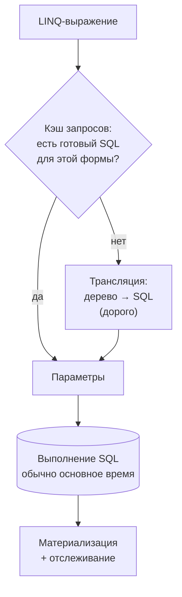
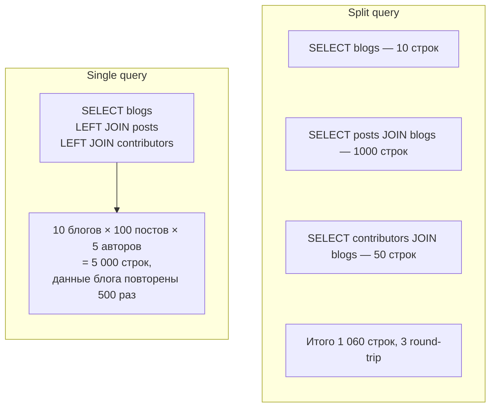
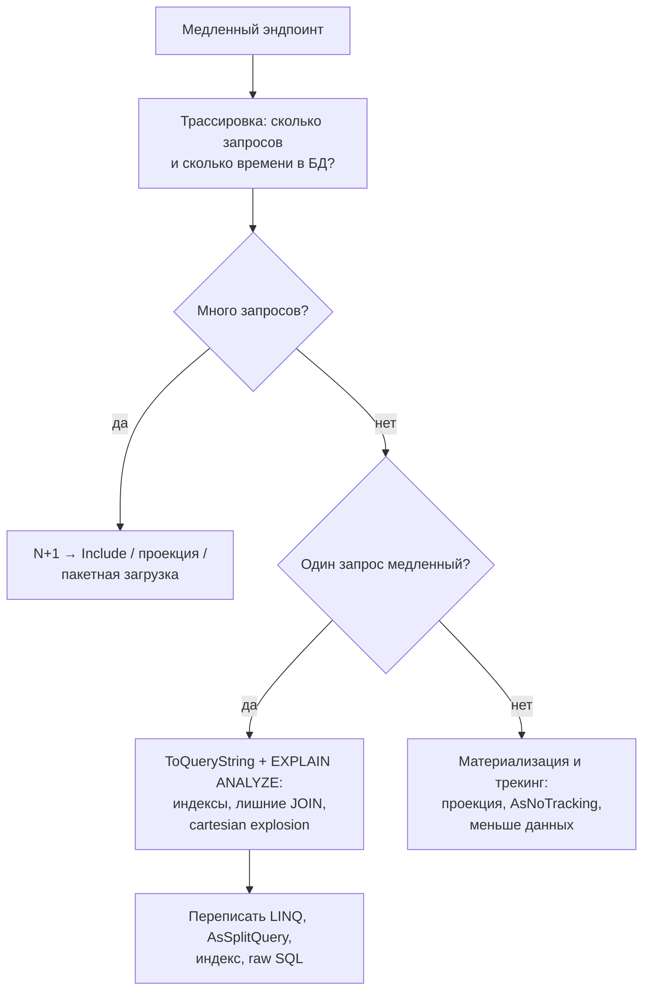

:::tldr
- **Сначала измерить**: логирование SQL, `ToQueryString()`, план выполнения (`EXPLAIN ANALYZE`), трассировка. Большинство проблем — в SQL и индексах, а не в EF.
- **Проекция** (`Select` в DTO) — только нужные столбцы, без отслеживания: самая частая и эффективная оптимизация.
- **Split queries** (`AsSplitQuery`) — вместо одного JOIN с несколькими коллекциями (cartesian explosion) — отдельный запрос на коллекцию.
- **Compiled queries** (`EF.CompileAsyncQuery`) — пропускают этап трансляции LINQ → SQL; полезно для очень частых простых запросов (выигрыш — микросекунды на вызов).
- Другие приёмы: `AsNoTracking`, **keyset-пагинация** вместо `Skip` на больших смещениях, `ExecuteUpdate/Delete` для массовых операций, batching (`AddRange` + один `SaveChanges`), **DbContext pooling**, фильтрация и агрегаты на стороне БД, правильные индексы.
:::

## Где тратится время



EF кэширует трансляцию по «форме» запроса — поэтому **параметры должны быть параметрами**, а не константами (переменные в лямбде автоматически становятся параметрами; `EF.Constant` — наоборот).

## 1. Проекция

```csharp
// Плохо: загружаем все столбцы сущностей, отслеживаем, тянем навигации
var orders = await db.Orders.Include(o => o.Customer).Include(o => o.Items).ToListAsync();
var dto = orders.Select(o => new OrderListItem(o.Id, o.Customer.Name, o.Items.Sum(i => i.Price * i.Qty)));

// Хорошо: вычисления на стороне БД, только нужные данные
var dto2 = await db.Orders
    .Select(o => new OrderListItem(o.Id, o.Customer.Name, o.Items.Sum(i => i.Price * i.Qty)))
    .ToListAsync();
```

С AutoMapper — `ProjectTo<T>()`, с Mapperly — сгенерированные методы проекции `IQueryable`.

## 2. Split queries

```csharp
var blogs = await db.Blogs
    .Include(b => b.Posts)
    .Include(b => b.Contributors)
    .AsSplitQuery()
    .ToListAsync();
```



Минусы split: больше round-trip, без транзакции уровня snapshot данные между запросами могут измениться. `Skip/Take` в split-запросах требует уникального порядка сортировки.

## 3. Compiled queries

```csharp
public sealed class ProductQueries
{
    private static readonly Func<ShopDbContext, int, CancellationToken, Task<ProductDto?>> GetById =
        EF.CompileAsyncQuery((ShopDbContext db, int id, CancellationToken ct) =>
            db.Products.Where(p => p.Id == id)
                .Select(p => new ProductDto(p.Id, p.Name, p.Price))
                .FirstOrDefault());

    public Task<ProductDto?> GetAsync(ShopDbContext db, int id, CancellationToken ct) => GetById(db, id, ct);
}
```

Выигрыш — отсутствие поиска в кэше запросов и построения ключа кэша: заметно только при **тысячах вызовов в секунду** простых запросов. Не заменяет правильный SQL и индексы.

## 4. Пагинация: offset против keyset

```csharp
// Offset: на странице 10 000 БД всё равно читает и отбрасывает 200 000 строк
var page = await db.Orders.OrderBy(o => o.Id).Skip(200_000).Take(20).ToListAsync();

// Keyset (seek): продолжаем от последнего ключа — всегда быстро по индексу
var next = await db.Orders
    .Where(o => o.Id > lastSeenId)
    .OrderBy(o => o.Id)
    .Take(20)
    .ToListAsync();

// Сортировка по неуникальному полю — составной курсор
var next2 = await db.Orders
    .Where(o => o.CreatedAt < lastCreatedAt || (o.CreatedAt == lastCreatedAt && o.Id < lastId))
    .OrderByDescending(o => o.CreatedAt).ThenByDescending(o => o.Id)
    .Take(20).ToListAsync();
```

| | Offset (`Skip/Take`) | Keyset |
|---|---|---|
| Скорость на глубоких страницах | Падает линейно | Постоянная |
| Переход на произвольную страницу | Да | Нет (только «следующая/предыдущая») |
| Стабильность при вставках | Дубли и пропуски | Стабильно |
| Подходит для | Админки с небольшими объёмами | Лент, API, бесконечной прокрутки, экспорта |

## 5. Массовые операции и batching

```csharp
// Вставка: один SaveChanges — EF объединяет INSERT-ы в пакеты (batching)
db.Products.AddRange(newProducts);
await db.SaveChangesAsync();

// Обновление/удаление без загрузки
await db.Orders.Where(o => o.Status == Status.Draft && o.CreatedAt < cutoff).ExecuteDeleteAsync();

// Очень большие импорты: COPY / SqlBulkCopy (EFCore.BulkExtensions, Npgsql BinaryImport)
```

Для длинных пакетных обработок: `ChangeTracker.Clear()` после каждого пакета, иначе трекер разрастается и каждый `DetectChanges` медленнее предыдущего.

## 6. Прочее

```csharp
// Пулинг контекстов
builder.Services.AddDbContextPool<ShopDbContext>(o => o.UseNpgsql(conn), poolSize: 256);

// Проверка существования — Any вместо Count
bool exists = await db.Orders.AnyAsync(o => o.Number == number);          // EXISTS, остановится на первой строке

// Агрегаты в БД, а не в памяти
decimal total = await db.Orders.Where(o => o.CustomerId == id).SumAsync(o => o.Total);

// Стриминг вместо ToList для огромных выборок
await foreach (var o in db.Orders.AsNoTracking().AsAsyncEnumerable()) { ... }

// Тегирование для поиска в логах БД
db.Orders.TagWith("Dashboard: top customers").Where(...);
```

## Чек-лист



## Вопросы на засыпку

:::qa Почему Contains со списком может быть медленным?
До EF Core 8 каждый элемент списка становился отдельным параметром или константой — разный SQL для разного числа элементов, плохое кэширование планов. В EF Core 8+ список передаётся одним параметром-массивом (PostgreSQL `= ANY(@p)`, SQL Server `OPENJSON`). Для огромных списков — временная таблица.
:::

:::qa Что такое client evaluation и почему она опасна?
Выполнение части запроса в памяти. В EF Core 3+ разрешена только в финальном `Select`; всё остальное непереводимое вызывает исключение. Опасна тем, что незаметно загружает много данных — раньше (EF Core 2) это была частая причина проблем.
:::

:::qa Как параметризация влияет на производительность?
Одинаковые по форме запросы с разными параметрами используют один кэшированный SQL в EF и один план в БД. Константы в SQL порождают множество различных запросов — засорение кэша планов. Иногда (перекошенные данные) нужно наоборот: `EF.Constant(x)` для отдельного плана.
:::

:::qa Когда стоит перейти на Dapper ради скорости?
Когда профилирование показывает, что накладные расходы EF (трансляция, материализация) значимы на горячем пути, или нужен SQL, который неудобно выразить в LINQ. Разница в материализации у современных EF и Dapper невелика — чаще выигрыш даёт сам SQL.
:::

## Итог

Оптимизация EF Core начинается с измерений. Главные рычаги — проекции, отсутствие N+1, `AsSplitQuery` против cartesian explosion, keyset-пагинация, массовые операции без загрузки и правильные индексы. Compiled queries и пулинг контекстов — тонкая настройка для очень нагруженных путей.
