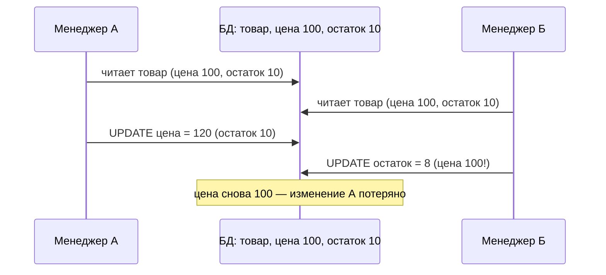
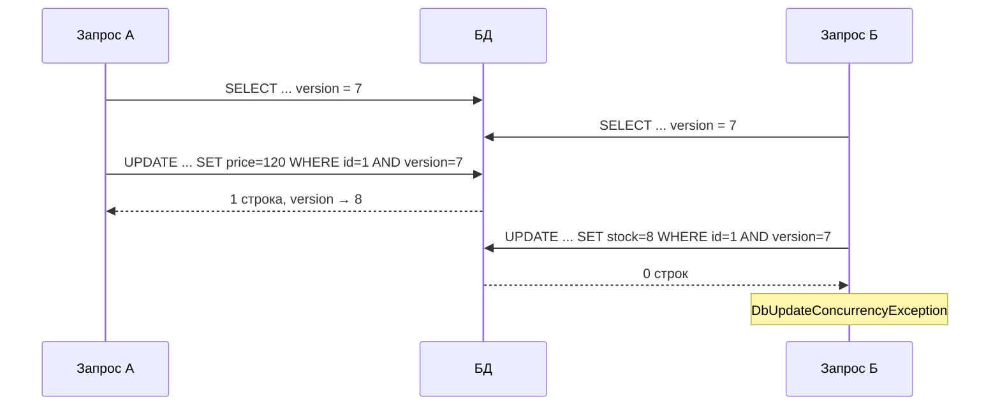
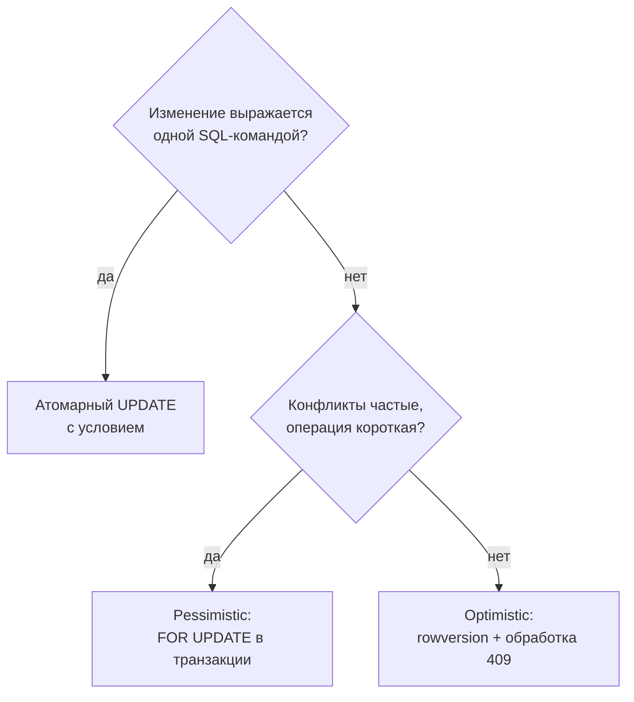

:::tldr
- Проблема: два пользователя читают одну запись, оба меняют и сохраняют — **второй затирает изменения первого** (lost update).
- **Optimistic concurrency** — «конфликты редки»: не блокируем при чтении, а при сохранении проверяем, что строка **не изменилась** с момента чтения: `UPDATE ... WHERE id = @id AND version = @originalVersion`. Если затронуто 0 строк → `DbUpdateConcurrencyException`. В EF — `[Timestamp]`/`IsRowVersion()` или `IsConcurrencyToken()`.
- **Pessimistic concurrency** — «конфликты вероятны»: блокируем строку при чтении (`SELECT ... FOR UPDATE`, `WITH (UPDLOCK)`) до конца транзакции. Другие ждут. В EF — через raw SQL.
- Optimistic — по умолчанию для веб-приложений (нет долгих блокировок, масштабируется). Pessimistic — для коротких «горячих» операций с высокой конкуренцией: списание остатков, выдача номеров, очереди задач (`FOR UPDATE SKIP LOCKED`).
- Для простых счётчиков лучше **атомарный UPDATE**: `SET stock = stock - @qty WHERE stock >= @qty`.
:::

## Проблема потерянного обновления



EF по умолчанию генерирует `UPDATE products SET ... WHERE id = @id` — без проверки, что данные не изменились. Последняя запись побеждает («last write wins»).

## Optimistic concurrency

```csharp Настройка
public class Product
{
    public int Id { get; set; }
    public string Name { get; set; } = "";
    public decimal Price { get; set; }
    public int Stock { get; set; }

    [Timestamp] public byte[] RowVersion { get; set; } = [];   // SQL Server: rowversion меняется автоматически
}

// PostgreSQL: системный столбец xmin как токен конкурентности
modelBuilder.Entity<Product>().Property<uint>("Version").IsRowVersion();   // Npgsql маппит на xmin

// Или ручной токен (любая СУБД): приложение само меняет значение
modelBuilder.Entity<Product>().Property(p => p.ConcurrencyStamp).IsConcurrencyToken();
```



### Обработка конфликта

```csharp
try
{
    product.Stock -= qty;
    await db.SaveChangesAsync(ct);
}
catch (DbUpdateConcurrencyException ex)
{
    var entry = ex.Entries.Single();
    var dbValues = await entry.GetDatabaseValuesAsync(ct);
    if (dbValues is null) throw new NotFoundException("Товар удалён");

    // Стратегии:
    // 1. Клиент выигрывает — перезаписать: entry.OriginalValues.SetValues(dbValues); SaveChanges снова
    // 2. БД выигрывает — отбросить изменения: entry.CurrentValues.SetValues(dbValues)
    // 3. Слияние / сообщить пользователю (чаще всего в UI)
    throw new ConflictException("Товар изменён другим пользователем. Обновите страницу.");   // → 409
}
```

### Optimistic concurrency в REST API

Версия передаётся клиенту и возвращается при изменении — через **ETag** и заголовок `If-Match`:

```csharp
app.MapPut("/products/{id}", async (int id, UpdateProduct dto, [FromHeader(Name = "If-Match")] string? ifMatch, ShopDbContext db) =>
{
    var product = await db.Products.FindAsync(id);
    if (product is null) return Results.NotFound();
    if (ifMatch is null) return Results.StatusCode(428);                              // Precondition Required

    db.Entry(product).Property(p => p.RowVersion).OriginalValue = Convert.FromBase64String(ifMatch.Trim('"'));
    product.Price = dto.Price;
    try { await db.SaveChangesAsync(); }
    catch (DbUpdateConcurrencyException) { return Results.StatusCode(412); }       // Precondition Failed
    return Results.NoContent();
});
```

Ключевой момент: подставить **исходную версию от клиента** в `OriginalValue`, иначе EF сравнит с версией, прочитанной сейчас (и конфликт между чтением клиентом и сохранением не будет обнаружен).

## Pessimistic concurrency

```csharp
await using var tx = await db.Database.BeginTransactionAsync(ct);

var account = await db.Accounts
    .FromSql($"SELECT * FROM accounts WHERE id = {accountId} FOR UPDATE")   // PostgreSQL; SQL Server: WITH (UPDLOCK, ROWLOCK)
    .SingleAsync(ct);                                                        // другие FOR UPDATE по этой строке будут ждать

account.Withdraw(amount);
await db.SaveChangesAsync(ct);
await tx.CommitAsync(ct);                                                    // блокировка снята
```

### Очередь задач в таблице

```sql
-- Каждый воркер берёт свою задачу, не ожидая чужих блокировок
UPDATE jobs SET status = 'processing', locked_by = @worker
WHERE id = (
    SELECT id FROM jobs
    WHERE status = 'pending'
    ORDER BY created_at
    FOR UPDATE SKIP LOCKED
    LIMIT 1
)
RETURNING *;
```

## Атомарные операции вместо «прочитать → изменить → записать»

```csharp
// Вместо загрузки товара и проверки остатка в C#:
int updated = await db.Products
    .Where(p => p.Id == productId && p.Stock >= qty)
    .ExecuteUpdateAsync(s => s.SetProperty(p => p.Stock, p => p.Stock - qty), ct);

if (updated == 0) throw new OutOfStockException();   // не хватило — никто не ушёл в минус
```

Одна команда, атомарна на уровне БД, без блокировок на время выполнения логики приложения.

## Сравнение

| | Optimistic | Pessimistic | Атомарный UPDATE |
|---|---|---|---|
| Блокировки | Нет (до сохранения) | Да, на время транзакции | Короткая, на время команды |
| Конфликт | Исключение при сохранении → повтор или ошибка пользователю | Ожидание | Условие в WHERE |
| Масштабируемость | Высокая | Ниже (ожидания, deadlock-и) | Высокая |
| Подходит для | Редактирование в UI, долгие «сессии» пользователя | Короткие горячие операции, строгая последовательность | Счётчики, остатки, балансы |
| Риск | Частые конфликты при высокой конкуренции | Deadlock-и, блокировки при медленном коде | Логика ограничена выражением SQL |



## Вопросы на засыпку

:::qa Чем rowversion отличается от concurrency token?
`rowversion`/`xmin` меняется **базой данных** автоматически при любом изменении строки. Обычный concurrency token (`IsConcurrencyToken`) — любое свойство, включаемое в WHERE при обновлении; его значение должно менять **приложение** (например, `Guid` при каждом сохранении). Rowversion надёжнее.
:::

:::qa Защищает ли уровень изоляции Serializable от lost update без токенов?
Да: при Serializable (и Repeatable Read в PostgreSQL) БД обнаружит конфликт и откатит одну из транзакций с ошибкой сериализации. Но это требует явных транзакций на всё «чтение → изменение», больше откатов и повторов. Optimistic concurrency решает задачу точечно и работает между HTTP-запросами.
:::

:::qa Почему optimistic concurrency работает между двумя HTTP-запросами, а pessimistic — нет?
Pessimistic требует держать транзакцию (и соединение) открытой всё время, пока пользователь редактирует форму — это минуты, недопустимо. Optimistic хранит версию у клиента и проверяет её при сохранении — ресурсы между запросами не удерживаются.
:::

:::qa Что делать, если конфликты optimistic concurrency частые?
Повторять операцию автоматически (для фоновых задач — перечитать и повторить), уменьшить «размер» конфликта (разделить сущность, менять меньше полей), перейти на атомарные операции или очередь (сериализация операций над одной сущностью через одного обработчика).
:::

## Итог

Без контроля конкурентности побеждает последняя запись и изменения теряются. Optimistic concurrency с rowversion и HTTP-заголовками ETag/If-Match — стандарт для веб-приложений; pessimistic блокировки — для коротких горячих операций; атомарные условные UPDATE — лучший выбор для счётчиков и остатков.
