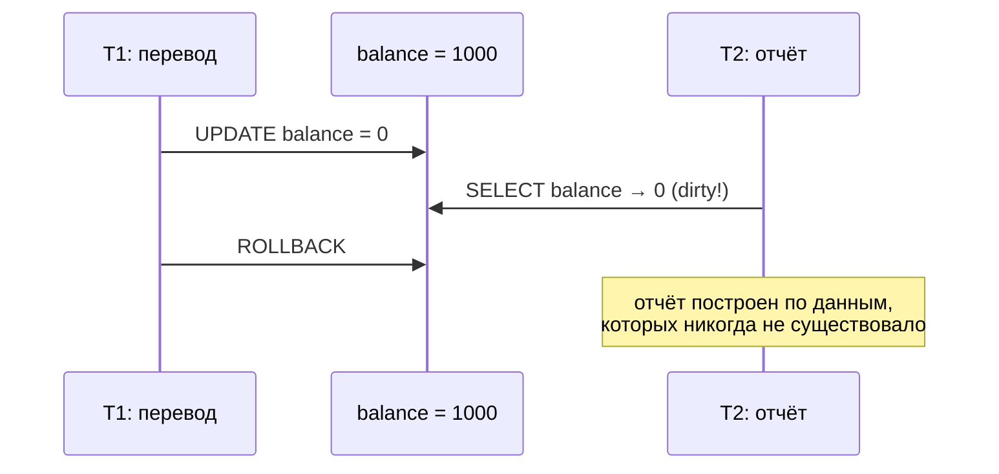
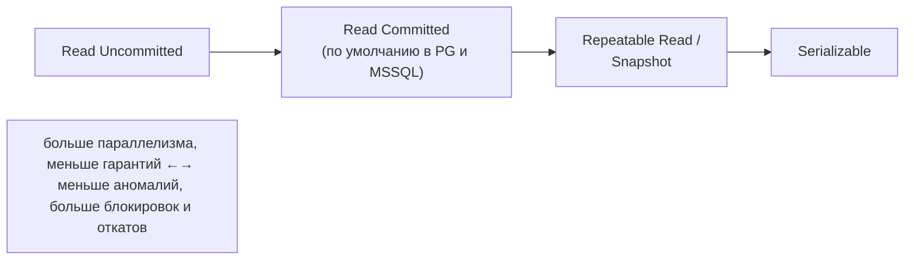
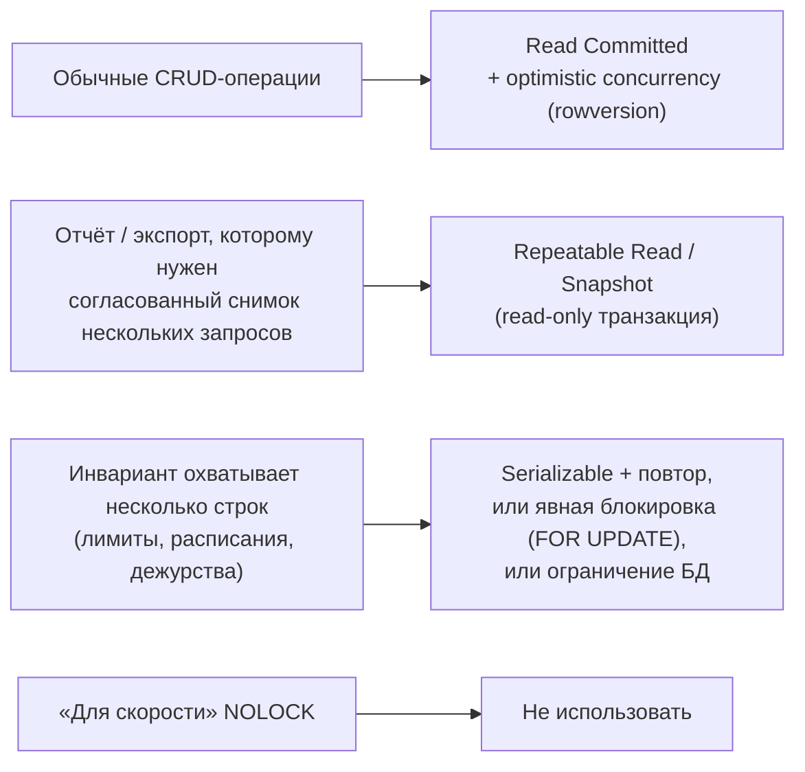

:::tldr
- Аномалии параллельных транзакций: **dirty read** (чтение незафиксированного), **non-repeatable read** (повторное чтение строки даёт другое значение), **phantom read** (повторный запрос с условием возвращает другой набор строк), **lost update**, **write skew** (две транзакции по отдельности не нарушают правило, а вместе — нарушают).
- Уровни стандарта SQL: **Read Uncommitted** → **Read Committed** → **Repeatable Read** → **Serializable**. Чем выше — тем меньше аномалий и тем больше блокировок/откатов.
- **По умолчанию**: PostgreSQL и SQL Server — Read Committed, MySQL InnoDB — Repeatable Read.
- Реализации отличаются от стандарта: в PostgreSQL Repeatable Read — это **snapshot isolation** (фантомов нет, но есть write skew), Read Uncommitted = Read Committed; в SQL Server есть отдельный уровень **SNAPSHOT** и опция **RCSI**.
- При Serializable/Repeatable Read в PostgreSQL приложение должно **повторять** транзакцию при ошибке сериализации (SQLSTATE `40001`).
:::

## Аномалии



```mermaid Non-repeatable read — строка изменилась между чтениями
sequenceDiagram
    participant T1 as T1
    participant DB as price = 100
    participant T2 as T2
    T1->>DB: SELECT price → 100
    T2->>DB: UPDATE price = 120; COMMIT
    T1->>DB: SELECT price → 120
    Note over T1: одно и то же чтение — разные значения
```

```mermaid Phantom read — появились новые строки
sequenceDiagram
    participant T1 as T1
    participant DB as orders
    participant T2 as T2
    T1->>DB: SELECT COUNT(*) WHERE status = 'new' → 5
    T2->>DB: INSERT order status = 'new'; COMMIT
    T1->>DB: SELECT COUNT(*) WHERE status = 'new' → 6
```

```mermaid Write skew — правило нарушено двумя корректными транзакциями
sequenceDiagram
    participant A as Врач А
    participant DB as дежурят: А и Б
    participant B as Врач Б
    Note over DB: правило: дежурить должен хотя бы один
    A->>DB: SELECT count(дежурных) → 2, можно уйти
    B->>DB: SELECT count(дежурных) → 2, можно уйти
    A->>DB: UPDATE А не дежурит; COMMIT
    B->>DB: UPDATE Б не дежурит; COMMIT
    Note over A,B: дежурных 0 — инвариант нарушен, хотя строки разные и конфликта записи не было
```

## Уровни и допускаемые аномалии

| Уровень | Dirty read | Non-repeatable read | Phantom read | Lost update | Write skew |
|---|---|---|---|---|---|
| Read Uncommitted | Возможно | Возможно | Возможно | Возможно | Возможно |
| **Read Committed** | Нет | Возможно | Возможно | Возможно | Возможно |
| Repeatable Read (стандарт) | Нет | Нет | Возможно | Нет* | Возможно |
| Snapshot (PG Repeatable Read, SQL Server SNAPSHOT) | Нет | Нет | Нет | Нет (ошибка при конфликте) | **Возможно** |
| **Serializable** | Нет | Нет | Нет | Нет | Нет |

\* зависит от реализации.



## Как реализовано в популярных СУБД

### PostgreSQL (MVCC)

- **Read Committed** — каждый **оператор** видит снимок на момент своего начала.
- **Repeatable Read** — вся **транзакция** видит снимок на момент первого запроса. Фантомов нет. Если пытаешься изменить строку, изменённую другой зафиксированной транзакцией, — ошибка `could not serialize access due to concurrent update`.
- **Serializable** — Serializable Snapshot Isolation (SSI): отслеживает зависимости чтения/записи и откатывает транзакции, которые могли бы дать несериализуемый результат (в том числе write skew). Без блокировок чтения, но с ошибками `40001`.
- Read Uncommitted ведёт себя как Read Committed — грязного чтения нет вообще.

### SQL Server

- По умолчанию **Read Committed на блокировках**: читатели ставят разделяемые блокировки, писатели — эксклюзивные → чтение ждёт незавершённую запись.
- **READ_COMMITTED_SNAPSHOT (RCSI)** — Read Committed на версиях строк (tempdb): читатели не блокируются. Включено по умолчанию в Azure SQL, в on-premise рекомендуется включать.
- **SNAPSHOT** — отдельный уровень, аналог Repeatable Read в PostgreSQL.
- **Serializable** — диапазонные блокировки (key-range locks): блокирует и «пустоты», чтобы не появились фантомы. Больше блокировок и deadlock-ов.
- `WITH (NOLOCK)` = Read Uncommitted для таблицы — может вернуть незафиксированные, дублированные и пропущенные строки. Не используйте «для скорости».

## Задание уровня

```sql
-- PostgreSQL
BEGIN ISOLATION LEVEL REPEATABLE READ;
-- ...
COMMIT;

-- SQL Server
SET TRANSACTION ISOLATION LEVEL SNAPSHOT;
BEGIN TRAN;
-- ...
COMMIT;
```

```csharp EF Core с повтором при ошибке сериализации
var strategy = db.Database.CreateExecutionStrategy();       // Npgsql: EnableRetryOnFailure повторяет 40001
await strategy.ExecuteAsync(async () =>
{
    db.ChangeTracker.Clear();
    await using var tx = await db.Database.BeginTransactionAsync(IsolationLevel.Serializable, ct);

    var onCall = await db.Doctors.CountAsync(d => d.ShiftId == shiftId && d.OnCall, ct);
    if (onCall < 2) throw new BusinessRuleException("Нельзя уйти: останется меньше одного дежурного");

    var me = await db.Doctors.SingleAsync(d => d.Id == doctorId, ct);
    me.OnCall = false;
    await db.SaveChangesAsync(ct);
    await tx.CommitAsync(ct);
});
```

## Как выбирать



- Большинство приложений живут на **Read Committed** + optimistic concurrency для сущностей.
- Для инвариантов на несколько строк — Serializable с повторами, или материализация конфликта: блокировка «родительской» строки (`SELECT ... FROM shifts WHERE id = @id FOR UPDATE`), уникальный индекс/исключающее ограничение (`EXCLUDE` в PostgreSQL для пересечений интервалов).

## Вопросы на засыпку

:::qa Почему в PostgreSQL нельзя получить dirty read даже на Read Uncommitted?
Архитектура MVCC: транзакция видит только версии строк, созданные зафиксированными транзакциями (и свои). Показать чужую незафиксированную версию механизм не умеет, поэтому уровень просто отображается на Read Committed — стандарт это разрешает (он задаёт минимальные гарантии).
:::

:::qa Чем snapshot isolation отличается от serializable?
Snapshot гарантирует, что транзакция видит согласованный снимок и не затирает чужие изменения тех же строк. Но две транзакции, читающие пересекающиеся данные и пишущие **разные** строки, могут вместе нарушить инвариант (write skew). Serializable это отлавливает.
:::

:::qa Что такое ошибка сериализации и что с ней делать?
SQLSTATE 40001: СУБД не смогла выполнить транзакцию так, чтобы результат был эквивалентен последовательному выполнению, и откатила её. Это нормальная часть работы на высоких уровнях изоляции — транзакцию нужно **повторить целиком** (чтение + логика + запись).
:::

:::qa Влияет ли уровень изоляции на read-only запросы?
Да: на Read Committed отчёт из нескольких запросов может увидеть данные из разных моментов (сумма по счетам не сойдётся). Для согласованных отчётов — одна транзакция Repeatable Read/Snapshot (`BEGIN READ ONLY` в PostgreSQL) или запрос к реплике.
:::

## Итог

Уровни изоляции — компромисс между корректностью и параллелизмом. Знайте аномалии (dirty, non-repeatable, phantom, lost update, write skew), знайте уровень по умолчанию своей СУБД и то, как он реализован (блокировки или MVCC). Большинству задач хватает Read Committed с optimistic concurrency, а многострочные инварианты требуют Serializable с повторами или явных блокировок.
