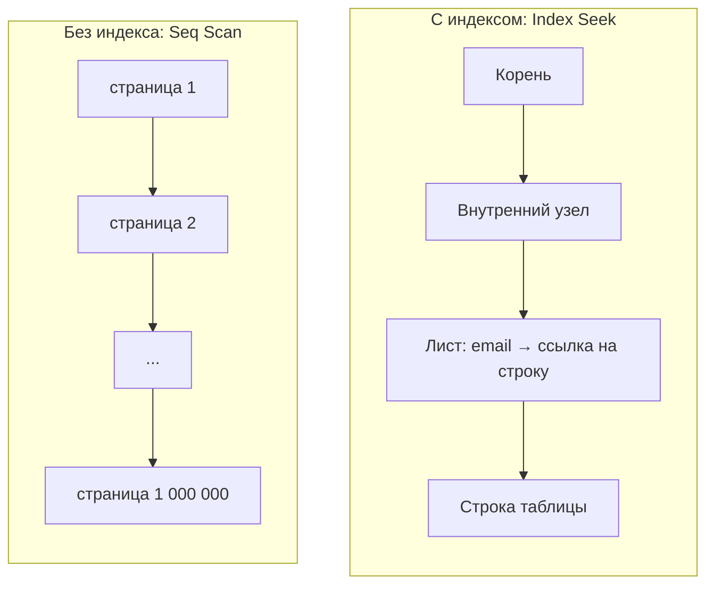
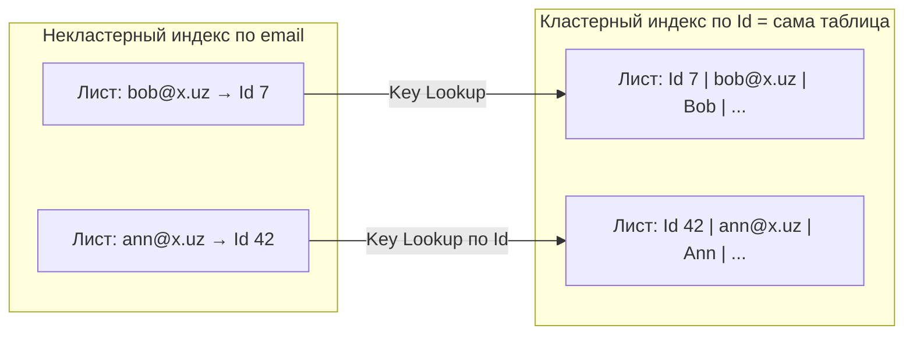

:::tldr
- **Индекс** — отдельная упорядоченная структура (обычно **B-Tree**), позволяющая найти строки без полного сканирования таблицы. Ускоряет чтение, **замедляет запись** и занимает место.
- **Clustered index** — таблица **сама хранится** в порядке ключа (листья индекса = строки). Может быть **только один** (в SQL Server по умолчанию — первичный ключ; в MySQL InnoDB — всегда PK). В PostgreSQL кластерных индексов в этом смысле нет — таблица это heap.
- **Non-clustered index** — отдельная структура: ключ → ссылка на строку (RID/ctid или ключ кластерного индекса). После поиска нужен переход к строке (**Key Lookup / heap fetch**).
- **Covering index** — содержит **все столбцы**, нужные запросу (ключ + `INCLUDE`) → запрос отвечается из индекса без обращения к таблице (**Index Only Scan**).
- Индекс не помогает: низкая **селективность**, функция/приведение типа над столбцом (**не-SARGable** условие), `LIKE '%текст'`, неправильный порядок столбцов в составном индексе, маленькие таблицы, устаревшая статистика.
:::

## Зачем индекс

Без индекса запрос `WHERE email = 'ann@x.uz'` читает **все** строки (Seq Scan / Table Scan) — O(n). Индекс B-Tree находит строку за O(log n): для 100 млн строк — 4–5 чтений страниц вместо миллионов.



## Clustered и non-clustered



| | Clustered | Non-clustered |
|---|---|---|
| Что в листьях | Сами строки таблицы | Ключ индекса + указатель на строку |
| Сколько на таблицу | Один | Много (SQL Server — до 999) |
| Физический порядок данных | По ключу индекса | Не влияет |
| Диапазонные запросы по ключу | Очень эффективны | Эффективны, но с lookup-ами |
| Доп. стоимость | Вставки «в середину» → разделение страниц (page split) | Каждый индекс — отдельная запись при INSERT/UPDATE/DELETE |

### Выбор кластерного ключа (SQL Server, MySQL)

- **Узкий** — ключ кластерного индекса копируется в каждый некластерный индекс.
- **Уникальный** и **неизменяемый**.
- **Возрастающий** — новые строки добавляются в конец, без page split. Поэтому `IDENTITY`/`bigint` лучше случайного `Guid` (`NEWID()`). Для `Guid` — последовательные: `NEWSEQUENTIALID()`, UUID v7 (`Guid.CreateVersion7()` в .NET 9).

### PostgreSQL

Таблица — **heap** (строки в порядке вставки), все индексы, включая первичный ключ, — «некластерные» и указывают на физический адрес строки (`ctid`). Команда `CLUSTER` однократно переупорядочивает таблицу, но порядок не поддерживается при дальнейших изменениях. Проверка видимости строки (MVCC) требует обращения к таблице, если страница не помечена во **visibility map** как all-visible — поэтому для Index Only Scan важен регулярный VACUUM.

## Covering index

```sql
-- Частый запрос списка заказов клиента
SELECT id, created_at, total
FROM orders
WHERE customer_id = @id AND status = 'paid'
ORDER BY created_at DESC;

-- Индекс только по customer_id: поиск + lookup в таблицу за каждой строкой
CREATE INDEX ix_orders_customer ON orders (customer_id);

-- Покрывающий: ключ для поиска и сортировки + INCLUDE для остальных столбцов
CREATE INDEX ix_orders_customer_status_date
    ON orders (customer_id, status, created_at DESC)
    INCLUDE (total);            -- PostgreSQL 11+, SQL Server
```

- **Ключевые** столбцы — для фильтрации и сортировки (участвуют в порядке B-Tree).
- **INCLUDE** — только хранятся в листьях, чтобы не ходить в таблицу; не влияют на порядок и не увеличивают внутренние узлы.

В плане выполнения: `Index Only Scan` (PostgreSQL) или отсутствие `Key Lookup` (SQL Server).

## Составной индекс и порядок столбцов

Индекс `(customer_id, status, created_at)` отсортирован сначала по `customer_id`, внутри — по `status`, внутри — по `created_at`. Как телефонный справочник: «фамилия, имя».

| Условие запроса | Используется ли индекс |
|---|---|
| `customer_id = 5` | Да (левый префикс) |
| `customer_id = 5 AND status = 'paid'` | Да |
| `customer_id = 5 AND status = 'paid' ORDER BY created_at` | Да, и сортировка из индекса |
| `status = 'paid'` | Как правило, нет (нет левого столбца) — либо skip scan в некоторых СУБД |
| `customer_id = 5 AND created_at > ...` | Частично: поиск по `customer_id`, `created_at` — фильтром |

Правило: сначала столбцы с **равенством**, потом с **диапазоном** и сортировкой; более селективные — левее (при прочих равных).

## Когда индекс не помогает

```sql
-- 1. Функция над столбцом (не-SARGable)
WHERE lower(email) = 'ann@x.uz'            -- индекс по email не используется
-- → функциональный индекс: CREATE INDEX ON users (lower(email));

WHERE date_trunc('day', created_at) = '2025-09-30'
-- → WHERE created_at >= '2025-09-30' AND created_at < '2025-10-01'

-- 2. Неявное приведение типов
WHERE phone = 998901234567                 -- phone varchar, сравнение с числом → приведение каждой строки

-- 3. Ведущий шаблон
WHERE name LIKE '%phone%'                  -- B-Tree не поможет → триграммный индекс (pg_trgm, GIN) или полнотекстовый

-- 4. OR по разным столбцам
WHERE email = @x OR phone = @y             -- иногда лучше UNION двух запросов по индексам

-- 5. Низкая селективность
WHERE is_active = true                     -- 95% строк активны → Seq Scan дешевле
-- → частичный индекс для редкого значения: CREATE INDEX ON users (id) WHERE NOT is_active;

-- 6. NOT IN, <>, IS NOT NULL на большой доле строк
```

Также: маленькие таблицы (сканирование нескольких страниц дешевле), устаревшая статистика (планировщик неверно оценивает число строк), параметр с перекошенным распределением (parameter sniffing в SQL Server).

## Цена индексов

- Каждый `INSERT` пишет во **все** индексы таблицы, `UPDATE` индексированного столбца — удаляет и вставляет запись в индексе.
- Индексы занимают место и память (buffer cache).
- Лишние и дублирующиеся индексы — частая проблема: `(a)` избыточен при наличии `(a, b)`.

```sql PostgreSQL: неиспользуемые индексы
SELECT relname, indexrelname, idx_scan, pg_size_pretty(pg_relation_size(indexrelid))
FROM pg_stat_user_indexes
WHERE idx_scan = 0
ORDER BY pg_relation_size(indexrelid) DESC;
```

## Вопросы на засыпку

:::qa Индексируются ли внешние ключи автоматически?
Нет — ни в PostgreSQL, ни в SQL Server (индекс создаётся только для PK и UNIQUE). Индекс на FK-столбце нужен для JOIN-ов и чтобы `DELETE` родителя не сканировал всю дочернюю таблицу. EF Core создаёт индексы на FK в миграциях автоматически.
:::

:::qa Почему случайный Guid как кластерный ключ — плохо?
Новые значения попадают в случайные места B-Tree → частые разделения страниц, фрагментация, рост размера, плохая локальность кэша. Последовательные идентификаторы (bigint identity, UUID v7) добавляются в конец.
:::

:::qa Чем INCLUDE отличается от добавления столбца в ключ индекса?
Столбцы ключа участвуют в сортировке и хранятся на всех уровнях дерева; их можно использовать для поиска и `ORDER BY`. INCLUDE-столбцы хранятся только в листьях — индекс компактнее, но искать или сортировать по ним нельзя.
:::

:::qa Может ли запрос использовать несколько индексов одновременно?
Да: PostgreSQL умеет Bitmap Index Scan с объединением (`BitmapAnd`/`BitmapOr`) нескольких индексов, SQL Server — index intersection. Но обычно один хорошо подобранный составной индекс эффективнее.
:::

## Итог

Индекс — упорядоченная копия части данных для быстрого поиска. Кластерный определяет физический порядок строк (один на таблицу), некластерные ссылаются на строки и требуют lookup, покрывающие отвечают на запрос целиком. Индексы работают только для SARGable-условий с учётом порядка столбцов и селективности — и за каждый индекс платит запись.
