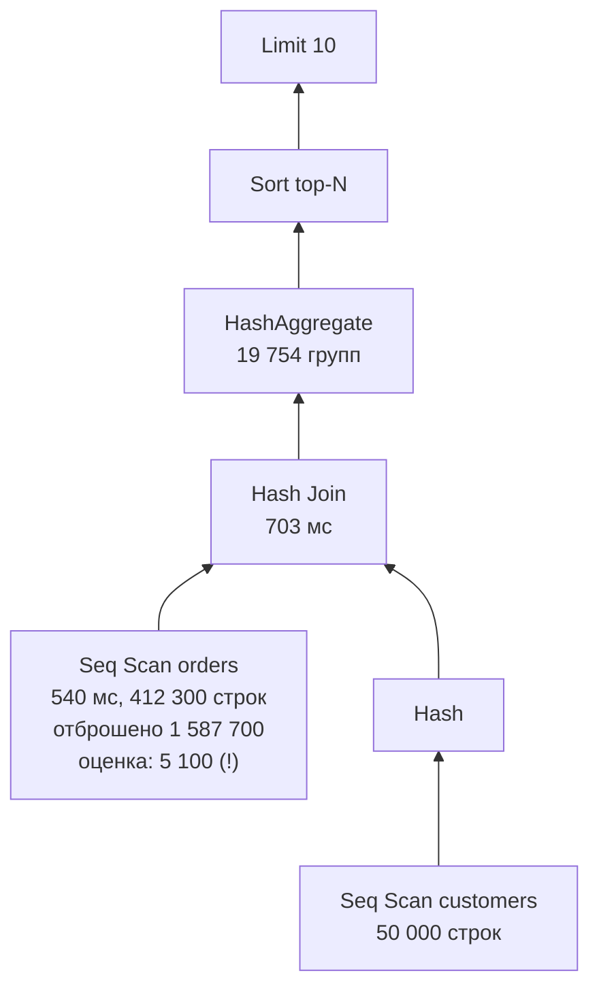
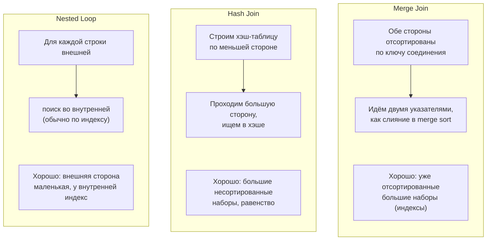
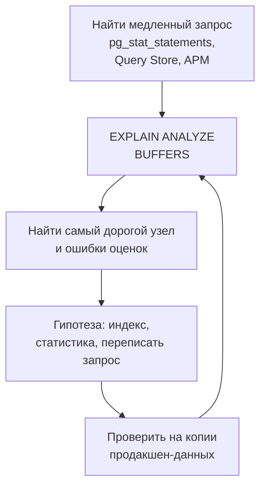

:::tldr
- **План выполнения** — дерево операций, которое выбрал **оптимизатор** на основе статистики и оценок стоимости. `EXPLAIN` показывает **план и оценки**, `EXPLAIN ANALYZE` — **выполняет** запрос и показывает **фактическое** время и число строк.
- Читается **изнутри наружу / снизу вверх**: листья — доступ к данным (Seq Scan, Index Scan, Index Only Scan, Bitmap Scan), выше — соединения (**Nested Loop, Hash Join, Merge Join**), сортировки, агрегаты, лимиты.
- Главное, на что смотреть: **самые дорогие узлы** (actual time), **расхождение оценки и факта** (rows=10 vs actual rows=100000 → плохая статистика), **Seq Scan на больших таблицах** с селективным фильтром, **Rows Removed by Filter**, сортировки на диск, **Key Lookup** в цикле.
- Типичные лекарства: индекс (составной/покрывающий/частичный), переписать условие в SARGable-форму, обновить статистику (`ANALYZE`), убрать лишние данные (проекция, `LIMIT`), переписать запрос (EXISTS вместо IN, keyset вместо OFFSET).
:::

## Как получить план

```sql
-- PostgreSQL
EXPLAIN SELECT ...;                                   -- только план и оценки
EXPLAIN (ANALYZE, BUFFERS, FORMAT TEXT) SELECT ...;   -- выполнить: реальное время, строки, чтения страниц
-- Осторожно: ANALYZE реально выполняет запрос — для UPDATE/DELETE оборачивайте в BEGIN ... ROLLBACK

-- SQL Server
SET STATISTICS IO, TIME ON;                            -- чтения и время
-- В SSMS: Ctrl+M (Include Actual Execution Plan) или Ctrl+L (Estimated)
```

Из EF Core: `query.ToQueryString()` → скопировать SQL с параметрами → `EXPLAIN ANALYZE`. В PostgreSQL для продакшена полезны `pg_stat_statements` (топ тяжёлых запросов) и `auto_explain` (логирование планов медленных запросов).

## Пример чтения плана

```sql
EXPLAIN (ANALYZE, BUFFERS)
SELECT c.name, COUNT(*) AS orders_count
FROM orders o
JOIN customers c ON c.id = o.customer_id
WHERE o.created_at >= '2025-09-01' AND o.status = 'paid'
GROUP BY c.name
ORDER BY orders_count DESC
LIMIT 10;
```

```text Вывод (упрощённо)
Limit  (cost=48210..48210 rows=10) (actual time=812.4..812.4 rows=10 loops=1)
  -> Sort  (cost=48210..48260 rows=19800) (actual time=812.4..812.4 rows=10 loops=1)
        Sort Key: (count(*)) DESC
        Sort Method: top-N heapsort  Memory: 26kB
        -> HashAggregate  (actual time=790.1..805.3 rows=19754 loops=1)
              Group Key: c.name
              -> Hash Join  (actual time=35.2..702.8 rows=412300 loops=1)
                    Hash Cond: (o.customer_id = c.id)
                    -> Seq Scan on orders o  (cost=0..39800 rows=5100) (actual time=0.03..540.7 rows=412300 loops=1)
                          Filter: ((created_at >= '2025-09-01') AND (status = 'paid'))
                          Rows Removed by Filter: 1587700
                          Buffers: shared hit=1204 read=18876
                    -> Hash  (actual time=34.9..34.9 rows=50000 loops=1)
                          -> Seq Scan on customers c  (actual time=0.01..18.2 rows=50000 loops=1)
Planning Time: 0.4 ms
Execution Time: 812.9 ms
```



Что видно:
1. **Узкое место** — `Seq Scan on orders`: 540 из 813 мс, прочитано ~2 млн строк, 80% отброшено фильтром.
2. **Оценка 5 100 строк против факта 412 300** — статистика устарела или условия коррелируют; оптимизатор может выбрать неудачный план.
3. `read=18876` — страницы читались с диска, а не из кэша.

Лечение:

```sql
ANALYZE orders;                                                      -- обновить статистику
CREATE INDEX ix_orders_status_created ON orders (status, created_at) INCLUDE (customer_id);
```

После индекса `Seq Scan` сменится на `Index Only Scan` по диапазону, а время упадёт на порядок.

## Операции доступа к данным

| Операция | Что делает | Хорошо когда |
|---|---|---|
| **Seq Scan** / Table Scan | Читает всю таблицу | Маленькая таблица или нужна большая доля строк |
| **Index Scan** / Index Seek | Ищет по индексу, для каждой строки идёт в таблицу | Мало строк (высокая селективность) |
| **Index Only Scan** | Всё нужное — в индексе (покрывающий) | Лучший вариант для частых запросов |
| **Bitmap Index Scan + Bitmap Heap Scan** (PG) | Собирает битовую карту страниц по индексу(ам), потом читает страницы по порядку | Средняя селективность, объединение нескольких индексов |
| **Key Lookup** / RID Lookup (MSSQL) | Переход из некластерного индекса в таблицу за недостающими столбцами | Немного строк; много lookup-ов → нужен INCLUDE |

## Алгоритмы соединения



| Join | Сложность | Память | Проблема |
|---|---|---|---|
| Nested Loop | O(N × log M) с индексом | Мало | Катастрофа, если внешняя сторона оказалась огромной (ошибка оценки) |
| Hash Join | O(N + M) | Хэш-таблица (может уйти на диск) | Только равенство; нехватка `work_mem` → batches на диск |
| Merge Join | O(N + M) при отсортированных входах | Мало | Требует сортировки, если нет индекса |

## Красные флаги в плане

- **Большая разница estimated vs actual rows** (в 10+ раз) → `ANALYZE`, расширенная статистика (`CREATE STATISTICS` для коррелирующих столбцов), проверка параметров.
- **Seq Scan** большой таблицы с `Rows Removed by Filter` ≫ возвращённых строк → нужен индекс или условие не SARGable.
- **Nested Loop с `loops=100000`** над внутренним Seq Scan → отсутствует индекс на ключе соединения.
- **Sort Method: external merge Disk** → сортировка не влезла в `work_mem`; нужен индекс под `ORDER BY` или меньше данных.
- **Key Lookup** с большим числом выполнений (SQL Server) → покрывающий индекс.
- **Implicit conversion** (SQL Server `CONVERT_IMPLICIT`) → несовпадение типов параметра и столбца (частая история с `nvarchar` из .NET против `varchar` в БД).
- Высокое `Planning Time` → очень сложный запрос или много партиций.

## Parameter sniffing (SQL Server) и generic plans (PostgreSQL)

План для параметризованного запроса кэшируется. Если первый вызов был с «редким» значением (`status = 'refunded'`, 10 строк) — сохранится план с Nested Loop, который будет ужасен для частого значения (`status = 'paid'`, 1 млн строк). Решения: `OPTION (RECOMPILE)`, `OPTIMIZE FOR`, разделение запросов, в PostgreSQL — `plan_cache_mode`.

## Процесс оптимизации



Всегда проверяйте на данных, похожих на продакшен по объёму и распределению: на тестовой базе с 1000 строк любой план быстрый.

## Вопросы на засыпку

:::qa Что означают два числа в cost=0.43..8.45?
Стартовая стоимость (до выдачи первой строки) и полная стоимость (до выдачи всех строк) в условных единицах оптимизатора (1 = чтение одной последовательной страницы). Это не миллисекунды; сравнивать имеет смысл только планы одного запроса.
:::

:::qa Почему оптимизатор выбрал Seq Scan, хотя индекс есть?
Возможно, он прав: при большой доле строк последовательное чтение дешевле случайных обращений через индекс. Или ошибается из-за устаревшей статистики, функции над столбцом, несовпадения типов, неподходящего порядка столбцов в индексе. Проверка: `SET enable_seqscan = off` (только для диагностики!) и сравнение фактического времени.
:::

:::qa Чем EXPLAIN ANALYZE опасен в продакшене?
Он реально выполняет запрос: `DELETE` удалит данные, тяжёлый запрос нагрузит БД. Для изменений — `BEGIN; EXPLAIN ANALYZE ...; ROLLBACK;`. Для тяжёлых — сначала обычный `EXPLAIN`.
:::

:::qa Что такое loops в плане PostgreSQL?
Сколько раз узел выполнялся. `actual time` и `rows` указаны **на одно выполнение** — итоговое время = time × loops. Внутренняя сторона Nested Loop с loops=50000 — частый скрытый виновник.
:::

## Итог

План выполнения показывает, как БД на самом деле выполняет запрос. Читайте его снизу вверх, ищите самый дорогой узел и расхождения оценок с фактом, узнавайте типы сканирования и соединений. Большинство проблем решаются индексом, свежей статистикой или переписыванием условия в SARGable-форму — и каждое изменение нужно проверять повторным `EXPLAIN ANALYZE`.
