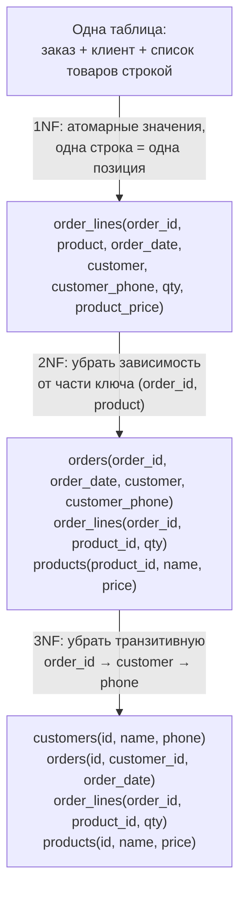
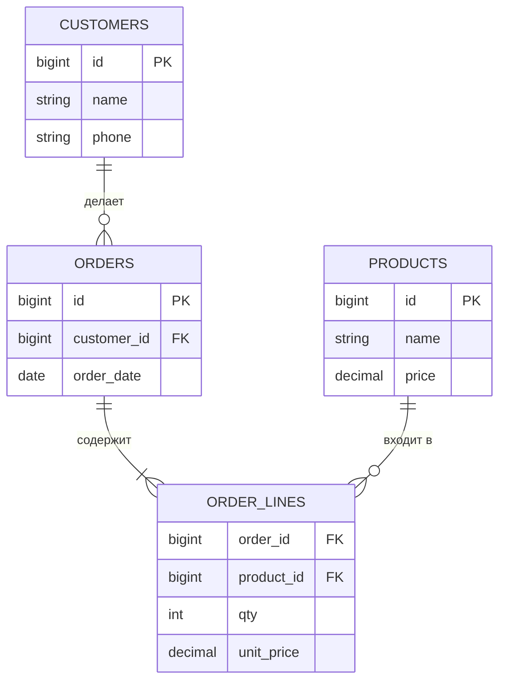
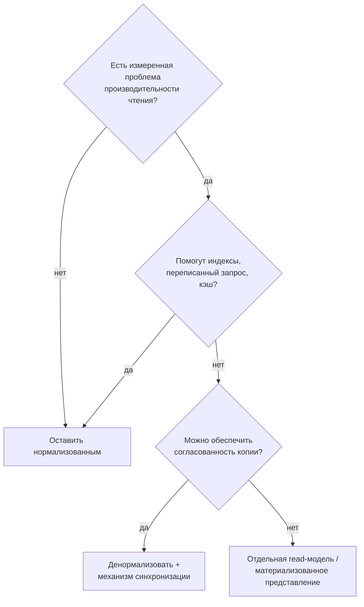

:::tldr
- **Нормализация** — организация данных так, чтобы каждый факт хранился **в одном месте**. Цель — избежать **аномалий**: вставки, обновления, удаления.
- **1NF** — атомарные значения, нет повторяющихся групп и списков в ячейке, есть ключ.
- **2NF** — 1NF + каждый неключевой атрибут зависит от **всего** составного ключа, а не от его части.
- **3NF** — 2NF + нет **транзитивных** зависимостей: неключевые атрибуты не зависят от других неключевых.
- **BCNF** — каждая детерминанта (то, от чего что-то зависит) — потенциальный ключ; строже 3NF.
- **Денормализация** — сознательное дублирование ради скорости чтения: счётчики, кэш-столбцы, снапшоты (цена в заказе), read-модели, аналитические витрины. Цена — сложность поддержания согласованности.
:::

## Проблема: ненормализованная таблица

| order_id | order_date | customer | customer_phone | products |
|---|---|---|---|---|
| 1 | 2025-09-01 | Ann | +998901111111 | Phone x1, Case x2 |
| 2 | 2025-09-02 | Ann | +998901111111 | Charger x1 |
| 3 | 2025-09-02 | Bob | +998902222222 | Phone x1 |

Аномалии:
- **Обновления**: Ann сменила телефон — нужно менять во всех её заказах; пропустили один — данные противоречат.
- **Вставки**: нельзя добавить клиента без заказа.
- **Удаления**: удалили единственный заказ Bob — потеряли и информацию о Bob.
- `products` — список в ячейке: нельзя посчитать продажи товара SQL-запросом без парсинга строк.

## Нормальные формы по шагам

### 1NF — атомарность

- Каждая ячейка — одно значение (не список, не «Phone x1, Case x2»).
- Нет повторяющихся столбцов (`phone1`, `phone2`, `phone3`).
- Строки различимы по ключу.

### 2NF — полная зависимость от ключа

Актуальна для **составных** ключей. В `order_lines(order_id, product_id, qty, order_date, product_name)`:
- `qty` зависит от `(order_id, product_id)` — полностью. ✓
- `order_date` зависит только от `order_id` — часть ключа. ✗ → в таблицу `orders`.
- `product_name` зависит только от `product_id`. ✗ → в таблицу `products`.

### 3NF — нет транзитивных зависимостей

`orders(id, customer_id, customer_phone)`: `id → customer_id → customer_phone`. Телефон зависит от клиента, а не от заказа → в таблицу `customers`.

Мнемоника: каждый неключевой атрибут зависит **от ключа, от всего ключа и ни от чего, кроме ключа**.

### BCNF

3NF допускает редкий случай: зависимость, где детерминанта — не ключ, но зависимый атрибут — часть ключа. Пример: `(студент, предмет, преподаватель)`, каждый преподаватель ведёт один предмет: `преподаватель → предмет`, но `преподаватель` — не ключ. BCNF требует разложить на `(студент, преподаватель)` и `(преподаватель, предмет)`. На практике 3NF и BCNF обычно совпадают.

Существуют 4NF (многозначные зависимости) и 5NF, но в прикладной разработке до них доходят редко.

## Итоговая схема

:::note unit_price в order_lines — это не нарушение нормализации
Цена товара меняется со временем, а заказ должен помнить цену **на момент покупки**. `order_lines.unit_price` — это отдельный факт («по какой цене продали»), а не копия `products.price`. Моделируйте **смысл** данных: исторические снапшоты — законное место для «дублирования».
:::

## Денормализация

Нормализованная схема оптимальна для **записи и целостности**, но чтение может требовать много JOIN-ов и агрегатов. Денормализация — осознанный компромисс:

| Приём | Пример | Как поддерживать согласованность |
|---|---|---|
| Кэш-столбец агрегата | `customers.orders_count`, `posts.likes_count` | В той же транзакции, триггер, или асинхронно по событию |
| Копия часто читаемого поля | `orders.customer_name` для списка заказов | Событие «клиент переименован» → обновление |
| Материализованное представление | Ежедневная сводка продаж | `REFRESH MATERIALIZED VIEW` по расписанию |
| Read-модель CQRS | Отдельная таблица/индекс для экрана | Проекции событий |
| JSON-столбец | Атрибуты товара разных категорий | Схема в коде, валидация |
| Витрина / DWH (звезда) | Аналитика | ETL/ELT |

## Типичные ошибки

- **Преждевременная денормализация** «для скорости» без измерений — получаем аномалии без выигрыша.
- **Чрезмерная нормализация** справочников-однодневок, из-за которой простой экран требует 12 JOIN-ов.
- Хранение списков через запятую (`tags = "a,b,c"`) — вместо связующей таблицы или массива/JSON с индексом.
- Путать исторический снапшот (цена в заказе) с дублированием.
- EAV (Entity-Attribute-Value) «для гибкости» — теряется типизация и производительность; современная альтернатива — JSON/JSONB с индексами.

## Вопросы на засыпку

:::qa Нарушает ли массив или JSONB в PostgreSQL первую нормальную форму?
Формально — да (значение не атомарно). Практически — это осознанный выбор, если элементы не нужно связывать с другими таблицами, а СУБД умеет их индексировать (GIN) и запрашивать. Для связей «многие-ко-многим» с внешними ключами лучше связующая таблица.
:::

:::qa Что такое функциональная зависимость?
`A → B` означает: значение A однозначно определяет значение B (по номеру паспорта определяется ФИО). Нормальные формы формулируются через функциональные зависимости между атрибутами.
:::

:::qa Почему в DWH используют денормализованные схемы?
Аналитические запросы читают огромные объёмы и агрегируют; JOIN-ы нормализованной схемы дороги. Схема «звезда» (таблица фактов + денормализованные измерения) и колоночные хранилища оптимизированы под чтение, а данные загружаются пакетно, без конкурентных обновлений.
:::

:::qa Как поддерживать денормализованный счётчик без гонок?
Атомарным обновлением в той же транзакции: `UPDATE posts SET likes_count = likes_count + 1 WHERE id = @id` — без чтения значения в приложение. Или асинхронно (событие + периодический пересчёт для исправления расхождений).
:::

## Итог

Нормализация (обычно до 3NF) убирает дублирование и аномалии: один факт — одно место. Денормализация — инструмент оптимизации чтения, который применяют после измерений и всегда вместе с механизмом поддержания согласованности. Исторические снапшоты данных — это не дублирование, а отдельные факты.
