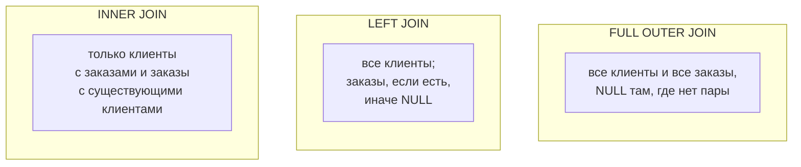
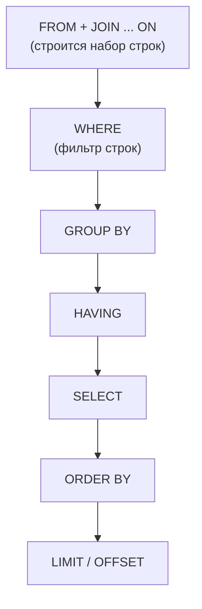

:::tldr
- **INNER JOIN** — только пары строк, у которых условие соединения выполнено (пересечение).
- **LEFT JOIN** — все строки левой таблицы + совпадения справа; нет совпадения → `NULL` в правых столбцах. **RIGHT JOIN** — зеркально (на практике переписывают в LEFT).
- **FULL OUTER JOIN** — все строки обеих таблиц; где нет пары — `NULL` с соответствующей стороны.
- **CROSS JOIN** — декартово произведение (каждая с каждой): N × M строк.
- **Self join** — таблица соединяется сама с собой (иерархии: сотрудник → руководитель).
- Полезные шаблоны: **anti join** (`LEFT JOIN ... WHERE right.id IS NULL` или `NOT EXISTS`) — «у кого нет»; **semi join** (`EXISTS`) — «у кого есть», без дублей.
- Ловушка: условие на правую таблицу в `WHERE` превращает LEFT JOIN в INNER — его место в `ON`.
:::

## Данные для примеров

```sql
customers                 orders
+----+-------+            +----+-------------+-------+
| id | name  |            | id | customer_id | total |
+----+-------+            +----+-------------+-------+
| 1  | Ann   |            | 10 | 1           | 500   |
| 2  | Bob   |            | 11 | 1           | 300   |
| 3  | Carol |            | 12 | 2           | 700   |
+----+-------+            | 13 | 99          | 100   |  ← клиента 99 нет
                          +----+-------------+-------+
```

## Виды соединений



### INNER JOIN

```sql
SELECT c.name, o.id, o.total
FROM customers c
INNER JOIN orders o ON o.customer_id = c.id;
```

| name | id | total |
|---|---|---|
| Ann | 10 | 500 |
| Ann | 11 | 300 |
| Bob | 12 | 700 |

Carol (нет заказов) и заказ 13 (нет клиента) не попали.

### LEFT JOIN

```sql
SELECT c.name, o.id, o.total
FROM customers c
LEFT JOIN orders o ON o.customer_id = c.id;
```

| name | id | total |
|---|---|---|
| Ann | 10 | 500 |
| Ann | 11 | 300 |
| Bob | 12 | 700 |
| Carol | NULL | NULL |

### FULL OUTER JOIN

```sql
SELECT c.name, o.id
FROM customers c
FULL OUTER JOIN orders o ON o.customer_id = c.id;
```

| name | id |
|---|---|
| Ann | 10 |
| Ann | 11 |
| Bob | 12 |
| Carol | NULL |
| NULL | 13 |

Применение: сверка двух источников (что есть только в одном, что в обоих).

### CROSS JOIN

```sql
-- Все комбинации размеров и цветов для генерации вариантов товара
SELECT s.size, c.color
FROM sizes s CROSS JOIN colors c;       -- 5 размеров × 4 цвета = 20 строк
```

Также используется для генерации календаря (`CROSS JOIN generate_series(...)`), чтобы в отчёте были дни без продаж.

### Self join

```sql
-- employees(id, name, manager_id)
SELECT e.name AS employee, m.name AS manager
FROM employees e
LEFT JOIN employees m ON m.id = e.manager_id;   -- LEFT, чтобы директор без руководителя тоже попал
```

Для иерархий произвольной глубины — рекурсивный CTE (см. вопрос про CTE).

## Anti join и semi join

```sql
-- Клиенты БЕЗ заказов (anti join)
SELECT c.* FROM customers c
WHERE NOT EXISTS (SELECT 1 FROM orders o WHERE o.customer_id = c.id);
-- эквивалент: LEFT JOIN orders o ON ... WHERE o.id IS NULL

-- Клиенты, у которых ЕСТЬ заказы дороже 600 (semi join), каждый клиент один раз
SELECT c.* FROM customers c
WHERE EXISTS (SELECT 1 FROM orders o WHERE o.customer_id = c.id AND o.total > 600);
```

:::warning NOT IN и NULL
```sql
SELECT * FROM customers WHERE id NOT IN (SELECT customer_id FROM orders);
```
Если в подзапросе есть хотя бы один `NULL`, результат будет **пустым**: `x NOT IN (1, NULL)` = `x <> 1 AND x <> NULL` = `UNKNOWN`. Используйте `NOT EXISTS` — он корректно работает с NULL и обычно оптимизируется лучше.
:::

## Ловушка: условие в WHERE вместо ON

```sql
-- Хотим всех клиентов и их заказы дороже 400
SELECT c.name, o.total
FROM customers c
LEFT JOIN orders o ON o.customer_id = c.id
WHERE o.total > 400;              -- Carol пропала! NULL > 400 = UNKNOWN → строка отброшена

SELECT c.name, o.total
FROM customers c
LEFT JOIN orders o ON o.customer_id = c.id AND o.total > 400;   -- правильно: фильтр правой стороны в ON
```



`ON` определяет, **как** соединять (для внешних соединений — несовпавшие строки всё равно остаются с NULL), `WHERE` — фильтрует **уже соединённый** результат.

## Размножение строк при JOIN

```sql
-- Сумма заказов и число отзывов клиента — НЕВЕРНО
SELECT c.id, SUM(o.total), COUNT(r.id)
FROM customers c
JOIN orders o ON o.customer_id = c.id
JOIN reviews r ON r.customer_id = c.id
GROUP BY c.id;
-- 3 заказа × 4 отзыва = 12 строк: SUM(total) завышен в 4 раза, COUNT в 3 раза
```

Решение — агрегировать **до** соединения:

```sql
SELECT c.id, o.sum_total, r.review_count
FROM customers c
LEFT JOIN (SELECT customer_id, SUM(total) AS sum_total FROM orders GROUP BY customer_id) o ON o.customer_id = c.id
LEFT JOIN (SELECT customer_id, COUNT(*) AS review_count FROM reviews GROUP BY customer_id) r ON r.customer_id = c.id;
```

## JOIN в EF Core

```csharp
// Навигации → EF сам построит JOIN
var list = await db.Orders.Select(o => new { o.Id, o.Customer.Name }).ToListAsync();   // INNER или LEFT по обязательности FK

// LEFT JOIN явно
var q = from c in db.Customers
        join o in db.Orders on c.Id equals o.CustomerId into orders
        from o in orders.DefaultIfEmpty()
        select new { c.Name, OrderId = (int?)o.Id };

// EF Core 10: операторы LeftJoin / RightJoin
var q2 = db.Customers.LeftJoin(db.Orders, c => c.Id, o => o.CustomerId, (c, o) => new { c.Name, OrderId = (int?)o!.Id });

// Anti join → NOT EXISTS
var withoutOrders = await db.Customers.Where(c => !c.Orders.Any()).ToListAsync();
```

## Вопросы на засыпку

:::qa Чем JOIN ... ON отличается от JOIN ... USING и NATURAL JOIN?
`USING (customer_id)` — сокращение для одноимённых столбцов, в результате один общий столбец. `NATURAL JOIN` соединяет по **всем** одноимённым столбцам автоматически — опасно: добавили столбец `created_at` в обе таблицы, и запрос молча сломался. В продакшен-коде — явный `ON`.
:::

:::qa Влияет ли порядок таблиц в INNER JOIN на производительность?
Логически нет — результат одинаков, и оптимизатор сам выбирает порядок соединения и алгоритм. Для LEFT JOIN порядок важен семантически. При очень большом числе таблиц оптимизатор может перестать перебирать все порядки (`join_collapse_limit` в PostgreSQL).
:::

:::qa Что быстрее: JOIN или подзапрос?
Современные оптимизаторы часто преобразуют одно в другое (`EXISTS` → semi join, коррелированный подзапрос → join). Выбирайте по смыслу: EXISTS для проверки наличия, JOIN для получения столбцов. Сравнивайте планы, а не синтаксис.
:::

:::qa Что такое LATERAL JOIN?
Соединение, в котором правая часть может ссылаться на столбцы левой (как коррелированный подзапрос, возвращающий несколько строк). Классика — «топ-3 последних заказа каждого клиента»: `FROM customers c CROSS JOIN LATERAL (SELECT ... WHERE o.customer_id = c.id ORDER BY created_at DESC LIMIT 3) o`. В SQL Server — `CROSS APPLY` / `OUTER APPLY`.
:::

## Итог

INNER — только совпадения, LEFT/RIGHT — все строки одной стороны, FULL — все строки обеих, CROSS — все комбинации, self join — связи внутри таблицы. Для «есть/нет» используйте EXISTS/NOT EXISTS, фильтры правой стороны LEFT JOIN ставьте в ON, а агрегаты по нескольким «многим» связям считайте до соединения.
