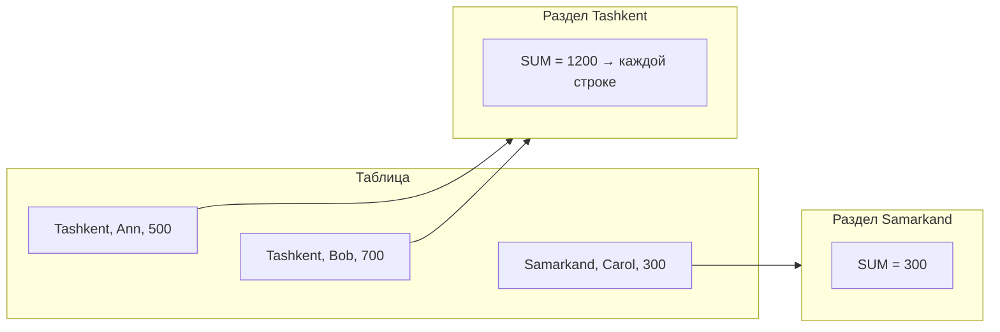
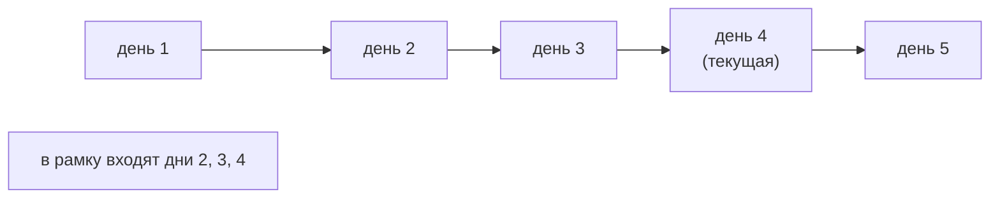
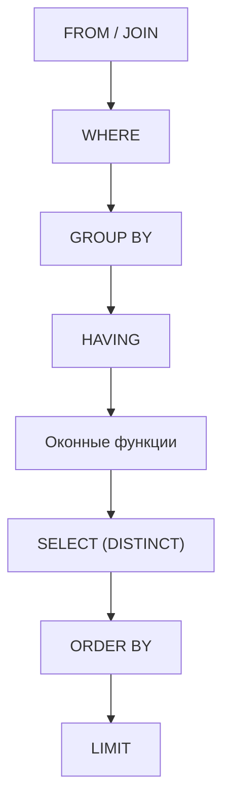

:::tldr
- **Оконная функция** вычисляет значение для каждой строки на основе **набора связанных строк** («окна»), **не схлопывая** строки, в отличие от `GROUP BY`.
- Синтаксис: `функция() OVER (PARTITION BY ... ORDER BY ... [ROWS/RANGE ...])`. `PARTITION BY` делит строки на группы, `ORDER BY` задаёт порядок внутри группы, **рамка** (frame) — какие строки учитываются.
- Ранжирование: **ROW_NUMBER** (1,2,3,4 — уникальные), **RANK** (1,2,2,4 — с пропусками), **DENSE_RANK** (1,2,2,3 — без пропусков), **NTILE(n)** (разбиение на n корзин).
- Смещение: **LAG** (предыдущая строка), **LEAD** (следующая), **FIRST_VALUE**, **LAST_VALUE**, **NTH_VALUE**.
- Агрегаты как окна: `SUM(...) OVER (...)` — **нарастающий итог**, скользящее среднее, доля от общего.
- Классические задачи: топ-N в каждой группе, дедупликация, разница с предыдущим периодом, нарастающие итоги, сессии и «пробелы и острова».
:::

## GROUP BY против оконной функции

```sql
-- sales(region, manager, amount)
-- GROUP BY: одна строка на регион, детали потеряны
SELECT region, SUM(amount) FROM sales GROUP BY region;

-- Окно: каждая строка остаётся, рядом — сумма по региону
SELECT region, manager, amount,
       SUM(amount) OVER (PARTITION BY region)                 AS region_total,
       ROUND(100.0 * amount / SUM(amount) OVER (PARTITION BY region), 1) AS pct_of_region
FROM sales;
```

| region | manager | amount | region_total | pct_of_region |
|---|---|---|---|---|
| Tashkent | Ann | 500 | 1200 | 41.7 |
| Tashkent | Bob | 700 | 1200 | 58.3 |
| Samarkand | Carol | 300 | 300 | 100.0 |



## Функции ранжирования

```sql
SELECT manager, amount,
       ROW_NUMBER() OVER (ORDER BY amount DESC) AS row_num,
       RANK()       OVER (ORDER BY amount DESC) AS rnk,
       DENSE_RANK() OVER (ORDER BY amount DESC) AS dense_rnk,
       NTILE(2)     OVER (ORDER BY amount DESC) AS half
FROM sales;
```

| manager | amount | row_num | rnk | dense_rnk | half |
|---|---|---|---|---|---|
| Bob | 900 | 1 | 1 | 1 | 1 |
| Ann | 700 | 2 | 2 | 2 | 1 |
| Dan | 700 | 3 | 2 | 2 | 2 |
| Carol | 300 | 4 | 4 | 3 | 2 |

- **ROW_NUMBER** — порядковый номер; при равенстве порядок произволен (добавьте уникальный столбец в `ORDER BY` для детерминизма).
- **RANK** — одинаковые значения получают одинаковый ранг, следующий ранг **пропускается** (как места в спорте).
- **DENSE_RANK** — без пропусков.

### Топ-N в каждой группе

```sql
-- 3 самых дорогих заказа каждого клиента
SELECT *
FROM (
    SELECT o.*,
           ROW_NUMBER() OVER (PARTITION BY customer_id ORDER BY total DESC, id) AS rn
    FROM orders o
) t
WHERE rn <= 3;
```

Оконные функции вычисляются **после** `WHERE`, поэтому фильтровать по их результату можно только во внешнем запросе/CTE (в некоторых СУБД — через `QUALIFY`).

### Дедупликация

```sql
-- Оставить последнюю запись по каждому email, удалить остальные
DELETE FROM subscribers
WHERE id IN (
    SELECT id FROM (
        SELECT id, ROW_NUMBER() OVER (PARTITION BY lower(email) ORDER BY created_at DESC) AS rn
        FROM subscribers
    ) d
    WHERE rn > 1
);
```

## LAG и LEAD

```sql
-- Выручка по месяцам и изменение к предыдущему месяцу
SELECT month,
       revenue,
       LAG(revenue) OVER (ORDER BY month)                      AS prev_revenue,
       revenue - LAG(revenue) OVER (ORDER BY month)            AS diff,
       ROUND(100.0 * (revenue / NULLIF(LAG(revenue) OVER (ORDER BY month), 0) - 1), 1) AS growth_pct,
       LEAD(revenue) OVER (ORDER BY month)                     AS next_revenue
FROM monthly_revenue;
```

| month | revenue | prev_revenue | diff | growth_pct |
|---|---|---|---|---|
| 2025-07 | 100 | NULL | NULL | NULL |
| 2025-08 | 120 | 100 | 20 | 20.0 |
| 2025-09 | 90 | 120 | -30 | -25.0 |

`LAG(col, n, default)` — смещение на n строк и значение по умолчанию вместо NULL.

## Нарастающий итог и рамки окна

```sql
SELECT day, amount,
       SUM(amount) OVER (ORDER BY day)                                        AS running_total,
       AVG(amount) OVER (ORDER BY day ROWS BETWEEN 6 PRECEDING AND CURRENT ROW) AS moving_avg_7d
FROM daily_sales;
```



| Рамка | Что входит |
|---|---|
| (по умолчанию с ORDER BY) `RANGE BETWEEN UNBOUNDED PRECEDING AND CURRENT ROW` | От начала раздела до текущей строки **и всех равных ей** по ORDER BY |
| `ROWS BETWEEN UNBOUNDED PRECEDING AND CURRENT ROW` | От начала до текущей **физической** строки |
| `ROWS BETWEEN 6 PRECEDING AND CURRENT ROW` | Скользящее окно из 7 строк |
| `ROWS BETWEEN UNBOUNDED PRECEDING AND UNBOUNDED FOLLOWING` | Весь раздел |

:::warning LAST_VALUE «не работает»
`LAST_VALUE(x) OVER (ORDER BY d)` с рамкой по умолчанию возвращает **текущую** строку, а не последнюю в разделе — рамка заканчивается на текущей строке. Нужно явно: `ROWS BETWEEN UNBOUNDED PRECEDING AND UNBOUNDED FOLLOWING`. Аналогичная ловушка с `RANGE` при дублях в `ORDER BY` в нарастающем итоге — используйте `ROWS`.
:::

## «Пробелы и острова»

```sql
-- Найти непрерывные серии дней, когда пользователь заходил
SELECT user_id, MIN(day) AS streak_start, MAX(day) AS streak_end, COUNT(*) AS days
FROM (
    SELECT user_id, day,
           day - (ROW_NUMBER() OVER (PARTITION BY user_id ORDER BY day))::int AS grp   -- у подряд идущих дней разность постоянна
    FROM logins
) t
GROUP BY user_id, grp
HAVING COUNT(*) >= 7;          -- серии от 7 дней
```

## Порядок вычисления



Поэтому оконную функцию можно применить к результату `GROUP BY` (например, `RANK() OVER (ORDER BY SUM(amount) DESC)`), но нельзя использовать в `WHERE`.

## Оконные функции и .NET

- EF Core (до 10) не транслирует оконные функции из LINQ напрямую — используйте `FromSql`/`SqlQuery<T>` или Dapper. Есть сторонние расширения (например, `Zomp.EFCore.WindowFunctions`).
- Для топ-N в группе EF Core может сгенерировать `ROW_NUMBER()` сам: `db.Orders.GroupBy(o => o.CustomerId).Select(g => g.OrderByDescending(o => o.Total).Take(3))` (в современных версиях транслируется через `ROW_NUMBER` + `LATERAL`/подзапрос).

## Производительность

- Окна требуют **сортировки** по `PARTITION BY` + `ORDER BY` — индекс `(partition_col, order_col)` позволяет избежать Sort.
- Несколько окон с одинаковой спецификацией вычисляются за один проход — используйте `WINDOW w AS (PARTITION BY ... ORDER BY ...)` и `OVER w`.
- Для топ-1 в группе в PostgreSQL иногда быстрее `DISTINCT ON`, в других СУБД — `LATERAL`/`APPLY` с `LIMIT 1` по индексу.

## Вопросы на засыпку

:::qa Чем ROW_NUMBER отличается от RANK и DENSE_RANK на одинаковых значениях?
Для значений 900, 700, 700, 300: ROW_NUMBER → 1,2,3,4 (уникальные, порядок равных произволен), RANK → 1,2,2,4 (пропуск), DENSE_RANK → 1,2,2,3 (без пропуска).
:::

:::qa Можно ли использовать оконную функцию в WHERE?
Нет — окна вычисляются после WHERE, GROUP BY и HAVING. Оборачивайте в подзапрос или CTE и фильтруйте снаружи. В Snowflake, BigQuery, DuckDB есть `QUALIFY`.
:::

:::qa Как посчитать долю строки от общей суммы?
`amount / SUM(amount) OVER ()` — пустое `OVER ()` означает окно из всех строк результата. С `PARTITION BY region` — доля от суммы региона.
:::

:::qa Чем ROWS отличается от RANGE?
`ROWS` считает физические строки (N строк назад), `RANGE` — логический диапазон значений `ORDER BY` (все строки с равным значением входят вместе, а с числами/датами можно задать `RANGE BETWEEN INTERVAL '7 days' PRECEDING AND CURRENT ROW`).
:::

## Итог

Оконные функции дают агрегаты и ранги «рядом с каждой строкой» без потери детализации: топ-N в группе, дедупликация, сравнение с предыдущим периодом, нарастающие итоги и скользящие средние. Помните про порядок вычисления (после WHERE и GROUP BY), рамки окна по умолчанию и индексы под `PARTITION BY` + `ORDER BY`.
