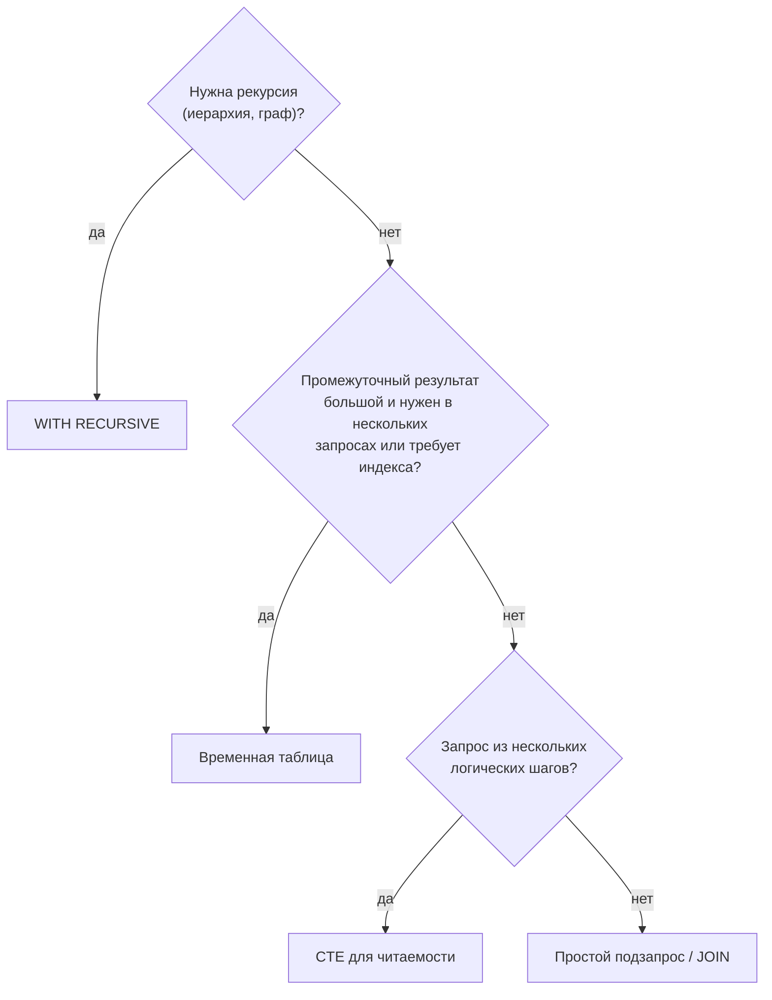

:::tldr
- **Подзапрос** — запрос внутри запроса (в `WHERE`, `FROM`, `SELECT`). Бывает **коррелированным** (зависит от строки внешнего запроса) и некоррелированным.
- **CTE** (`WITH name AS (...)`) — именованный подзапрос в рамках **одного** оператора. Главное — **читаемость** (запрос «сверху вниз» по шагам) и **рекурсия** (`WITH RECURSIVE`) для иерархий и графов.
- Производительность CTE: в PostgreSQL 12+ и SQL Server CTE **встраивается** в основной запрос (как подзапрос); в PostgreSQL можно принудительно материализовать — `AS MATERIALIZED`. До PG 12 CTE всегда материализовался («барьер оптимизации»).
- **Временная таблица** (`CREATE TEMP TABLE` / `#temp`) — реальный объект на время сессии/транзакции: можно **индексировать**, собирать **статистику**, использовать в нескольких запросах. Хороша для многошаговой обработки больших промежуточных наборов.
- **Табличные переменные** (SQL Server `@t`) — без статистики, для небольших наборов.
:::

## Одна задача — три способа

Задача: клиенты, чья сумма заказов за месяц выше средней.

```sql Подзапросы
SELECT c.name, t.total
FROM customers c
JOIN (
    SELECT customer_id, SUM(total) AS total
    FROM orders
    WHERE created_at >= '2025-09-01'
    GROUP BY customer_id
) t ON t.customer_id = c.id
WHERE t.total > (
    SELECT AVG(s.total) FROM (
        SELECT SUM(total) AS total FROM orders WHERE created_at >= '2025-09-01' GROUP BY customer_id
    ) s
);
```

```sql CTE — те же шаги, но читается сверху вниз
WITH monthly AS (
    SELECT customer_id, SUM(total) AS total
    FROM orders
    WHERE created_at >= '2025-09-01'
    GROUP BY customer_id
),
avg_total AS (
    SELECT AVG(total) AS value FROM monthly          -- CTE ссылается на предыдущий CTE
)
SELECT c.name, m.total
FROM monthly m
JOIN customers c ON c.id = m.customer_id
CROSS JOIN avg_total a
WHERE m.total > a.value;
```

```sql Временная таблица — если промежуточный результат большой и нужен в нескольких запросах
CREATE TEMP TABLE monthly AS
SELECT customer_id, SUM(total) AS total
FROM orders WHERE created_at >= '2025-09-01'
GROUP BY customer_id;

CREATE INDEX ON monthly (customer_id);
ANALYZE monthly;                                     -- статистика для оптимизатора

SELECT c.name, m.total FROM monthly m JOIN customers c ON c.id = m.customer_id
WHERE m.total > (SELECT AVG(total) FROM monthly);

UPDATE customers SET segment = 'vip'
WHERE id IN (SELECT customer_id FROM monthly WHERE total > 1000000);
```

## Сравнение

| | Подзапрос | CTE | Временная таблица |
|---|---|---|---|
| Область видимости | Место, где написан | Один оператор | Сессия / транзакция |
| Читаемость | Падает с вложенностью | Высокая: шаги по порядку | Высокая, но многословно |
| Повторное использование | Нужно копировать | В пределах оператора | В нескольких операторах |
| Рекурсия | Нет | **Да** | Через цикл |
| Индексы и статистика | — | — | **Да** |
| Оптимизация | Встраивается | Встраивается (PG 12+, MSSQL) или материализуется | Отдельные шаги, план каждого запроса отдельно |
| Стоимость | Нет накладных расходов | Нет (если встраивается) | Запись в tempdb / temp-файлы |



## Рекурсивный CTE

```sql
-- Дерево категорий: все потомки категории 5 с уровнем и путём
WITH RECURSIVE tree AS (
    -- якорь: стартовая строка
    SELECT id, parent_id, name, 1 AS depth, name::text AS path
    FROM categories
    WHERE id = 5

    UNION ALL

    -- рекурсивная часть: дети уже найденных
    SELECT c.id, c.parent_id, c.name, t.depth + 1, t.path || ' > ' || c.name
    FROM categories c
    JOIN tree t ON c.parent_id = t.id
    WHERE t.depth < 10                              -- защита от бесконечной рекурсии
)
SELECT * FROM tree ORDER BY path;
```


Другие применения: цепочка руководителей сотрудника, развёртка BOM (спецификация изделия), поиск путей в графе, генерация последовательностей дат (хотя для этого есть `generate_series`).

:::warning Циклы в данных
Если в «дереве» есть цикл (A → B → A), рекурсия бесконечна. Защита: ограничение глубины, накопление пути и проверка `NOT c.id = ANY(t.visited)`, в PostgreSQL 14+ — `CYCLE id SET is_cycle USING path`. В SQL Server есть лимит `MAXRECURSION` (100 по умолчанию).
:::

## Коррелированный подзапрос

```sql
-- Для каждого клиента — дата последнего заказа (выполняется «для каждой строки» внешнего запроса)
SELECT c.name,
       (SELECT MAX(o.created_at) FROM orders o WHERE o.customer_id = c.id) AS last_order_at
FROM customers c;
```

Оптимизатор часто превращает такой подзапрос в JOIN с агрегатом, но не всегда. При проблемах — переписать через `LEFT JOIN (SELECT customer_id, MAX(...) ... GROUP BY)` или `LATERAL`.

## Материализация CTE в PostgreSQL

```sql
-- Принудительно вычислить один раз (например, дорогая функция используется несколько раз)
WITH expensive AS MATERIALIZED (
    SELECT id, heavy_calculation(data) AS score FROM items
)
SELECT * FROM expensive WHERE score > 10
UNION ALL
SELECT * FROM expensive WHERE score < -10;

-- Наоборот, разрешить встраивание, даже если CTE используется дважды
WITH cheap AS NOT MATERIALIZED (...)
```

Модифицирующие CTE (`WITH deleted AS (DELETE ... RETURNING *) INSERT INTO archive SELECT * FROM deleted`) выполняются всегда ровно один раз — удобный способ атомарно переместить данные.

## CTE и EF Core

LINQ-запросы EF Core генерируют подзапросы, а не CTE. Для рекурсивных запросов и сложной аналитики используют `FromSql` / `SqlQuery<T>`:

```csharp
var descendants = await db.Categories.FromSql($"""
    WITH RECURSIVE tree AS (
        SELECT * FROM categories WHERE id = {rootId}
        UNION ALL
        SELECT c.* FROM categories c JOIN tree t ON c.parent_id = t.id
    )
    SELECT * FROM tree
    """).AsNoTracking().ToListAsync(ct);
```

Альтернатива для иерархий — хранить путь: `ltree` в PostgreSQL, `hierarchyid` в SQL Server, materialized path (`/1/5/12/`), closure table.

## Вопросы на засыпку

:::qa Материализуется ли CTE в SQL Server?
Нет, SQL Server всегда встраивает нерекурсивный CTE в запрос; если CTE используется дважды — он вычисляется дважды. Для однократного вычисления — временная таблица.
:::

:::qa Чем UNION отличается от UNION ALL в рекурсивном CTE?
`UNION ALL` добавляет все строки итерации. `UNION` убирает дубликаты — это может остановить зацикливание в графах, но дороже (нужно сравнивать с уже полученными строками).
:::

:::qa Временная таблица или табличная переменная в SQL Server?
`#temp` — есть статистика, индексы, можно ALTER; лучше для больших наборов. `@table` — без статистики (оптимизатор считает, что там 1 строка — до SQL Server 2019 с deferred compilation), меньше перекомпиляций; для небольших наборов.
:::

:::qa Видна ли временная таблица другим сессиям?
Локальная временная таблица (`#t` в SQL Server, `TEMP` в PostgreSQL) видна только своей сессии и удаляется при её завершении. С пулом соединений это важно: соединение возвращается в пул, и таблица может «пережить» логическую операцию — удаляйте явно или используйте `ON COMMIT DROP`.
:::

## Итог

Подзапросы — для простых вложенных условий, CTE — для читаемых многошаговых запросов и рекурсии, временные таблицы — для больших промежуточных результатов, которым нужны индексы, статистика и повторное использование. В современных СУБД CTE обычно не влияет на производительность, а в PostgreSQL материализацией можно управлять явно.
