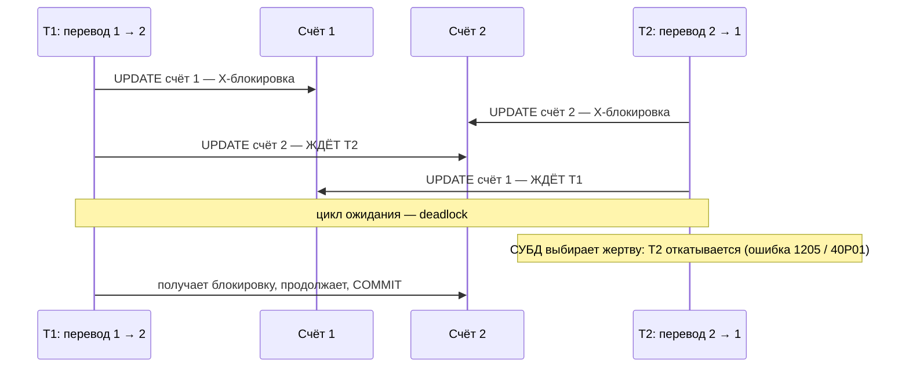
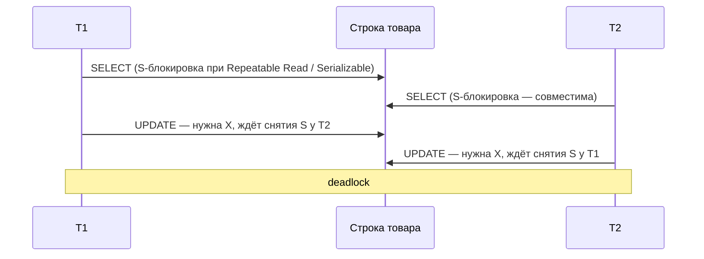
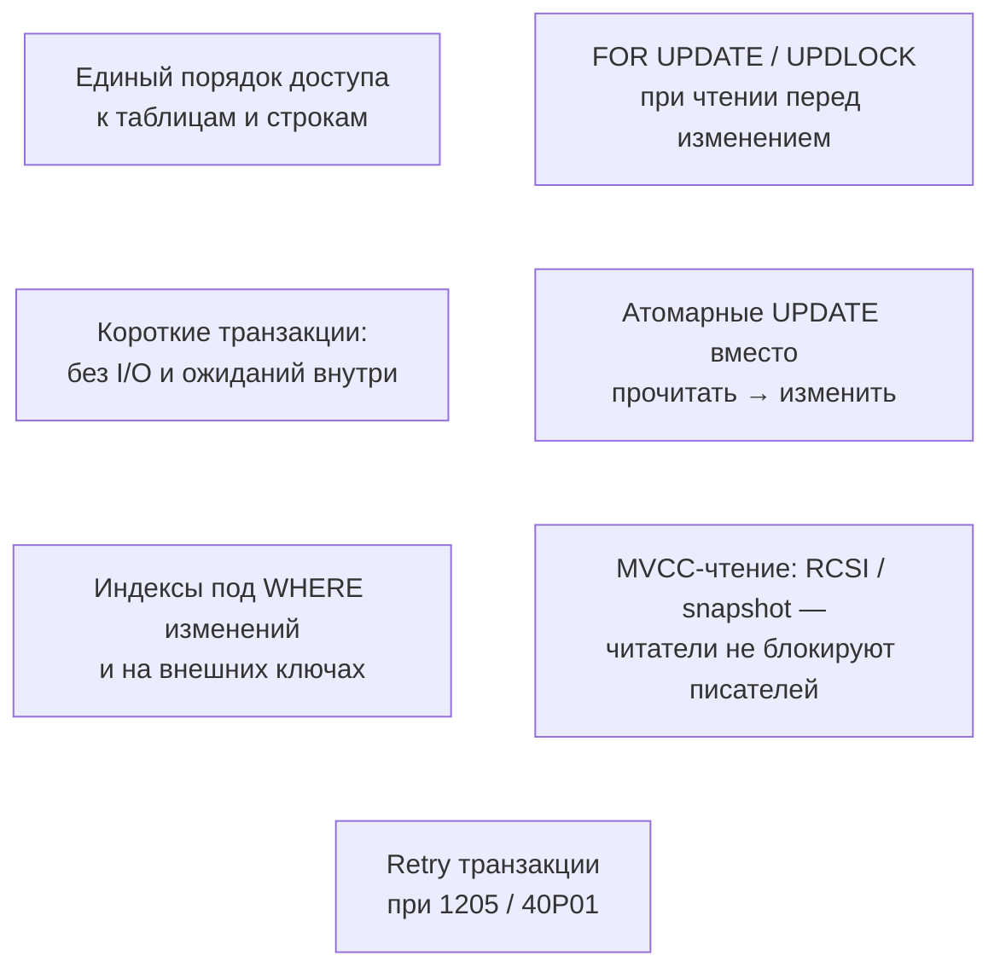

:::tldr
- **Deadlock** — две (или больше) транзакции **ждут друг друга по кругу**: T1 держит ресурс A и ждёт B, T2 держит B и ждёт A. Сами они никогда не завершатся.
- СУБД обнаруживает цикл ожидания (граф ожиданий) и **убивает одну из транзакций** («жертву»): SQL Server — ошибка **1205**, PostgreSQL — `deadlock detected` (SQLSTATE **40P01**). Остальные продолжают работу.
- Частые причины: **разный порядок** обновления строк/таблиц, **эскалация** блокировок (shared → exclusive при «прочитать, потом обновить»), отсутствие индексов (сканирование блокирует лишние строки), внешние ключи, длинные транзакции.
- Профилактика: **единый порядок** захвата ресурсов, **короткие** транзакции, правильные **индексы**, `UPDLOCK` / `FOR UPDATE` при чтении перед изменением, атомарные `UPDATE ... WHERE`, snapshot/MVCC-чтение.
- Лечение в коде: deadlock — **нормальная** ситуация под нагрузкой; транзакцию нужно **повторить** (retry с небольшой задержкой).
:::

## Как возникает




Детектор deadlock-ов периодически (в PostgreSQL — после `deadlock_timeout`, по умолчанию 1 с ожидания; в SQL Server — каждые ~5 с, чаще при обнаружениях) строит граф ожиданий и ищет циклы.

## Типичные сценарии

### 1. Разный порядок доступа

Перевод 1 → 2 и перевод 2 → 1 одновременно (пример выше). То же — с таблицами: один код обновляет `orders`, потом `stock`, другой — `stock`, потом `orders`.

**Решение — единый порядок**, например по возрастанию id:

```csharp
var (first, second) = fromId < toId ? (fromId, toId) : (toId, fromId);
await using var tx = await db.Database.BeginTransactionAsync(ct);
await db.Database.ExecuteSqlAsync($"SELECT id FROM accounts WHERE id IN ({first}, {second}) ORDER BY id FOR UPDATE", ct);
// теперь обе строки заблокированы в едином порядке — можно безопасно менять
```

### 2. Конверсия блокировок: прочитать, затем изменить



**Решение**: сразу брать блокировку на изменение при чтении — `SELECT ... FOR UPDATE` (PostgreSQL), `WITH (UPDLOCK)` (SQL Server). Или вообще не читать: атомарный `UPDATE stock SET qty = qty - 1 WHERE id = @id AND qty > 0`.

### 3. Отсутствие индекса

`UPDATE orders SET status = 'x' WHERE customer_id = 5` без индекса по `customer_id` сканирует таблицу и (в блокировочных СУБД) блокирует гораздо больше строк/страниц, чем нужно, увеличивая шанс пересечения с другими транзакциями. Индексы на FK и на столбцы в `WHERE` изменений уменьшают «площадь» блокировок.

### 4. Внешние ключи и каскады

Вставка дочерней строки берёт разделяемую блокировку на родителя (проверка FK). Параллельное удаление/обновление родителя в другом порядке → deadlock. Каскадное удаление блокирует множество строк в разных таблицах.

### 5. Длинные транзакции

Чем дольше транзакция держит блокировки (HTTP-вызов внутри транзакции, пользовательский ввод), тем выше вероятность пересечения.

## Как расследовать

```sql
-- SQL Server: встроенная сессия Extended Events system_health хранит deadlock graph
SELECT xed.value('@timestamp', 'datetime2') AS time, xed.query('.') AS deadlock_graph
FROM (SELECT CAST(target_data AS xml) AS td
      FROM sys.dm_xe_session_targets t JOIN sys.dm_xe_sessions s ON s.address = t.event_session_address
      WHERE s.name = 'system_health' AND t.target_name = 'ring_buffer') x
CROSS APPLY td.nodes('RingBufferTarget/event[@name="xml_deadlock_report"]') AS q(xed);
```

```text PostgreSQL: сообщение в логе (log_lock_waits = on)
ERROR:  deadlock detected
DETAIL:  Process 4121 waits for ShareLock on transaction 9054; blocked by process 4135.
         Process 4135 waits for ShareLock on transaction 9053; blocked by process 4121.
         Process 4121: UPDATE accounts SET balance = balance + 500 WHERE id = 2
         Process 4135: UPDATE accounts SET balance = balance + 500 WHERE id = 1
```

Deadlock graph показывает участников, их запросы, удерживаемые и ожидаемые ресурсы — по нему восстанавливается порядок доступа.

## Retry в .NET

```csharp
// EF Core: встроенная стратегия повторяет транзиентные ошибки, включая deadlock
builder.Services.AddDbContext<ShopDbContext>(o => o.UseSqlServer(conn, sql => sql.EnableRetryOnFailure(
    maxRetryCount: 3, maxRetryDelay: TimeSpan.FromSeconds(2), errorNumbersToAdd: [1205])));

// Polly для произвольного кода (Dapper, ADO.NET)
var pipeline = new ResiliencePipelineBuilder()
    .AddRetry(new RetryStrategyOptions
    {
        ShouldHandle = new PredicateBuilder()
            .Handle<SqlException>(e => e.Number == 1205)
            .Handle<PostgresException>(e => e.SqlState == PostgresErrorCodes.DeadlockDetected),
        MaxRetryAttempts = 3,
        Delay = TimeSpan.FromMilliseconds(100),
        BackoffType = DelayBackoffType.Exponential,
        UseJitter = true
    })
    .Build();

await pipeline.ExecuteAsync(async ct => await TransferAsync(from, to, amount, ct), ct);
```

Повторять нужно **всю транзакцию** целиком (вместе с чтениями), а не только упавший оператор.

## Чек-лист профилактики



## Deadlock не только в БД

- **`lock` в C#** при захвате двух объектов в разном порядке.
- **Sync-over-async**: `.Result` в UI-потоке (см. вопрос про async/await).
- **Распределённые блокировки** (Redis) без TTL.

Принципы те же: единый порядок, короткие критические секции, таймауты.

## Вопросы на засыпку

:::qa Чем deadlock отличается от обычной блокировки (blocking)?
Blocking — одна транзакция ждёт другую, которая рано или поздно завершится и освободит ресурс. Deadlock — круговое ожидание, которое само не разрешится; его разрывает только СУБД, убивая жертву.
:::

:::qa Как СУБД выбирает жертву?
SQL Server — по умолчанию транзакцию с наименьшей стоимостью отката (можно влиять `SET DEADLOCK_PRIORITY`). PostgreSQL — ту, в процессе которой был обнаружен цикл (кто первым проверил после `deadlock_timeout`).
:::

:::qa Помогает ли NOLOCK от deadlock-ов?
Он убирает разделяемые блокировки чтения, но ценой грязного и неконсистентного чтения (пропущенные и дублированные строки). Правильное решение для SQL Server — `READ_COMMITTED_SNAPSHOT`: читатели работают с версиями строк и не блокируют писателей.
:::

:::qa Возможен ли deadlock в одной таблице и одной строке?
Да — при конверсии блокировок (оба держат S и хотят X) или при взаимодействии индексов: одна транзакция идёт по некластерному индексу к строке, другая — по кластерному к индексу, блокируя ключи в разном порядке.
:::

## Итог

Deadlock — круговое ожидание блокировок, которое СУБД разрывает, откатывая одну транзакцию. Снижайте вероятность единым порядком доступа, короткими транзакциями, индексами и захватом блокировки на изменение сразу при чтении; а в коде всегда предусматривайте повтор транзакции — под нагрузкой deadlock-и неизбежны.
