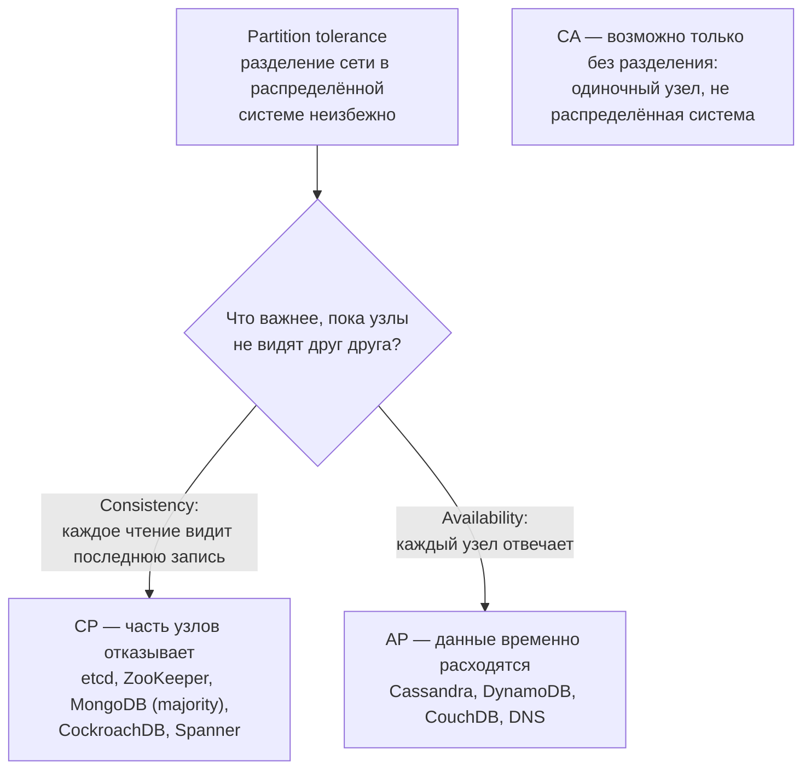
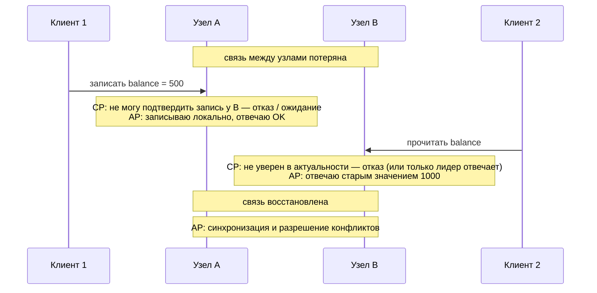
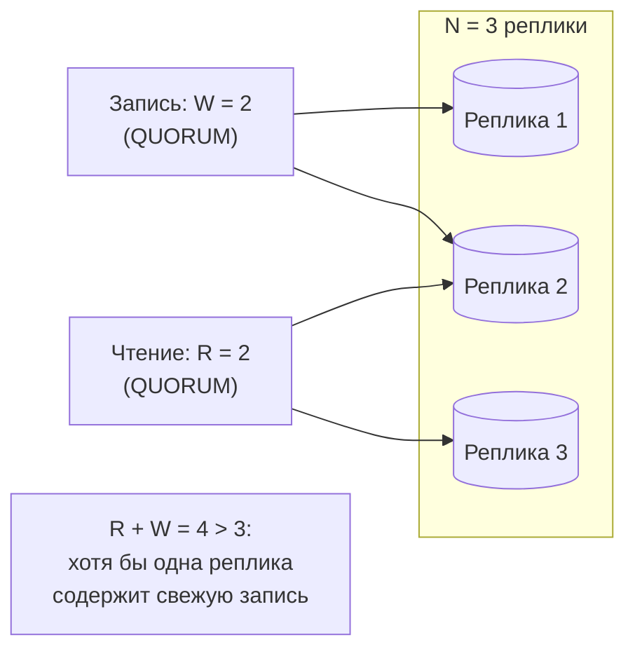
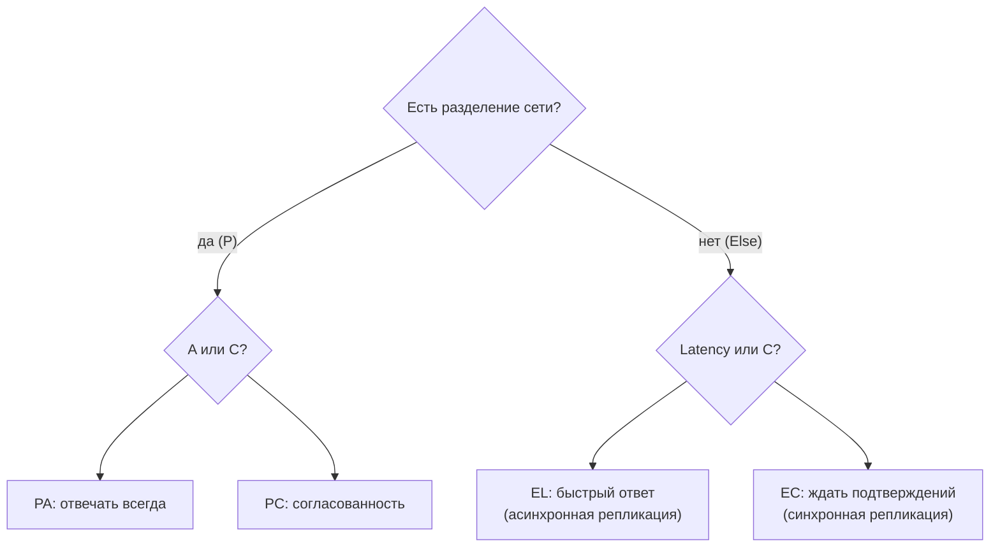

:::tldr
- **CAP**: распределённая система при **сетевом разделении** (Partition) должна выбрать между **Consistency** (все узлы отвечают актуальными данными или отказывают) и **Availability** (каждый работающий узел отвечает, пусть и устаревшими данными).
- «P» не выбирают — сеть в распределённой системе **обязательно** когда-нибудь разделится. Реальный выбор: **CP** или **AP** на время разделения.
- **CP**: при разделении часть узлов отказывает в обслуживании (etcd, ZooKeeper, HBase, MongoDB с majority, распределённые SQL). **AP**: все узлы отвечают, данные расходятся и потом **сходятся** (Cassandra, DynamoDB, Riak, CouchDB) — eventual consistency.
- **PACELC** уточняет: при разделении (P) — выбор A или C, **иначе (E)** — выбор между **Latency** и **Consistency**. Даже без сбоев строгая согласованность стоит задержки.
- «C» в CAP — это **линеаризуемость**, не «C» из ACID. Многие системы настраиваются: уровни согласованности на запрос (кворумы `ONE`/`QUORUM`/`ALL`).
:::

## Формулировка

Теорема (Брюер, 2000; доказательство Гилберта и Линч, 2002) говорит о **моменте разделения сети**. В нормальной работе система может быть и согласованной, и доступной.

## Что происходит при разделении

### CP-системы

Жертвуют доступностью: узлы, не попавшие в **большинство** (кворум), перестают принимать записи (или чтения). Пример — Raft/Paxos-консенсус: лидер должен получить подтверждение большинства.

- **etcd / Consul / ZooKeeper** — хранилища конфигурации и координации; согласованность важнее.
- **MongoDB** с `writeConcern: majority` и `readConcern: majority/linearizable`.
- **CockroachDB, YugabyteDB, Spanner** — распределённые SQL-базы с консенсусом.

### AP-системы

Отвечают всегда, но разные узлы могут вернуть разные данные. После восстановления связи — **синхронизация** и **разрешение конфликтов**:
- **Last write wins** (по времени) — просто, но теряет данные.
- **Векторные часы / версии** — обнаружение конфликтов, разрешение приложением.
- **CRDT** — структуры данных, которые сливаются автоматически без конфликтов (счётчики, множества).

## Настраиваемая согласованность: кворумы

В Cassandra и DynamoDB согласованность выбирается **на каждый запрос**. При N репликах, W — число подтверждений записи, R — число реплик для чтения:

| Уровень | Запись | Чтение | Свойства |
|---|---|---|---|
| `ONE` / `ONE` | 1 реплика | 1 реплика | Максимальная доступность и скорость, возможны устаревшие чтения |
| `QUORUM` / `QUORUM` | Большинство | Большинство | Сильная согласованность чтения своих записей, переживает отказ меньшинства |
| `ALL` | Все | — | Любой отказ узла — запись невозможна |

## PACELC

| Система | Классификация PACELC |
|---|---|
| Cassandra, DynamoDB (по умолчанию) | PA/EL — доступность и скорость |
| MongoDB (по умолчанию) | PA/EC* (зависит от настроек write/read concern) |
| etcd, ZooKeeper, Spanner, CockroachDB | PC/EC — согласованность всегда |
| PostgreSQL с асинхронной репликой | При failover возможна потеря данных (EL); с синхронной — EC |

## Где это важно .NET-разработчику

- **Чтение с реплик** (асинхронная репликация) — это уже eventual consistency: «прочитать свою запись» может не получиться.
- **Кэш** (Redis перед БД) — ещё одна копия данных; инвалидация — задача согласованности.
- **Микросервисы** со своими БД и событиями — система в целом AP-подобна: данные согласуются через события с задержкой.
- **Распределённые блокировки** (Redis) — при разделении сети могут выдать блокировку двум клиентам; для строгих гарантий нужны CP-системы (etcd) и fencing-токены.

## Вопросы на засыпку

:::qa Почему нельзя выбрать CA?
В распределённой системе нельзя гарантировать отсутствие сетевых разделений — это внешнее событие. Отказаться от P значит построить систему, которая при разделении ведёт себя непредсказуемо. «CA» честно только для одного узла, который не является распределённой системой.
:::

:::qa Чем C в CAP отличается от C в ACID?
ACID-consistency — соблюдение ограничений целостности внутри одной БД. CAP-consistency — линеаризуемость: любое чтение возвращает результат последней завершённой записи, как если бы копия данных была одна.
:::

:::qa Является ли реляционная БД CP или AP?
Одиночный сервер не распределён — CAP к нему в чистом виде не применяется. Кластер с синхронной репликацией и автоматическим failover ведёт себя как CP (при потере кворума запись недоступна), с асинхронными репликами для чтения — чтения AP-подобны (могут быть устаревшими).
:::

:::qa Что такое eventual consistency и какие есть более сильные модели?
Eventual — если записи прекратятся, все реплики со временем придут к одному значению; гарантий «когда» нет. Сильнее: read-your-writes, monotonic reads, causal consistency (причинно связанные операции видны в правильном порядке), linearizability (строгая).
:::

## Итог

CAP напоминает: при разделении сети распределённая система выбирает между согласованностью и доступностью, а PACELC — что и без сбоев согласованность стоит задержки. Многие хранилища позволяют настраивать этот выбор на уровне запроса. Для разработчика важно понимать, где в его системе живут копии данных (реплики, кэши, сервисы) и какие гарантии они дают.
