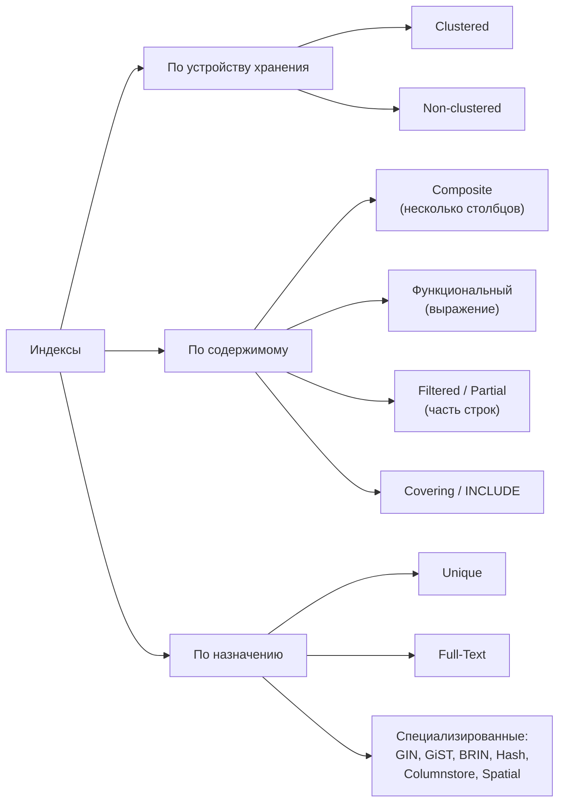
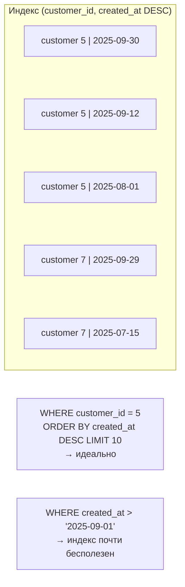

:::tldr
- **Clustered** — определяет физический порядок строк, один на таблицу (SQL Server, InnoDB). **Non-clustered** — отдельная структура со ссылками на строки, много на таблицу.
- **Unique** — гарантирует уникальность значений (бизнес-правило на уровне БД) и ускоряет поиск. PK — частный случай.
- **Composite (составной)** — по нескольким столбцам; работает по **левому префиксу**, порядок столбцов критичен.
- **Filtered (SQL Server) / Partial (PostgreSQL)** — индекс только по строкам, удовлетворяющим условию (`WHERE status = 'pending'`, `WHERE NOT is_deleted`). Меньше, быстрее, позволяет «условную уникальность».
- **Covering / INCLUDE** — содержит все столбцы запроса, избавляет от обращения к таблице.
- **Функциональный / по выражению** — по результату выражения: `lower(email)`, `(data->>'sku')`.
- **Full-Text** — поиск по словам с морфологией и ранжированием (`tsvector` + GIN в PostgreSQL, Full-Text Index в SQL Server). Специализированные структуры PostgreSQL (GIN, GiST, BRIN, Hash) — в отдельном вопросе.
:::

## Карта видов индексов



## Unique

```sql
-- Уникальный email пользователя без учёта регистра
CREATE UNIQUE INDEX ux_users_email ON users (lower(email));

-- Уникальность комбинации
ALTER TABLE order_items ADD CONSTRAINT uq_order_product UNIQUE (order_id, product_id);
```

- `UNIQUE constraint` и `UNIQUE INDEX` почти эквивалентны; ограничение — декларация намерения (и может быть целью FK), индекс даёт больше опций (выражения, фильтры).
- `NULL` обычно **не** считаются равными: в столбце с уникальным индексом может быть много `NULL` (PostgreSQL 15+: `NULLS NOT DISTINCT` меняет это; SQL Server допускает только один `NULL` в unique-индексе — используйте filtered index).
- Уникальный индекс — **последний рубеж** против гонок: проверка «есть ли такой email» в коде не защитит от двух одновременных регистраций, а индекс — защитит.

```csharp Обработка нарушения уникальности в .NET
try { await db.SaveChangesAsync(ct); }
catch (DbUpdateException ex) when (ex.InnerException is PostgresException { SqlState: PostgresErrorCodes.UniqueViolation })
{
    return Results.Conflict(new ProblemDetails { Title = "Email уже зарегистрирован" });
}
```

## Composite (составной)

```sql
CREATE INDEX ix_orders_customer_created ON orders (customer_id, created_at DESC);
```



Правила:
1. **Равенства — первыми**, диапазоны и сортировка — после.
2. Индекс `(a, b)` обслуживает запросы по `a` и по `a, b`, но не по одному `b`.
3. Порядок сортировки в индексе (`DESC`) важен для `ORDER BY` по нескольким столбцам в разных направлениях.
4. Не создавайте `(a)`, если есть `(a, b)` — первый избыточен.

## Filtered / Partial

```sql
-- PostgreSQL: индекс только по «живым» задачам очереди — крошечный, хотя таблица огромная
CREATE INDEX ix_jobs_pending ON jobs (created_at) WHERE status = 'pending';

-- Условная уникальность: один активный email, удалённые не мешают
CREATE UNIQUE INDEX ux_users_email_active ON users (email) WHERE deleted_at IS NULL;

-- SQL Server: filtered index
CREATE UNIQUE INDEX ux_users_phone ON users (phone) WHERE phone IS NOT NULL;
```

Запрос должен содержать **то же условие** (или более строгое), чтобы оптимизатор мог использовать частичный индекс. В SQL Server есть нюансы с параметризованными запросами (условие фильтра должно быть видно на этапе компиляции).

```csharp EF Core
modelBuilder.Entity<User>().HasIndex(u => u.Email).IsUnique().HasFilter("deleted_at IS NULL");
```

## Функциональные индексы

```sql
CREATE INDEX ix_users_lower_email ON users (lower(email));
SELECT * FROM users WHERE lower(email) = lower(@email);      -- выражение должно совпадать

CREATE INDEX ix_orders_day ON orders ((created_at::date));    -- PostgreSQL
CREATE INDEX ix_events_type ON events ((payload->>'type'));   -- поле JSONB
```

В SQL Server аналог — **вычисляемый столбец** (`PERSISTED`) + индекс по нему.

## Full-Text

```sql
-- PostgreSQL
ALTER TABLE products ADD COLUMN search tsvector
    GENERATED ALWAYS AS (to_tsvector('russian', coalesce(name, '') || ' ' || coalesce(description, ''))) STORED;
CREATE INDEX ix_products_search ON products USING GIN (search);

SELECT id, name, ts_rank(search, q) AS rank
FROM products, plainto_tsquery('russian', 'беспроводные наушники') q
WHERE search @@ q
ORDER BY rank DESC
LIMIT 20;
```

- Разбиение на лексемы, стемминг («наушники» найдёт «наушников»), стоп-слова, ранжирование.
- `LIKE '%слово%'` не использует B-Tree и не знает морфологии.
- Для сложного поиска (опечатки, синонимы, фасеты, релевантность) — Elasticsearch/OpenSearch; для поиска подстрок — триграммы (`pg_trgm`).

```csharp EF Core + Npgsql
var found = await db.Products
    .Where(p => p.Search.Matches(EF.Functions.PlainToTsQuery("russian", term)))
    .OrderByDescending(p => p.Search.Rank(EF.Functions.PlainToTsQuery("russian", term)))
    .Take(20).ToListAsync(ct);
```

## Прочие

| Индекс | СУБД | Для чего |
|---|---|---|
| **Columnstore** | SQL Server | Аналитика: колоночное хранение, сжатие, пакетная обработка |
| **Spatial** / GiST | SQL Server / PostgreSQL (PostGIS) | Геоданные: «ближайшие магазины» |
| **Hash** | PostgreSQL, Memory-optimized SQL Server | Только равенство |
| **BRIN** | PostgreSQL | Огромные таблицы с естественным порядком (логи по времени) |
| **GIN** | PostgreSQL | JSONB, массивы, полнотекстовый поиск, триграммы |

## Сводная таблица

| Вид | Ускоряет | Особенности |
|---|---|---|
| Clustered | Диапазоны по ключу, чтение всей строки | Один на таблицу; выбор ключа влияет на всё |
| Non-clustered | Поиск по столбцу | Lookup в таблицу за остальными столбцами |
| Unique | Поиск + целостность | Защита от дублей даже при гонках |
| Composite | Мульти-условия, сортировка | Левый префикс |
| Filtered / Partial | Запросы к подмножеству | Меньше размер; условие в запросе должно совпадать |
| Covering | Index Only Scan | Больше размер индекса |
| Функциональный | Условия с выражениями | Выражение в запросе должно совпадать |
| Full-Text | Поиск по словам | Морфология, ранжирование |

## Вопросы на засыпку

:::qa Почему уникальная проверка в коде не заменяет уникальный индекс?
Между «проверил, что email свободен» и «вставил» другой запрос может вставить тот же email (race condition). Только ограничение БД атомарно гарантирует уникальность. Проверку в коде оставляют для дружелюбного сообщения, а индекс — для гарантии.
:::

:::qa Когда частичный индекс лучше обычного?
Когда запросы почти всегда касаются небольшой доли строк: активные задачи, неоплаченные заказы, неудалённые записи. Индекс в разы меньше, чаще целиком в памяти, дешевле в обслуживании при изменениях строк вне условия.
:::

:::qa Сколько индексов на таблицу — нормально?
Нет универсального числа. Для OLTP-таблиц с интенсивной записью — минимально необходимое (обычно до 5–7), каждый индекс оправдан реальным запросом. Для таблиц, которые в основном читаются, — больше. Регулярно проверяйте неиспользуемые индексы.
:::

:::qa Индексирует ли PostgreSQL NULL-значения?
Да, B-Tree в PostgreSQL хранит NULL, поэтому `WHERE x IS NULL` может использовать индекс. Можно исключить NULL частичным индексом `WHERE x IS NOT NULL`, если они не нужны в поиске.
:::

## Итог

Правильный вид индекса — под конкретный запрос: составной с правильным порядком столбцов, частичный для подмножеств, функциональный для выражений, покрывающий для частых чтений, уникальный — для гарантии целостности, полнотекстовый — для поиска по словам. Каждый индекс стоит места и замедляет запись, поэтому создаются они по данным о реальной нагрузке.
