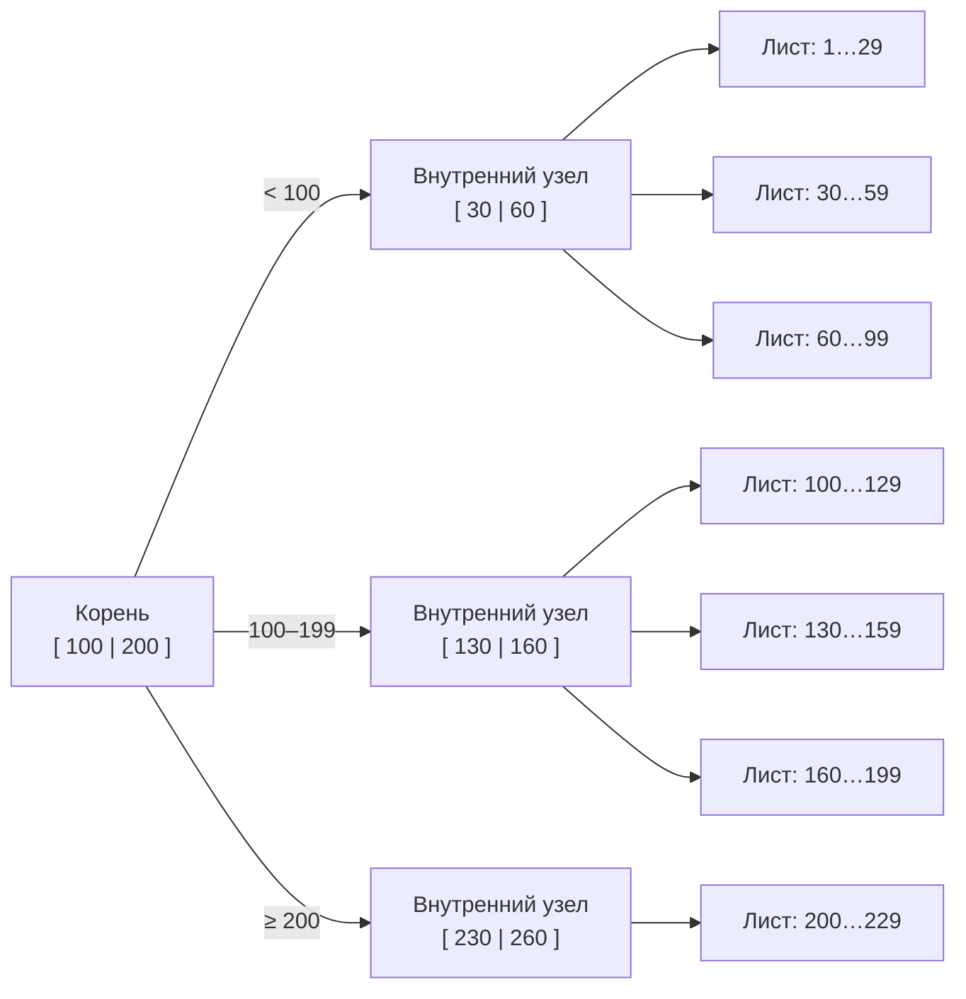
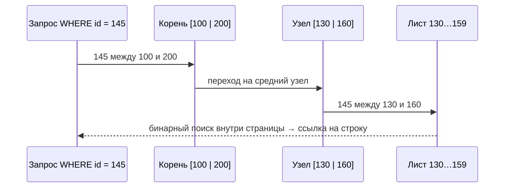
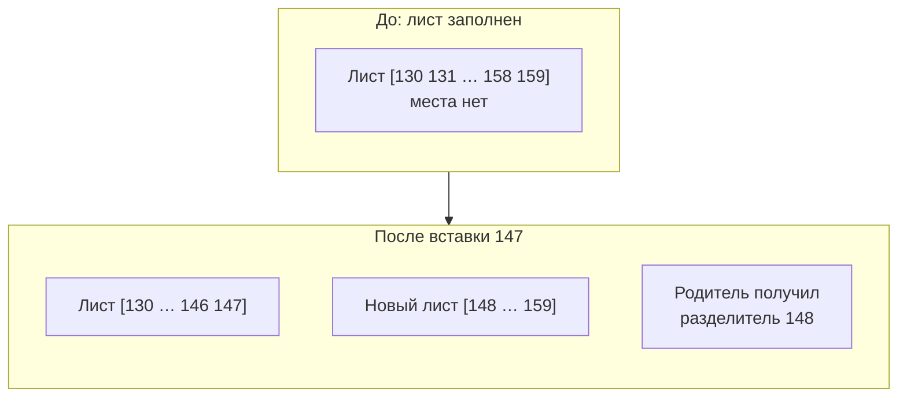

:::tldr
- В СУБД используется **B+-дерево**: сбалансированное дерево из **страниц** (обычно 8 КБ), где все значения хранятся в **листьях**, а внутренние узлы содержат только ключи-разделители и ссылки вниз.
- Каждая страница вмещает **сотни** ключей (высокий коэффициент ветвления), поэтому дерево **очень низкое**: 3–4 уровня для сотен миллионов строк. Поиск = O(log n) чтений страниц.
- Листья связаны **двусвязным списком** — диапазонные запросы (`BETWEEN`, `ORDER BY`, `>`): найти начало и идти по листьям.
- Вставка в заполненную страницу вызывает **разделение (page split)**: половина ключей переносится в новую страницу, в родителя добавляется разделитель. Случайные ключи (UUID v4) → частые split-ы и фрагментация; возрастающие → вставка в конец.
- Дерево всегда **сбалансировано**: растёт вверх (разделение корня), все листья на одной глубине.
:::

## Структура

Все листья находятся на одной глубине и связаны **двусвязным списком** (1…29 ↔ 30…59 ↔ 60…99 ↔ …) — это позволяет эффективно читать диапазоны.

| Уровень | Что хранит |
|---|---|
| **Корень** | Ключи-разделители и ссылки на страницы следующего уровня |
| **Внутренние узлы** | То же — «оглавление» для спуска |
| **Листья** | Ключи индекса + ссылка на строку (TID/RID или ключ кластерного индекса), а в кластерном индексе — сама строка; указатели на соседние листья |

## Почему дерево такое низкое

Размер страницы 8 КБ. Ключ `bigint` (8 байт) + ссылка на дочернюю страницу (≈6–8 байт) + служебные данные ≈ 20 байт → **~400 ключей** на внутренней странице.

| Уровни | Сколько листьев можно адресовать | При ~200 строк на лист |
|---|---|---|
| 1 (только корень-лист) | 1 | 200 строк |
| 2 | 400 | 80 000 строк |
| 3 | 160 000 | 32 млн строк |
| 4 | 64 млн | **12,8 млрд строк** |

Корень и верхние уровни почти всегда в кэше (buffer pool), поэтому поиск по индексу в таблице на миллиард строк — это 1–2 чтения с диска.

## Поиск

Внутри страницы ключи отсортированы — используется бинарный поиск. Итого: высота дерева × (чтение страницы + бинарный поиск).

### Диапазонный запрос

`WHERE id BETWEEN 145 AND 175`: найти лист со 145, затем идти по связному списку листьев, пока ключ ≤ 175. Поэтому B-Tree прекрасно подходит для `<`, `>`, `BETWEEN`, `ORDER BY`, `LIKE 'префикс%'` — в отличие от хэш-индекса.

## Вставка и разделение страниц

1. Найти целевой лист.
2. Есть место — вставить в отсортированную позицию.
3. Нет места — **разделить**: выделить новую страницу, перенести ~половину ключей, добавить разделитель в родителя. Если родитель тоже полон — разделение поднимается выше; при разделении корня дерево **растёт на уровень**.

### Последствия для выбора ключа

| Ключ | Что происходит при вставке |
|---|---|
| Возрастающий (`IDENTITY`, sequence, UUID v7, время) | Всегда в последний лист; split только «справа», страницы заполнены плотно |
| Случайный (UUID v4, хэш) | В случайные листья по всему дереву; частые split-ы, страницы заполнены на ~50–70%, индекс больше, хуже кэш |

Это одна из главных причин рекомендации **последовательных идентификаторов** (`Guid.CreateVersion7()` в .NET 9+, `NEWSEQUENTIALID()` в SQL Server).

### Fill factor

Параметр, сколько процентов страницы заполнять при создании/перестроении индекса (`FILLFACTOR = 90`). Запас места снижает число split-ов для индексов с вставками «в середину» и обновлениями, но увеличивает размер индекса.

## Удаление и фрагментация

- Удалённые ключи оставляют пустоты; страницы редко сливаются автоматически.
- **Фрагментация**: логический порядок страниц не совпадает с физическим, страницы заполнены неплотно → больше чтений.
- Обслуживание: `REINDEX` / `REINDEX CONCURRENTLY` (PostgreSQL), `ALTER INDEX ... REORGANIZE / REBUILD` (SQL Server). В PostgreSQL ещё и MVCC: обновление строки создаёт новую версию и новую запись в индексе (если не сработала HOT-оптимизация) — VACUUM убирает мёртвые записи.

## B-Tree в разных СУБД

| СУБД | Особенности |
|---|---|
| PostgreSQL | Таблица — heap, все индексы ссылаются на физический адрес строки (ctid); дедупликация одинаковых ключей (13+); HOT-обновления не трогают индексы, если не менялись индексированные столбцы |
| SQL Server | Кластерный индекс — B+-дерево со строками в листьях; некластерные ссылаются на ключ кластерного индекса |
| MySQL InnoDB | Таблица всегда кластеризована по PK; вторичные индексы содержат значение PK (поэтому длинный PK раздувает все индексы) |

## Сложность операций

| Операция | Сложность | Примечание |
|---|---|---|
| Поиск по равенству | O(log n) | На практике 3–4 чтения страниц |
| Диапазон из k строк | O(log n + k) | Спуск + проход по листьям |
| Вставка | O(log n) | + иногда split |
| Удаление | O(log n) | Страницы не всегда сливаются |
| Полный обход в порядке ключа | O(n) | По листьям, без сортировки |

## Вопросы на засыпку

:::qa Чем B-Tree отличается от B+-дерева?
В классическом B-дереве значения (данные) хранятся во всех узлах. В B+-дереве — только в листьях, а внутренние узлы содержат лишь разделители. Поэтому внутренние узлы вмещают больше ключей (дерево ниже), а листья, связанные списком, позволяют эффективно сканировать диапазоны. СУБД используют B+-деревья, хотя по привычке называют их B-Tree.
:::

:::qa Почему не бинарное дерево поиска?
У бинарного дерева 2 потомка на узел: для миллиарда ключей высота ~30, то есть 30 случайных чтений с диска. B+-дерево с сотнями потомков на узел — высота 3–4. Для дисков, где чтение страницы — дорогая операция, это решающая разница. Плюс B+-дерево всегда сбалансировано.
:::

:::qa Почему индекс по столбцу с низкой селективностью бесполезен?
Если условие выбирает 30% строк, придётся пройти большой диапазон листьев и сделать сотни тысяч случайных обращений к таблице. Последовательное сканирование всей таблицы оказывается дешевле, и оптимизатор выбирает его.
:::

:::qa Что такое индекс с обратным порядком байтов ключа (reverse key)?
Приём (Oracle) для борьбы с «горячим» последним листом при возрастающих ключах в высококонкурентной вставке: ключ хранится с переставленными байтами и распределяется по дереву. Ценой — невозможность эффективных диапазонных запросов.
:::

## Итог

B+-дерево — сбалансированное дерево страниц с огромным коэффициентом ветвления: поиск за 3–4 чтения даже на миллиардах строк, эффективные диапазоны благодаря связанным листьям. Вставки могут вызывать разделение страниц, поэтому возрастающие ключи дружелюбнее случайных, а индексы требуют периодического обслуживания.
