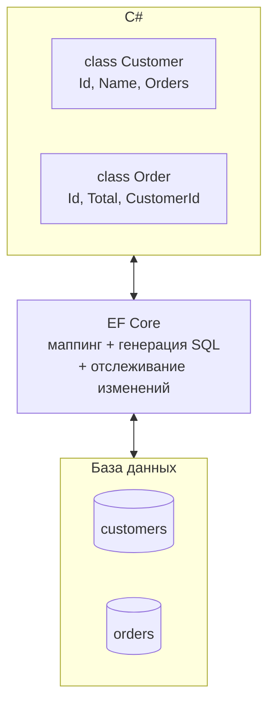
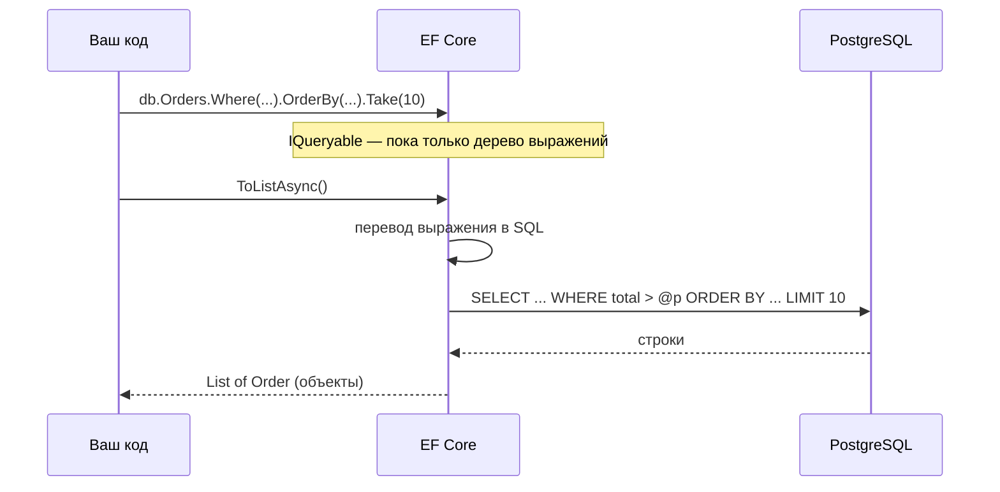
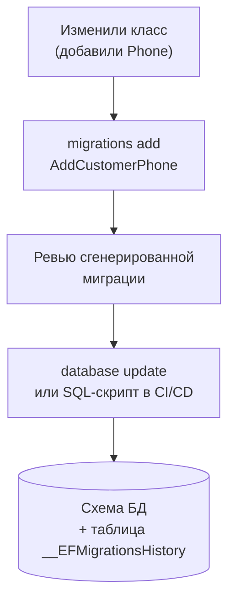

:::tldr
- **ORM** (Object-Relational Mapping) — библиотека, которая сопоставляет **классы** C# с **таблицами** БД: вы работаете с объектами и LINQ, а ORM генерирует SQL и заполняет объекты результатами.
- **EF Core** — основная ORM в .NET. Ключевые понятия: **сущность** (класс, отображаемый на таблицу), **`DbContext`** (сессия работы с БД, отслеживает изменения), **`DbSet<T>`** (таблица, к которой пишутся LINQ-запросы), **провайдер** (PostgreSQL, SQL Server, SQLite).
- Чтение: LINQ к `DbSet` → EF Core переводит в SQL и выполняет при `ToListAsync`/`FirstOrDefaultAsync`. Запись: `Add`/изменение свойств/`Remove` → **`SaveChangesAsync()`** отправляет INSERT/UPDATE/DELETE одной транзакцией.
- **Миграции** — версионирование схемы БД из кода: `dotnet ef migrations add Name` → `dotnet ef database update`.
- Альтернативы: **Dapper** (микро-ORM: свой SQL, быстрый маппинг результатов), чистый ADO.NET. ORM ускоряет разработку, но нужно понимать, **какой SQL** она генерирует.
:::

## Идея ORM



Без ORM приходится писать SQL вручную, открывать соединение, читать `DataReader` и переносить поля в объекты. ORM берёт эту рутину на себя.

## Модель и DbContext

```csharp Сущности
public class Customer
{
    public int Id { get; set; }                          // по соглашению Id — первичный ключ
    public required string Name { get; set; }
    public required string Email { get; set; }
    public List<Order> Orders { get; set; } = [];        // навигационное свойство: один-ко-многим
}

public class Order
{
    public int Id { get; set; }
    public decimal Total { get; set; }
    public DateTime CreatedAt { get; set; }
    public int CustomerId { get; set; }                  // внешний ключ
    public Customer Customer { get; set; } = null!;
}
```

```csharp DbContext
public class ShopDbContext(DbContextOptions<ShopDbContext> options) : DbContext(options)
{
    public DbSet<Customer> Customers => Set<Customer>();
    public DbSet<Order> Orders => Set<Order>();

    protected override void OnModelCreating(ModelBuilder b)
    {
        b.Entity<Customer>().HasIndex(c => c.Email).IsUnique();
        b.Entity<Order>().Property(o => o.Total).HasPrecision(12, 2);
    }
}
```

```csharp Регистрация в ASP.NET Core
builder.Services.AddDbContext<ShopDbContext>(o =>
    o.UseNpgsql(builder.Configuration.GetConnectionString("Shop")));   // DbContext — Scoped: один на HTTP-запрос
```

## Чтение данных

```csharp
// SELECT ... FROM orders WHERE total > @p ORDER BY created_at DESC LIMIT 10
var bigOrders = await db.Orders
    .Where(o => o.Total > 1_000_000m)
    .OrderByDescending(o => o.CreatedAt)
    .Take(10)
    .ToListAsync(ct);

var customer = await db.Customers.FirstOrDefaultAsync(c => c.Email == email, ct);

// Связанные данные одним запросом (JOIN)
var withOrders = await db.Customers
    .Include(c => c.Orders)
    .FirstOrDefaultAsync(c => c.Id == id, ct);

// Только нужные поля — проекция в DTO, без отслеживания
var list = await db.Orders
    .Select(o => new OrderListItem(o.Id, o.Customer.Name, o.Total))
    .ToListAsync(ct);
```



## Запись данных

```csharp
// INSERT
var customer = new Customer { Name = "Анна", Email = "anna@mail.uz" };
db.Customers.Add(customer);
await db.SaveChangesAsync(ct);          // после сохранения customer.Id заполнен

// UPDATE — достаточно изменить загруженный объект
var order = await db.Orders.FindAsync([orderId], ct);
order!.Total = 950_000m;
await db.SaveChangesAsync(ct);          // EF сам увидит изменение и сгенерирует UPDATE

// DELETE
db.Orders.Remove(order);
await db.SaveChangesAsync(ct);

// Массовые операции без загрузки объектов (EF Core 7+)
await db.Orders.Where(o => o.CreatedAt < cutoff).ExecuteDeleteAsync(ct);
```

`DbContext` **отслеживает** загруженные объекты (Change Tracker): при `SaveChanges` он сравнивает текущие значения с исходными и формирует нужные команды — все в одной транзакции.

## Миграции

```bash
dotnet tool install --global dotnet-ef
dotnet ef migrations add InitialCreate          # C#-файл с описанием изменений схемы
dotnet ef database update                       # применить к БД
dotnet ef migrations add AddCustomerPhone       # после изменения модели
dotnet ef migrations script --idempotent -o migrate.sql   # SQL-скрипт для продакшена
```



## EF Core, Dapper или ADO.NET

| | EF Core | Dapper | ADO.NET |
|---|---|---|---|
| SQL пишет | EF Core (из LINQ) | Разработчик | Разработчик |
| Маппинг в объекты | Автоматически | Автоматически | Вручную |
| Отслеживание изменений | Да | Нет | Нет |
| Миграции схемы | Да | Нет | Нет |
| Скорость разработки | Высокая | Средняя | Низкая |
| Контроль над SQL | Средний | Полный | Полный |
| Когда | Большинство CRUD и бизнес-логики | Сложные отчёты, критичные по скорости запросы | Особые случаи, низкоуровневый код |

Часто их комбинируют: EF Core для основной логики, Dapper или `FromSql` — для тяжёлых отчётов.

## Типичные ошибки новичков

:::warning Частые ошибки
- Забыть `await db.SaveChangesAsync()` — изменения не попадут в БД.
- `ToList()` до `Where`: вся таблица загружается в память, фильтр выполняется в C#.
- Обращение к навигационному свойству в цикле — проблема **N+1** запросов.
- Регистрация `DbContext` как Singleton или использование одного контекста из нескольких потоков — он не потокобезопасен.
- Возврат сущностей EF из API напрямую — циклические ссылки в JSON и утечка лишних полей. Используйте DTO.
:::

## Вопросы на засыпку

:::qa Почему DbContext регистрируют как Scoped?
`DbContext` — лёгкая короткоживущая «единица работы»: он накапливает отслеживаемые объекты и не потокобезопасен. Один контекст на HTTP-запрос изолирует запросы друг от друга и освобождает память после ответа. Singleton-контекст разрастался бы и ломался при параллельных запросах.
:::

:::qa Что такое навигационное свойство?
Свойство сущности, указывающее на связанную сущность или коллекцию (`Order.Customer`, `Customer.Orders`). По ним EF Core строит JOIN-ы в запросах (`Include`, обращения в `Select`) и понимает связи при сохранении.
:::

:::qa Где выполнится фильтр: в базе или в памяти?
Если фильтр применён к `IQueryable` (до `ToList`/`AsEnumerable`), EF Core переведёт его в SQL — выполнится в базе. После материализации (`ToList()`) дальнейшие операции LINQ выполняются в памяти над уже загруженными объектами.
:::

:::qa Зачем миграции, если можно менять таблицы вручную?
Миграции версионируют схему вместе с кодом: каждое изменение воспроизводимо, проходит ревью, одинаково применяется на машинах разработчиков, в тестах и продакшене. Ручные изменения приводят к расхождению схем между окружениями.
:::

## Итог

ORM связывает объекты C# и таблицы БД; в .NET это прежде всего EF Core: сущности описывают таблицы, `DbContext` — сессию работы, `DbSet` — точку входа для LINQ-запросов, которые переводятся в SQL. Изменения сохраняются через `SaveChangesAsync`, схема развивается миграциями. Используйте проекции и DTO, не загружайте лишнего и помните, какой SQL генерируется. Подробности — в следующих вопросах раздела.
