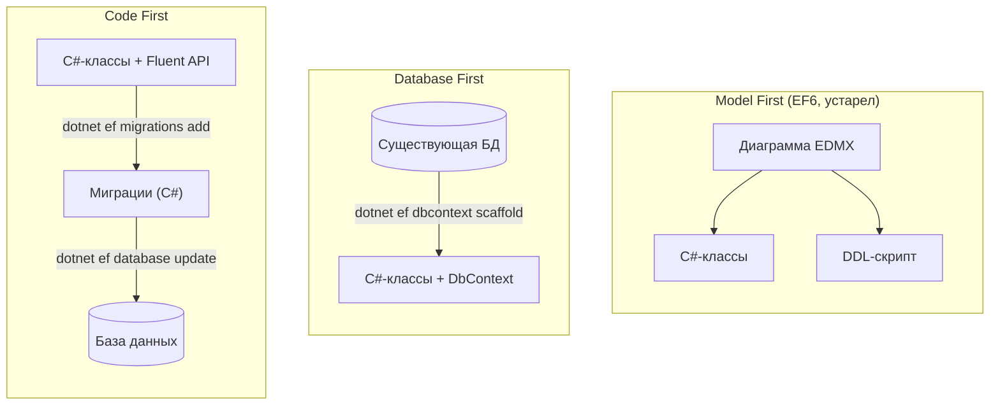
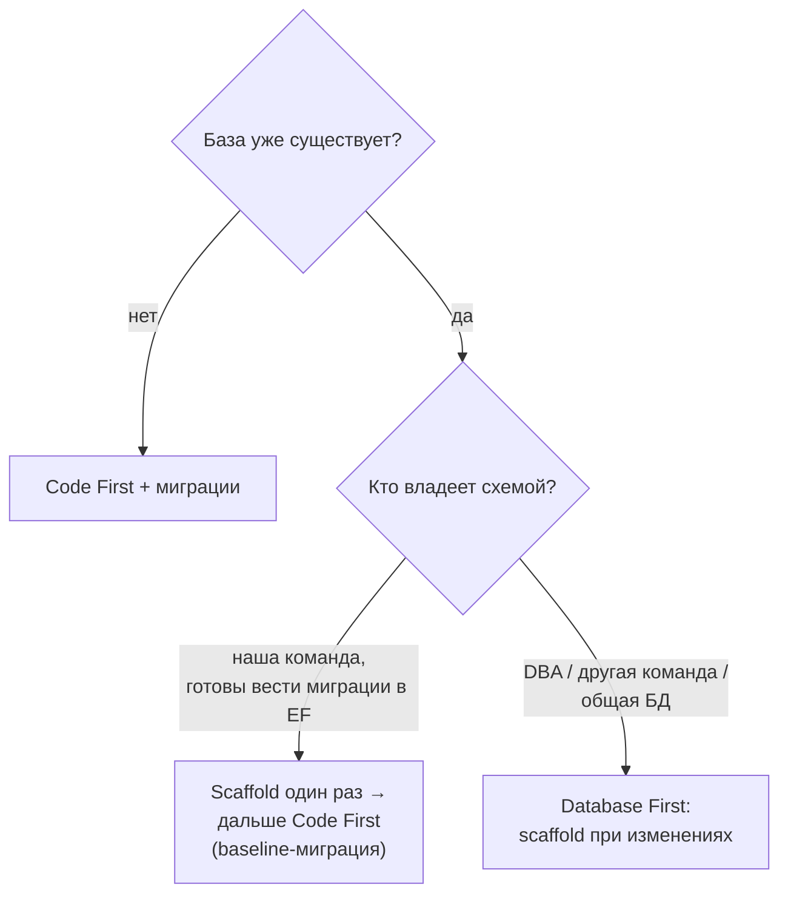

:::tldr
- **Code First** — источник истины — **C#-классы и конфигурация**. Схема БД генерируется и эволюционирует через **миграции**. Стандарт для новых проектов на EF Core.
- **Database First** — источник истины — **существующая БД**. Классы генерируются командой `dotnet ef dbcontext scaffold` (reverse engineering). Для legacy-баз и баз, которыми владеет DBA/другая команда.
- **Model First** — модель рисуется в визуальном дизайнере (EDMX), из неё генерируются и БД, и код. Был в EF6, **в EF Core не поддерживается**.
- В EF Core оба подхода используют одну и ту же модель (`OnModelCreating`) — разница в том, **откуда** она берётся и **кто владеет** схемой.
- Гибрид: начать с Database First (scaffold один раз), затем вести изменения как Code First с миграциями.
:::

## Направление синхронизации



## Code First

```csharp Модель в коде
public sealed class Product
{
    public int Id { get; private set; }
    public string Name { get; private set; } = "";
    public decimal Price { get; private set; }
    public int CategoryId { get; private set; }
    public Category Category { get; private set; } = null!;
}

public sealed class ProductConfiguration : IEntityTypeConfiguration<Product>
{
    public void Configure(EntityTypeBuilder<Product> b)
    {
        b.ToTable("products");
        b.Property(p => p.Name).HasMaxLength(200).IsRequired();
        b.Property(p => p.Price).HasPrecision(18, 2);
        b.HasIndex(p => p.Name);
        b.HasOne(p => p.Category).WithMany(c => c.Products).HasForeignKey(p => p.CategoryId);
    }
}
```

```bash Рабочий цикл
dotnet ef migrations add AddProductIndex      # сравнить модель со снапшотом, сгенерировать миграцию
dotnet ef migrations script --idempotent      # SQL-скрипт для ревью и деплоя
dotnet ef database update                     # применить к локальной БД
```

**Плюсы:** модель и схема версионируются вместе с кодом в git, ревьюятся в pull request, одинаково разворачиваются на всех окружениях; удобно для DDD (богатая доменная модель, value objects, owned types).

**Минусы:** нужна дисциплина с миграциями; сложные объекты БД (триггеры, процедуры, партиции) описываются через raw SQL в миграциях; DBA может не понравиться, что схему «генерирует ORM».

## Database First

```bash
dotnet ef dbcontext scaffold "Host=db;Database=erp;Username=reader;Password=***" Npgsql.EntityFrameworkCore.PostgreSQL \
  --output-dir Entities --context-dir Data --context ErpDbContext \
  --table public.orders --table public.customers \
  --no-onconfiguring --use-database-names
```

Генерирует partial-классы сущностей и `DbContext` с Fluent API. При изменении схемы — повторный scaffold с `--force` (ручные правки в сгенерированных файлах **затрутся** — расширяйте через `partial`-классы).

**Плюсы:** работа с уже существующей БД; схемой управляют DBA и отдельные инструменты (Flyway, Liquibase, SSDT, DbUp); видно реальную структуру.

**Минусы:** модель «анемичная» и повторяет таблицы; сложнее применять DDD; нужно регенерировать код при изменениях схемы.

:::tip EF Core Power Tools
Расширение для Visual Studio с графическим интерфейсом scaffold-а, сохранением настроек (`efpt.config.json`), выбором таблиц и шаблонами T4/Handlebars для кастомизации сгенерированного кода.
:::

## Сравнение

| | Code First | Database First | Model First |
|---|---|---|---|
| Источник истины | Код | База данных | Визуальная модель |
| Изменение схемы | Миграции EF | Скрипты/инструменты DBA + re-scaffold | Дизайнер |
| Поддержка в EF Core | Да | Да (scaffold) | **Нет** |
| Новый проект | Идеально | Если БД проектируется отдельно | — |
| Legacy БД | Сложно (нужна baseline-миграция) | Идеально | — |
| DDD, богатая модель | Удобно | Сложнее | — |

## Как выбрать



### Переход Database First → Code First

1. Scaffold текущей схемы.
2. `dotnet ef migrations add Baseline`.
3. Очистить методы `Up`/`Down` миграции (схема уже существует) или применить её только к новым окружениям, а в существующей БД вручную вставить запись в `__EFMigrationsHistory`.
4. Дальше — обычный Code First.

## Вопросы на засыпку

:::qa Можно ли в Code First использовать хранимые процедуры, представления, триггеры?
Да: создавать их через `migrationBuilder.Sql("CREATE VIEW ...")` в миграциях, маппить представления на сущности без ключа (`ToView("...")`, `HasNoKey()`), вызывать процедуры через `FromSql`/`ExecuteSql`. EF не отслеживает их изменения автоматически — это ручная работа в миграциях.
:::

:::qa Что делать, если в Database First нужно добавить в сущность вычисляемое свойство?
Сгенерированные классы — `partial`. Создайте отдельный файл с `partial class Order` и добавьте свойство (с `[NotMapped]` или конфигурацией `Ignore`) — при повторном scaffold оно не пропадёт.
:::

:::qa Можно ли использовать EF Core без миграций при Code First?
`db.Database.EnsureCreated()` создаёт схему по модели без миграций — удобно для тестов и прототипов, но несовместимо с последующими миграциями и не умеет изменять существующую схему.
:::

:::qa Почему Model First исчез?
EDMX-дизайнер был тяжёлым, плохо работал с системами контроля версий (огромный XML с конфликтами при слиянии) и с кроссплатформенностью. EF Core сделал ставку на модель в коде; для визуализации есть EF Core Power Tools (диаграммы DGML из модели).
:::

## Итог

Code First — выбор по умолчанию для новых проектов: модель в коде, схема в миграциях, всё в git. Database First — для существующих баз и схем, которыми управляют не разработчики приложения. Model First остался в EF6. Часто оптимален гибрид: scaffold один раз, дальше — Code First.
