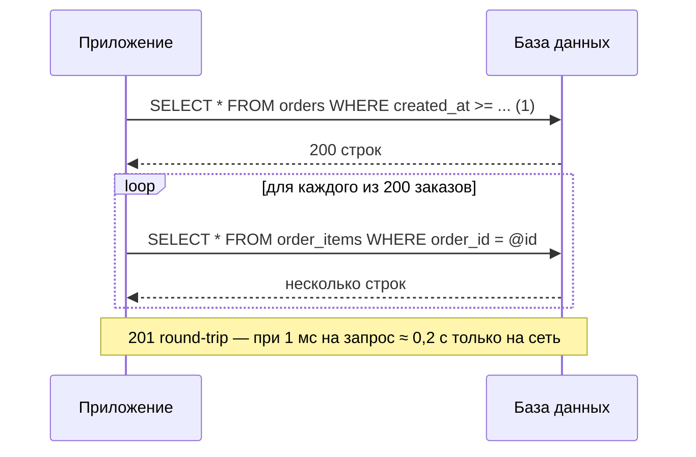
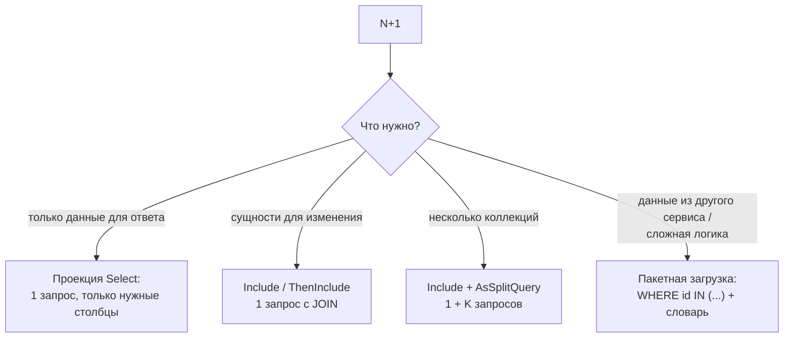

:::tldr
- **N+1**: один запрос загружает список из N записей, затем для **каждой** записи выполняется ещё по запросу за связанными данными. Итого N+1 запросов вместо 1–2.
- Причины в EF Core: **lazy loading** в цикле, **явные запросы внутри цикла** (`await db.Items.Where(i => i.OrderId == o.Id)...` для каждого заказа), вызов репозитория/сервиса в цикле, сериализация графа с ленивыми навигациями.
- Обнаружение: логирование SQL (`LogTo`, категория `Microsoft.EntityFrameworkCore.Database.Command`), MiniProfiler, OpenTelemetry-трейсы (десятки одинаковых span-ов БД), счётчики запросов в тестах.
- Решения: **`Include`** (JOIN), **проекция** в `Select`, **пакетная загрузка** (`WHERE id IN (...)` + словарь), **`AsSplitQuery`** для нескольких коллекций.
- Каждый лишний запрос — это сетевой round-trip (0,5–2 мс и больше): 1000 запросов = секунды ожидания.
:::

## Как выглядит проблема

```csharp
var orders = await db.Orders.Where(o => o.CreatedAt >= today).ToListAsync();   // 1 запрос → 200 заказов

foreach (var order in orders)
{
    // Lazy loading ИЛИ явный запрос в цикле — +1 запрос на каждой итерации
    var items = await db.OrderItems.Where(i => i.OrderId == order.Id).ToListAsync();
    Console.WriteLine($"{order.Id}: {items.Count} позиций");
}
// Итого: 201 запрос
```



Проблема коварна: на локальной машине с 10 записями и БД на localhost она незаметна. В продакшене с тысячами записей и БД в другой зоне — страница грузится секунды, а БД загружена однотипными запросами.

## Как обнаружить

### 1. Логирование SQL

```csharp
builder.Services.AddDbContext<ShopDbContext>(o => o
    .UseNpgsql(conn)
    .LogTo(Console.WriteLine, [DbLoggerCategory.Database.Command.Name], LogLevel.Information)
    .EnableSensitiveDataLogging()          // значения параметров — ТОЛЬКО в разработке
    .EnableDetailedErrors());
```

Признак — повторяющиеся одинаковые запросы с разными параметрами.

### 2. Трассировка

В Jaeger/Tempo/Aspire Dashboard N+1 видна сразу: под одним HTTP-span — «лесенка» из сотен коротких span-ов `SELECT` (при подключённой инструментации EF Core или Npgsql).

### 3. Тест на количество запросов

```csharp
public sealed class QueryCounter : DbCommandInterceptor
{
    public int Count;
    public override ValueTask<InterceptionResult<DbDataReader>> ReaderExecutingAsync(
        DbCommand command, CommandEventData eventData, InterceptionResult<DbDataReader> result, CancellationToken ct = default)
    {
        Interlocked.Increment(ref Count);
        return base.ReaderExecutingAsync(command, eventData, result, ct);
    }
}

[Fact]
public async Task GetOrders_executes_constant_number_of_queries()
{
    var counter = new QueryCounter();
    await using var db = CreateContext(counter);
    await new OrderQueries(db).GetTodayAsync();
    Assert.True(counter.Count <= 2, $"Выполнено {counter.Count} запросов");
}
```

### 4. Предупреждение lazy loading

EF Core логирует `LazyLoadOnDisposedContextWarning` и при желании можно превратить ленивые загрузки в ошибки на время разработки: `ConfigureWarnings(w => w.Throw(CoreEventId.NavigationLazyLoading))`.

## Как исправить



### Решение 1: проекция

```csharp
var result = await db.Orders
    .Where(o => o.CreatedAt >= today)
    .Select(o => new { o.Id, ItemCount = o.Items.Count() })   // COUNT в подзапросе
    .ToListAsync();
// 1 запрос:
// SELECT o.id, (SELECT COUNT(*) FROM order_items i WHERE i.order_id = o.id) FROM orders o WHERE ...
```

### Решение 2: Include

```csharp
var orders = await db.Orders
    .Where(o => o.CreatedAt >= today)
    .Include(o => o.Items)
    .ToListAsync();
// 1 запрос с LEFT JOIN
```

### Решение 3: пакетная загрузка

Когда связанные данные приходят не через навигацию (другой контекст, внешний API, сложный запрос):

```csharp
var orders = await db.Orders.Where(o => o.CreatedAt >= today).ToListAsync();
var customerIds = orders.Select(o => o.CustomerId).Distinct().ToList();

var customers = await crmClient.GetCustomersAsync(customerIds);          // ОДИН вызов вместо N
var byId = customers.ToDictionary(c => c.Id);

var view = orders.Select(o => new OrderView(o.Id, byId.GetValueOrDefault(o.CustomerId)?.Name));
```

Для GraphQL-серверов (HotChocolate) тот же принцип реализуют **DataLoader**-ы: собирают ключи из всех резолверов и загружают одним пакетом.

## N+1 «в другом месте»

- **Вызов сервиса/репозитория в цикле**: `foreach (var id in ids) await _repo.GetAsync(id);` — та же проблема, только спрятанная за абстракцией. Добавьте метод `GetManyAsync(ids)`.
- **HTTP-вызовы в цикле** к другому микросервису — N+1 по сети, ещё дороже. Нужен пакетный эндпоинт.
- **Сериализация ответа** с lazy loading: сериализатор обходит навигации и дёргает ленивую загрузку для каждого объекта.
- **AutoMapper `Map` после загрузки** вместо `ProjectTo` — маппер обращается к ленивым навигациям.

## Обратная крайность

Не надо загружать «всё и сразу»: `Include` пяти коллекций с `ThenInclude` может сформировать огромный JOIN (cartesian explosion) или вытянуть мегабайты ненужных данных. Цель — **минимальное число запросов, возвращающих только нужные данные**.

## Вопросы на засыпку

:::qa Почему N+1 не видна на локальной машине?
Локальная БД на том же компьютере отвечает за доли миллисекунды, а данных мало. В продакшене задержка сети, конкурирующая нагрузка и в сотни раз больше строк умножают каждый лишний запрос.
:::

:::qa Всегда ли один большой запрос лучше, чем несколько маленьких?
Нет. JOIN нескольких коллекций дублирует строки (cartesian explosion) — иногда 3 запроса через `AsSplitQuery` передают в разы меньше данных. Правило: не зависеть от N (количество запросов должно быть константой), а не «строго один запрос».
:::

:::qa Как решить N+1 при использовании Contains с большим списком id?
`WHERE id IN (@p0, ..., @p9999)` — много параметров, плохо кэшируется план. EF Core 8+ передаёт массив одним параметром (PostgreSQL `= ANY(@ids)`, SQL Server — через `OPENJSON`). Для очень больших наборов — временная таблица или разбиение на пакеты.
:::

:::qa Что такое «N+1» в GraphQL и как DataLoader её решает?
Каждое поле-связь резолвится отдельно, и для списка из N объектов резолвер связи вызывается N раз. DataLoader откладывает загрузку до конца текущего такта, собирает все запрошенные ключи и выполняет один пакетный запрос, затем раздаёт результаты резолверам.
:::

## Итог

N+1 — самая частая причина медленных страниц с ORM: количество запросов растёт вместе с объёмом данных. Включайте логирование SQL и трассировку, проверяйте число запросов в тестах, а исправляйте проекциями, `Include`, `AsSplitQuery` и пакетной загрузкой вместо запросов в цикле.
