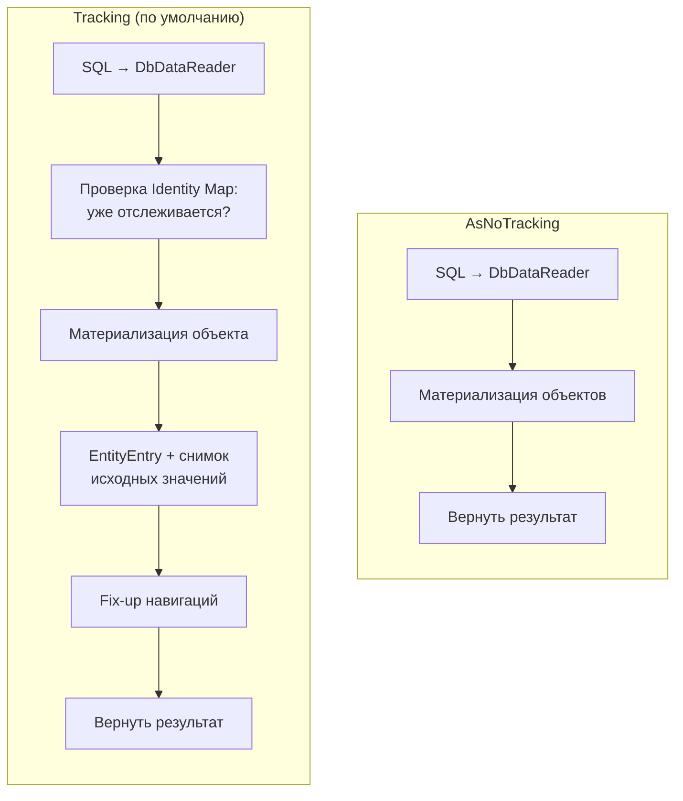

:::tldr
- `AsNoTracking()` говорит EF Core **не регистрировать** загруженные сущности в Change Tracker: не создаются `EntityEntry`, **снимки исходных значений**, нет Identity Map.
- Результат: **быстрее материализация** и **меньше памяти** — часто на 20–40% для больших выборок. Изменения таких объектов **не сохранятся** при `SaveChanges` (если не присоединить их явно).
- Использовать для **только чтения**: отчёты, списки, API-эндпоинты GET, экспорт.
- Минус: одинаковые строки → **разные объекты** (например, один `Customer` для 100 заказов → 100 копий). Решение — `AsNoTrackingWithIdentityResolution()`.
- Можно включить по умолчанию для контекста: `UseQueryTrackingBehavior(QueryTrackingBehavior.NoTracking)`, а для изменений использовать `AsTracking()`.
:::

## Что экономится



При отслеживании для каждой сущности EF:
1. Ищет её в Identity Map по ключу.
2. Создаёт `InternalEntityEntry` и **копию значений всех свойств** (snapshot) — фактически удваивает память под данные.
3. Выполняет fix-up навигаций со всеми уже отслеживаемыми сущностями.
4. Впоследствии каждый `DetectChanges` будет сравнивать все эти сущности.

## Использование

```csharp
// Список для API — только чтение
var products = await db.Products
    .AsNoTracking()
    .Where(p => p.IsActive)
    .OrderBy(p => p.Name)
    .Take(50)
    .ToListAsync(ct);

// Для всего контекста по умолчанию
builder.Services.AddDbContext<ReadDbContext>(o => o
    .UseNpgsql(conn)
    .UseQueryTrackingBehavior(QueryTrackingBehavior.NoTracking));

// ...и явное отслеживание, когда нужно изменить
var order = await db.Orders.AsTracking().SingleAsync(o => o.Id == id, ct);
order.MarkPaid();
await db.SaveChangesAsync(ct);
```

:::note Проекции не отслеживаются
Запрос с `Select` в DTO или анонимный тип **и так** не отслеживается — `AsNoTracking` там не нужен. Отслеживаются только сущности, попавшие в результат целиком (в том числе внутри проекции: `Select(o => new { o, o.Customer })` вернёт отслеживаемые `Order` и `Customer`).
:::

## Проблема дубликатов и identity resolution

```csharp
var orders = await db.Orders.AsNoTracking().Include(o => o.Customer).ToListAsync();
// 100 заказов одного клиента → 100 разных экземпляров Customer с одинаковыми данными
Console.WriteLine(ReferenceEquals(orders[0].Customer, orders[1].Customer));  // False

var orders2 = await db.Orders.AsNoTrackingWithIdentityResolution().Include(o => o.Customer).ToListAsync();
Console.WriteLine(ReferenceEquals(orders2[0].Customer, orders2[1].Customer)); // True
```

`AsNoTrackingWithIdentityResolution` использует временную Identity Map **только на время запроса**: объекты дедуплицируются, но не остаются в Change Tracker. Чуть медленнее обычного `AsNoTracking`, но экономит память при повторяющихся связанных сущностях и сохраняет корректный граф (важно для сериализации циклических ссылок).

## Сравнение

| | Tracking | AsNoTracking | AsNoTrackingWithIdentityResolution |
|---|---|---|---|
| Change Tracker | Да | Нет | Нет |
| Снимки значений | Да | Нет | Нет |
| Дедупликация объектов | Да (весь контекст) | **Нет** | Да (в рамках запроса) |
| Изменения сохраняются | Да | Нет | Нет |
| Скорость | Базовая | Максимальная | Высокая |
| Для чего | Изменение и сохранение | Чтение, простые графы | Чтение графов с повторами |

## Изменение неотслеживаемой сущности

```csharp
var product = await db.Products.AsNoTracking().SingleAsync(p => p.Id == id);
product.Price = 999;
await db.SaveChangesAsync();             // НИЧЕГО не сохранится — контекст о product не знает

db.Products.Update(product);             // отметить ВСЕ свойства как изменённые
await db.SaveChangesAsync();             // UPDATE всех столбцов

// Или точечно:
db.Attach(product);
db.Entry(product).Property(p => p.Price).IsModified = true;
await db.SaveChangesAsync();             // UPDATE только price
```

## Когда AsNoTracking не нужен или вреден

- Вы **собираетесь изменить** сущность — отслеживание нужно для `SaveChanges`.
- Запрос уже проецирует в DTO.
- Небольшая выборка в методе, который потом всё равно сохраняет изменения — выигрыш мизерный, а риск «забытого» `Attach` реален.
- Нужен `Find` из кэша контекста — `Find` работает только с отслеживаемыми сущностями.

## Архитектурный приём: разделение чтения и записи

В CQRS-стиле запросы (queries) работают через `AsNoTracking` или отдельный read-only контекст (часто — к реплике БД), а команды (commands) — через отслеживающий контекст с доменной моделью.

```csharp
public sealed class OrderQueries(ReadDbContext db)             // NoTracking по умолчанию, реплика
{
    public Task<List<OrderListItem>> GetRecentAsync(CancellationToken ct) =>
        db.Orders.OrderByDescending(o => o.CreatedAt).Take(20)
          .Select(o => new OrderListItem(o.Id, o.Customer.Name, o.Total)).ToListAsync(ct);
}
```

## Вопросы на засыпку

:::qa Насколько AsNoTracking ускоряет запрос?
Зависит от количества и «ширины» сущностей. На SQL-время не влияет — выигрыш в материализации и памяти. Для тысяч сущностей — десятки процентов, для одной — несущественно. Проверяйте BenchmarkDotNet-ом.
:::

:::qa Работает ли lazy loading с AsNoTracking?
Для прокси — нет: ленивой загрузке нужен контекст, который отслеживает сущность; EF выдаст предупреждение/исключение. Это ещё одна причина не полагаться на lazy loading.
:::

:::qa Почему после AsNoTracking-запроса Update может обновить связанные сущности?
`Update` обходит граф навигаций и помечает **все достижимые** сущности как Modified (или Added, если ключ не задан). Если к продукту прицеплена категория — её строка тоже будет обновлена. Для точечного обновления используйте `Attach` + `IsModified` или `ExecuteUpdate`.
:::

:::qa Что быстрее для массового обновления: загрузить с tracking и изменить или ExecuteUpdate?
`ExecuteUpdateAsync` (EF Core 7+) — один `UPDATE ... WHERE` без загрузки данных в память. На порядки быстрее для массовых операций, но минует Change Tracker, интерсепторы `SaveChanges` и доменные события.
:::

## Итог

`AsNoTracking` убирает накладные расходы Change Tracker там, где данные только читаются. Используйте его (или проекции) для всех read-сценариев, `AsNoTrackingWithIdentityResolution` — для графов с повторяющимися сущностями, а отслеживание оставляйте для изменения и сохранения.
