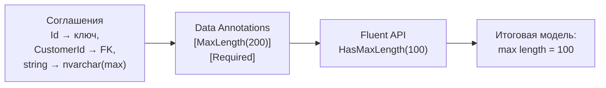
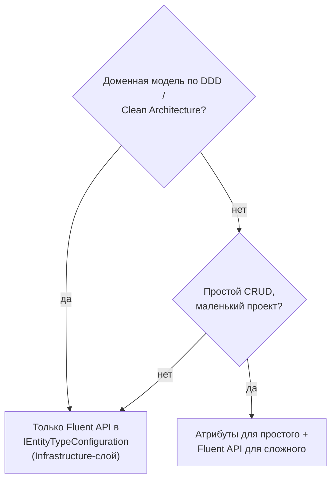

:::tldr
- Модель EF Core строится из трёх источников с растущим приоритетом: **соглашения (conventions)** → **Data Annotations** (атрибуты на классах) → **Fluent API** (`OnModelCreating`). Fluent API **перекрывает** атрибуты.
- **Data Annotations** (`[Key]`, `[Required]`, `[MaxLength]`, `[Table]`, `[Column]`, `[Index]`) — просто и наглядно, но **засоряют доменную модель** инфраструктурой и умеют не всё.
- **Fluent API** — полный набор возможностей: составные ключи, связи, owned types, конвертеры значений, наследование, фильтры, индексы с фильтром, последовательности, seed, конкурентность.
- Лучшая практика: Fluent API в отдельных классах **`IEntityTypeConfiguration<T>`** + `ApplyConfigurationsFromAssembly`. Доменные классы остаются чистыми.
- Глобальные правила (snake_case, длина строк, `decimal`-точность) — через **`ConfigureConventions`** и пользовательские соглашения.
:::

## Источники конфигурации



### Что делают соглашения без всякой настройки

- Свойство `Id` или `<Тип>Id` → первичный ключ; `int`/`long`/`Guid` ключ → генерируется БД/EF.
- Навигация `Customer` + свойство `CustomerId` → внешний ключ и связь.
- `DbSet<Order> Orders` → таблица `Orders`.
- Nullable reference types: `string` → `NOT NULL`, `string?` → `NULL`.
- `decimal` → `decimal(18,2)` с предупреждением (лучше задать явно).

## Data Annotations

```csharp
[Table("customers")]
[Index(nameof(Email), IsUnique = true)]
public class Customer
{
    [Key]
    public int Id { get; set; }

    [Required, MaxLength(254)]
    public string Email { get; set; } = "";

    [Column("full_name", TypeName = "varchar(200)")]
    public string? FullName { get; set; }

    [Precision(18, 2)]
    public decimal Balance { get; set; }

    [Timestamp]                                    // rowversion для оптимистичной конкурентности
    public byte[] Version { get; set; } = [];

    [NotMapped]
    public string DisplayName => FullName ?? Email;
}
```

Бонус: часть атрибутов (`[Required]`, `[MaxLength]`) используется и **валидацией ASP.NET Core**, если сущность совпадает с моделью запроса (что, впрочем, само по себе не лучшая практика).

## Fluent API

```csharp
public sealed class OrderConfiguration : IEntityTypeConfiguration<Order>
{
    public void Configure(EntityTypeBuilder<Order> b)
    {
        b.ToTable("orders", t => t.HasCheckConstraint("ck_orders_total_positive", "total >= 0"));
        b.HasKey(o => o.Id);
        b.Property(o => o.Id).UseIdentityAlwaysColumn();

        b.Property(o => o.Number).HasMaxLength(20).IsRequired();
        b.HasIndex(o => o.Number).IsUnique();
        b.HasIndex(o => new { o.CustomerId, o.CreatedAt }).HasFilter("status <> 'Cancelled'");  // частичный индекс

        b.Property(o => o.Status).HasConversion<string>().HasMaxLength(20);   // enum как строка
        b.Property(o => o.Total).HasPrecision(18, 2);
        b.Property(o => o.CreatedAt).HasDefaultValueSql("now()");

        b.OwnsOne(o => o.ShippingAddress, a =>                              // value object
        {
            a.Property(x => x.City).HasColumnName("ship_city").HasMaxLength(100);
            a.Property(x => x.Street).HasColumnName("ship_street").HasMaxLength(200);
        });

        b.HasOne(o => o.Customer).WithMany(c => c.Orders)
            .HasForeignKey(o => o.CustomerId).OnDelete(DeleteBehavior.Restrict);

        b.HasMany(o => o.Items).WithOne().HasForeignKey(i => i.OrderId).OnDelete(DeleteBehavior.Cascade);
        b.Navigation(o => o.Items).UsePropertyAccessMode(PropertyAccessMode.Field);   // приватное поле _items

        b.Property(o => o.Version).IsRowVersion();
        b.HasQueryFilter(o => !o.IsDeleted);                                         // soft delete
    }
}

protected override void OnModelCreating(ModelBuilder modelBuilder) =>
    modelBuilder.ApplyConfigurationsFromAssembly(typeof(ShopDbContext).Assembly);
```

## Глобальные соглашения

```csharp
protected override void ConfigureConventions(ModelConfigurationBuilder cfg)
{
    cfg.Properties<decimal>().HavePrecision(18, 2);          // все decimal
    cfg.Properties<string>().HaveMaxLength(500);             // все строки по умолчанию
    cfg.Properties<DateTime>().HaveConversion<UtcDateTimeConverter>();
    cfg.Properties<Money>().HaveConversion<MoneyConverter>(); // свой тип-значение
}

// snake_case имён — пакет EFCore.NamingConventions
builder.Services.AddDbContext<ShopDbContext>(o => o.UseNpgsql(conn).UseSnakeCaseNamingConvention());
```

## Сравнение

| Возможность | Data Annotations | Fluent API |
|---|---|---|
| Имя таблицы, столбца, тип | Да | Да |
| Обязательность, длина, точность | Да | Да |
| Простой ключ, индекс | Да | Да |
| **Составной ключ** | Только `[PrimaryKey]` (EF 7+) | Да |
| **Связи с настройкой каскада**, many-to-many с payload | Частично (`[ForeignKey]`, `[InverseProperty]`) | Полностью |
| **Owned types, table splitting** | `[Owned]` — базово | Полностью |
| **Value converters** | Нет | Да |
| **Наследование TPH/TPT/TPC**, дискриминатор | Нет | Да |
| **Query filters**, check constraints, фильтрованные индексы | Нет | Да |
| Backing fields, access mode | Нет | Да |
| Seed-данные, последовательности | Нет | Да |
| Чистота доменной модели | Атрибуты в домене | Домен без ссылок на EF |

## Что выбрать



Главное — **единообразие**: смешение стилей без правил приводит к тому, что конфигурацию одной сущности приходится искать в двух местах, а атрибут молча перекрывается Fluent API.

## Вопросы на засыпку

:::qa Почему Fluent API побеждает атрибуты?
EF строит модель слоями: сначала соглашения, затем атрибуты (как специальные соглашения), затем вызывается `OnModelCreating`, где каждое явное указание переопределяет предыдущее. Fluent API — последний и самый явный уровень.
:::

:::qa Как посмотреть итоговую модель?
`db.Model.ToDebugString(MetadataDebugStringOptions.LongDefault)` или `dotnet ef dbcontext optimize` / EF Core Power Tools (диаграмма). Также полезно смотреть SQL миграции — это финальная правда о схеме.
:::

:::qa Когда OnModelCreating вызывается?
Один раз на тип контекста (и набор опций) за жизнь процесса: модель кэшируется. Поэтому в `OnModelCreating` нельзя полагаться на данные конкретного экземпляра контекста (кроме полей, используемых в query filters — они параметризуются).
:::

:::qa Что такое compiled model?
`dotnet ef dbcontext optimize` генерирует код готовой модели, чтобы не строить её при старте. Ускоряет запуск приложений с сотнями сущностей и нужен для NativeAOT.
:::

## Итог

Соглашения покрывают основу, атрибуты — простые случаи, Fluent API — всё остальное и имеет наивысший приоритет. Для чистой доменной модели и полного контроля выносите Fluent API в `IEntityTypeConfiguration<T>`, а общие правила — в `ConfigureConventions`.
