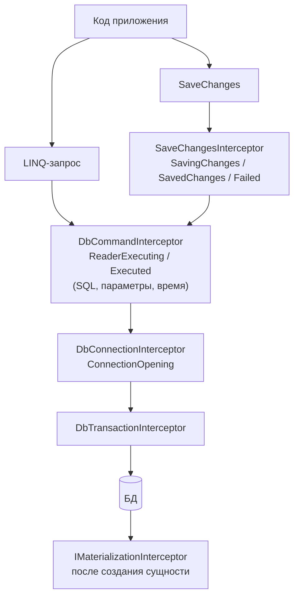
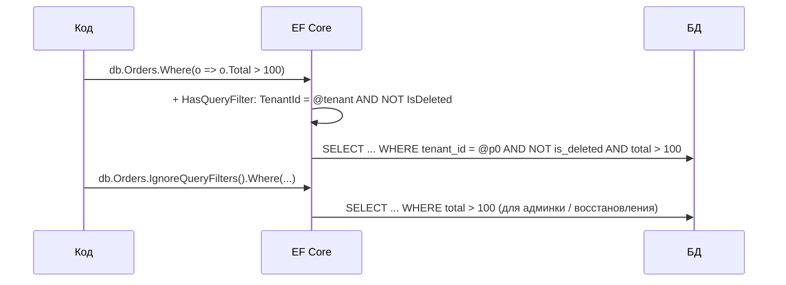

:::tldr
- **Interceptors** — перехватчики операций EF Core: выполнение команд (`DbCommandInterceptor`), сохранение (`SaveChangesInterceptor`), соединения (`DbConnectionInterceptor`), транзакции, материализация сущностей. Позволяют изменить, подменить или дополнить операцию.
- Типичные применения: **аудит** (CreatedAt/UpdatedBy), публикация **доменных событий** и запись в **Outbox**, логирование медленных запросов, подстановка токена доступа в соединение, SQL-hints.
- **Global Query Filters** (`HasQueryFilter`) — условие, **автоматически** добавляемое ко всем LINQ-запросам сущности (включая `Include`): **soft delete** (`!IsDeleted`), **multi-tenancy** (`TenantId == _tenantId`).
- Отключение фильтра — `IgnoreQueryFilters()` (в EF Core 10 — выборочно по имени фильтра).
- Фильтры не применяются к raw SQL без композиции и к `ExecuteSql`; интерсепторы `SaveChanges` не видят `ExecuteUpdate/Delete`.
:::

## Где срабатывают интерсепторы



## SaveChangesInterceptor: аудит

```csharp
public interface IAuditable
{
    DateTime CreatedAt { get; set; }
    string? CreatedBy { get; set; }
    DateTime? UpdatedAt { get; set; }
    string? UpdatedBy { get; set; }
}

public sealed class AuditInterceptor(ICurrentUser user, TimeProvider clock) : SaveChangesInterceptor
{
    public override ValueTask<InterceptionResult<int>> SavingChangesAsync(
        DbContextEventData eventData, InterceptionResult<int> result, CancellationToken ct = default)
    {
        var db = eventData.Context!;
        var now = clock.GetUtcNow().UtcDateTime;

        foreach (var entry in db.ChangeTracker.Entries<IAuditable>())
        {
            if (entry.State == EntityState.Added)
            {
                entry.Entity.CreatedAt = now;
                entry.Entity.CreatedBy = user.Id;
            }
            else if (entry.State == EntityState.Modified)
            {
                entry.Entity.UpdatedAt = now;
                entry.Entity.UpdatedBy = user.Id;
            }
        }
        return base.SavingChangesAsync(eventData, result, ct);
    }
}

// Регистрация (интерсептор из DI — может иметь зависимости)
builder.Services.AddScoped<AuditInterceptor>();
builder.Services.AddDbContext<ShopDbContext>((sp, o) => o
    .UseNpgsql(conn)
    .AddInterceptors(sp.GetRequiredService<AuditInterceptor>()));
```

### Доменные события и Outbox

```csharp
public sealed class OutboxInterceptor : SaveChangesInterceptor
{
    public override ValueTask<InterceptionResult<int>> SavingChangesAsync(DbContextEventData e, InterceptionResult<int> r, CancellationToken ct = default)
    {
        var db = e.Context!;
        var events = db.ChangeTracker.Entries<AggregateRoot>()
            .SelectMany(x => x.Entity.DequeueDomainEvents())
            .Select(ev => new OutboxMessage(Guid.NewGuid(), ev.GetType().Name, JsonSerializer.Serialize(ev, ev.GetType()), DateTime.UtcNow))
            .ToList();
        db.Set<OutboxMessage>().AddRange(events);   // в той же транзакции, что и изменения агрегатов
        return base.SavingChangesAsync(e, r, ct);
    }
}
```

## DbCommandInterceptor: медленные запросы

```csharp
public sealed class SlowQueryInterceptor(ILogger<SlowQueryInterceptor> log) : DbCommandInterceptor
{
    private static readonly TimeSpan Threshold = TimeSpan.FromMilliseconds(500);

    public override ValueTask<DbDataReader> ReaderExecutedAsync(DbCommand cmd, CommandExecutedEventData data, DbDataReader result, CancellationToken ct = default)
    {
        if (data.Duration > Threshold)
            log.LogWarning("Медленный запрос {Ms} мс: {Sql}", data.Duration.TotalMilliseconds, cmd.CommandText);
        return base.ReaderExecutedAsync(cmd, data, result, ct);
    }

    // Можно и изменить команду: добавить комментарий-тег или hint
    public override ValueTask<InterceptionResult<DbDataReader>> ReaderExecutingAsync(DbCommand cmd, CommandEventData data, InterceptionResult<DbDataReader> result, CancellationToken ct = default)
    {
        if (cmd.CommandText.Contains("-- use-replica")) { /* например, пометить для маршрутизации */ }
        return base.ReaderExecutingAsync(cmd, data, result, ct);
    }
}
```

Совет: для пометки запросов используйте `TagWith("GetTopCustomers")` — комментарий попадёт в SQL и будет виден в логах БД и `pg_stat_statements`.

## Global Query Filters

### Soft delete

```csharp
public interface ISoftDeletable { bool IsDeleted { get; set; } DateTime? DeletedAt { get; set; } }

modelBuilder.Entity<Product>().HasQueryFilter(p => !p.IsDeleted);

// Превращаем Remove в «мягкое» удаление в интерсепторе
foreach (var entry in db.ChangeTracker.Entries<ISoftDeletable>().Where(e => e.State == EntityState.Deleted))
{
    entry.State = EntityState.Modified;
    entry.Entity.IsDeleted = true;
    entry.Entity.DeletedAt = DateTime.UtcNow;
}
```

### Multi-tenancy

```csharp
public sealed class ShopDbContext(DbContextOptions<ShopDbContext> options, ITenantContext tenant) : DbContext(options)
{
    private readonly Guid _tenantId = tenant.TenantId;

    protected override void OnModelCreating(ModelBuilder b)
    {
        // Поле контекста в фильтре → EF параметризует его значением ТЕКУЩЕГО экземпляра контекста
        b.Entity<Order>().HasQueryFilter(o => o.TenantId == _tenantId);
        b.Entity<Customer>().HasQueryFilter(c => c.TenantId == _tenantId && !c.IsDeleted);
    }
}
```



Фильтр применяется и к навигациям в `Include`, и к подзапросам — удалённые позиции не «просочатся» через связанные коллекции.

:::warning Подводные камни фильтров
- **Обязательные связи**: если `Order` отфильтрован, а `OrderItem` с обязательной навигацией на него — нет, `Include` из `OrderItem` может вести себя неожиданно (EF предупреждает). Настраивайте фильтры согласованно по всему агрегату.
- **Уникальные индексы** с soft delete: удалённая запись с email `a@x.uz` помешает создать новую. Нужен частичный индекс `WHERE NOT is_deleted`.
- **Индексы под фильтр**: `tenant_id` должен быть первым столбцом составных индексов.
- Фильтры **не применяются** к `FromSqlRaw` без последующей композиции… точнее, применяются, если EF может обернуть SQL в подзапрос; к `ExecuteSql` и Dapper — никогда. В мультиарендности это потенциальная утечка данных.
:::

### Именованные фильтры (EF Core 10)

```csharp
b.Entity<Order>()
    .HasQueryFilter("SoftDelete", o => !o.IsDeleted)
    .HasQueryFilter("Tenant", o => o.TenantId == _tenantId);

db.Orders.IgnoreQueryFilters(["SoftDelete"]);   // отключить только soft delete, мультиарендность оставить
```

## Вопросы на засыпку

:::qa Почему для мультиарендности используют поле контекста, а не статическое значение?
Модель (и фильтр) строится один раз и кэшируется. Если в фильтре использовать поле экземпляра контекста, EF распознаёт это и подставляет его значение **параметром** при каждом запросе. Константа или значение, захваченное из другого источника, «запеклось» бы в кэшированную модель.
:::

:::qa Почему интерсептор не срабатывает при ExecuteUpdate?
`ExecuteUpdate/ExecuteDelete` не проходят через `SaveChanges` и Change Tracker — поэтому `SaveChangesInterceptor` их не видит. `DbCommandInterceptor` при этом сработает (SQL всё равно выполняется). Аудит массовых операций — отдельной логикой или триггерами БД.
:::

:::qa Чем интерсептор отличается от переопределения SaveChanges в контексте?
Переопределение работает, но смешивает инфраструктурную логику с контекстом и затрудняет повторное использование. Интерсепторы — отдельные классы с DI, их можно подключать к разным контекстам и тестировать изолированно.
:::

:::qa Можно ли фильтром реализовать права доступа «пользователь видит только свои заказы»?
Технически да, но это хрупко: фильтры не защищают raw SQL и `ExecuteSql`, их легко отключить `IgnoreQueryFilters`. Для безопасности данных в БД (особенно мультиарендности) рассматривают **Row-Level Security** PostgreSQL/SQL Server как дополнительный уровень.
:::

## Итог

Интерсепторы — точки расширения вокруг команд, сохранения и соединений: аудит, outbox, логирование медленных запросов. Global Query Filters автоматически дописывают условия ко всем запросам — идеально для soft delete и мультиарендности, но требуют согласованной настройки, правильных индексов и осторожности с raw SQL.
