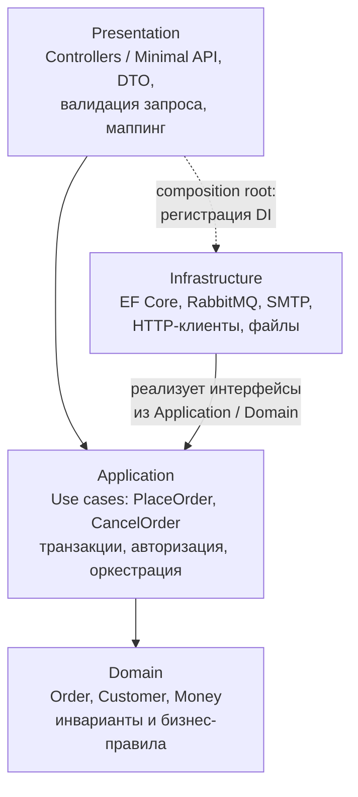
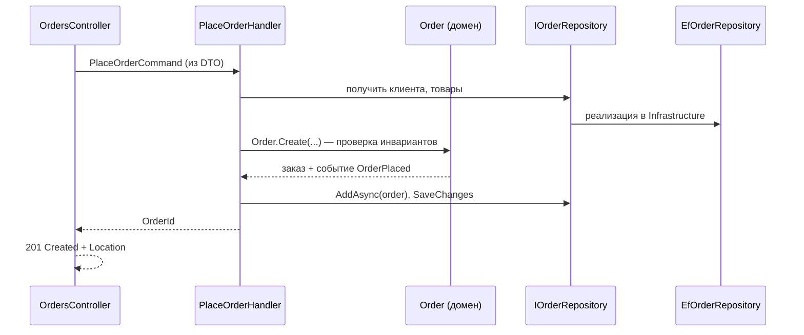
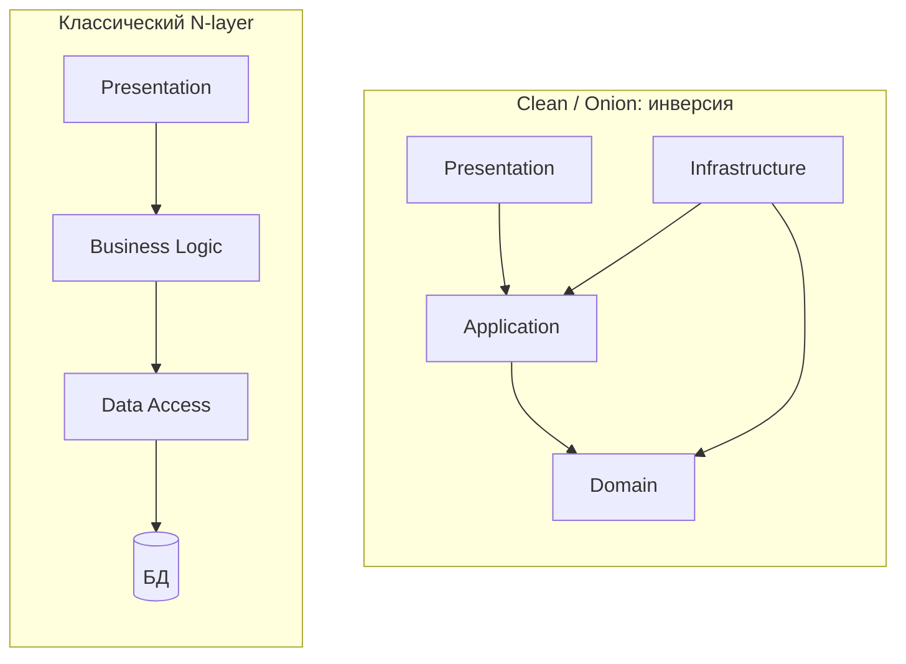
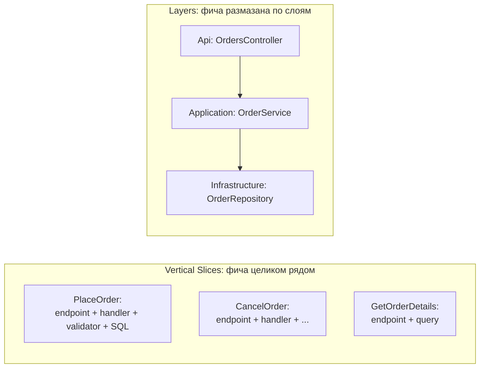

:::tldr
- Код делится на **слои** по ответственности: **Presentation** (API, UI — принять запрос, вернуть ответ), **Application** (сценарии использования, оркестрация, транзакции), **Domain** (бизнес-правила, сущности, инварианты), **Infrastructure** (БД, брокеры, внешние API, файлы, email).
- Зависимости направлены **сверху вниз**: слой знает только о нижележащих. Изменения в UI не затрагивают домен.
- **Классическая** N-layer: Presentation → Business → Data Access — домен зависит от доступа к данным. **Современный** вариант (Clean/Onion) **инвертирует** зависимость: Infrastructure зависит от Domain/Application через интерфейсы.
- Плюсы: понятная структура, разделение ответственности, тестируемость. Минусы: «сквозные» изменения фичи затрагивают все слои, риск **анемичной модели** и «прокидывания» вызовов через пустые слои.
- В .NET слои обычно — отдельные **проекты** (`Shop.Api`, `Shop.Application`, `Shop.Domain`, `Shop.Infrastructure`), а правила зависимостей проверяются ссылками проектов и архитектурными тестами.
:::

## Слои и их ответственность



| Слой | Отвечает за | Не должен |
|---|---|---|
| **Presentation** | HTTP/gRPC/UI, аутентификация, формат ответов, маппинг DTO | Содержать бизнес-правила, обращаться к БД напрямую |
| **Application** | Сценарии: загрузить агрегаты, вызвать доменную логику, сохранить, опубликовать события | Знать про HTTP, SQL, конкретные библиотеки |
| **Domain** | Сущности, value objects, инварианты, доменные сервисы и события | Зависеть от чего-либо внешнего (EF, ASP.NET, JSON) |
| **Infrastructure** | Технические детали: репозитории, DbContext, брокеры, внешние API | Содержать бизнес-решения |

## Путь запроса через слои



## Структура решения в .NET

```text
src/
├── Shop.Api/                     # Presentation
│   ├── Endpoints/OrderEndpoints.cs
│   ├── Contracts/CreateOrderRequest.cs
│   └── Program.cs                # composition root: регистрация всех слоёв
├── Shop.Application/             # Application
│   ├── Orders/PlaceOrder/PlaceOrderCommand.cs
│   ├── Orders/PlaceOrder/PlaceOrderHandler.cs
│   └── Abstractions/IOrderRepository.cs, IEmailSender.cs, IUnitOfWork.cs
├── Shop.Domain/                  # Domain — без внешних зависимостей
│   ├── Orders/Order.cs, OrderItem.cs, OrderStatus.cs
│   └── Common/Money.cs, DomainEvent.cs
└── Shop.Infrastructure/          # Infrastructure
    ├── Persistence/ShopDbContext.cs, Configurations/, Repositories/
    ├── Messaging/RabbitMqPublisher.cs
    └── DependencyInjection.cs    # AddInfrastructure(this IServiceCollection ...)
tests/
├── Shop.Domain.Tests/
├── Shop.Application.Tests/
└── Shop.Api.IntegrationTests/
```

```csharp Доменная сущность с инвариантами
public sealed class Order
{
    private readonly List<OrderItem> _items = [];
    public Guid Id { get; } = Guid.CreateVersion7();
    public OrderStatus Status { get; private set; } = OrderStatus.New;
    public IReadOnlyList<OrderItem> Items => _items;

    public void AddItem(ProductId productId, int qty, Money price)
    {
        if (Status != OrderStatus.New) throw new DomainException("Нельзя менять оплаченный заказ");
        if (qty <= 0) throw new DomainException("Количество должно быть положительным");
        _items.Add(new OrderItem(productId, qty, price));
    }
}
```

## Классический N-layer против инвертированного



В классическом варианте бизнес-логика зависит от слоя доступа к данным — схема БД диктует модель, тестировать бизнес-логику без БД сложно. Инвертированный вариант делает домен центром, а инфраструктуру — подключаемой деталью.

## Проблемы и анти-паттерны

- **Анемичная модель**: сущности — только свойства (`get; set;`), вся логика — в «сервисах» Application-слоя. Инварианты размазаны и легко обходятся.
- **Слои-прослойки**: `Controller → Service → Manager → Repository → DbContext`, где сервис лишь вызывает репозиторий с теми же параметрами. Каждый слой должен добавлять ценность.
- **Протекание абстракций**: `IQueryable` из репозитория в контроллер, сущности EF как ответ API, `HttpContext` в Application-слое.
- **Горизонтальная нарезка большого приложения**: чтобы добавить одну фичу, правим 4 проекта в 4 папках. Для крупных систем часто лучше **вертикальные срезы** (Vertical Slice Architecture) или модули (модульный монолит), а слои — внутри модуля.



## Проверка правил архитектуры тестами

```csharp NetArchTest
[Fact]
public void Domain_should_not_depend_on_other_layers()
{
    var result = Types.InAssembly(typeof(Order).Assembly)
        .ShouldNot().HaveDependencyOnAny("Shop.Application", "Shop.Infrastructure", "Shop.Api", "Microsoft.EntityFrameworkCore")
        .GetResult();
    Assert.True(result.IsSuccessful, string.Join(", ", result.FailingTypeNames ?? []));
}
```

## Вопросы на засыпку

:::qa Где должна быть валидация?
На нескольких уровнях с разным смыслом: формат запроса — в Presentation (DataAnnotations/FluentValidation), проверки сценария (существует ли клиент, есть ли права) — в Application, инварианты сущностей (нельзя добавить товар в оплаченный заказ) — в Domain.
:::

:::qa Можно ли возвращать доменные сущности из API?
Нежелательно: API-контракт привяжется к внутренней модели (любой рефакторинг ломает клиентов), возможна утечка полей и проблемы сериализации (циклы, ленивые навигации). Используйте DTO/Response-модели и маппинг на границе.
:::

:::qa Чем слоистая архитектура отличается от N-tier?
Layers — логическое разделение кода внутри приложения. Tiers — физическое разделение по процессам/машинам (браузер, веб-сервер, сервер БД). Слоистое приложение может быть развернуто одним процессом.
:::

:::qa Где регистрируются зависимости всех слоёв?
В **composition root** — точке входа (`Program.cs` в Api). Каждый слой может предоставлять метод-расширение (`AddApplication()`, `AddInfrastructure(config)`), но собирается всё в одном месте. Только composition root ссылается на Infrastructure.
:::

## Итог

Слоистая архитектура разделяет представление, сценарии, бизнес-правила и технические детали, направляя зависимости к ядру. Современный вариант инвертирует зависимость инфраструктуры от домена. Следите, чтобы каждый слой добавлял ценность, домен не был анемичным, а для крупных систем комбинируйте слои с вертикальными срезами и модулями.
