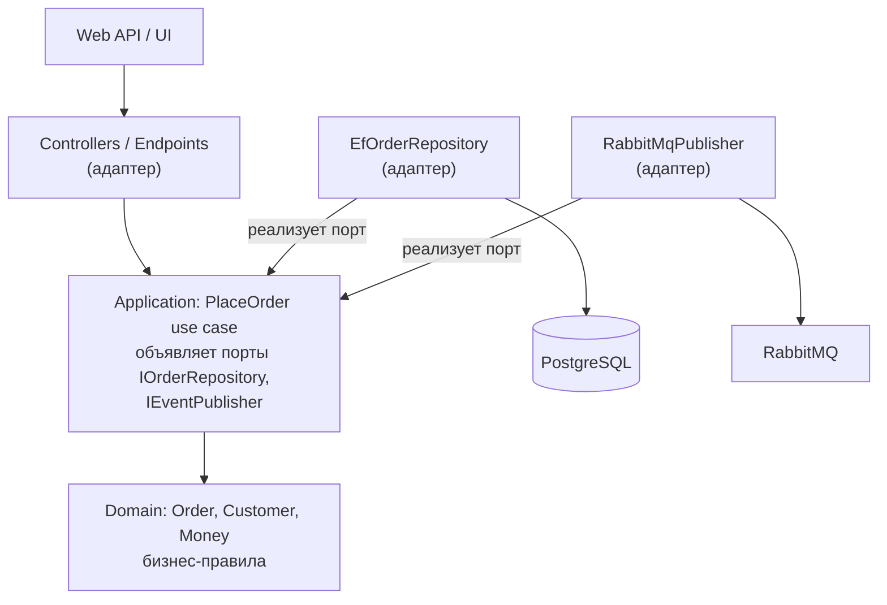
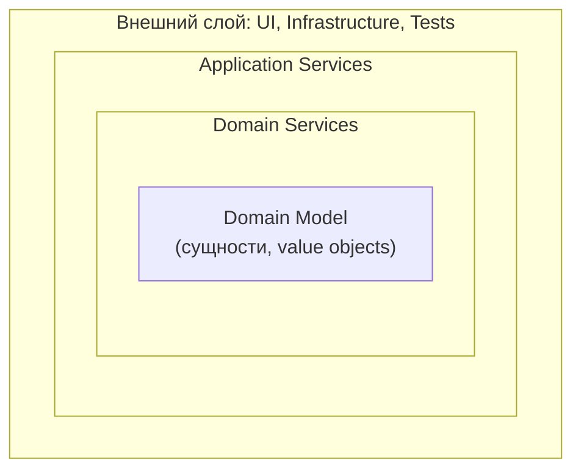
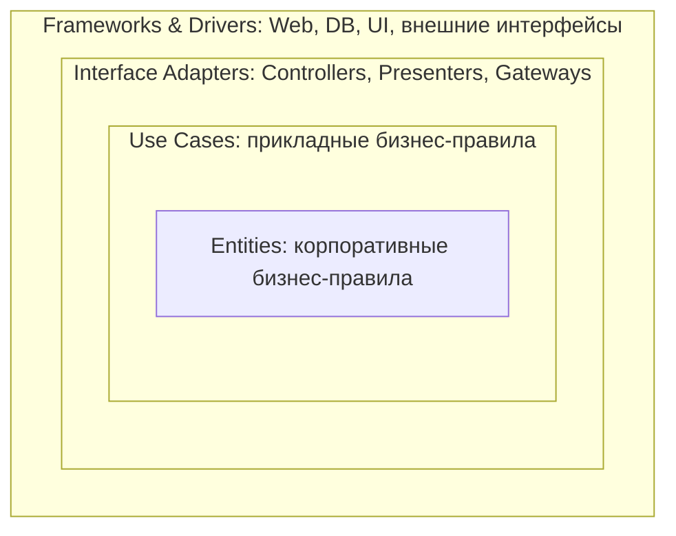
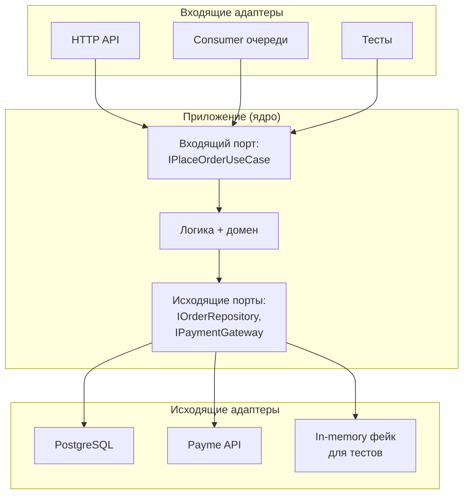

:::tldr
- **Onion** (Jeffrey Palermo, 2008), **Hexagonal / Ports & Adapters** (Alistair Cockburn, 2005) и **Clean** (Robert Martin, 2012) — вариации **одной идеи**: бизнес-логика в центре, инфраструктура снаружи, **зависимости направлены только внутрь** (Dependency Rule).
- **Onion**: концентрические слои — Domain Model → Domain Services → Application Services → внешнее кольцо (UI, инфраструктура, тесты).
- **Clean**: Entities → Use Cases (Interactors) → Interface Adapters (контроллеры, презентеры, шлюзы) → Frameworks & Drivers. Акцент на **use cases** как на центральных объектах и на **границах** (input/output ports).
- **Hexagonal**: ядро + **порты** (интерфейсы) + **адаптеры** (реализации) — «входящие» (HTTP, очереди) и «исходящие» (БД, почта). Акцент на симметрии входов и выходов.
- Практическая разница невелика: в .NET все три обычно реализуются одинаково — проекты Domain, Application, Infrastructure, Api с инверсией зависимостей через интерфейсы.
:::

## Общая идея



Главное правило: **код внутреннего круга ничего не знает о внешних**. Домен не ссылается на EF Core, ASP.NET, JSON-сериализаторы. Внешние слои зависят от внутренних и реализуют объявленные ими интерфейсы.

## Onion Architecture



- **Domain Model** — сущности и value objects, инварианты.
- **Domain Services** — доменная логика, не принадлежащая одной сущности (расчёт цены по нескольким агрегатам); интерфейсы репозиториев часто объявлены здесь.
- **Application Services** — сценарии, оркестрация.
- **Внешний слой** — UI, инфраструктура, тесты; все зависят от внутренних колец.

Onion делает акцент на **доменной модели** (в духе DDD) и на том, что БД — не центр системы.

## Clean Architecture



Особенности Clean:
- **Use Case** — центральный элемент: один класс на сценарий (`PlaceOrderInteractor`), с явными **input port** (запрос) и **output port** (ответ/презентер).
- Разделение **Entities** (правила, общие для всего предприятия) и **Use Cases** (правила конкретного приложения).
- Пересечение границ — через простые структуры данных (DTO), а не сущности.
- «Кричащая архитектура» (Screaming Architecture): структура проекта должна говорить о предметной области («Заказы», «Платежи»), а не о фреймворке («Controllers», «Models»).

## Hexagonal (Ports & Adapters)



Hexagonal подчёркивает, что HTTP — лишь один из способов «привести в действие» приложение, наравне с очередью, CLI и тестами, а БД — один из способов хранить данные.

## Сравнение

| | Hexagonal | Onion | Clean |
|---|---|---|---|
| Автор, год | Cockburn, 2005 | Palermo, 2008 | Martin, 2012 |
| Метафора | Шестиугольник с портами | Луковица с кольцами | Концентрические круги |
| Центр | Приложение (ядро) | Доменная модель | Entities + Use Cases |
| Акцент | Симметрия входов/выходов, заменяемость адаптеров | Домен в центре, БД снаружи | Use cases, границы, input/output ports |
| Слои внутри ядра | Не предписаны | Domain Model / Domain Services / Application | Entities / Use Cases |
| Общее | Dependency Rule, инверсия зависимостей, инфраструктура — деталь | ← | ← |

## Реализация в .NET

```text
Shop.Domain          → нет ссылок (разве что на базовую библиотеку примитивов)
Shop.Application     → ссылается на Domain; объявляет IOrderRepository, IPaymentGateway, IClock
Shop.Infrastructure  → ссылается на Application и Domain; EF Core, HttpClient, RabbitMQ
Shop.Api             → ссылается на Application (+ Infrastructure только для регистрации DI)
```

```csharp Порт в Application, адаптер в Infrastructure
// Shop.Application/Abstractions/IPaymentGateway.cs
public interface IPaymentGateway
{
    Task<PaymentResult> ChargeAsync(Guid orderId, Money amount, CancellationToken ct);
}

// Shop.Infrastructure/Payments/PaymeGateway.cs
internal sealed class PaymeGateway(HttpClient http, IOptions<PaymeOptions> options) : IPaymentGateway
{
    public async Task<PaymentResult> ChargeAsync(Guid orderId, Money amount, CancellationToken ct)
    {
        var response = await http.PostAsJsonAsync("/api/charge", new { orderId, amount = amount.Tiyin }, ct);
        return response.IsSuccessStatusCode ? PaymentResult.Success() : PaymentResult.Failed(await response.Content.ReadAsStringAsync(ct));
    }
}

// Shop.Infrastructure/DependencyInjection.cs
public static IServiceCollection AddInfrastructure(this IServiceCollection services, IConfiguration cfg)
{
    services.AddDbContext<ShopDbContext>(o => o.UseNpgsql(cfg.GetConnectionString("Default")));
    services.AddScoped<IOrderRepository, EfOrderRepository>();
    services.AddHttpClient<IPaymentGateway, PaymeGateway>(c => c.BaseAddress = new Uri(cfg["Payme:Url"]!));
    return services;
}
```

## Критика и компромиссы

- **Много церемоний** для простых CRUD-сервисов: 4 проекта, интерфейсы, мапперы для задачи «сохранить форму в таблицу».
- **Репозиторий поверх EF Core** часто дублирует DbContext. Многие команды допускают прямое использование `DbContext` (через интерфейс `IAppDbContext`) в Application-слое — прагматичный компромисс.
- **Разделение по слоям** затрудняет работу над фичей — отсюда популярность Vertical Slice Architecture поверх или вместо чистой архитектуры.
- Шаблоны вроде Jason Taylor's Clean Architecture или Ardalis CleanArchitecture — хорошая отправная точка, но их стоит адаптировать под размер проекта.

## Вопросы на засыпку

:::qa Где объявлять интерфейс репозитория — в Domain или Application?
Оба варианта встречаются. В DDD-стиле (Onion) — в Domain рядом с агрегатом (`IOrderRepository` — часть языка домена). В Clean — в Application, как порт use case-а. Важно лишь, чтобы интерфейс был во внутреннем слое, а реализация — во внешнем.
:::

:::qa Может ли Application-слой использовать EF Core напрямую?
По канону — нет (EF — деталь инфраструктуры). Прагматично — часто да, через интерфейс `IAppDbContext` с `DbSet<T>`: LINQ-запросы остаются в Application, а тестируют его интеграционными тестами. Это осознанный компромисс, уменьшающий количество кода.
:::

:::qa Зачем нужны input/output ports в Clean Architecture?
Input port (интерфейс use case) позволяет вызывать сценарий из любого адаптера и подменять его в тестах. Output port (презентер) отделяет формирование ответа от логики — use case не знает, JSON это, HTML или сообщение в очередь. В .NET-практике output port часто упрощают до возврата DTO.
:::

:::qa Как проверить соблюдение Dependency Rule?
Ссылками проектов (Domain физически не может сослаться на Infrastructure, если нет ссылки) и архитектурными тестами (NetArchTest, ArchUnitNET), которые падают в CI при появлении запрещённой зависимости.
:::

## Итог

Clean, Onion и Hexagonal — разные метафоры одного принципа: бизнес-логика в центре, детали снаружи, зависимости направлены внутрь через интерфейсы. Onion акцентирует доменную модель, Clean — use cases и границы, Hexagonal — порты и адаптеры. На практике выбирайте степень строгости по размеру и сложности проекта.
