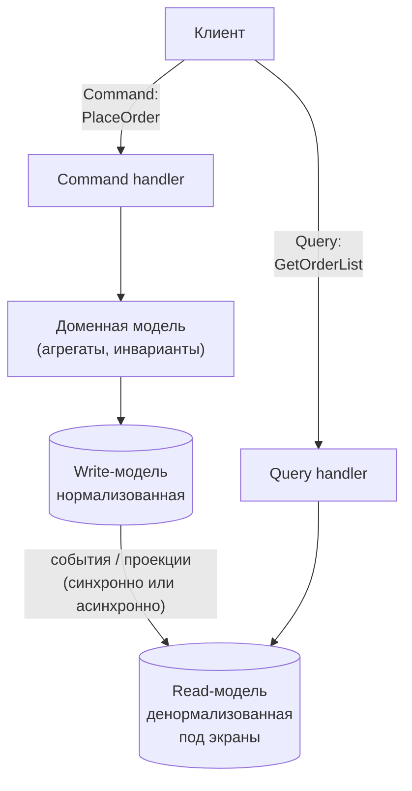
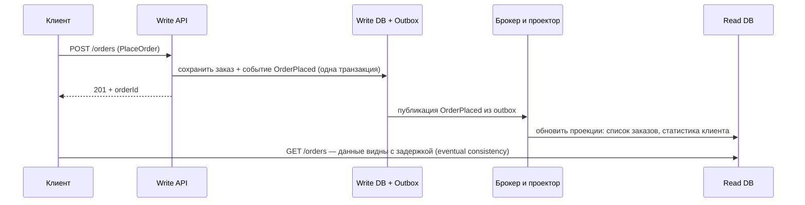
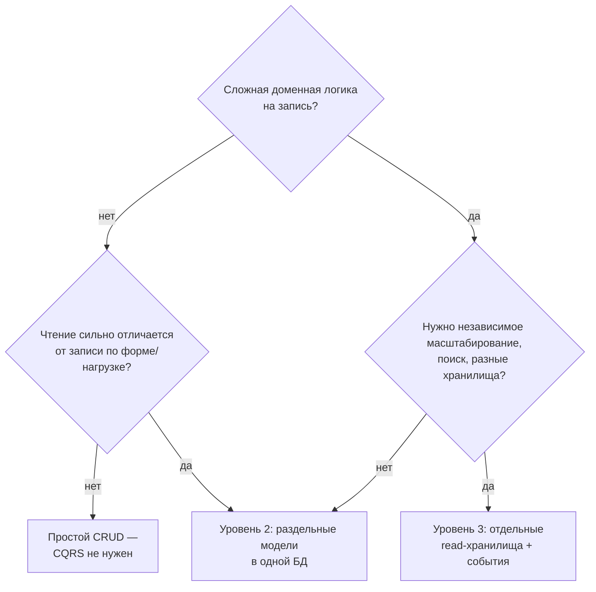

:::tldr
- **CQS** (Бертран Мейер) — на уровне методов: метод либо **изменяет** состояние (command), либо **возвращает** данные (query), но не то и другое сразу.
- **CQRS** (Command Query Responsibility Segregation, Грег Янг) — на уровне архитектуры: **разные модели** для записи и чтения. Команды проходят через доменную модель с инвариантами; запросы читают данные максимально прямым путём (проекции, SQL, отдельные read-модели).
- Уровни применения: **(1)** разделение классов (команды/запросы, обработчики) в одном приложении и одной БД → **(2)** разные модели в одной БД (EF с доменом для записи, Dapper/проекции для чтения) → **(3)** разные хранилища (реплика, денормализованные таблицы, Elasticsearch) с **eventual consistency**.
- Зачем: сложный домен на записи и разнообразные экраны на чтении требуют разных моделей; независимое масштабирование чтения; оптимизация запросов без искажения доменной модели.
- Когда не нужен: простой CRUD. Полный CQRS с отдельными хранилищами добавляет сложность синхронизации и задержку видимости данных.
:::

## От CQS к CQRS

```csharp CQS на уровне методов
public class Account
{
    public decimal Balance { get; private set; }         // query — только читает
    public void Deposit(decimal amount) { Balance += amount; }   // command — только меняет

    // Нарушение CQS: и меняет, и возвращает — неочевидные побочные эффекты при «чтении»
    public decimal WithdrawAndGetBalance(decimal amount) { Balance -= amount; return Balance; }
}
```

(Прагматичные исключения существуют: `Stack.Pop()`, `Interlocked.Increment` возвращают значение — это нормально.)

## Архитектура CQRS



| | Сторона записи (Commands) | Сторона чтения (Queries) |
|---|---|---|
| Цель | Корректность, инварианты, транзакции | Скорость, удобная форма данных |
| Модель | Богатая доменная модель (DDD-агрегаты) | Плоские DTO / проекции под экраны |
| Технология | EF Core с Change Tracker | Dapper, SQL, `AsNoTracking` + `Select`, представления, поисковый индекс |
| Результат | Ничего или идентификатор/статус | Данные |
| Масштабирование | Обычно меньше нагрузки | Реплики, кэш, отдельные хранилища |

## Уровень 1–2: одна БД, разные модели

```csharp Команда и её обработчик
public sealed record PlaceOrderCommand(Guid CustomerId, IReadOnlyList<OrderLine> Lines) : IRequest<Guid>;

public sealed class PlaceOrderHandler(ShopDbContext db, IClock clock) : IRequestHandler<PlaceOrderCommand, Guid>
{
    public async Task<Guid> Handle(PlaceOrderCommand cmd, CancellationToken ct)
    {
        var customer = await db.Customers.SingleAsync(c => c.Id == cmd.CustomerId, ct);
        var order = customer.PlaceOrder(cmd.Lines, clock.UtcNow);        // доменная логика и инварианты
        db.Orders.Add(order);
        await db.SaveChangesAsync(ct);
        return order.Id;
    }
}
```

```csharp Запрос и его обработчик — без доменной модели
public sealed record GetCustomerOrdersQuery(Guid CustomerId, int Page) : IRequest<IReadOnlyList<OrderListItem>>;

public sealed class GetCustomerOrdersHandler(IDbConnectionFactory connections) : IRequestHandler<GetCustomerOrdersQuery, IReadOnlyList<OrderListItem>>
{
    public async Task<IReadOnlyList<OrderListItem>> Handle(GetCustomerOrdersQuery q, CancellationToken ct)
    {
        await using var conn = await connections.OpenReadOnlyAsync(ct);        // можно на реплику
        var rows = await conn.QueryAsync<OrderListItem>("""
            SELECT o.id, o.created_at, o.status, SUM(i.qty * i.price) AS total, COUNT(*) AS items
            FROM orders o JOIN order_items i ON i.order_id = o.id
            WHERE o.customer_id = @CustomerId
            GROUP BY o.id
            ORDER BY o.created_at DESC
            LIMIT 20 OFFSET @Offset
            """, new { q.CustomerId, Offset = q.Page * 20 });
        return rows.AsList();
    }
}
```

Уже на этом уровне — большой выигрыш: доменная модель не раздувается свойствами «для экранов», а запросы чтения оптимальны.

## Уровень 3: отдельные хранилища



Особенности:
- **Eventual consistency**: сразу после команды read-модель может ещё не содержать изменений. UI должен с этим жить: оптимистичное отображение, «заказ обрабатывается», чтение своей записи с write-стороны.
- **Перестраиваемость**: read-модель — производные данные; её можно удалить и перестроить из write-БД или событий (особенно с Event Sourcing).
- **Разные технологии**: write — PostgreSQL, read — Elasticsearch для поиска, Redis для счётчиков, ClickHouse для аналитики.

## Когда CQRS оправдан



Признаки того, что CQRS поможет:
- Сущности обрастают свойствами только для отображения, запросы через доменную модель тянут кучу данных.
- Чтений в десятки раз больше, чем записей, и они тяжёлые (агрегаты, поиск).
- Разные команды/люди работают над записью и отчётами.

Признаки переусложнения:
- Команда «UpdateUser» и запрос «GetUser» для формы из пяти полей, плюс отдельная БД и шина.
- Команда не понимает, почему «только что сохранённое не видно».

## Вопросы на засыпку

:::qa Может ли команда возвращать результат?
Строгое определение говорит «нет», но на практике команды возвращают идентификатор созданной сущности, результат валидации или статус — это не нарушает идею: команда не возвращает **данные для чтения**. Альтернатива — клиент генерирует Id сам (Guid v7).
:::

:::qa Обязательно ли CQRS использовать с Event Sourcing?
Нет. CQRS — разделение моделей; Event Sourcing — способ хранить состояние как последовательность событий. Их часто сочетают (события естественно питают read-модели), но CQRS прекрасно работает с обычной реляционной БД.
:::

:::qa Как тестировать CQRS-приложение?
Команды — unit-тесты доменной логики + интеграционные тесты обработчиков с реальной БД. Запросы — интеграционные тесты на SQL (Testcontainers). Проекции — тест «событие → ожидаемое состояние read-модели».
:::

:::qa Чем CQRS отличается от просто «сервиса чтения» и «сервиса записи»?
CQRS — это про **модели**, а не обязательно про сервисы или процессы. Можно иметь один процесс, одну БД и разделённые модели. Разделение на отдельные развёртывания — дополнительный шаг, если нужно независимое масштабирование.
:::

## Итог

CQRS разделяет модели записи и чтения: команды проходят через доменную модель и охраняют инварианты, запросы читают данные кратчайшим путём в удобной форме. Начинайте с раздельных обработчиков в одной БД — это даёт основную пользу без затрат; отдельные хранилища и асинхронные проекции вводите, когда нагрузка и требования действительно этого требуют.
