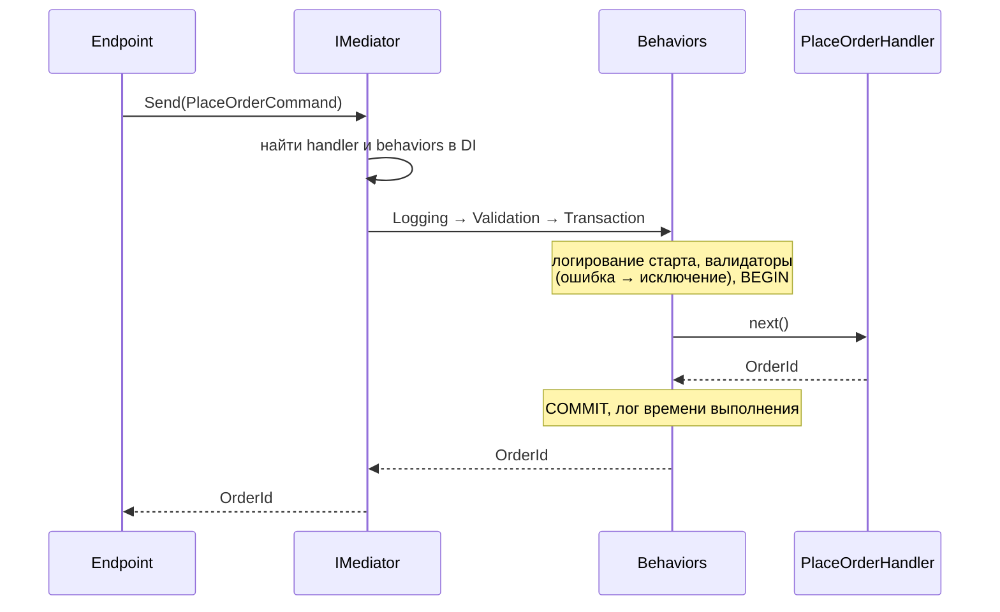
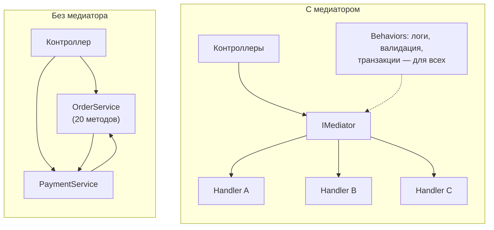

:::tldr
- **Паттерн Mediator** — объекты общаются не напрямую, а через **посредника**, что уменьшает связанность «многие-ко-многим».
- **MediatR** — популярная .NET-библиотека: `mediator.Send(request)` находит **единственный** `IRequestHandler<TRequest, TResponse>` через DI; `mediator.Publish(notification)` вызывает **все** `INotificationHandler<T>` — внутрипроцессная шина.
- Ключевая ценность — **pipeline behaviors** (`IPipelineBehavior<,>`): сквозная логика вокруг каждого обработчика — валидация, логирование, транзакции, кэширование, метрики, ретраи.
- Плюсы: тонкие контроллеры, один класс на сценарий (удобно для CQRS и Vertical Slices), единое место для cross-cutting concerns.
- Минусы: **неявность** (переход «к определению» ведёт к интерфейсу, а не к обработчику), накладные расходы, искушение «всё через MediatR», **сервис-локатор** под капотом; с 2025 года MediatR распространяется по **коммерческой лицензии** — многие переходят на альтернативы (Mediator source generator, Wolverine, собственные простые диспетчеры) или прямые вызовы.
:::

## Как это работает



```csharp Запрос, обработчик, вызов
public sealed record GetOrderQuery(Guid Id) : IRequest<OrderDto?>;

public sealed class GetOrderHandler(ShopDbContext db) : IRequestHandler<GetOrderQuery, OrderDto?>
{
    public Task<OrderDto?> Handle(GetOrderQuery q, CancellationToken ct) =>
        db.Orders.Where(o => o.Id == q.Id).Select(o => new OrderDto(o.Id, o.Status, o.Total)).FirstOrDefaultAsync(ct);
}

builder.Services.AddMediatR(cfg =>
{
    cfg.RegisterServicesFromAssemblyContaining<GetOrderHandler>();
    cfg.AddOpenBehavior(typeof(LoggingBehavior<,>));
    cfg.AddOpenBehavior(typeof(ValidationBehavior<,>));
    cfg.AddOpenBehavior(typeof(TransactionBehavior<,>));
});

app.MapGet("/orders/{id:guid}", async (Guid id, ISender sender, CancellationToken ct) =>
    await sender.Send(new GetOrderQuery(id), ct) is { } dto ? Results.Ok(dto) : Results.NotFound());
```

## Pipeline behaviors

```csharp Валидация для всех команд
public sealed class ValidationBehavior<TRequest, TResponse>(IEnumerable<IValidator<TRequest>> validators)
    : IPipelineBehavior<TRequest, TResponse> where TRequest : notnull
{
    public async Task<TResponse> Handle(TRequest request, RequestHandlerDelegate<TResponse> next, CancellationToken ct)
    {
        if (!validators.Any()) return await next();

        var context = new ValidationContext<TRequest>(request);
        var failures = (await Task.WhenAll(validators.Select(v => v.ValidateAsync(context, ct))))
            .SelectMany(r => r.Errors).Where(e => e is not null).ToList();

        if (failures.Count != 0) throw new ValidationException(failures);
        return await next();
    }
}
```

```csharp Логирование и время выполнения
public sealed class LoggingBehavior<TRequest, TResponse>(ILogger<LoggingBehavior<TRequest, TResponse>> log)
    : IPipelineBehavior<TRequest, TResponse> where TRequest : notnull
{
    public async Task<TResponse> Handle(TRequest request, RequestHandlerDelegate<TResponse> next, CancellationToken ct)
    {
        var name = typeof(TRequest).Name;
        var sw = Stopwatch.StartNew();
        try { return await next(); }
        finally { log.LogInformation("{Request} выполнен за {Ms} мс", name, sw.ElapsedMilliseconds); }
    }
}
```

Behaviors — это аналог middleware, но на уровне прикладных сценариев, независимо от транспорта (HTTP, очередь, фоновая задача).

## Notifications

```csharp
public sealed record OrderPlaced(Guid OrderId, Guid CustomerId) : INotification;

public sealed class SendConfirmationEmail(IEmailSender email) : INotificationHandler<OrderPlaced>
{
    public Task Handle(OrderPlaced n, CancellationToken ct) => email.SendOrderConfirmationAsync(n.OrderId, ct);
}
public sealed class UpdateCustomerStats(ShopDbContext db) : INotificationHandler<OrderPlaced> { /* ... */ }

await publisher.Publish(new OrderPlaced(order.Id, order.CustomerId), ct);
```

:::warning Publish — это не очередь сообщений
Обработчики выполняются **в том же процессе**, по умолчанию последовательно, в рамках текущего запроса. Если процесс упадёт после `SaveChanges`, но до отправки email — письмо потеряется. Исключение в одном обработчике прерывает остальных. Для надёжности (доставка после сбоя, ретраи, другие сервисы) — Outbox + брокер сообщений.
:::

## Плюсы и минусы

| Плюсы | Минусы |
|---|---|
| Тонкие контроллеры / эндпоинты | Неявный поток: сложнее навигация по коду |
| Один класс = один сценарий (SRP, Vertical Slices) | Дополнительный уровень косвенности, небольшие накладные расходы |
| Единое место для сквозной логики (behaviors) | Behaviors применяются ко всем запросам — легко сделать «магию» |
| Легко тестировать обработчики изолированно | Обработчики, вызывающие `Send` из других обработчиков, → запутанные цепочки |
| Независимость от транспорта | Сервис-локатор внутри; ошибки регистрации — в рантайме |
| — | Коммерческая лицензия MediatR (с версии 13, 2025) |



## Альтернативы

- **Прямой вызов обработчика**: внедрить `PlaceOrderHandler` в эндпоинт и вызвать `Handle`. Навигация проще, сквозную логику — декораторами (Scrutor) или фильтрами эндпоинтов.
- **Mediator** (martinothamar/Mediator) — source generator: тот же API, без рефлексии, быстрее, совместим с AOT, MIT-лицензия.
- **Wolverine** — медиатор + шина сообщений с outbox.
- **Собственный минимальный диспетчер** — 50 строк кода на `IServiceProvider`.

## Вопросы на засыпку

:::qa Чем MediatR отличается от классического паттерна Mediator из GoF?
GoF-медиатор координирует взаимодействие **конкретных** коллег (например, элементов формы), зная о них. MediatR — скорее диспетчер «запрос → обработчик» (ближе к Command Dispatcher / in-process message bus): отправитель вообще не знает, кто обработает запрос.
:::

:::qa Нужно ли вызывать Send из одного обработчика в другой?
Лучше избегать: цепочки `Send` скрывают зависимости и порождают вложенные транзакции/behaviors. Общую логику выносите в доменные или прикладные сервисы, а обработчик пусть остаётся точкой входа сценария.
:::

:::qa Как организовать транзакции через behavior?
`TransactionBehavior` открывает транзакцию только для команд (например, маркерный интерфейс `ICommand`), вызывает `next()`, затем `SaveChanges` и `Commit`. Запросы пропускает. Важно не открывать транзакции для чтения и учитывать retry-стратегию EF.
:::

:::qa MediatR — это обязательная часть CQRS?
Нет. CQRS — разделение моделей, MediatR — лишь удобный способ маршрутизации команд и запросов. CQRS можно реализовать с прямыми вызовами обработчиков или любым другим диспетчером.
:::

## Итог

MediatR реализует диспетчеризацию запросов к обработчикам и in-process уведомления, а его главная сила — pipeline behaviors для сквозной логики. Он хорошо ложится на CQRS и вертикальные срезы, но добавляет неявность и зависимость от библиотеки (теперь коммерческой). Оценивайте, окупается ли косвенность, и помните, что `Publish` — не замена надёжной шине сообщений.
