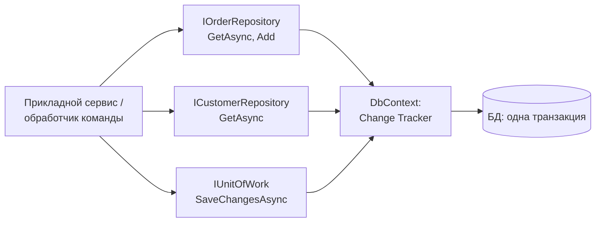
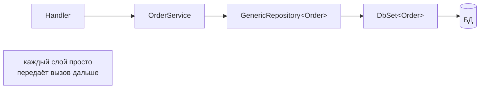
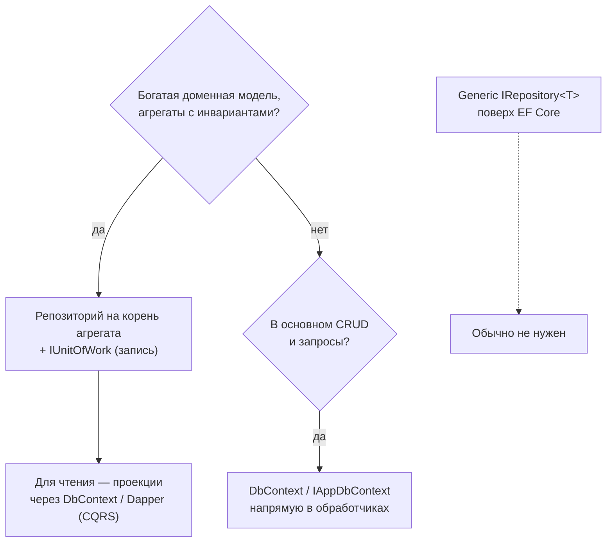

:::tldr
- **Repository** — абстракция коллекции доменных объектов: «дай заказ по id», «сохрани заказ». Скрывает детали хранения от бизнес-логики.
- **Unit of Work** — отслеживает изменения в рамках бизнес-операции и фиксирует их **одной транзакцией** (`Commit`/`SaveChanges`).
- **EF Core уже реализует оба**: `DbSet<T>` — репозиторий, `DbContext` — Unit of Work. Поэтому обёртки над EF — предмет споров.
- Критика **generic repository** (`IRepository<T>` с `GetAll`, `Find(Expression)`, `Add`, `Update`, `Delete`): дублирует DbSet, протекает (`IQueryable`, `Include`), не выражает домен, мешает оптимизациям EF.
- Когда репозиторий оправдан: **DDD-агрегаты** (репозиторий на корень агрегата с методами на языке домена), инкапсуляция сложных запросов, несколько источников данных, изоляция домена от ORM. Альтернативы: прямое использование `DbContext` в обработчиках, **Specification** pattern, query-объекты.
:::

## Классические определения



```csharp Репозиторий агрегата на языке домена
public interface IOrderRepository
{
    Task<Order?> GetAsync(OrderId id, CancellationToken ct);
    Task<IReadOnlyList<Order>> GetUnpaidOlderThanAsync(DateTime threshold, CancellationToken ct);
    void Add(Order order);
}

public interface IUnitOfWork
{
    Task<int> SaveChangesAsync(CancellationToken ct);
}

internal sealed class EfOrderRepository(ShopDbContext db) : IOrderRepository
{
    public Task<Order?> GetAsync(OrderId id, CancellationToken ct) =>
        db.Orders.Include(o => o.Items).SingleOrDefaultAsync(o => o.Id == id, ct);   // агрегат грузится целиком

    public async Task<IReadOnlyList<Order>> GetUnpaidOlderThanAsync(DateTime threshold, CancellationToken ct) =>
        await db.Orders.Where(o => o.Status == OrderStatus.New && o.CreatedAt < threshold).ToListAsync(ct);

    public void Add(Order order) => db.Orders.Add(order);
}

public sealed class CancelStaleOrdersHandler(IOrderRepository orders, IUnitOfWork uow, TimeProvider clock)
{
    public async Task Handle(CancellationToken ct)
    {
        var stale = await orders.GetUnpaidOlderThanAsync(clock.GetUtcNow().UtcDateTime.AddDays(-3), ct);
        foreach (var order in stale) order.Cancel("Не оплачен за 3 дня");
        await uow.SaveChangesAsync(ct);                     // все изменения — одной транзакцией
    }
}
```

## Критика generic repository

```csharp Типичный generic repository
public interface IRepository<T> where T : class
{
    IQueryable<T> GetAll();                                // протекающая абстракция
    Task<T?> GetByIdAsync(object id);
    Task<IEnumerable<T>> FindAsync(Expression<Func<T, bool>> predicate);
    Task AddAsync(T entity);
    void Update(T entity);
    void Delete(T entity);
    Task SaveAsync();                                      // UoW внутри репозитория — каждый сохраняет сам
}
```

Проблемы:

| Проблема | Почему плохо |
|---|---|
| Дублирует `DbSet<T>` | Тот же API, только беднее: нет `Include`, `AsNoTracking`, `AsSplitQuery`, проекций |
| `IQueryable<T> GetAll()` | Абстракция протекает: вызывающий код пишет LINQ к EF, зависит от его трансляции, может сгенерировать N+1 |
| `FindAsync(predicate)` возвращает сущности целиком | Нет проекций — тянем все столбцы, отслеживание |
| Не выражает домен | `Delete` для журнала аудита, `Update` для неизменяемого агрегата — операции есть, хотя по смыслу их быть не должно |
| `SaveAsync` в каждом репозитории | Ломает Unit of Work: операция над двумя агрегатами — две транзакции |
| «Для замены ORM» | Замена ORM почти никогда не происходит, а если происходит — абстракция не спасает |
| «Для тестов» | Моки репозиториев проверяют вызовы, а не поведение запросов; баги в LINQ-трансляции не ловятся |



## Когда репозиторий оправдан

1. **DDD-агрегаты**: репозиторий только для **корня** агрегата, загружает его **целиком** (инварианты требуют полноты), методы на языке домена. Это защищает от ошибок вида «изменили `OrderItem` напрямую в обход `Order`».
2. **Сложные повторно используемые запросы**: инкапсулировать в одном месте, дать им имя.
3. **Несколько источников**: данные частично из БД, частично из внешнего API/кэша.
4. **Изоляция домена от EF** в строгой Clean Architecture.

## Альтернативы

### Прямой DbContext в обработчиках

```csharp
public sealed class GetOrderDetailsHandler(ShopDbContext db)
{
    public Task<OrderDetailsDto?> Handle(Guid id, CancellationToken ct) =>
        db.Orders.AsNoTracking().Where(o => o.Id == id)
            .Select(o => new OrderDetailsDto(o.Id, o.Customer.Name, o.Items.Count, o.Total))
            .SingleOrDefaultAsync(ct);
}
```

Особенно естественно для **запросов** (CQRS read side) и Vertical Slice Architecture: полная мощь EF, минимум кода. Тестируется интеграционно (Testcontainers).

### Specification pattern

```csharp
public sealed class UnpaidOrdersOlderThan : Specification<Order>      // библиотека Ardalis.Specification
{
    public UnpaidOrdersOlderThan(DateTime threshold) =>
        Query.Where(o => o.Status == OrderStatus.New && o.CreatedAt < threshold)
             .Include(o => o.Items)
             .OrderBy(o => o.CreatedAt);
}

var stale = await repository.ListAsync(new UnpaidOrdersOlderThan(threshold), ct);
```

Спецификация — именованный, переиспользуемый, тестируемый объект-запрос; generic-репозиторий принимает спецификации вместо произвольных выражений.

### IAppDbContext

```csharp
public interface IAppDbContext
{
    DbSet<Order> Orders { get; }
    DbSet<Customer> Customers { get; }
    Task<int> SaveChangesAsync(CancellationToken ct);
}
```

Компромисс для Clean Architecture: Application-слой зависит от интерфейса (не от конкретного контекста), но пользуется полным LINQ EF Core.

## Как выбрать



## Вопросы на засыпку

:::qa Почему репозиторий должен загружать агрегат целиком?
Инварианты агрегата проверяются внутри корня на основе **всех** его частей (например, «сумма позиций не превышает лимит»). Если загрузить заказ без позиций, метод `AddItem` не сможет корректно проверить правило. Поэтому агрегаты делают небольшими.
:::

:::qa Нарушает ли возврат IQueryable из репозитория инкапсуляцию?
Да: вызывающий код получает возможность строить произвольные запросы к хранилищу и зависит от провайдера LINQ. Плюс выполнение может произойти после завершения жизни контекста. Возвращайте материализованные результаты или используйте спецификации.
:::

:::qa Как тестировать код с репозиториями?
Доменную логику — unit-тестами без репозиториев вовсе (передавая объекты). Обработчики — либо с in-memory фейком репозитория (простой класс на `List<T>`, а не мок), либо интеграционно с реальной БД. Сами репозитории — только интеграционно.
:::

:::qa Где вызывать SaveChanges — в репозитории или снаружи?
Снаружи — в Unit of Work на уровне прикладной операции (обработчик, behavior, фильтр). Тогда изменения нескольких агрегатов в одной операции фиксируются атомарно, а репозитории остаются «коллекциями».
:::

## Итог

Repository абстрагирует коллекцию агрегатов, Unit of Work — атомарную фиксацию изменений, и EF Core уже реализует оба паттерна. Generic repository поверх EF чаще вредит, чем помогает. Используйте репозитории на корни агрегатов в богатых доменах, а для чтения и простого CRUD — `DbContext` напрямую, проекции и спецификации.
