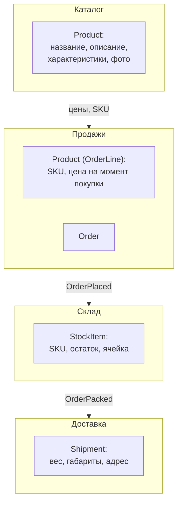
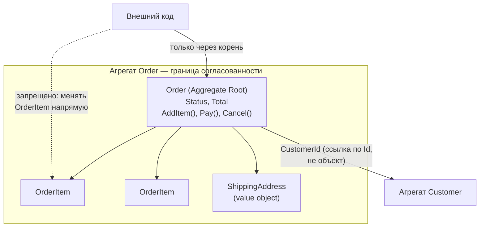
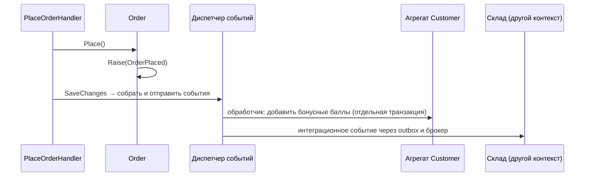

:::tldr
- **DDD** — подход к сложным доменам: модель кода отражает язык и правила бизнеса. **Стратегическая** часть: **Ubiquitous Language** (единый язык с экспертами), **Bounded Context** (граница, внутри которой термины однозначны), Context Map. **Тактическая**: строительные блоки ниже.
- **Entity** — объект с **идентичностью**, которая сохраняется при изменении атрибутов (Заказ №42 остаётся собой, меняя статус). Равенство — по Id.
- **Value Object** — объект без идентичности, определяется **значениями**, **неизменяем**, самовалидируется (`Money`, `Email`, `Address`, `DateRange`). Равенство — по значениям.
- **Aggregate** — кластер сущностей и value objects с **корнем** (Aggregate Root), через который идут все изменения. Граница **транзакционной согласованности** и **инвариантов**. Одна транзакция — один агрегат; ссылки на другие агрегаты — **по Id**.
- **Domain Event** — факт, произошедший в домене (`OrderPlaced`), в прошедшем времени. Позволяет реагировать на изменения без жёстких связей, часто — **между агрегатами** (eventual consistency).
- Также: **Domain Service** (логика вне одной сущности), **Repository** (на корень агрегата), **Factory**.
:::

## Стратегический DDD



Один и тот же термин «Товар» означает разное в разных контекстах. Попытка создать единую модель `Product` на всю компанию порождает монстра с сотней полей. Bounded Context — естественная граница для модуля или микросервиса.

## Entity

```csharp
public abstract class Entity<TId> where TId : notnull
{
    public TId Id { get; protected init; } = default!;
    public override bool Equals(object? obj) => obj is Entity<TId> other && GetType() == other.GetType() && Id.Equals(other.Id);
    public override int GetHashCode() => Id.GetHashCode();
}

public sealed class Customer : Entity<CustomerId>
{
    public string Name { get; private set; }
    public Email Email { get; private set; }            // value object

    public void ChangeEmail(Email newEmail)             // поведение, а не публичный сеттер
    {
        if (Email == newEmail) return;
        Email = newEmail;
        Raise(new CustomerEmailChanged(Id, newEmail));
    }
}
```

## Value Object

```csharp
public sealed record Money
{
    public decimal Amount { get; }
    public string Currency { get; }

    public Money(decimal amount, string currency)
    {
        if (amount < 0) throw new DomainException("Сумма не может быть отрицательной");
        if (currency is not ("UZS" or "USD")) throw new DomainException($"Неизвестная валюта {currency}");
        Amount = decimal.Round(amount, 2);
        Currency = currency;
    }

    public Money Add(Money other) => other.Currency == Currency
        ? new Money(Amount + other.Amount, Currency)
        : throw new DomainException("Нельзя складывать разные валюты");

    public static Money Zero(string currency) => new(0, currency);
}

public sealed record Email
{
    public string Value { get; }
    public Email(string value)
    {
        if (!MailAddress.TryCreate(value, out _)) throw new DomainException("Некорректный email");
        Value = value.Trim().ToLowerInvariant();
    }
}
```

Value objects избавляют от **примитивной одержимости** (primitive obsession): вместо `decimal price, string currency` по всему коду — один тип с проверками и операциями. Идентификаторы тоже удобно делать value objects (`OrderId`, `CustomerId`) — нельзя случайно передать Id клиента вместо Id заказа.

| | Entity | Value Object |
|---|---|---|
| Идентичность | Есть (Id) | Нет |
| Равенство | По Id | По всем значениям |
| Изменяемость | Изменяемая (через методы) | Неизменяемый — замена целиком |
| Жизненный цикл | Создаётся, меняется, удаляется | Создаётся и заменяется |
| Примеры | Order, Customer, Account | Money, Address, Email, DateRange |
| В EF Core | Сущность с ключом | Owned type / complex type / value converter |

## Aggregate



```csharp
public sealed class Order : AggregateRoot<OrderId>
{
    private const int MaxItems = 50;
    private readonly List<OrderItem> _items = [];

    public CustomerId CustomerId { get; private set; }            // ссылка на другой агрегат — только Id
    public OrderStatus Status { get; private set; } = OrderStatus.Draft;
    public IReadOnlyList<OrderItem> Items => _items.AsReadOnly();
    public Money Total => _items.Aggregate(Money.Zero("UZS"), (sum, i) => sum.Add(i.LineTotal));

    private Order() { }                                            // для EF
    public static Order Create(CustomerId customerId) => new() { Id = OrderId.New(), CustomerId = customerId };

    public void AddItem(ProductId productId, int qty, Money price)
    {
        EnsureStatus(OrderStatus.Draft);
        if (_items.Count >= MaxItems) throw new DomainException($"Не более {MaxItems} позиций");
        var existing = _items.FirstOrDefault(i => i.ProductId == productId);
        if (existing is not null) existing.IncreaseQty(qty);
        else _items.Add(new OrderItem(productId, qty, price));
    }

    public void Place()
    {
        EnsureStatus(OrderStatus.Draft);
        if (_items.Count == 0) throw new DomainException("Пустой заказ нельзя оформить");
        Status = OrderStatus.Placed;
        Raise(new OrderPlaced(Id, CustomerId, Total));             // доменное событие
    }

    private void EnsureStatus(OrderStatus expected)
    {
        if (Status != expected) throw new DomainException($"Операция недоступна в статусе {Status}");
    }
}
```

### Правила проектирования агрегатов (Vaughn Vernon)

1. Защищайте **истинные инварианты** внутри границы агрегата.
2. Делайте агрегаты **маленькими** — большие агрегаты: конфликты конкурентности, медленная загрузка.
3. Ссылайтесь на другие агрегаты **по идентификатору**.
4. Между агрегатами — **eventual consistency** через доменные события; одна транзакция изменяет **один** агрегат.

## Domain Events



```csharp
public abstract class AggregateRoot<TId> : Entity<TId> where TId : notnull
{
    private readonly List<IDomainEvent> _events = [];
    public IReadOnlyList<IDomainEvent> DomainEvents => _events;
    protected void Raise(IDomainEvent e) => _events.Add(e);
    public void ClearEvents() => _events.Clear();
}

public sealed record OrderPlaced(OrderId OrderId, CustomerId CustomerId, Money Total) : IDomainEvent;
```

Различают **доменные события** (внутри Bounded Context, в процессе) и **интеграционные события** (между сервисами, через брокер, стабильный публичный контракт). Доменные события обычно диспетчеризуются в `SaveChanges` (interceptor) — до или после коммита, а интеграционные записываются в Outbox.

## Анемичная и богатая модель

```csharp Анемичная модель — логика размазана по сервисам
public class Order { public int Id { get; set; } public string Status { get; set; } public List<OrderItem> Items { get; set; } }
public class OrderService
{
    public void Pay(Order o) { if (o.Status != "Placed") throw ...; o.Status = "Paid"; }
}
// А в другом сервисе: order.Status = "Paid"; — правило обойдено
```

Богатая модель инкапсулирует правила: состояние меняется только через методы с проверками, сеттеры закрыты. Анемичная модель допустима для простого CRUD, но в сложном домене ведёт к дублированию и нарушениям инвариантов.

## Когда DDD оправдан

- Сложная, меняющаяся бизнес-логика, много правил и состояний (финансы, логистика, страхование).
- Есть доступ к экспертам предметной области.
- Долгоживущий продукт.

Для CRUD-приложений тактический DDD — избыточен, но стратегические идеи (Bounded Context, единый язык) полезны почти всегда.

## Вопросы на засыпку

:::qa Как определить границы агрегата?
Спросите: какие данные должны быть согласованы **немедленно**, в одной транзакции, чтобы соблюсти бизнес-правило? Всё, что может быть согласовано с задержкой, — в разных агрегатах. Например, лимит суммы заказа — внутри Order; бонусы клиента за заказ — в Customer, через событие.
:::

:::qa Может ли value object содержать ссылку на сущность?
Обычно нет: value object описывает характеристику и должен быть самодостаточным и неизменяемым. Он может хранить **идентификатор** сущности как значение, но не саму сущность.
:::

:::qa Чем доменный сервис отличается от прикладного?
Доменный сервис содержит **бизнес-логику**, которая не принадлежит одной сущности (расчёт стоимости доставки по заказу и тарифам перевозчика), работает только с доменными объектами. Прикладной сервис/обработчик **оркестрирует** сценарий: загрузить агрегаты, вызвать домен, сохранить, опубликовать события — без бизнес-правил.
:::

:::qa Как хранить агрегаты и value objects в EF Core?
Корень и внутренние сущности — обычные сущности EF с приватными сеттерами и backing fields для коллекций; value objects — owned/complex types или value converters; строго типизированные Id — value converters. Приватный конструктор без параметров нужен EF для материализации.
:::

## Итог

DDD — это прежде всего язык и границы (Bounded Contexts), а тактические блоки помогают выразить правила в коде: сущности с идентичностью, неизменяемые value objects, агрегаты как границы согласованности с корнем-стражем инвариантов и доменные события для слабосвязанного взаимодействия. Применяйте в сложных доменах, а для простого CRUD не усложняйте.
