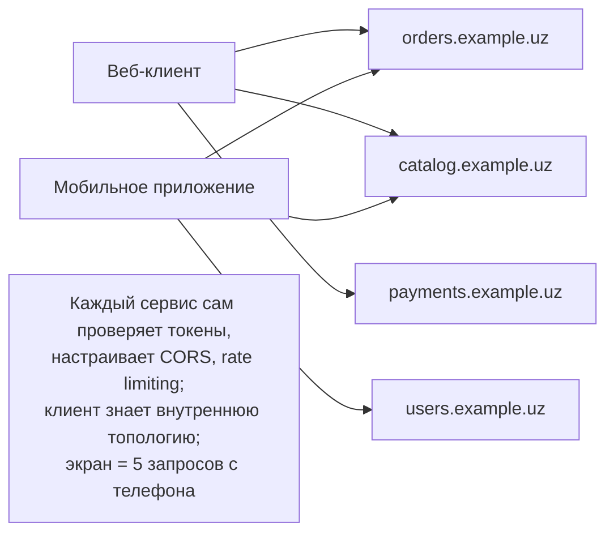
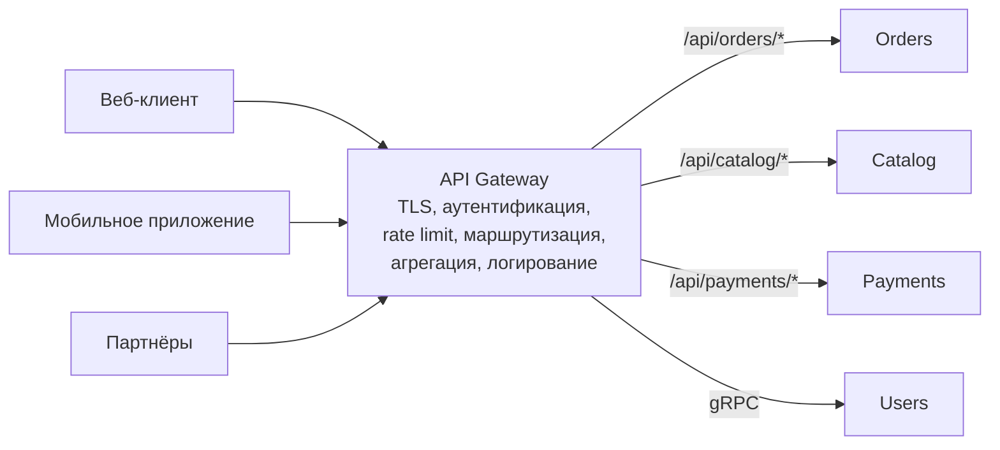
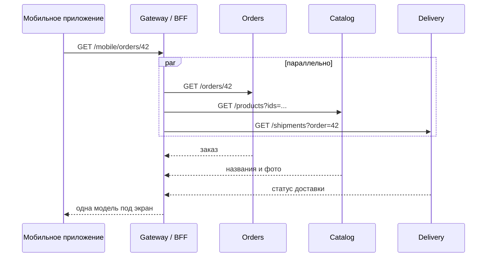
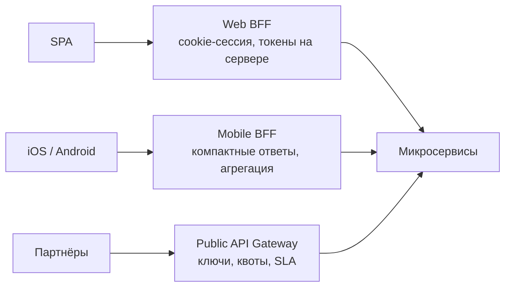

:::tldr
- **API Gateway** — единая точка входа для внешних клиентов в систему микросервисов. Клиент знает один адрес, а шлюз **маршрутизирует** запросы к нужным сервисам.
- Типичные функции: маршрутизация, **аутентификация** (проверка токена один раз на входе), **rate limiting**, TLS-терминация, **агрегация** ответов нескольких сервисов, преобразование протоколов (REST → gRPC), кэширование, CORS, логирование и трассировка, версионирование API.
- **BFF (Backend for Frontend)** — отдельный шлюз под каждый тип клиента (веб, мобильное приложение, партнёры), учитывающий его потребности.
- В .NET: **YARP** (библиотека reverse proxy от Microsoft), Ocelot; вне .NET — Kong, NGINX, Envoy, облачные (Azure API Management, AWS API Gateway), Kubernetes Ingress/Gateway API.
- Риски: **единая точка отказа** и узкое место (нужны реплики), «умный» шлюз с бизнес-логикой превращается в монолит, лишний сетевой переход.
:::

## Проблема без шлюза



## Со шлюзом



## Функции шлюза

| Функция | Зачем |
|---|---|
| **Маршрутизация** | Скрыть внутреннюю топологию, менять её без изменения клиентов |
| **Аутентификация** | Проверить JWT один раз; сервисы получают уже проверенный контекст (или тоже проверяют — zero trust) |
| **Rate limiting / квоты** | Защита от злоупотреблений, тарифные планы для партнёров |
| **Агрегация** | Один запрос клиента → несколько внутренних, один ответ (экономия запросов с мобильной сети) |
| **Трансляция протоколов** | Внешний REST/JSON → внутренний gRPC |
| **Кросс-срезы** | CORS, сжатие, заголовки безопасности, кэш, correlation id, логирование |
| **Версионирование и canary** | `/v1` и `/v2`, процент трафика на новую версию |

## Агрегация



Одна мобильная round-trip вместо трёх — заметная экономия на медленной сети. Но агрегация — это уже логика; при её росте её лучше держать в **BFF**, а не в общем шлюзе.

## BFF — Backend for Frontend



BFF принадлежит команде клиента и меняется вместе с ним; общий шлюз не превращается в «свалку» частных потребностей всех клиентов. Web-BFF также решает задачу безопасности: токены OAuth не хранятся в браузере.

## YARP

```json appsettings.json
{
  "ReverseProxy": {
    "Routes": {
      "orders":  { "ClusterId": "orders",  "AuthorizationPolicy": "default", "RateLimiterPolicy": "per-user",
                   "Match": { "Path": "/api/orders/{**rest}" }, "Transforms": [ { "PathPattern": "/orders/{**rest}" } ] },
      "catalog": { "ClusterId": "catalog", "Match": { "Path": "/api/catalog/{**rest}" } }
    },
    "Clusters": {
      "orders":  { "LoadBalancingPolicy": "RoundRobin",
                   "HealthCheck": { "Active": { "Enabled": true, "Path": "/health/ready" } },
                   "Destinations": { "o1": { "Address": "http://orders-1:8080" }, "o2": { "Address": "http://orders-2:8080" } } },
      "catalog": { "Destinations": { "c1": { "Address": "http://catalog:8080" } } }
    }
  }
}
```

```csharp Program.cs шлюза
var builder = WebApplication.CreateBuilder(args);
builder.Services.AddAuthentication(JwtBearerDefaults.AuthenticationScheme).AddJwtBearer(o => o.Authority = "https://auth.example.uz");
builder.Services.AddAuthorization();
builder.Services.AddRateLimiter(o => o.AddTokenBucketLimiter("per-user", t => { t.TokenLimit = 100; t.TokensPerPeriod = 50; t.ReplenishmentPeriod = TimeSpan.FromSeconds(10); }));
builder.Services.AddReverseProxy().LoadFromConfig(builder.Configuration.GetSection("ReverseProxy"));

var app = builder.Build();
app.UseAuthentication();
app.UseAuthorization();
app.UseRateLimiter();
app.MapReverseProxy();
app.Run();
```

YARP — это обычное приложение ASP.NET Core: весь конвейер middleware, DI, OpenTelemetry, собственные трансформации на C#.

## API Gateway и Service Mesh

| | API Gateway | Service Mesh (Istio, Linkerd) |
|---|---|---|
| Трафик | **Север-юг**: снаружи внутрь | **Восток-запад**: сервис ↔ сервис |
| Где | На границе системы | Sidecar-прокси рядом с каждым сервисом |
| Функции | Аутентификация клиентов, квоты, агрегация, публичный API | mTLS, ретраи, балансировка, телеметрия между сервисами |

Они дополняют друг друга.

## Риски и анти-паттерны

- **Единая точка отказа**: несколько реплик шлюза за балансировщиком, health checks, автомасштабирование.
- **Бизнес-логика в шлюзе**: шлюз меняется при каждой фиче — снова монолит. Шлюз — инфраструктура; логика — в сервисах или BFF.
- **Один шлюз на все команды**: узкое место для изменений. Декларативная конфигурация (маршруты в репозиториях сервисов) или BFF решают.
- **Дополнительная задержка** — небольшая (миллисекунды), но для цепочек стоит учитывать.

## Вопросы на засыпку

:::qa Нужно ли сервисам проверять токен, если его уже проверил шлюз?
В модели zero trust — да: внутренняя сеть не считается доверенной, и сервис проверяет токен (дёшево — подпись и claims) или использует mTLS + передачу пользовательского контекста. Минимум — сервисы не должны быть доступны снаружи в обход шлюза.
:::

:::qa Чем API Gateway отличается от обычного reverse proxy или балансировщика?
Reverse proxy (NGINX) и балансировщик распределяют трафик на уровне HTTP/TCP. API Gateway — reverse proxy с функциями управления API: аутентификация, квоты, агрегация, трансформации, аналитика, портал разработчика. Граница размыта: YARP и NGINX можно дорастить до шлюза.
:::

:::qa Что такое Kubernetes Gateway API?
Стандартизированное расширение Ingress в Kubernetes с ролями (инфраструктура / маршруты команд), маршрутизацией HTTP и gRPC, разделением трафика. Реализуется контроллерами Envoy Gateway, Istio, NGINX и другими — часто заменяет отдельный шлюз для маршрутизации.
:::

:::qa Как шлюз помогает при миграции монолита?
Шлюз — естественная точка паттерна Strangler Fig: новые эндпоинты маршрутизируются в новый сервис, остальные — в монолит. Клиенты не замечают перехода.
:::

## Итог

API Gateway даёт клиентам единую точку входа и централизует кросс-срезы: маршрутизацию, аутентификацию, лимиты, агрегацию. BFF подстраивает API под конкретный клиент. Держите шлюз тонким и отказоустойчивым, бизнес-логику — в сервисах, а для межсервисного трафика используйте service mesh или устойчивые клиенты.
