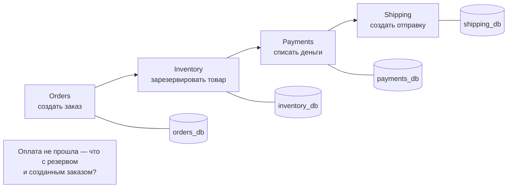
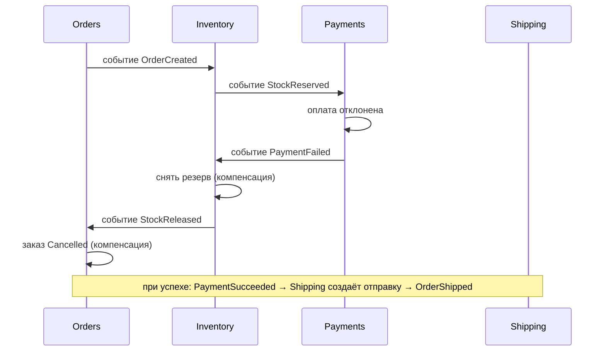
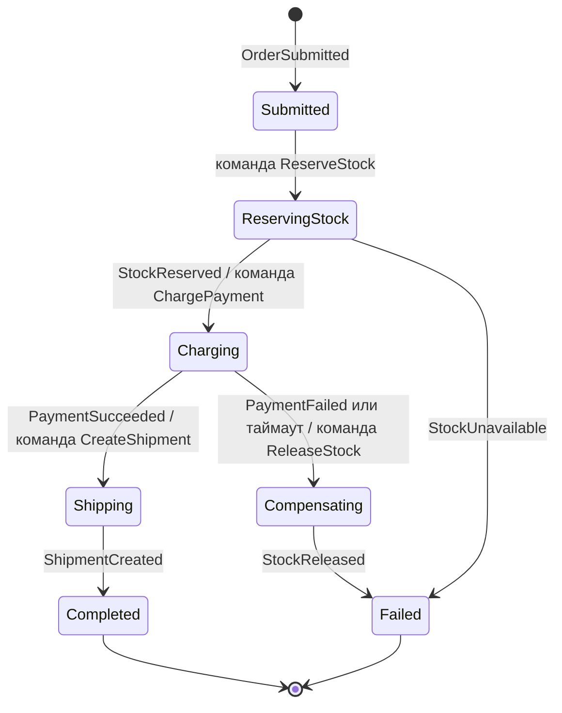
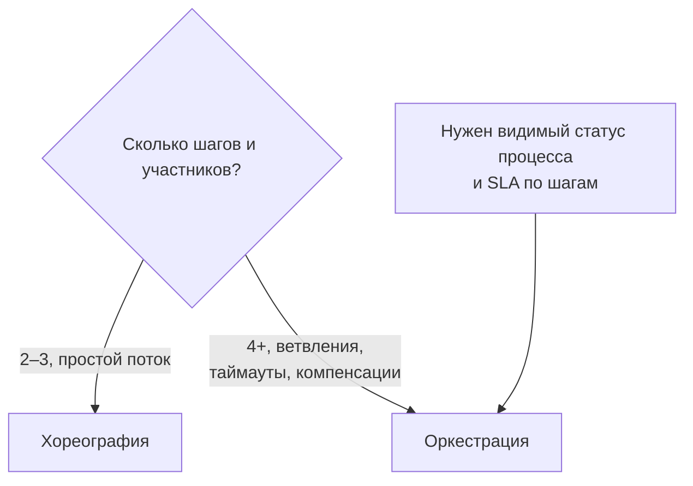

:::tldr
- **Проблема**: бизнес-операция затрагивает несколько сервисов со своими БД (заказ → резерв на складе → оплата → доставка). Одной ACID-транзакции нет, 2PC плохо масштабируется и связывает сервисы.
- **Saga** — последовательность **локальных транзакций**; каждый шаг публикует событие/сообщение, запускающее следующий. При сбое выполняются **компенсирующие транзакции** в обратном порядке (отменить резерв, вернуть деньги).
- **Choreography (хореография)** — нет центра: сервисы реагируют на события друг друга. Просто для 2–3 шагов, но логика процесса **размазана**, сложно отслеживать и менять.
- **Orchestration (оркестрация)** — центральный **оркестратор** (state machine) отправляет команды участникам и ждёт ответов. Процесс виден в одном месте, легко добавлять шаги и таймауты; риск — «умный» оркестратор-монолит.
- Требования к участникам: **идемпотентность**, **Outbox** для надёжной публикации, компенсации (семантический откат, а не «удаление истории»). Изоляции нет — возможны промежуточные состояния, видимые другим.
- В .NET: **MassTransit** (Saga State Machine), NServiceBus, Wolverine, Temporal/Dapr Workflow.
:::

## Проблема распределённой транзакции



**Two-Phase Commit (2PC)** формально решает задачу (координатор: «приготовиться» → «зафиксировать»), но: блокирует ресурсы всех участников до завершения, координатор — единая точка отказа, требует поддержки XA всеми участниками (брокеры, NoSQL, внешние API её не имеют), плохо масштабируется. В микросервисах используют Saga.

## Компенсации

Каждому шагу, который можно «отменить», соответствует компенсирующее действие:

| Шаг (T) | Компенсация (C) |
|---|---|
| Создать заказ (status = Pending) | Отменить заказ (status = Cancelled) |
| Зарезервировать товар | Снять резерв |
| Списать деньги | Вернуть деньги (refund) |
| Создать отправку | — (последний шаг, «точка невозврата») |

Компенсация — **семантический** откат: не удаление записи, а новое действие, оставляющее след в истории (возврат — это отдельная операция, а не удаление платежа).

## Choreography



| Плюсы | Минусы |
|---|---|
| Нет центрального компонента | Процесс «размазан»: чтобы понять поток, нужно читать все сервисы |
| Слабая связанность, просто начать | Циклические зависимости событий, сложно добавлять шаги |
| Хорошо для 2–4 шагов | Трудно отследить статус конкретной саги и обработать таймауты |

## Orchestration



```csharp MassTransit Saga State Machine (упрощённо)
public sealed class OrderState : SagaStateMachineInstance
{
    public Guid CorrelationId { get; set; }          // = OrderId
    public string CurrentState { get; set; } = "";
    public decimal Amount { get; set; }
    public Guid? PaymentTimeoutTokenId { get; set; }
}

public sealed class OrderSaga : MassTransitStateMachine<OrderState>
{
    public State ReservingStock { get; private set; } = null!;
    public State Charging { get; private set; } = null!;
    public State Compensating { get; private set; } = null!;
    public State Completed { get; private set; } = null!;
    public State Failed { get; private set; } = null!;

    public Event<OrderSubmitted> Submitted { get; private set; } = null!;
    public Event<StockReserved> Reserved { get; private set; } = null!;
    public Event<StockUnavailable> Unavailable { get; private set; } = null!;
    public Event<PaymentSucceeded> Paid { get; private set; } = null!;
    public Event<PaymentFailed> PaymentFailed { get; private set; } = null!;
    public Event<StockReleased> Released { get; private set; } = null!;

    public OrderSaga()
    {
        InstanceState(x => x.CurrentState);

        Initially(When(Submitted)
            .Then(ctx => ctx.Saga.Amount = ctx.Message.Amount)
            .Send(ctx => new ReserveStock(ctx.Saga.CorrelationId, ctx.Message.Items))
            .TransitionTo(ReservingStock));

        During(ReservingStock,
            When(Reserved)
                .Send(ctx => new ChargePayment(ctx.Saga.CorrelationId, ctx.Saga.Amount))
                .TransitionTo(Charging),
            When(Unavailable)
                .Publish(ctx => new OrderRejected(ctx.Saga.CorrelationId, "Нет в наличии"))
                .TransitionTo(Failed));

        During(Charging,
            When(Paid)
                .Send(ctx => new CreateShipment(ctx.Saga.CorrelationId))
                .TransitionTo(Completed),
            When(PaymentFailed)
                .Send(ctx => new ReleaseStock(ctx.Saga.CorrelationId))          // компенсация
                .TransitionTo(Compensating));

        During(Compensating,
            When(Released)
                .Publish(ctx => new OrderRejected(ctx.Saga.CorrelationId, "Оплата не прошла"))
                .TransitionTo(Failed));
    }
}
```

Состояние саги хранится в БД (EF Core / Redis / Mongo-репозиторий MassTransit), переживает перезапуски. Таймауты реализуются отложенными сообщениями (scheduler).

| Плюсы оркестрации | Минусы |
|---|---|
| Весь процесс виден в одном месте, легко менять | Дополнительный компонент |
| Явный статус каждой саги, таймауты, ретраи | Риск перенести в оркестратор бизнес-логику участников |
| Нет циклических зависимостей событий | Участники связаны с командами оркестратора |

## Выбор подхода



## Обязательные условия надёжности

1. **Outbox**: изменение локальной БД и публикация события — атомарно (иначе заказ сохранён, а событие потеряно).
2. **Идемпотентность** обработчиков: сообщения доставляются «хотя бы раз», повтор не должен списать деньги дважды.
3. **Компенсации тоже могут падать** — их нужно повторять до успеха (они должны быть идемпотентными и «гарантированно выполнимыми»).
4. **Порядок шагов**: сначала шаги, которые легко компенсировать (резерв), в конце — трудно отменяемые (отправка письма, передача в доставку) — «pivot transaction».
5. **Нет изоляции**: другой пользователь может увидеть заказ в статусе Pending или товар «зарезервированным». Контрмеры: семантические блокировки (статусы `Pending`), повторное чтение перед решением, коммутативные операции.

## Вопросы на засыпку

:::qa Почему не использовать распределённые транзакции (2PC)?
Они блокируют ресурсы всех участников на время координации, требуют поддержки протокола всеми участниками (брокеры и HTTP-API её не имеют), координатор — единая точка отказа, а доступность системы становится произведением доступностей участников. Saga жертвует изоляцией ради доступности и слабой связанности.
:::

:::qa Что делать, если компенсация невозможна (письмо уже отправлено)?
Ставить такие шаги в конец саги, после «точки невозврата». Если отмена всё же нужна — «компенсация по смыслу»: отправить письмо об отмене, создать задачу оператору. Некоторые шаги требуют ручного вмешательства — процесс должен это предусматривать.
:::

:::qa Как отслеживать состояние саг в хореографии?
Сложно: нужен correlation id во всех событиях и трассировка (OpenTelemetry), иногда — отдельный сервис-наблюдатель, собирающий события в проекцию статусов. Это один из аргументов в пользу оркестрации для сложных процессов.
:::

:::qa Чем Saga отличается от workflow-движков вроде Temporal?
Это близкие идеи. Temporal/Dapr Workflow/Durable Functions позволяют писать оркестрацию как обычный код (`await charge; await ship;`) с автоматическим сохранением состояния и ретраями; саги в MassTransit/NServiceBus — декларативные машины состояний поверх брокера.
:::

## Итог

Saga заменяет распределённую транзакцию цепочкой локальных транзакций с компенсациями. Хореография проста для коротких потоков, оркестрация — для сложных процессов с ветвлениями и таймаутами. Без Outbox, идемпотентности и продуманных компенсаций саги ненадёжны, а отсутствие изоляции нужно учитывать в модели статусов.
