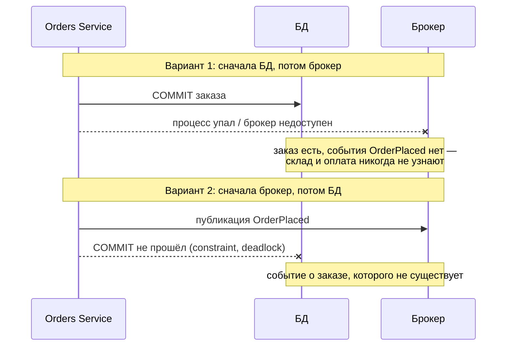
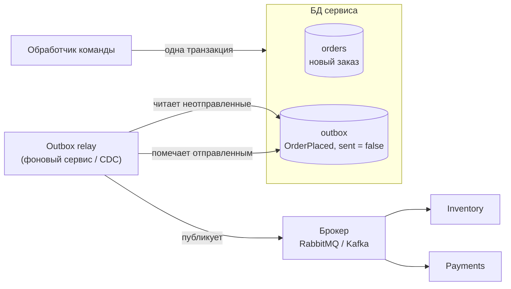
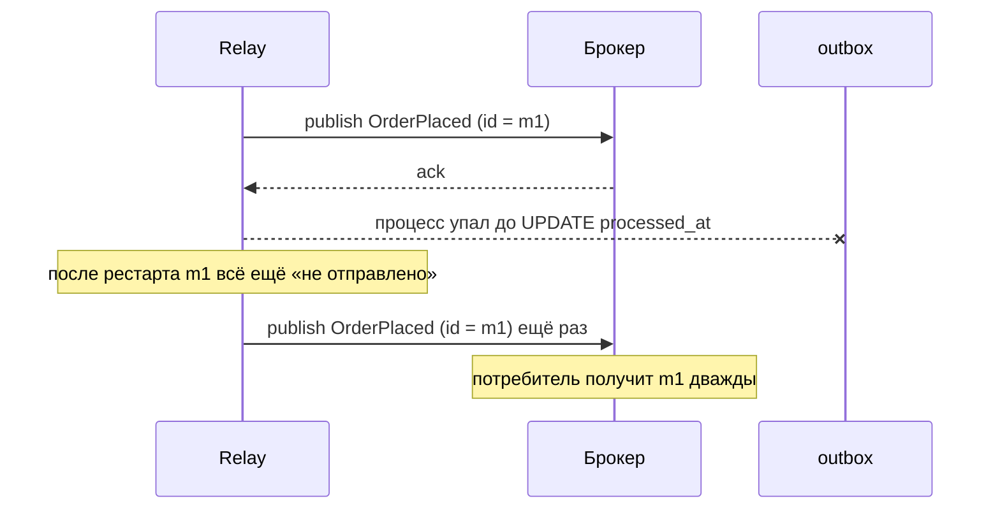

:::tldr
- **Проблема dual write**: нужно изменить БД **и** отправить сообщение в брокер. Это две разные системы — атомарно не получится: упадёт между шагами → либо данные есть, а события нет, либо событие ушло, а транзакция откатилась.
- **Transactional Outbox**: сообщение записывается в таблицу `outbox` **в той же транзакции**, что и бизнес-данные. Отдельный процесс (relay) читает outbox и публикует в брокер, помечая отправленное.
- Гарантия — **at-least-once**: сообщение будет доставлено хотя бы раз (возможны дубли при сбое после публикации, до пометки) → потребители должны быть **идемпотентными** (часто — через **Inbox**: таблица обработанных `MessageId`).
- Способы доставки из outbox: **polling** таблицы фоновым сервисом или **CDC** (Change Data Capture: Debezium читает WAL и публикует).
- В .NET готово в **MassTransit** (EF Core Outbox), NServiceBus, Wolverine, CAP (DotNetCore.CAP).
:::

## Проблема двойной записи



Попытки «исправить» без outbox не работают: публикация внутри транзакции (до `COMMIT`) — транзакция может откатиться после публикации; `try/catch` с повтором — процесс может упасть в любой момент; распределённые транзакции с брокером (MSDTC) — не поддерживаются современными брокерами.

## Решение: Transactional Outbox



```sql Таблица outbox
CREATE TABLE outbox_messages (
    id            uuid PRIMARY KEY,
    occurred_at   timestamptz NOT NULL,
    type          text        NOT NULL,
    payload       jsonb       NOT NULL,
    trace_parent  text,                       -- для сквозной трассировки
    processed_at  timestamptz,
    attempts      int NOT NULL DEFAULT 0,
    error         text
);
CREATE INDEX ix_outbox_unprocessed ON outbox_messages (occurred_at) WHERE processed_at IS NULL;
```

```csharp Запись события в той же транзакции (через interceptor или явно)
public async Task<Guid> Handle(PlaceOrder cmd, CancellationToken ct)
{
    var order = Order.Place(cmd.CustomerId, cmd.Items);
    db.Orders.Add(order);
    db.OutboxMessages.Add(OutboxMessage.From(new OrderPlaced(order.Id, order.CustomerId, order.Total)));
    await db.SaveChangesAsync(ct);          // заказ и сообщение — атомарно
    return order.Id;
}
```

```csharp Relay: фоновая публикация с блокировкой строк
public sealed class OutboxPublisher(IServiceScopeFactory scopes, IMessagePublisher bus, ILogger<OutboxPublisher> log) : BackgroundService
{
    protected override async Task ExecuteAsync(CancellationToken ct)
    {
        while (!ct.IsCancellationRequested)
        {
            await using var scope = scopes.CreateAsyncScope();
            var db = scope.ServiceProvider.GetRequiredService<ShopDbContext>();
            await using var tx = await db.Database.BeginTransactionAsync(ct);

            // SKIP LOCKED: несколько экземпляров сервиса не возьмут одни и те же сообщения
            var batch = await db.OutboxMessages
                .FromSql($"SELECT * FROM outbox_messages WHERE processed_at IS NULL ORDER BY occurred_at LIMIT 100 FOR UPDATE SKIP LOCKED")
                .ToListAsync(ct);

            foreach (var msg in batch)
            {
                try
                {
                    await bus.PublishAsync(msg.Type, msg.Payload, messageId: msg.Id, ct);
                    msg.ProcessedAt = DateTime.UtcNow;
                }
                catch (Exception ex)
                {
                    msg.Attempts++; msg.Error = ex.Message;
                    log.LogWarning(ex, "Не удалось опубликовать {MessageId}", msg.Id);
                }
            }
            await db.SaveChangesAsync(ct);
            await tx.CommitAsync(ct);

            if (batch.Count == 0) await Task.Delay(TimeSpan.FromSeconds(1), ct);
        }
    }
}
```

## Почему возможны дубли



Поэтому outbox даёт **at-least-once**, а exactly-once **обработку** обеспечивает потребитель.

## Inbox — идемпотентность на стороне потребителя

```csharp
public async Task Consume(OrderPlaced message, Guid messageId, CancellationToken ct)
{
    await using var tx = await db.Database.BeginTransactionAsync(ct);

    // Уникальный ключ по message_id: повтор вызовет конфликт → пропускаем
    var inserted = await db.Database.ExecuteSqlAsync(
        $"INSERT INTO inbox_messages (message_id, processed_at) VALUES ({messageId}, now()) ON CONFLICT DO NOTHING", ct);
    if (inserted == 0) return;                                   // уже обработано

    await reservations.ReserveAsync(message.OrderId, message.Items, ct);   // бизнес-логика в той же транзакции
    await db.SaveChangesAsync(ct);
    await tx.CommitAsync(ct);
}
```

## Polling против CDC

| | Polling (фоновый сервис) | CDC (Debezium, logical replication) |
|---|---|---|
| Как | Периодический `SELECT ... WHERE processed_at IS NULL` | Чтение журнала БД (WAL/binlog) и публикация изменений |
| Задержка | Интервал опроса (обычно 100 мс – 1 с) | Почти мгновенно |
| Нагрузка на БД | Запросы по расписанию | Минимальная |
| Инфраструктура | Только код в сервисе | Kafka Connect / Debezium Server |
| Порядок | По `occurred_at` / id | По порядку в журнале |

## Готовые решения в .NET

```csharp MassTransit: Transactional Outbox с EF Core
builder.Services.AddMassTransit(x =>
{
    x.AddEntityFrameworkOutbox<ShopDbContext>(o =>
    {
        o.UsePostgres();
        o.UseBusOutbox();                       // IPublishEndpoint пишет в outbox, а не в брокер
        o.QueryDelay = TimeSpan.FromSeconds(1);
    });
    x.AddConsumer<ReserveStockConsumer>();
    x.UsingRabbitMq((ctx, cfg) => cfg.ConfigureEndpoints(ctx));
});

// В обработчике: публикация «попадёт» в outbox и уйдёт после SaveChanges
await publishEndpoint.Publish(new OrderPlaced(order.Id), ct);
await db.SaveChangesAsync(ct);
```

MassTransit также реализует **inbox** (дедупликация входящих по MessageId) — вместе это даёт надёжную обработку «exactly-once» с точки зрения бизнес-эффекта.

## Эксплуатация

- **Очистка**: отправленные сообщения удалять/архивировать по расписанию — таблица не должна расти бесконечно.
- **Мониторинг**: возраст самого старого неотправленного сообщения, число ошибок публикации — метрики и алерты.
- **Порядок**: если важен порядок событий одного агрегата — публиковать последовательно по ключу (partition key в Kafka = id агрегата).
- **Трассировка**: сохранять `traceparent` в outbox, чтобы цепочка запрос → событие → обработка была видна в Jaeger/Tempo.

## Вопросы на засыпку

:::qa Почему нельзя просто публиковать событие после SaveChanges с ретраями?
Процесс может упасть (деплой, OOM, выключение пода) между `SaveChanges` и публикацией — ретраев не будет, событие потеряно навсегда. Outbox делает намерение опубликовать частью транзакции, поэтому оно переживает падение.
:::

:::qa Даёт ли Outbox exactly-once доставку?
Нет — at-least-once. Дубли возможны при сбое после публикации до пометки. Exactly-once **эффект** достигается идемпотентными потребителями (Inbox, естественная идемпотентность операций, уникальные ключи).
:::

:::qa Чем Outbox отличается от Event Sourcing?
В Event Sourcing события — источник истины и хранятся всегда. В Outbox события — временные «исходящие письма» рядом с обычным состоянием; после доставки их можно удалить. Event store может играть роль outbox: подписка на поток событий = relay.
:::

:::qa Как обеспечить порядок сообщений через outbox?
Relay должен читать в порядке `occurred_at`/последовательности и публиковать последовательно; при нескольких экземплярах relay — партиционировать по ключу агрегата (или один активный relay). На стороне брокера — партиция по ключу (Kafka) или single active consumer (RabbitMQ).
:::

## Итог

Outbox решает проблему двойной записи: событие сохраняется в той же транзакции, что и данные, а доставляется асинхронно — polling-ом или CDC. Гарантия — at-least-once, поэтому потребители обязаны быть идемпотентными (Inbox). Это фундамент надёжного взаимодействия микросервисов, саг и интеграций.
