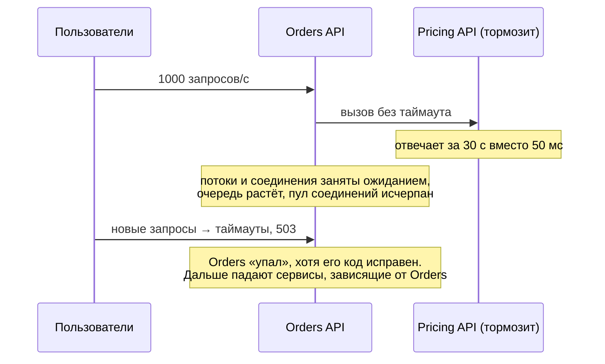
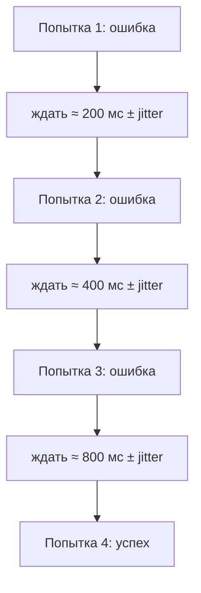
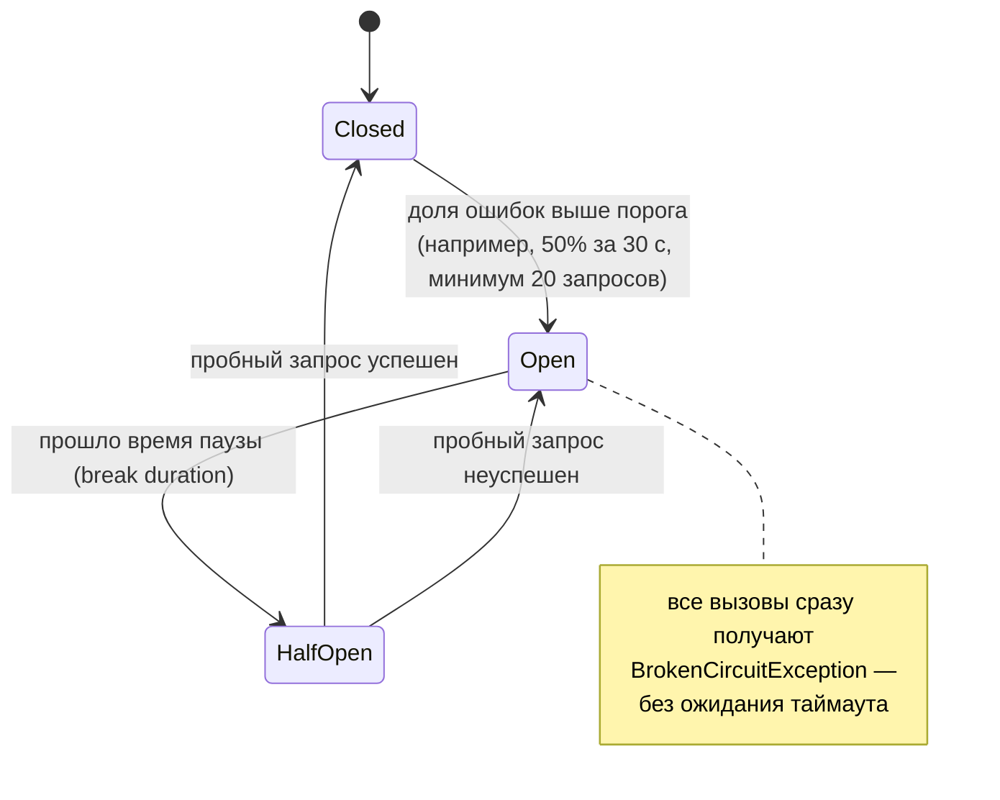
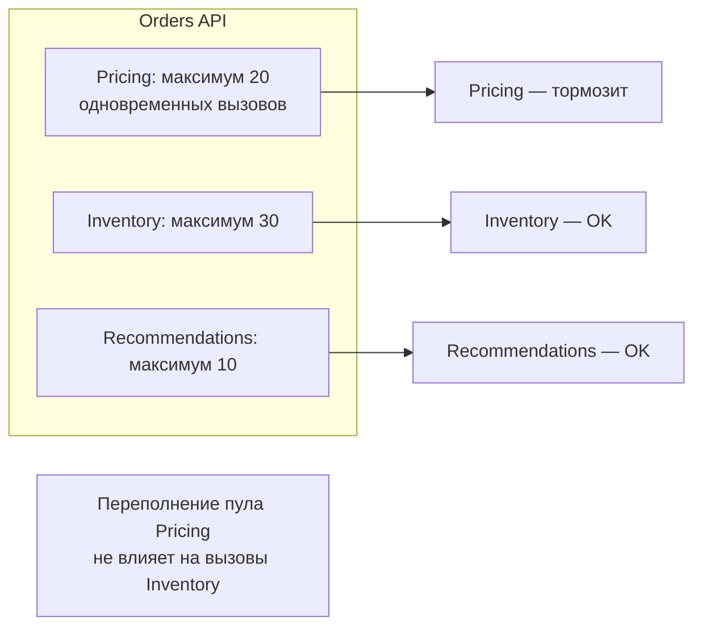

:::tldr
- В распределённой системе зависимости **будут** отказывать: сеть, перегрузка, деплой. Задача — не допустить **каскадного отказа** и восстанавливаться автоматически.
- **Timeout** — не ждать бесконечно; каждое сетевое обращение должно иметь дедлайн.
- **Retry** — повторить **транзиентные** ошибки (5xx, 408, 429, таймауты, сетевые сбои) с **экспоненциальной задержкой и jitter**. Только для **идемпотентных** операций.
- **Circuit Breaker** — «предохранитель»: после серии ошибок **размыкается** и сразу отклоняет вызовы (fail fast), давая зависимости восстановиться; через паузу пробует (half-open).
- **Bulkhead** — изоляция ресурсов: ограничить число одновременных вызовов к каждой зависимости, чтобы медленная зависимость не съела все потоки и соединения.
- **Fallback** — запасной ответ (кэш, значение по умолчанию, деградация функции). **Hedging** — параллельный повторный запрос при медленном ответе.
- В .NET: **Polly v8** (`ResiliencePipeline`) и **Microsoft.Extensions.Http.Resilience** (`AddStandardResilienceHandler`).
:::

## Каскадный отказ



## Паттерны

### Timeout

Самый базовый и самый частый пропуск. `HttpClient.Timeout` по умолчанию — **100 секунд**. Нужны два уровня: таймаут **попытки** и **общий** таймаут операции (включая ретраи).

### Retry



- **Jitter** (случайный разброс) — чтобы тысячи клиентов не повторяли синхронно («thundering herd»), добивая восстанавливающийся сервис.
- Повторять только **транзиентные** ошибки. 400, 401, 404, 422 — не повторять.
- **Идемпотентность**: повтор `POST /payments` может списать деньги дважды. Используйте Idempotency-Key.
- Уважайте `Retry-After` из ответов 429/503.
- Ретраи на каждом уровне цепочки перемножаются: 3 ретрая × 3 уровня = 27 запросов к нижнему сервису. Ретраить лучше на одном уровне.

### Circuit Breaker



Зачем: не тратить ресурсы на заведомо неудачные вызовы (быстрый отказ вместо 30-секундного таймаута) и дать зависимости «отдышаться» без нагрузки.

### Bulkhead



Название — от переборок в корабле: пробоина в одном отсеке не топит судно. Реализация: `ConcurrencyLimiter` (Polly RateLimiter strategy), отдельные `HttpClient` с лимитами соединений, отдельные очереди/пулы потоков.

### Fallback

```csharp
// Рекомендации недоступны → показать популярные товары из кэша, а не ошибку страницы
var recommendations = await pipeline.ExecuteAsync(ct => recClient.GetForUserAsync(userId, ct), ct);
```

**Graceful degradation**: некритичная часть (рекомендации, отзывы) деградирует, критичная (оформление заказа) продолжает работать.

## Polly v8

```csharp Пайплайн вручную
var pipeline = new ResiliencePipelineBuilder<HttpResponseMessage>()
    .AddTimeout(TimeSpan.FromSeconds(10))                                   // общий таймаут
    .AddRetry(new RetryStrategyOptions<HttpResponseMessage>
    {
        ShouldHandle = new PredicateBuilder<HttpResponseMessage>()
            .Handle<HttpRequestException>()
            .Handle<TimeoutRejectedException>()
            .HandleResult(r => (int)r.StatusCode >= 500 || r.StatusCode == HttpStatusCode.TooManyRequests),
        MaxRetryAttempts = 3,
        BackoffType = DelayBackoffType.Exponential,
        Delay = TimeSpan.FromMilliseconds(200),
        UseJitter = true
    })
    .AddCircuitBreaker(new CircuitBreakerStrategyOptions<HttpResponseMessage>
    {
        FailureRatio = 0.5,
        SamplingDuration = TimeSpan.FromSeconds(30),
        MinimumThroughput = 20,
        BreakDuration = TimeSpan.FromSeconds(15)
    })
    .AddTimeout(TimeSpan.FromSeconds(2))                                    // таймаут одной попытки
    .Build();
```


```csharp Стандартный набор для HttpClient
builder.Services.AddHttpClient<IPricingClient, PricingClient>(c => c.BaseAddress = new Uri("http://pricing"))
    .AddStandardResilienceHandler(o =>
    {
        o.AttemptTimeout.Timeout = TimeSpan.FromSeconds(2);
        o.TotalRequestTimeout.Timeout = TimeSpan.FromSeconds(10);
        o.Retry.MaxRetryAttempts = 3;
        o.CircuitBreaker.BreakDuration = TimeSpan.FromSeconds(15);
    });
// включает: rate limiter (bulkhead) → total timeout → retry → circuit breaker → attempt timeout
```

Для сценариев с медленными «хвостами» задержки — `AddStandardHedgingHandler()`: если ответ не пришёл за N мс, отправляется параллельный запрос (к другой реплике), берётся первый успешный.

## Где применять

| Зависимость | Рекомендуемые стратегии |
|---|---|
| Внутренний HTTP/gRPC-сервис | Timeout + Retry (идемпотентные) + Circuit Breaker |
| Внешний платёжный API | Timeout + Circuit Breaker + Idempotency-Key; ретраи осторожно |
| БД | Retry транзиентных ошибок (EnableRetryOnFailure), таймаут команды |
| Брокер сообщений | Retry публикации, outbox; на потребителе — retry + DLQ |
| Некритичные функции | Fallback / graceful degradation |

## Вопросы на засыпку

:::qa Почему ретраи без jitter вредны?
После сбоя все клиенты повторяют через одинаковые интервалы — синхронные волны нагрузки бьют по восстанавливающемуся сервису и снова его роняют. Случайный разброс «размазывает» повторы во времени.
:::

:::qa Где должен стоять Circuit Breaker относительно Retry?
Обычно Retry снаружи, Circuit Breaker внутри: каждая попытка ретрая проходит через предохранитель, и если он разомкнут — ретрай сразу получает отказ (можно не ретраить `BrokenCircuitException`). Так ретраи не «пробивают» открытый предохранитель.
:::

:::qa Нужен ли Circuit Breaker на каждый экземпляр сервиса или общий?
Состояние Polly — в памяти экземпляра (и по умолчанию на именованный клиент/пайплайн). Каждый экземпляр сам наблюдает ошибки и размыкается независимо — обычно этого достаточно. Для разных downstream-хостов/эндпоинтов нужны отдельные предохранители, иначе падение одного размыкает все.
:::

:::qa Чем bulkhead отличается от rate limiting?
Rate limiting ограничивает **входящие** запросы к вашему сервису (защита от клиентов). Bulkhead ограничивает **исходящие** параллельные вызовы к конкретной зависимости (защита себя от медленной зависимости). Технически оба могут использовать одинаковые лимитеры.
:::

## Итог

Отказы зависимостей неизбежны; задача — локализовать их. Таймауты — обязательно везде, ретраи — только транзиентных ошибок идемпотентных операций с экспонентой и jitter, circuit breaker — для быстрого отказа и восстановления, bulkhead — для изоляции ресурсов, fallback — для деградации некритичного. В .NET всё это даёт Polly и стандартный resilience handler.
