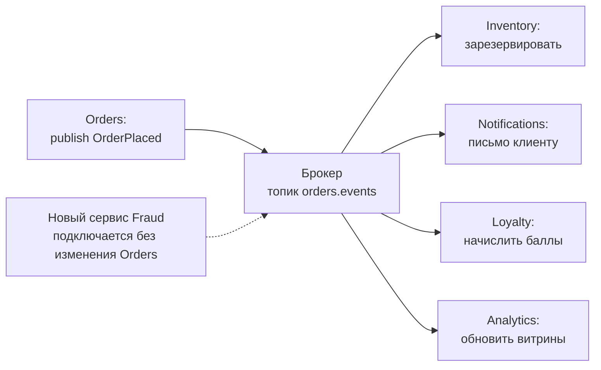
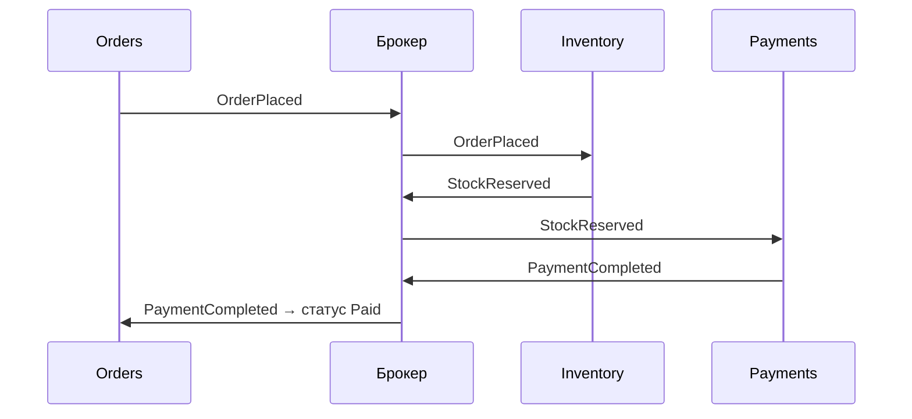
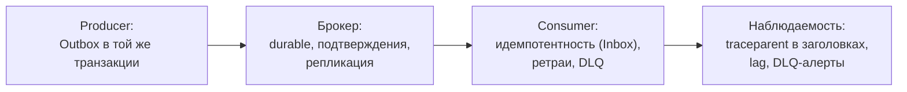

:::tldr
- **EDA** — архитектура, где компоненты взаимодействуют через **события**: факты о произошедшем («заказ оформлен»), которые публикуются без знания о получателях. Производитель и потребители **слабо связаны** во времени, пространстве и реализации.
- Роли: **producer** → **брокер/шина** (Kafka, RabbitMQ, Azure Service Bus) → **consumers**. Паттерн **publish/subscribe**.
- Стили событий (Мартин Фаулер): **Event Notification** (тонкое событие «что-то случилось», за деталями — запрос), **Event-Carried State Transfer** (событие несёт данные, потребители хранят копию), **Event Sourcing** (события — источник истины), **CQRS** рядом.
- Плюсы: слабая связанность, лёгкое добавление потребителей, асинхронность и буферизация пиков, масштабируемость, изоляция отказов.
- Минусы: **eventual consistency**, сложнее отладка и трассировка, версионирование контрактов событий, дубли и порядок сообщений, «где логика процесса?».
:::

## Команда против события

| | Команда | Событие |
|---|---|---|
| Смысл | «Сделай» (`ReserveStock`) | «Произошло» (`OrderPlaced`) |
| Время | Повелительное | Прошедшее |
| Получатели | Один конкретный | Любое число (0..N) |
| Отправитель знает получателя | Да | Нет |
| Может быть отклонено | Да | Нет — это факт |
| Транспорт | Очередь (point-to-point) | Топик / exchange (pub/sub) |

## Поток событий



Сравните с синхронным подходом: Orders вызывает по HTTP четыре сервиса, ждёт их ответов, знает их адреса и падает, если любой недоступен. В EDA оформление заказа завершается, как только событие надёжно опубликовано.

## Стили событий

### Event Notification

```json
{ "type": "OrderPlaced", "orderId": "ord_1042", "occurredAt": "2025-09-30T10:15:00Z" }
```

Минимальное событие. Потребитель, которому нужны детали, запрашивает их у Orders API. Плюс — маленький контракт; минус — обратная связанность (запрос к источнику) и нагрузка на него.

### Event-Carried State Transfer

```json
{
  "type": "OrderPlaced",
  "orderId": "ord_1042",
  "customer": { "id": "c_7", "email": "ann@example.uz", "tier": "gold" },
  "items": [ { "sku": "PHONE-1", "qty": 1, "price": 7990000 } ],
  "total": 7990000,
  "occurredAt": "2025-09-30T10:15:00Z"
}
```

Событие несёт всё нужное — потребители не обращаются к источнику и могут хранить локальную копию данных (например, Shipping хранит адреса клиентов). Плюс — автономность; минусы — больше данных в сообщениях, дублирование, контракт шире.

### Event Sourcing и CQRS

События — не только интеграция, но и способ хранения (см. вопросы про Event Sourcing и CQRS).

## Топологии обработки



- **Broker topology / хореография** — нет центрального координатора, каждый реагирует на события. Гибко, но поток процесса неявный.
- **Mediator topology / оркестрация** — центральный процесс (сага, workflow) управляет шагами командами и слушает события.

## Надёжность



Проблемы, с которыми придётся жить:
- **At-least-once** доставка → дубли → идемпотентные обработчики.
- **Порядок** не гарантирован глобально → партиционирование по ключу агрегата, версии в событиях, проверка «событие старее текущего состояния».
- **Eventual consistency** → UI и процессы должны учитывать задержку.
- **Ядовитые сообщения** → ретраи с ограничением и **Dead Letter Queue**.

## Контракты событий

```csharp Событие как публичный контракт
namespace Shop.Orders.Contracts.V1;

/// <summary>Опубликовано после успешного оформления заказа.</summary>
public sealed record OrderPlaced(
    Guid EventId,               // идентификатор для идемпотентности
    Guid OrderId,
    Guid CustomerId,
    decimal Total,
    string Currency,
    DateTimeOffset OccurredAt,
    int SchemaVersion = 1);
```

Правила эволюции:
- Добавлять поля — безопасно (потребители игнорируют неизвестное); удалять и переименовывать — нет.
- Несовместимые изменения — новый тип/версия (`OrderPlacedV2`), публиковать обе версии на период миграции.
- Реестр схем (Schema Registry для Avro/Protobuf в Kafka) или контрактные тесты (Pact).
- **CloudEvents** — стандартный конверт метаданных (`id`, `source`, `type`, `time`, `datacontenttype`).

## Когда EDA уместна

| Хорошо | Плохо |
|---|---|
| Много независимых реакций на одно событие | Нужен немедленный ответ с результатом (синхронный запрос) |
| Интеграция сервисов разных команд | Строгая согласованность между шагами |
| Сглаживание пиков нагрузки | Простое приложение без интеграций |
| Аудит, аналитика, потоковая обработка | Команда без опыта наблюдаемости и работы с брокером |

## Вопросы на засыпку

:::qa Что включать в событие: только ID или все данные?
Компромисс. Тонкие события (notification) проще версионировать, но заставляют потребителей обращаться к источнику. Толстые (state transfer) дают автономность, но раздувают контракт. Часто выбирают «достаточные» данные: то, что нужно большинству потребителей, + ID для остального.
:::

:::qa Как отлаживать систему на событиях?
Сквозная трассировка (OpenTelemetry с передачей `traceparent` в заголовках сообщений), correlation id в логах, визуализация потоков (Jaeger/Tempo), мониторинг lag потребителей и DLQ, возможность повторно проиграть сообщения из DLQ после исправления.
:::

:::qa Чем событие отличается от сообщения?
Сообщение — транспортная единица (конверт с заголовками и телом). Событие — один из видов содержимого сообщения (наряду с командами и запросами/ответами). Брокер доставляет сообщения; семантика «событие/команда» — договорённость приложения.
:::

:::qa Что такое event storming?
Практика совместного моделирования с бизнесом: на стене раскладываются доменные события (оранжевые стикеры) в хронологическом порядке, затем команды, акторы, агрегаты, политики. Помогает найти границы контекстов и потоки событий до написания кода.
:::

## Итог

Event-Driven Architecture связывает компоненты через факты о произошедшем: производитель не знает потребителей, новые реакции добавляются без изменения источника, пики сглаживаются брокером. Плата — eventual consistency, дубли, порядок и сложность наблюдения; поэтому EDA требует outbox, идемпотентных потребителей, DLQ, версионирования контрактов и хорошей трассировки.
