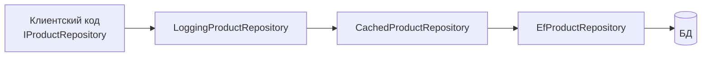
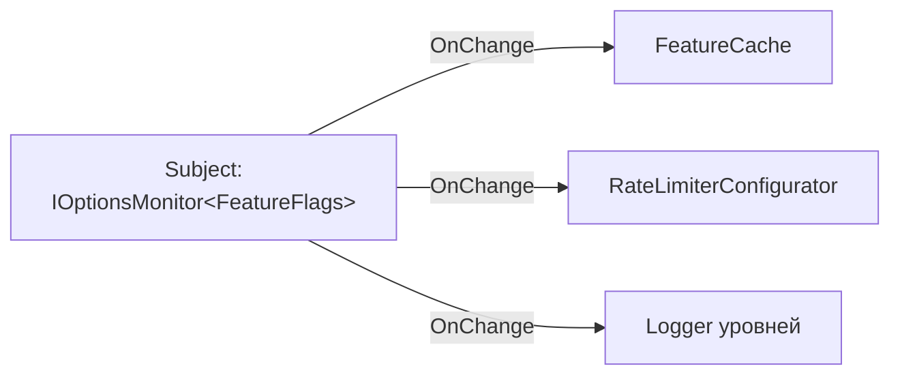
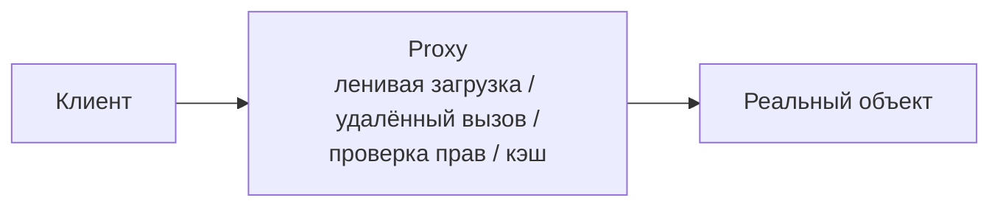

:::tldr
- **Factory / Factory Method / Abstract Factory** — инкапсулируют создание объектов: `IHttpClientFactory`, `ILoggerFactory`, `DbProviderFactory`, фабрики в DI (`AddScoped(sp => ...)`).
- **Decorator** — оборачивает объект с тем же интерфейсом, добавляя поведение: `BufferedStream(FileStream)`, `GZipStream`, `DelegatingHandler` в `HttpClient`, кэширующий/логирующий репозиторий (Scrutor `Decorate`).
- **Strategy** — взаимозаменяемые алгоритмы за общим интерфейсом: `IComparer<T>`, политики скидок/доставки, `IPasswordHasher`, выбор реализации через DI.
- **Observer** — подписка на уведомления: `event`, `IObservable<T>/IObserver<T>`, `IOptionsMonitor.OnChange`, `IChangeToken`, доменные события.
- **Proxy** — заместитель, контролирующий доступ: ленивые прокси EF Core, Castle DynamicProxy (моки Moq), gRPC/HTTP-клиенты как удалённые прокси, `Lazy<T>`.
- Также повсеместно: **Builder** (`WebApplication.CreateBuilder`, `StringBuilder`, `HostBuilder`), **Adapter**, **Chain of Responsibility** (middleware, `DelegatingHandler`), **Template Method** (`BackgroundService.ExecuteAsync`), **Singleton** (через DI, а не static), **Iterator** (`IEnumerable`/`yield`), **Command** (MediatR-запросы), **Composite** (`CompositeFileProvider`).
:::

## Factory

```csharp
// IHttpClientFactory — фабрика с пулом обработчиков и конфигурацией по имени
builder.Services.AddHttpClient("payments", c => c.BaseAddress = new Uri("https://pay.example.uz"));

public sealed class PaymentService(IHttpClientFactory factory)
{
    public Task<HttpResponseMessage> PingAsync() => factory.CreateClient("payments").GetAsync("/ping");
}

// Собственная фабрика, выбирающая реализацию по данным
public interface INotificationSenderFactory { INotificationSender Create(Channel channel); }

public sealed class NotificationSenderFactory(IServiceProvider sp) : INotificationSenderFactory
{
    public INotificationSender Create(Channel channel) => channel switch
    {
        Channel.Email => sp.GetRequiredService<EmailSender>(),
        Channel.Sms => sp.GetRequiredService<SmsSender>(),
        Channel.Telegram => sp.GetRequiredService<TelegramSender>(),
        _ => throw new ArgumentOutOfRangeException(nameof(channel))
    };
}
// В .NET 8 то же удобнее через keyed services: sp.GetRequiredKeyedService<INotificationSender>(channel)
```

## Decorator



```csharp
public sealed class CachedProductRepository(IProductRepository inner, HybridCache cache) : IProductRepository
{
    public async Task<Product?> GetAsync(int id, CancellationToken ct) =>
        await cache.GetOrCreateAsync($"product:{id}", async t => await inner.GetAsync(id, t), cancellationToken: ct);

    public Task SaveAsync(Product p, CancellationToken ct) => inner.SaveAsync(p, ct);   // + инвалидация кэша
}

builder.Services.AddScoped<IProductRepository, EfProductRepository>();
builder.Services.Decorate<IProductRepository, CachedProductRepository>();   // Scrutor
```

```csharp Декоратор в HttpClient: DelegatingHandler
public sealed class ApiKeyHandler(IOptions<PartnerOptions> options) : DelegatingHandler
{
    protected override Task<HttpResponseMessage> SendAsync(HttpRequestMessage request, CancellationToken ct)
    {
        request.Headers.Add("X-Api-Key", options.Value.ApiKey);
        return base.SendAsync(request, ct);        // следующий обработчик в цепочке
    }
}
builder.Services.AddTransient<ApiKeyHandler>();
builder.Services.AddHttpClient<PartnerClient>().AddHttpMessageHandler<ApiKeyHandler>();
```

В BCL: `Stream` — классика декоратора: `new GZipStream(new BufferedStream(new FileStream(...)), CompressionMode.Compress)`.

## Strategy

```csharp
public interface IShippingCostStrategy
{
    bool CanHandle(ShippingMethod method);
    Money Calculate(Order order);
}

public sealed class CourierStrategy : IShippingCostStrategy { /* ... */ }
public sealed class PickupPointStrategy : IShippingCostStrategy { /* ... */ }
public sealed class PostStrategy : IShippingCostStrategy { /* ... */ }

public sealed class ShippingCalculator(IEnumerable<IShippingCostStrategy> strategies)
{
    public Money Calculate(Order order) =>
        strategies.First(s => s.CanHandle(order.ShippingMethod)).Calculate(order);
}
```

В BCL: `IComparer<T>` для `List.Sort`, `IEqualityComparer<T>` для `Dictionary` (`StringComparer.OrdinalIgnoreCase`), `JsonNamingPolicy`. В C# стратегия часто — просто делегат `Func<Order, Money>`.

## Observer



```csharp
// 1. События C#
public event EventHandler<OrderPlacedEventArgs>? OrderPlaced;

// 2. IObservable (Rx.NET) — композиция потоков событий
IDisposable sub = priceTicks
    .Where(t => t.Symbol == "USD")
    .Throttle(TimeSpan.FromSeconds(1))
    .Subscribe(t => UpdateUi(t));

// 3. Изменение конфигурации
monitor.OnChange(flags => logger.LogInformation("Флаги обновлены"));
```

Главная ловушка — утечки памяти при отсутствии отписки (см. вопрос про события).

## Proxy



| Вид прокси | Пример в .NET |
|---|---|
| **Виртуальный** (ленивое создание) | `Lazy<T>`, lazy loading прокси EF Core |
| **Удалённый** | Сгенерированные gRPC-клиенты, Refit-интерфейсы, WCF-клиенты |
| **Защищающий** | Проверка прав перед вызовом (обёртка сервиса) |
| **Динамический** | `DispatchProxy`, Castle DynamicProxy (Moq, NSubstitute, перехватчики) |

```csharp Refit: интерфейс — это удалённый прокси
public interface IGitHubApi
{
    [Get("/users/{user}")]
    Task<GitHubUser> GetUserAsync(string user);
}
builder.Services.AddRefitClient<IGitHubApi>().ConfigureHttpClient(c => c.BaseAddress = new Uri("https://api.github.com"));
```

Decorator и Proxy структурно похожи; разница в намерении: декоратор **добавляет** поведение, прокси **контролирует доступ** к объекту.

## Другие паттерны, которые вы используете каждый день

| Паттерн | Где в .NET |
|---|---|
| **Builder** | `WebApplication.CreateBuilder()`, `HostApplicationBuilder`, `StringBuilder`, `UriBuilder`, `DbContextOptionsBuilder`, Test Data Builders |
| **Chain of Responsibility** | Конвейер middleware, `DelegatingHandler`, MediatR behaviors, фильтры MVC |
| **Adapter** | `StreamReader` (Stream → текст), обёртки над сторонними SDK под свой интерфейс (порт/адаптер) |
| **Template Method** | `BackgroundService.ExecuteAsync`, `DbContext.OnModelCreating`, `AuthorizationHandler<T>.HandleRequirementAsync` |
| **Singleton** | Время жизни Singleton в DI (вместо статического `Instance`) |
| **Iterator** | `IEnumerable<T>` / `IEnumerator<T>`, `yield return`, `IAsyncEnumerable` |
| **Command** | Команды MediatR, `ICommand` в WPF/MAUI |
| **Composite** | `CompositeFileProvider`, `CompositeChangeToken`, деревья выражений |
| **Facade** | `WebApplication` (скрывает хостинг, DI, конфигурацию), `DbContext.Database` |
| **Flyweight** | Интернирование строк, `ArrayPool`, кэш `Task.CompletedTask` / `Task.FromResult(true)` |

## Анти-паттерны при использовании паттернов

- **Singleton со статическим `Instance`** — глобальное состояние, скрытые зависимости, проблемы в тестах. Используйте время жизни DI.
- **Service Locator** — «фабрика», принимающая `IServiceProvider` повсюду. Допустимо только в инфраструктурных фабриках.
- **Паттерн ради паттерна** — стратегия с одной реализацией, фабрика, которая просто вызывает `new`.

## Вопросы на засыпку

:::qa Чем Decorator отличается от наследования?
Наследование добавляет поведение статически, на этапе компиляции, и порождает комбинаторный взрыв классов (`CachedLoggedRepository`, `LoggedCachedRepository`...). Декораторы комбинируются динамически и в любом порядке, соблюдая один интерфейс.
:::

:::qa Чем Strategy отличается от State?
Структура одинаковая (интерфейс + реализации). Strategy выбирается **снаружи** клиентом и обычно не меняется в процессе. State меняется **изнутри** по ходу работы объекта: каждое состояние решает, в какое перейти дальше (машина состояний заказа).
:::

:::qa Где в ASP.NET Core Chain of Responsibility?
Конвейер middleware: каждый компонент решает, обработать запрос сам (short-circuit) или передать следующему (`next`). То же в `DelegatingHandler` для `HttpClient` и в MediatR pipeline behaviors.
:::

:::qa Почему Singleton считают анти-паттерном?
Классический Singleton со статическим доступом — это глобальная переменная: скрытая зависимость, невозможность подменить в тестах, проблемы многопоточной инициализации. Единственность экземпляра полезна, но её обеспечивает DI-контейнер (Singleton lifetime), а зависимость остаётся явной в конструкторе.
:::

## Итог

GoF-паттерны в .NET встречаются на каждом шагу: фабрики HttpClient и логгеров, декораторы потоков и HTTP-обработчиков, стратегии сравнения и политик, наблюдатели событий и конфигурации, прокси для ленивой загрузки и удалённых вызовов, builder-ы хоста. На собеседовании ценится умение показать паттерн на примере из фреймворка и объяснить, какую проблему он решает.
