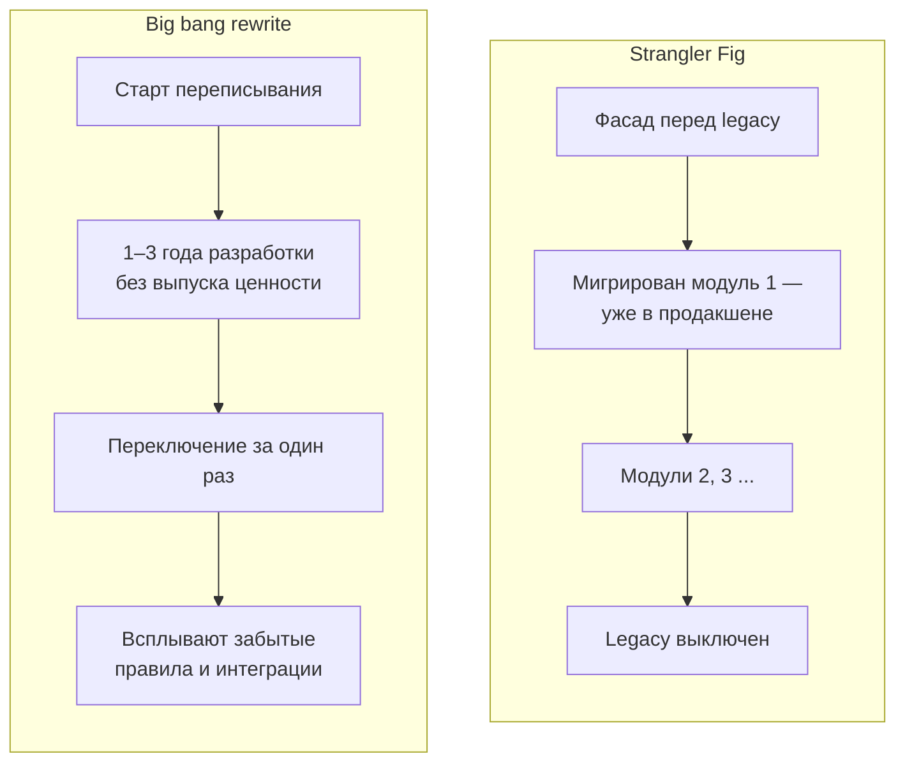
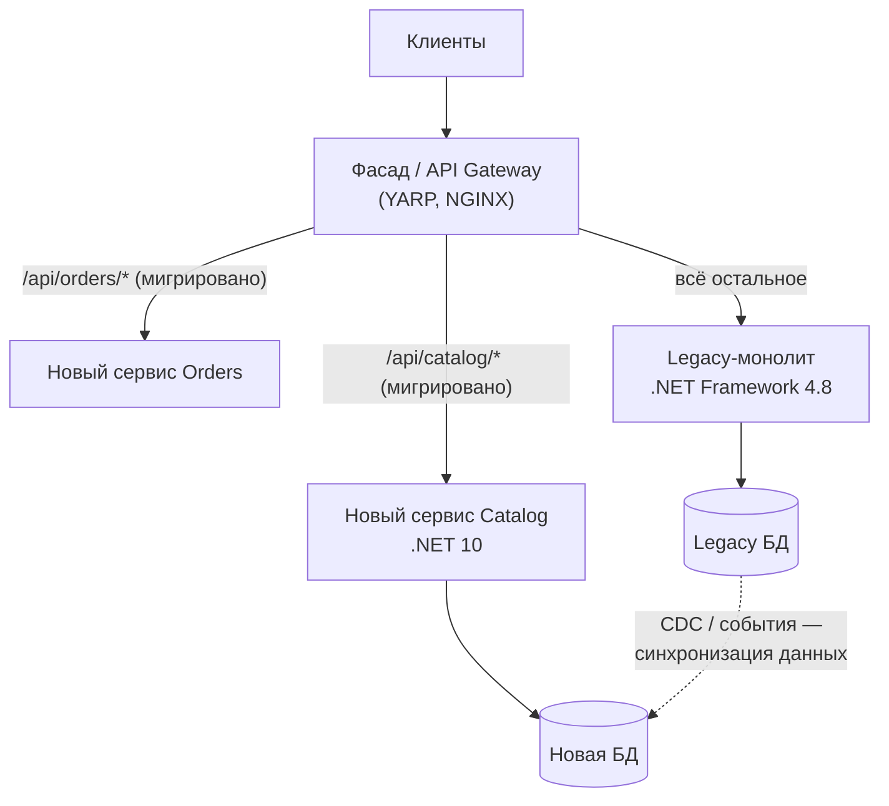
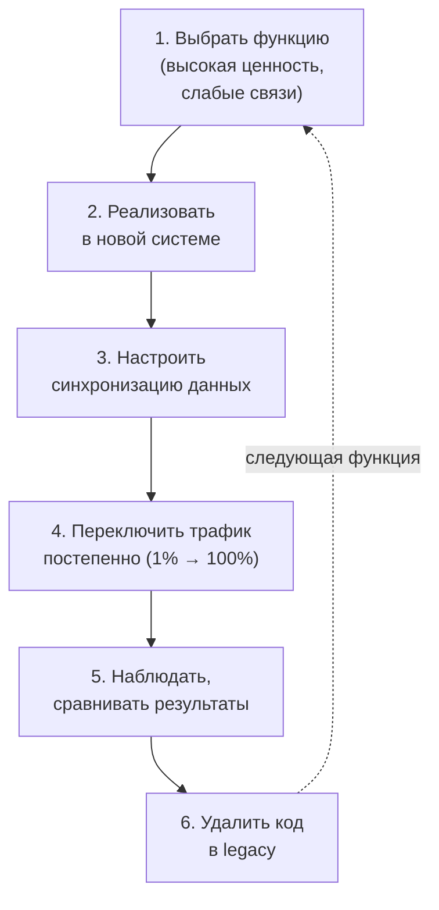
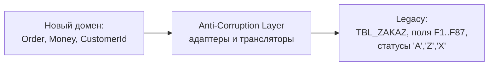

:::tldr
- **Strangler Fig** (Мартин Фаулер, по аналогии с фикусом-душителем) — постепенная замена legacy-системы: новая система растёт **вокруг** старой, забирая функциональность **по частям**, пока старая не станет не нужна и не будет выключена.
- Альтернатива «большому переписыванию» (big bang rewrite), которое часто проваливается: годы без ценности для бизнеса, погоня за движущейся целью, потеря скрытых знаний старой системы.
- Ключевой элемент — **фасад / маршрутизатор** перед системой (API Gateway, reverse proxy — YARP, NGINX), который направляет запросы: мигрированные — в новую систему, остальные — в старую.
- Этапы: **перехват** (фасад), **выделение** функции, **переключение** трафика (постепенно, с feature flags/canary), **удаление** старого кода. Повторять.
- Сложности: **общие данные** (синхронизация БД, CDC, событийная репликация), **Anti-Corruption Layer** для изоляции новой модели от старой, долгий период работы двух систем.
:::

## Метафора

Фикус-душитель прорастает на дереве-хозяине, постепенно оплетает его корнями, и через годы от старого дерева остаётся лишь пустота внутри нового. Система-хозяин продолжает работать, пока новая берёт на себя её функции.

## Big bang против Strangler Fig



| | Big bang | Strangler Fig |
|---|---|---|
| Выпуск ценности | В конце | Постоянно |
| Риск | Огромный, сосредоточен в одном переключении | Малый, распределён по шагам |
| Откат | Практически невозможен | Переключить маршрут обратно |
| Обратная связь | Поздно | С первого модуля |
| Цена | Две системы в разработке, заморозка старой | Две системы в эксплуатации какое-то время, фасад, синхронизация данных |

## Как это работает



### Шаги для каждой функции



## Фасад на YARP

```json Маршрутизация: мигрированное — в новый сервис, остальное — в legacy
{
  "ReverseProxy": {
    "Routes": {
      "catalog-new": { "ClusterId": "catalog", "Order": 1, "Match": { "Path": "/api/catalog/{**rest}" } },
      "legacy-all":  { "ClusterId": "legacy",  "Order": 100, "Match": { "Path": "{**catch-all}" } }
    },
    "Clusters": {
      "catalog": { "Destinations": { "d1": { "Address": "http://catalog-service:8080" } } },
      "legacy":  { "Destinations": { "d1": { "Address": "http://legacy-iis.internal" } } }
    }
  }
}
```

Постепенное переключение — по проценту трафика, пользователям-тестировщикам или feature flag:

```csharp
app.MapReverseProxy(proxy => proxy.Use(async (ctx, next) =>
{
    var flags = ctx.RequestServices.GetRequiredService<IFeatureManager>();
    if (ctx.Request.Path.StartsWithSegments("/api/orders") && !await flags.IsEnabledAsync("NewOrdersService"))
        ctx.Features.Get<IReverseProxyFeature>()!.AvailableDestinations = GetLegacyDestinations(ctx);
    await next();
}));
```

Microsoft предлагает для ASP.NET Framework → ASP.NET Core готовые инструменты: **System.Web Adapters** и **YARP-based incremental migration** (новое приложение ASP.NET Core проксирует немигрированные маршруты в старое, общая сессия и аутентификация).

## Данные — самая сложная часть

Варианты:

1. **Общая БД на переходный период** — новый сервис читает/пишет в старую схему. Быстро, но сохраняет связанность; допустимо как временный шаг.
2. **Синхронизация через CDC** (Debezium) или события: legacy остаётся источником истины, новая БД — производная, пока функция не мигрирована полностью.
3. **Двойная запись** через фасад/новый сервис (с outbox, не наивно!) на время перехода.
4. **Перенос владения**: после переключения новая система — источник истины, старая получает изменения обратно, если они ей ещё нужны.

## Anti-Corruption Layer



ACL (термин DDD) не даёт странностям старой модели «просочиться» в новую: маппинг статусов, форматов, кодировок, разбиение «божественных» таблиц. Новая система говорит на своём языке, а переводом занимается изолированный слой.

## Практические советы

- Начинайте с функции, которая **приносит ценность** и **слабо связана** с остальным (каталог, уведомления, отчёты), чтобы быстро доказать работоспособность подхода.
- **Замораживайте** изменения в мигрируемой части legacy, иначе придётся переносить движущуюся цель.
- **Сравнивайте результаты** (shadow traffic / dark launch): отправлять копию запросов в новую систему и сравнивать ответы, не отдавая их пользователю.
- **Удаляйте** мигрированный код из legacy — иначе через год будут поддерживаться обе версии.
- **Наблюдаемость** обеих систем и фасада — единые трассировки и метрики.
- Иметь **план завершения**: без него «временное» сосуществование становится постоянным.

## Вопросы на засыпку

:::qa Почему большие переписывания часто проваливаются?
Legacy содержит годы неявных бизнес-правил, исправлений и интеграций, которые нигде не задокументированы. Пока идёт переписывание, старая система продолжает меняться. Бизнес годами не получает ценности, бюджет и терпение заканчиваются раньше, чем новая система догоняет старую.
:::

:::qa Что делать с функциями, которые нельзя выделить по URL?
Перехватывать не только HTTP: события (подписка на изменения legacy через CDC), фоновые задания (переносить по одному), UI (микрофронтенды или iframe-вставки), вызовы внутри кода (выделение интерфейса в legacy и реализация через вызов нового сервиса — branch by abstraction).
:::

:::qa Что такое Branch by Abstraction?
Техника для замены компонента внутри кода: вводится абстракция перед старой реализацией, все вызовы переводятся на неё, создаётся новая реализация, переключение через флаг, затем старая удаляется. Это Strangler Fig на уровне кода, без долгоживущих веток в git.
:::

:::qa Как понять, что миграция завершена?
Фасад больше не направляет трафик в legacy, данные legacy не нужны ни одному процессу (или заархивированы), фоновые задания перенесены, мониторинг показывает нулевые обращения к старой системе. После этого её выключают — и удаляют фасадные маршруты.
:::

## Итог

Strangler Fig заменяет legacy постепенно: фасад перехватывает трафик, функции переносятся по одной с постепенным переключением и возможностью отката, а старый код удаляется. Главные сложности — данные и изоляция моделей (CDC, события, Anti-Corruption Layer). Это медленнее на старте, но надёжнее и ценнее для бизнеса, чем большое переписывание.
